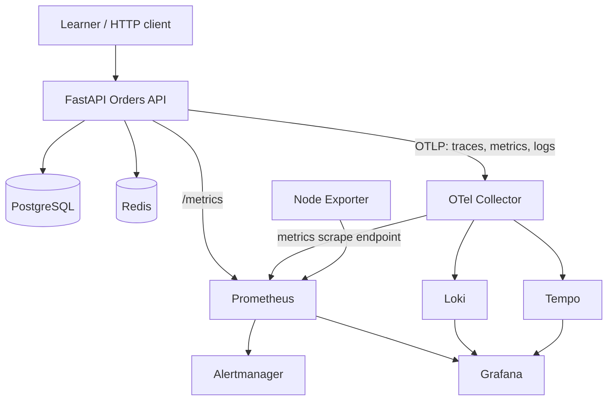

# Observable Orders API: 50-Lab Platform

A self-contained training repository for learning application monitoring and modern observability on one Linux virtual machine. It combines a real FastAPI CRUD service with PostgreSQL, Redis, Prometheus, Alertmanager, OpenTelemetry Collector, Loki, Tempo, Grafana, and Node Exporter.

The repository is intentionally designed so early labs can start only the application dependencies and later labs can progressively introduce each telemetry system. Do **not** start the full stack before Lab 1 unless you are only performing a platform smoke test.

## What Is Included

- Async FastAPI CRUD API backed by PostgreSQL.
- Redis cache-aside behavior with safe database fallback.
- Liveness and dependency-aware readiness endpoints.
- Bounded latency, HTTP error, exception, CPU, memory, database, cache, and trace simulations.
- Prometheus-native counters, gauges, histograms, build information, and exemplars.
- OpenTelemetry traces, metrics, and logs over OTLP/gRPC.
- Automatic FastAPI, SQLAlchemy, Redis, and HTTPX instrumentation.
- Custom spans, events, status, metrics, and trace-correlated structured JSON logs.
- Prometheus scraping, recording rules, and actionable sample alerts.
- Alertmanager routing, grouping, inhibition, a local webhook receiver, and an app-down-safe route.
- Loki TSDB/v13 filesystem storage with native OTLP log ingestion and seven-day retention.
- Tempo monolithic local storage with span metrics and service-graph generation.
- Provisioned Grafana data sources, correlations, and a baseline dashboard.
- Node Exporter visibility into the underlying VM.
- Verification, smoke-test, load-generation, and explicit data-reset scripts.
- A progressive [50-lab roadmap](docs/50-lab-roadmap.md) and the complete [Lab 1-50 guide](labs/).

## Architecture



The application has two separate metrics paths by design:

1. `GET /metrics` exposes hand-authored Prometheus metrics for instrumentation and PromQL labs.
2. The OpenTelemetry SDK exports custom and automatic metrics to the Collector, which exposes them on port `8889` for Prometheus to scrape.

That overlap is educational: it lets you compare native Prometheus instrumentation with a vendor-neutral OTLP pipeline.

## Pinned Component Matrix

| **Component**          | **Version/Image**            | **Host Port**                 | **Persistent Volume**       |
|------------------------|------------------------------|-------------------------------|-----------------------------|
| FastAPI App            | Python 3.13.7 / app `1.0.0`  | 8000                          | Stateless                   |
| PostgreSQL             | `postgres:17.6-alpine`       | 127.0.0.1:5432                | `obs-lab-postgres-data`     |
| Redis                  | `redis:8.2.1-alpine`         | 127.0.0.1:6379                | `obs-lab-redis-data`        |
| Prometheus             | `prom/prometheus:v3.14.0`    | 9090                          | `obs-lab-prometheus-data`   |
| Alertmanager           | `prom/alertmanager:v0.34.0`  | 9093                          | `obs-lab-alertmanager-data` |
| OTel Collector Contrib | `0.160.0`                    | 127.0.0.1:4317/4318/8888/8889 | Stateless                   |
| Loki                   | `grafana/loki:3.7.7`         | 127.0.0.1:3100                | `obs-lab-loki-data`         |
| Tempo                  | `grafana/tempo:3.0.3`        | 127.0.0.1:3200                | `obs-lab-tempo-data`        |
| Grafana                | `grafana/grafana:13.2.1`     | 3000                          | `obs-lab-grafana-data`      |
| Node Exporter          | `prom/node-exporter:v1.12.0` | 127.0.0.1:9100                | Stateless                   |

The port column describes default bindings. Change host ports in `.env` when a port is already in use. PostgreSQL, Redis, Loki, Tempo, Collector, and Node Exporter are loopback-bound by default; only the app and browser UIs bind to `BIND_ADDRESS`.

## Repository Layout

```text
observability-labs/
├── app/                         FastAPI source, Dockerfile, and unit tests
├── config/
│   ├── alertmanager/            Routes and receivers
│   ├── grafana/                 Provisioned data sources and dashboard
│   ├── loki/                    Single-binary Loki configuration
│   ├── otel-collector/          Default and optional Mimir pipelines
│   ├── prometheus/              Scrapes, recording rules, and alerts
│   └── tempo/                   Single-binary tracing configuration
├── docs/                        Roadmap and operations reference
├── labs/                        1-50 hands-on lab
├── lab-notes/                   Your evidence and observations
├── optional/minikube/           Optional Kubernetes translation exercise
├── postgres/init.sql            First-initialization SQL
├── scripts/                     Verification, workload, and reset utilities
├── .env.example                 Local configuration template
├── docker-compose.yml           Single-VM orchestration
└── Makefile                     Short operator commands
```

## Setup Required Before Starting The Lab

Complete only this section before opening `labs/Lab-1.md`.

### 1. Prepare the VM

Recommended capacity for the eventual full stack:

- Linux x86-64 or ARM64 VM.
- 4 vCPUs minimum; 6–8 preferred for load labs.
- 12 GB RAM minimum; 16 GB preferred when Tempo metrics generation is active.
- 30 GB free disk minimum; 60 GB preferred for longer retention experiments.
- An account allowed to run Docker.

Lab 1 itself needs far less, but preparing the VM once prevents later interruptions.

### 2. Install Required Host Tools

Install:

- Docker Engine 26 or newer.
- Docker Compose plugin 2.30 or newer (`docker compose`, not legacy `docker-compose`).
- `curl`.
- `jq`.
- `make`.
- Git, recommended for checkpoints and rollback exercises.

Verify them:

```bash
docker version
docker compose version
curl --version
jq --version
make --version
git --version
```

Confirm Docker can run a container:

```bash
docker run --rm hello-world
```

If that requires `sudo`, either use `sudo` consistently or follow Docker's post-install guidance for your Linux distribution. Do not weaken the Docker socket permissions.

### 3. Extract and Enter the Repository

```bash
unzip observability-labs.zip
cd observabstapi-labs
```

Con are in the correct directory:

```bash
pwd
test -f docker-compose.yml
test -f labs/Lab-1.md
```

### 4. Create Local Configuration

```bash
make setup
```

This creates `.env` from `.env.example` only when `.env` does not already exist and ensures `lab-notes/` exists.

Review the file:

```bash
less .env
```

The included credentials are deliberate lab defaults. If the VM is reachable by other people, change at least `POSTGRES_PASSWORD` and `GRAFANA_ADMIN_PASSWORD` before starting anything. A password embedded in a database URL must be URL-encoded if it contains reserved URL characters.

### 5. Set the Safe Bind Address

For a local desktop VM, keep:

```dotenv
BIND_ADDRESS=127.0.0.1
```

Add it to `.env` if you want all browser-facing services available only from the VM itself. If you connect from another computer, use the VM's private interface address instead of `0.0.0.0` whenever possible and restrict access with the VM firewall or cloud security group.

Never expose this training stack directly to the public internet. The local Loki and Tempo modes have no authentication, TLS termination is intentionally out of scope, and failure-simulation endpoints are deliberately available.

### 6. Check Host Ports

These commands should normally produce no listening process before startup:

```bash
ss -lnt | grep -E ':(3000|4317|4318|5432|6379|8000|8888|8889|9090|9093|9100|3100|3200)\b' || true
```

If a port is occupied, change its corresponding `*_HOST_PORT` value in `.env`. Container-to-container ports do not change.

### 7. Validate the Compose Model

```bash
docker compose config --quiet
```

Expected result: no output and exit code `0`.

You can inspect the fully resolved model without starting containers:

```bash
docker compose config > /tmp/observability-labs.compose.resolved.yaml
less /tmp/observability-labs.compose.resolved.yaml
```

### 8. Pull Images and Build the App

Downloading now avoids interrupting later labs:

```bash
docker compose pull --ignore-buildable
docker compose build app
```

This downloads several gigabytes. Keep enough free disk space and allow the commands to finish.

### 9. Create a Git Checkpoint

If the extracted directory is not already a Git repository:

```bash
git init
git add .
git commit -m "baseline observability lab repository"
```

Git checkpoints make later instrumentation and configuration experiments reversible. `.env` and your lab notebook entries are intentionally ignored.

### 10. Start Lab 1, Not the Full Stack

You are now ready. Open:

```bash
less labs/Lab-1.md
```

Lab 1 will instruct you when to run:

```bash
make baseline
```

That command starts only PostgreSQL, Redis, and FastAPI, with OTLP export disabled. Do **not** run `make up` first: seeing every monitoring service already running removes the progressive discovery that the early labs are designed to teach.

## Setup Completion Checklist

- [ ] The VM meets the CPU, memory, and disk guidance.
- [ ] `docker version` succeeds.
- [ ] `docker compose version` succeeds.
- [ ] `docker run --rm hello-world` succeeds.
- [ ] `curl`, `jq`, `make`, and Git are available.
- [ ] The repository is extracted and is your current directory.
- [ ] `.env` exists and has been reviewed.
- [ ] The bind address and firewall posture are understood.
- [ ] Required host ports are free or remapped.
- [ ] `docker compose config --quiet` succeeds.
- [ ] Images are pulled and the app image builds.
- [ ] A Git baseline exists.
- [ ] The full observability stack is not running before Lab 1.

## Application Interface Reference

| **Method** | **Path**                          | **Purpose**                                    |
|------------|-----------------------------------|------------------------------------------------|
| GET        | `/`                               | Service metadata and navigation                |
| GET        | `/health/live` (`/health`)        | Process liveness only                          |
| GET        | `/health/ready` (`/ready`)        | PostgreSQL and Redis readiness                 |
| GET        | `/metrics`                        | Prometheus/OpenMetrics exposition              |
| POST       | `/api/v1/orders`                  | Create an order                                |
| GET        | `/api/v1/orders`                  | List orders; total in `X-Total-Count`          |
| GET        | `/api/v1/orders/{id}`             | Read through Redis, falling back to PostgreSQL |
| PUT        | `/api/v1/orders/{id}`             | Update and refresh the cache                   |
| DELETE     | `/api/v1/orders/{id}`             | Delete and invalidate the cache                |
| GET        | `/api/v1/simulate/latency`        | Controlled latency                             |
| GET        | `/api/v1/simulate/error`          | Controlled 4xx/5xx response                    |
| GET        | `/api/v1/simulate/exception`      | Unhandled exception path                       |
| GET        | `/api/v1/simulate/cpu`            | Bounded CPU work                               |
| GET        | `/api/v1/simulate/memory`         | Bounded temporary allocation                   |
| GET        | `/api/v1/simulate/database-error` | Deliberately invalid SQL                       |
| GET        | `/api/v1/simulate/cache`          | Repeatable cache hit/miss behavior             |
| GET        | `/api/v1/simulate/trace`          | Nested custom spans and optional failure       |
| GET        | `/api/v1/lab/alerts`              | Notifications received from Alertmanager       |

Interactive API documentation is at `http://localhost:8000/docs` after the app starts.

## Operator Commands for Later Labs

```bash
make up          # full stack
make status      # container and health state
make verify      # end-to-end telemetry checks
make smoke       # CRUD plus simulation checks
make load        # two-minute bounded mixed load
make logs        # follow all logs
make down        # remove containers, preserve volumes
make reset       # explicit, confirmed deletion of lab volumes
```

`make reset` is destructive. It requires typing `DELETE-LAB-DATA` and removes all named-volume data. Ordinary `make down` preserves it.

## Storage and Production Boundary

This is a production-shaped **single-node learning environment**, not a highly available production deployment:

- Images and Python dependencies are pinned.
- Containers use restart policies, resource bounds, rotating Docker logs, explicit networks, health checks, read-only configuration mounts, and named volumes.
- The app is non-root, read-only, drops Linux capabilities, validates input, bounds load simulations, and fails gracefully when Redis is unavailable.
- Loki and Tempo use local filesystem storage because the target is one VM. Real production systems should use supported object storage, authentication, TLS, backup policies, tested capacity models, and multiple failure domains.
- Secrets in `.env` are appropriate for a private lab, not for source control or enterprise secret management.

See [Operations Reference](docs/operations.md) for data flow, backup notes, failure boundaries, and troubleshooting order.

## Optional Mimir and Minikube Paths

The mounted Collector configuration exports OTLP metrics through a Prometheus scrape endpoint. If a Mimir-compatible backend is later added, set the following values in `.env` and recreate the Collector:

```dotenv
OTEL_COLLECTOR_CONFIG_FILE=otel-collector-config.mimir.example.yaml
MIMIR_REMOTE_WRITE_ENDPOINT=http://mimir:9009/api/v1/push
```

```bash
docker compose up -d --force-recreate otel-collector
```

The example uses the current `prometheus_remote_write` exporter alias and a plaintext lab endpoint. Change its TLS policy and authentication for a secured remote backend. The optional file replaces the Prometheus scrape exporter; it does not start Mimir itself.

Docker Compose is the canonical environment for Labs 1–48 and 50. The optional [Minikube guide](optional/minikube/README.md) supports the Kubernetes translation exercise in Lab 49 without making Kubernetes a prerequisite for the course.

## Upstream References

- [Docker Compose startup order and health conditions](https://docs.docker.com/compose/how-tos/startup-order/)
- [Prometheus configuration](https://prometheus.io/docs/prometheus/latest/configuration/configuration/)
- [Alertmanager configuration](https://prometheus.io/docs/alerting/latest/configuration/)
- [OpenTelemetry Collector configuration](https://opentelemetry.io/docs/collector/configuration/)
- [Loki native OTLP ingestion](https://grafana.com/docs/loki/latest/send-data/otel/)
- [Loki filesystem configuration](https://grafana.com/docs/loki/latest/configure/examples/configuration-examples/)
- [Tempo single-node deployment](https://grafana.com/docs/tempo/latest/set-up-for-tracing/setup-tempo/deploy/locally/linux/)
- [Grafana provisioning](https://grafana.com/docs/grafana/latest/administration/provisioning/)