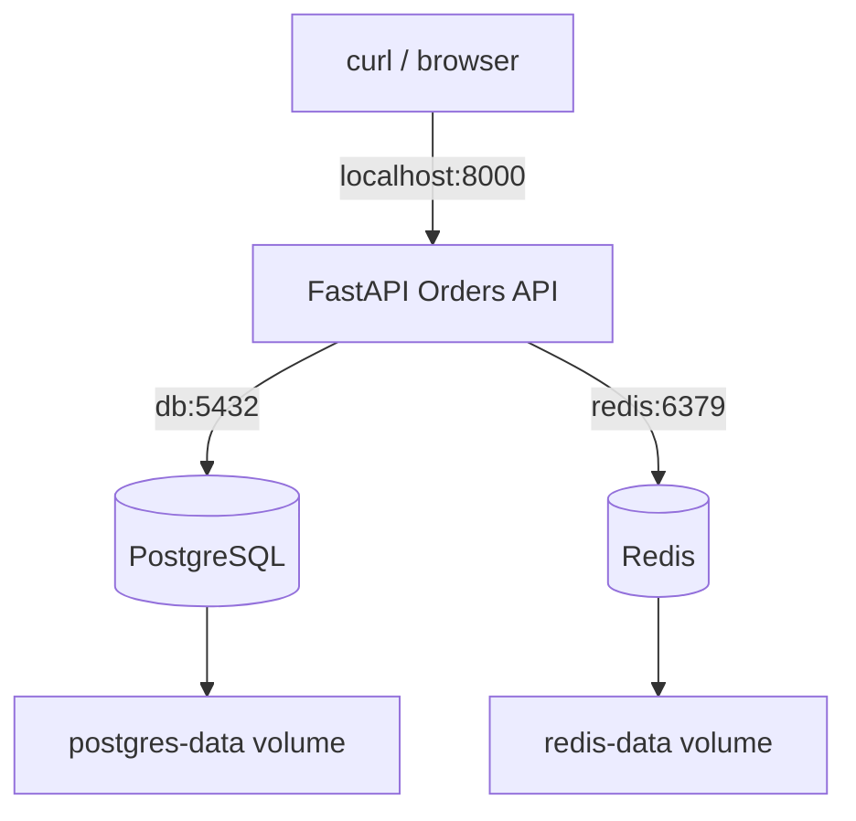
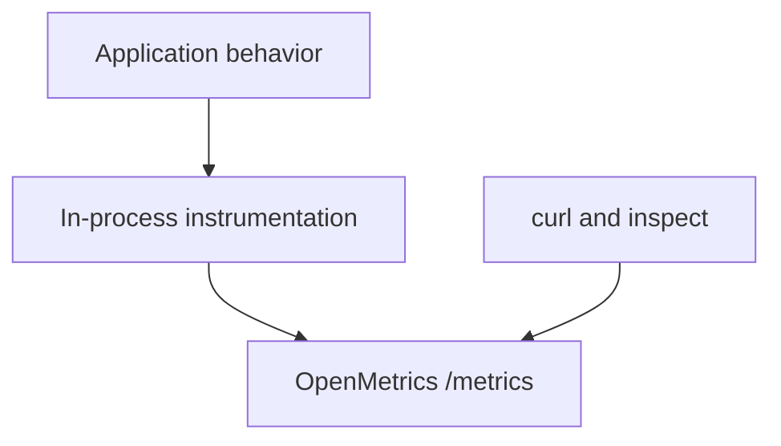

# Lab 01: Application Baseline, Persistence, & Dependency Health

## Purpose and Scope

> **Primary Objective:** Build an evidence-based mental model of the application, PostgreSQL, Redis, container networking, persistent state, cache behavior, liveness, readiness, and dependency failure before introducing the observability backends.

Professional observability starts with system behavior, not with dashboards.

If you do not know what the application does when PostgreSQL fails, what Redis is allowed to mask, or what a health endpoint actually proves, then a green panel can create false confidence. This lab establishes that baseline first.

## 1. Lab Context

Only three services belong in this lab:

```text
FastAPI Orders API
PostgreSQL
Redis
```

Do **not** start these services yet:

```text
Prometheus
Grafana
Alertmanager
OpenTelemetry Collector
Loki
Tempo
Node Exporter
```

The application contains instrumentation, but `make baseline` disables OTLP export for this lab. You will inspect local metrics and JSON logs without introducing a telemetry collector or backend.

This separation matters:

```text
Application behavior first
Telemetry production second
Telemetry transport third
Telemetry storage and analysis fourth
Alerting and response fifth
```

## 2. Prerequisites

Complete the **Setup Required Before Lab 1** section in `README.md`.

You should already have:

- a Linux VM with Docker Engine and Docker Compose;
- `curl`, `jq`, `make`, and Git;
- the extracted repository;
- `.env` copied from `.env.example` and reviewed;
- free or remapped host ports;
- successfully run `docker compose config --quiet`;
- pulled the images and built the application image; and
- a Git baseline commit.

From the repository root, verify your location:

```bash
pwd
test -f docker-compose.yml
test -f app/app/main.py
test -f labs/Lab-1.md
```

Expected result: each `test` command exits successfully without output.

Load the non-secret lab settings into the current shell so later diagnostic commands use any values you changed in `.env`:

```bash
set -a
source .env
set +a

LAB_HTTP_HOST="${BIND_ADDRESS:-127.0.0.1}"
if [[ "${LAB_HTTP_HOST}" == "0.0.0.0" || "${LAB_HTTP_HOST}" == "::" ]]; then
  LAB_HTTP_HOST=127.0.0.1
fi
export APP_URL="http://${LAB_HTTP_HOST}:${APP_HOST_PORT:-8000}"
```

Run that setup block again if you open a new terminal during the lab. Do not print or copy the resulting environment into tickets or shared transcripts because it contains the lab database password.

`APP_URL` makes the remaining commands work when you remap the application host port or bind Compose to a private VM interface.

## 3. Learning Objectives

By the end of Lab 01, you must be able to explain and demonstrate:

- the user-visible purpose of the Orders API;
- the roles of PostgreSQL and Redis;
- an image versus a container versus a Compose service;
- host-to-container port publication;
- Docker DNS and why the app uses `db` and `redis` rather than `localhost`;
- named-volume persistence and container lifecycle;
- cache-aside reads and cache invalidation;
- the difference between a cache hit, miss, error, and stale value;
- the difference between liveness and readiness;
- why a live process can be unable to perform useful work;
- why Redis failure and PostgreSQL failure have different user impact;
- how a cache hit can temporarily mask a database outage;
- what `depends_on: condition: service_healthy` does and does not do;
- how to introduce a bounded failure, collect evidence, recover, and prove recovery;
- why `/metrics` can exist without Prometheus;
- why JSON logs can exist without Loki; and
- the distinction between a telemetry producer, transport, backend, and visualization layer.

## 4. Baseline Architecture



The critical paths are:

| **Path**                  | **Purpose**                    | **Durable?**                                        |
|---------------------------|--------------------------------|-----------------------------------------------------|
| Client → FastAPI          | HTTP request handling          | No                                                  |
| FastAPI → PostgreSQL      | Source-of-truth CRUD data      | Yes                                                 |
| FastAPI → Redis           | Short-lived cached order reads | Redis AOF persists, but cache values are disposable |
| PostgreSQL → named volume | Database files                 | Yes                                                 |
| Redis → named volume      | AOF/cache state                | Yes, but not authoritative business data            |

PostgreSQL is the source of truth. Redis is a performance dependency. That distinction will predict several results later.

## 5. Establish a Clean Starting State

List the Compose services without starting them:

```bash
docker compose config --services
```

You should see:

```text
db
redis
app
prometheus
alertmanager
otel-collector
loki
tempo
grafana
node-exporter
```

Now inspect current state:

```bash
docker compose ps
```

If containers from a previous attempt exist, remove containers while preserving any named volumes:

```bash
docker compose down --remove-orphans
```

Do **not** run either of these commands:

```bash
docker compose down -v
make reset
```

Both can delete persistent lab data. Destructive cleanup is unnecessary for this lab.

## 6. Inspect the Compose Service Definitions

Open the Compose file:

```bash
less docker-compose.yml
```

Find these service keys:

```yaml
services:
  db:
  redis:
  app:
```

A **Compose service** is the desired runtime definition for one component. It can specify an image or build, command, environment, networks, volumes, ports, health check, resource bounds, and dependencies.

### 6.1 Image, Container, and Service

Do not use these terms interchangeably:

| **Term**  | **Meaning In This Lab**                                         |
|-----------|-----------------------------------------------------------------|
| Image     | Immutable packaged runtime, such as `postgres:17.6-alpine`      |
| Container | A running or stopped instance created from an image             |
| Service   | The Compose declaration that defines how a container should run |

The `app` service differs slightly:

```yaml
build:
  context: ./app
  dockerfile: Dockerfile
image: observability-labs/orders-api:1.0.0
```

Compose builds a local image from the Dockerfile and then creates the app container from that image.

### 6.2 Predict Before Inspecting

Without running anything, answer in your notes:

1. Which service stores authoritative order data?
2. Which service can lose all cached values without losing the orders themselves?
3. Which host ports are deliberately bound only to `127.0.0.1`?
4. Which networks will the app join?
5. Will `make baseline` start Prometheus indirectly?

You will prove every answer.

## 7. Database Configuration and Persistence

Locate the PostgreSQL environment:

```yaml
POSTGRES_DB: ${POSTGRES_DB:-orders}
POSTGRES_USER: ${POSTGRES_USER:-orders_app}
POSTGRES_PASSWORD: ${POSTGRES_PASSWORD:-orders_app_lab_password}
```

The expression:

```text
${POSTGRES_DB:-orders}
```

means: use `POSTGRES_DB` if it is set and non-empty; otherwise use `orders`.

Inspect your resolved values without printing the password:

```bash
grep -E '^(POSTGRES_DB|POSTGRES_USER|POSTGRES_HOST_PORT)=' .env
```

Locate the volume:

```yaml
- postgres-data:/var/lib/postgresql/data
```

The named volume outlives replacement of the `db` container. Deleting a container is not the same as deleting its data volume.

Also locate:

```yaml
- ./postgres/init.sql:/docker-entrypoint-initdb.d/001-init.sql:ro
```

The suffix `:ro` means the container sees the host file as read-only. PostgreSQL executes files in this directory only when it initializes an empty data directory. Editing the file later does not re-run it against an existing volume.

## 8. Redis Configuration and Persistence

Locate:

```yaml
command: ["redis-server", "--appendonly", "yes", "--save", "60", "1"]
```

Redis enables append-only persistence and periodic snapshots for this lab. That helps later restart experiments, but it does **not** make Redis the source of truth.

Locate:

```yaml
- redis-data:/data
```

The application assigns cached orders a finite TTL. A cache value may disappear because:

- its TTL expires;
- it is explicitly invalidated;
- Redis evicts it under memory pressure;
- the Redis data is reset; or
- the key never existed.

Correct application behavior must tolerate all of these.

## 9. Container Networking and DNS

The app connects with URLs equivalent to:

```text
postgresql+asyncpg://...@db:5432/orders
redis://redis:6379/0
```

`db` and `redis` are Compose service names. Docker's embedded DNS resolves those names for containers attached to `app-net`.

Inside the app container:

```text
localhost = the app container itself
db        = the PostgreSQL service
redis     = the Redis service
```

Using `localhost:5432` from the app would ask the app container for PostgreSQL. No PostgreSQL process runs there.

The app joins two networks:

```yaml
networks:
  - app-net
  - monitoring-net
```

In Lab 1, `monitoring-net` has no active consumer. It exists so later monitoring services can reach the app without putting PostgreSQL or Redis directly on that network.

## 10. Host Ports Versus Container Ports

The app publishes:

```yaml
${BIND_ADDRESS:-127.0.0.1}:${APP_HOST_PORT:-8000}:8000
```

Read the mapping from left to right:

```text
host interface : host port : container port
```

With the recommended local-only configuration:

```text
127.0.0.1:8000 on the VM → port 8000 in the app container
```

Container-to-container requests continue to use service DNS and container ports. Changing `APP_HOST_PORT` to `18000` would change your host URL, but Prometheus inside Docker would still scrape `app:8000` later.

## 11. Health Checks and Startup Ordering

PostgreSQL runs:

```bash
pg_isready -U "$POSTGRES_USER" -d "$POSTGRES_DB"
```

Redis runs:

```bash
redis-cli ping
```

The app has:

```yaml
depends_on:
  db:
    condition: service_healthy
  redis:
    condition: service_healthy
```

This prevents Compose from creating the app before those startup health checks pass.

It does **not** guarantee that dependencies remain healthy. If PostgreSQL stops ten minutes later, Compose does not continuously pause the app or reconstruct the dependency graph for you.

The app container health check calls `/health/live`, not `/health/ready`. Therefore, the container can remain healthy while a dependency is unavailable. That is deliberate and will be proven.

## 12. Start Only the Baseline

Run:

```bash
make baseline
```

This expands to a command equivalent to:

```bash
APP_OTEL_ENABLED=false docker compose up -d --build db redis app
```

Confirm the active services:

```bash
docker compose ps
```

Expected:

- `db` is running and healthy;
- `redis` is running and healthy;
- `app` is running and healthy; and
- no observability backend appears.

Prove the exclusions:

```bash
docker compose ps --services --status running
```

Expected output contains exactly:

```text
db
redis
app
```

Ordering can differ. Count them:

```bash
docker compose ps --services --status running | wc -l
```

Expected value: `3`.

## 13. Inspect Startup Evidence

Inspect database logs:

```bash
docker compose logs --tail=50 db
```

Look for a message indicating the database is ready to accept connections.

Inspect Redis:

```bash
docker compose logs --tail=50 redis
```

Look for readiness and AOF initialization messages.

Inspect the app:

```bash
docker compose logs --tail=100 app
```

Look for JSON events similar to:

```text
database.initialized
cache.connected
application.started
```

Do not require exact timestamps or container hostnames. Identify the stable fields:

```text
timestamp
severity
service_name
environment
logger
message
request_id
```

Why is `trace_id` absent from some startup logs? There is no active request span, and OTLP instrumentation is disabled for this baseline.

## 14. Inspect the HTTP Interface

Call the service root:

```bash
curl -fsS "${APP_URL}/" | jq
```

The `APP_URL` value prepared in Section 2 already accounts for a remapped host port.

Expected fields include:

```json
{
  "service": "Observable Orders API",
  "version": "1.0.0",
  "environment": "lab",
  "docs": "/docs",
  "metrics": "/metrics"
}
```

Open the generated API documentation in a browser:

```bash
printf '%s/docs\n' "${APP_URL}"
```

Identify the order endpoints and the simulation endpoints, but do not run load simulations yet.

## 15. Liveness

Call:

```bash
curl -i "${APP_URL}/health/live"
```

The legacy short alias also works:

```bash
curl -i "${APP_URL}/health"
```

Expected status:

```text
HTTP/1.1 200 OK
```

Expected body:

```json
{"status":"alive"}
```

Liveness answers one narrow question:

> Can this application process receive and answer an HTTP request?

It does not prove PostgreSQL works, Redis works, orders can be created, cached reads are correct, or a complete user journey succeeds.

## 16. Readiness

Call:

```bash
curl -i "${APP_URL}/health/ready"
```

The short alias also works:

```bash
curl -i "${APP_URL}/ready"
```

Expected status:

```text
HTTP/1.1 200 OK
```

Expected shape:

```json
{
  "status": "ready",
  "dependencies": {
    "postgresql": {"status": "ok", "detail": "ok"},
    "redis": {"status": "ok", "detail": "ok"}
  }
}
```

Readiness asks:

> Should this instance receive ordinary application traffic right now?

This application requires both dependencies to report ready, even though some operations can degrade gracefully when Redis is unavailable.

## 17. Observe Request IDs and JSON Logs

Send a caller-provided request ID:

```bash
curl -i \
  -H 'X-Request-ID: lab01-root-check' \
  "${APP_URL}/"
```

The response should contain:

```text
x-request-id: lab01-root-check
```

Find the matching log:

```bash
docker compose logs app | grep 'lab01-root-check'
```

Pretty-print the latest matching JSON object:

```bash
docker compose logs --no-log-prefix app \
  | grep 'lab01-root-check' \
  | tail -n 1 \
  | jq
```

Record:

- HTTP method;
- route template;
- status code;
- duration in milliseconds; and
- request ID.

The route is a template such as `/api/v1/orders/{order_id}`, not a concrete value such as `/api/v1/orders/4817`. Template labels prevent one metric series per order ID.

## 18. Create the First Order

Create an order with synthetic data:

```bash
CREATE_RESPONSE="$({
  curl -fsS \
    -X POST \
    -H 'Content-Type: application/json' \
    -H 'X-Request-ID: lab01-create-order' \
    -d '{
      "customer_name": "Ada Lovelace",
      "product": "Observability Workbook",
      "quantity": 2,
      "unit_price": "24.50",
      "status": "pending"
    }' \
    "${APP_URL}/api/v1/orders"
})"
```

Inspect it:

```bash
jq <<<"${CREATE_RESPONSE}"
```

Capture the generated ID:

```bash
ORDER_ID="$(jq -er '.id' <<<"${CREATE_RESPONSE}")"
printf 'ORDER_ID=%s\n' "${ORDER_ID}"
```

Expected: a positive integer.

The API writes PostgreSQL first. Only after the commit succeeds does it place the serialized order in Redis. This ordering avoids caching an order that the source of truth rejected.

## 19. Verify PostgreSQL Directly

Do not treat the API response alone as proof of persistence. Query the source of truth:

```bash
docker compose exec db \
  psql \
    -U "${POSTGRES_USER:-orders_app}" \
    -d "${POSTGRES_DB:-orders}" \
    -c "SELECT id, customer_name, product, quantity, unit_price, status FROM orders WHERE id = ${ORDER_ID};"
```

Expected: one row matching the API response.

Inspect the schema:

```bash
docker compose exec db \
  psql \
    -U "${POSTGRES_USER:-orders_app}" \
    -d "${POSTGRES_DB:-orders}" \
    -c '\d+ orders'
```

Identify:

- the primary key;
- numeric precision for price;
- status and timestamp columns; and
- check constraints for quantity and price.

## 20. Verify Redis Directly

The create path warms the cache. Confirm the key:

```bash
docker compose exec redis redis-cli EXISTS "order:${ORDER_ID}"
```

Expected result: `1`.

Inspect the TTL:

```bash
docker compose exec redis redis-cli TTL "order:${ORDER_ID}"
```

Expected: a positive number no greater than the configured cache TTL, unless you waited long enough for it to expire.

Inspect the cached JSON:

```bash
docker compose exec redis redis-cli GET "order:${ORDER_ID}" | jq
```

The cached representation is derived data. PostgreSQL remains authoritative.

## 21. Prove Cache Miss and Cache Hit Behavior

Delete only the cached copy:

```bash
docker compose exec redis redis-cli DEL "order:${ORDER_ID}"
```

Confirm it is absent:

```bash
docker compose exec redis redis-cli EXISTS "order:${ORDER_ID}"
```

Expected: `0`.

Read the order through the API:

```bash
curl -fsS \
  -H 'X-Request-ID: lab01-cache-miss' \
  "${APP_URL}/api/v1/orders/${ORDER_ID}" | jq
```

This request follows:

```text
Redis miss → PostgreSQL read → Redis set → HTTP response
```

Read it a second time:

```bash
curl -fsS \
  -H 'X-Request-ID: lab01-cache-hit' \
  "${APP_URL}/api/v1/orders/${ORDER_ID}" | jq
```

This request should follow:

```text
Redis hit → HTTP response
```

Do not assume the second request was a hit merely because it was fast. Prove the cache key exists and inspect metrics in the next section.

## 22. Inspect Metrics Without Prometheus

Fetch the exposition:

```bash
curl -fsS "${APP_URL}/metrics" > /tmp/lab01-metrics.txt
```

Find request metrics:

```bash
grep '^obslab_http_requests_total' /tmp/lab01-metrics.txt
```

Find cache outcomes:

```bash
grep '^obslab_cache_operations_total' /tmp/lab01-metrics.txt
```

Expected series include outcomes such as:

```text
outcome="miss"
outcome="hit"
outcome="success"
```

Find histogram buckets:

```bash
grep '^obslab_http_request_duration_seconds_bucket' /tmp/lab01-metrics.txt | head
```

Prometheus is not running. The application is the telemetry producer and exposition endpoint. `curl` is merely reading the current process state.

Without Prometheus you do not yet have:

- scheduled collection;
- a durable time series;
- historical range queries;
- rate calculation across time;
- recording rules;
- alert evaluation; or
- Grafana visualization.

## 23. Update and Invalidate

Update the order:

```bash
curl -fsS \
  -X PUT \
  -H 'Content-Type: application/json' \
  -H 'X-Request-ID: lab01-update-order' \
  -d '{"status":"paid","quantity":3}' \
  "${APP_URL}/api/v1/orders/${ORDER_ID}" | jq
```

The application commits the database change and refreshes the cached value.

Compare both stores:

```bash
docker compose exec db \
  psql \
    -U "${POSTGRES_USER:-orders_app}" \
    -d "${POSTGRES_DB:-orders}" \
    -tAc "SELECT quantity || ':' || status FROM orders WHERE id = ${ORDER_ID};"
```

```bash
docker compose exec redis redis-cli GET "order:${ORDER_ID}" \
  | jq -r '(.quantity | tostring) + ":" + .status'
```

Expected from both:

```text
3:paid
```

This is cache consistency by explicit refresh, not a distributed transaction. A process failure between database commit and cache update could leave a stale cached value until invalidation or TTL expiry. Record that production implication.

## 24. Controlled Failure Method

Every failure exercise in this course uses the same operating discipline:

1. Define the hypothesis.
2. Predict user-visible behavior.
3. Record the start time.
4. Change exactly one component.
5. Collect evidence from every relevant layer.
6. Explain the root cause.
7. Restore only the changed component.
8. Prove recovery.
9. Record residual risk or hidden state.

Never begin with “restart everything.”

## 25. Redis Failure: Predict First

Before stopping Redis, write predicted status codes for:

| **Check/Action**          | **Prediction** |
|---------------------------|----------------|
| `/health/live`            |       ?        |
| `/health/ready`           |       ?        |
| `GET /api/v1/orders/{id}` |       ?        |
| `POST /api/v1/orders`     |       ?        |
| App container health      |       ?        |

Use architecture, not guessing:

- the process remains running;
- readiness explicitly probes Redis;
- order reads catch Redis errors and fall back to PostgreSQL;
- order writes commit PostgreSQL and treat cache-set failure as degraded behavior; and
- the container health check uses liveness.

## 26. Stop Only Redis

Record the UTC time:

```bash
date -u +'%Y-%m-%dT%H:%M:%SZ'
```

Stop Redis:

```bash
docker compose stop redis
```

Inspect state:

```bash
docker compose ps
```

Confirm the app was not restarted:

```bash
docker inspect -f '{{.RestartCount}}' obs-lab-app
```

Expected restart count: normally `0`.

## 27. Observe Liveness and Readiness During Redis Failure

Liveness:

```bash
curl -sS -o /tmp/redis-down-live.json -w '%{http_code}\n' \
  "${APP_URL}/health/live"
jq . /tmp/redis-down-live.json
```

Expected HTTP status: `200`.

Readiness:

```bash
curl -sS -o /tmp/redis-down-ready.json -w '%{http_code}\n' \
  "${APP_URL}/health/ready"
jq . /tmp/redis-down-ready.json
```

Expected HTTP status: `503`, with PostgreSQL `ok` and Redis `error`.

Inspect Docker's view of the app:

```bash
docker inspect \
  --format '{{json .State.Health}}' \
  obs-lab-app | jq
```

Expected: the app container remains healthy because its container probe tests liveness only.

## 28. Prove Graceful Cache Degradation

Read the existing order:

```bash
curl -sS \
  -H 'X-Request-ID: lab01-redis-down-read' \
  -o /tmp/redis-down-read.json \
  -w '%{http_code}\n' \
  "${APP_URL}/api/v1/orders/${ORDER_ID}"
jq . /tmp/redis-down-read.json
```

Expected HTTP status: `200`.

The cache lookup fails, the application logs a warning, and PostgreSQL serves the order.

Find the evidence:

```bash
docker compose logs --since=5m --no-log-prefix app \
  | grep -E 'cache\.(get|set|health_check)_failed|lab01-redis-down-read'
```

Create another order while Redis is unavailable:

```bash
curl -sS \
  -X POST \
  -H 'Content-Type: application/json' \
  -d '{
    "customer_name":"Grace Hopper",
    "product":"Failure Analysis Notebook",
    "quantity":1,
    "unit_price":"18.00"
  }' \
  -o /tmp/redis-down-create.json \
  -w '%{http_code}\n' \
  "${APP_URL}/api/v1/orders"
jq . /tmp/redis-down-create.json
```

Expected HTTP status: `201`. The database write succeeds; cache warming fails and is logged.

This is a deliberate policy choice:

```text
Redis failure = degraded performance and readiness, not loss of CRUD correctness
```

## 29. Restore Redis and Prove Recovery

Start Redis:

```bash
docker compose start redis
```

Wait for a real response:

```bash
until docker compose exec -T redis redis-cli ping | grep -q PONG; do
  sleep 1
done
```

Check readiness:

```bash
curl -fsS "${APP_URL}/health/ready" | jq
```

Expected: both dependencies return `ok`.

Read the original order twice to repopulate and use the cache:

```bash
curl -fsS "${APP_URL}/api/v1/orders/${ORDER_ID}" >/dev/null
curl -fsS "${APP_URL}/api/v1/orders/${ORDER_ID}" >/dev/null
```

Verify the key:

```bash
docker compose exec redis redis-cli EXISTS "order:${ORDER_ID}"
```

Expected: `1`.

Recovery is proven only when the dependency answers, readiness recovers, and an actual user operation succeeds.

## 30. PostgreSQL Failure: Predict the Cache Mask

The original order is now cached. Before stopping PostgreSQL, predict:

| **Check/Action**                            | **Prediction** |
|---------------------------------------------|----------------|
| `/health/live`                              |       ?        |
| `/health/ready`                             |       ?        |
| GET cached order                            |       ?        |
| GET same order after deleting its Redis key |       ?        |
| POST new order                              |       ?        |
| App container health                        |       ?        |

The important question is not simply “is the database down?” It is:

> Which user paths require the database on this request, and which can temporarily be served by derived state?

## 31. Stop Only PostgreSQL

```bash
date -u +'%Y-%m-%dT%H:%M:%SZ'
docker compose stop db
docker compose ps
```

Confirm FastAPI and Redis remain running.

Test liveness:

```bash
curl -sS -o /tmp/db-down-live.json -w '%{http_code}\n' \
  "${APP_URL}/health/live"
```

Expected: `200`.

Test readiness:

```bash
curl -sS -o /tmp/db-down-ready.json -w '%{http_code}\n' \
  "${APP_URL}/health/ready"
jq . /tmp/db-down-ready.json
```

Expected: `503`, with PostgreSQL `error` and Redis `ok`.

## 32. Demonstrate a Cached Read During Database Failure

Confirm the key still exists:

```bash
docker compose exec redis redis-cli EXISTS "order:${ORDER_ID}"
```

If the result is `0` because the TTL expired, temporarily restart PostgreSQL, read the order once, and stop PostgreSQL again before continuing.

Now read the cached order:

```bash
curl -sS \
  -H 'X-Request-ID: lab01-db-down-cache-hit' \
  -o /tmp/db-down-cache-hit.json \
  -w '%{http_code}\n' \
  "${APP_URL}/api/v1/orders/${ORDER_ID}"
jq . /tmp/db-down-cache-hit.json
```

Expected: `200`.

This does not prove the application is ready or PostgreSQL is healthy. It proves only that one derived representation was available in Redis.

This is the **cache mask**:

```text
Database unavailable + cached key available = selected read can still succeed
```

## 33. Remove the Mask and Prove Database Dependence

Delete the cached key while PostgreSQL remains stopped:

```bash
docker compose exec redis redis-cli DEL "order:${ORDER_ID}"
```

Repeat the read:

```bash
curl -sS \
  -H 'X-Request-ID: lab01-db-down-cache-miss' \
  -o /tmp/db-down-cache-miss.json \
  -w '%{http_code}\n' \
  "${APP_URL}/api/v1/orders/${ORDER_ID}"

jq . /tmp/db-down-cache-miss.json 2>/dev/null || jq -n \
  --arg response "$(cat /tmp/db-down-cache-miss.json)" \
  '{error: $response}'
```

Expected HTTP status: `503`.

Attempt a write:

```bash
curl -sS \
  -X POST \
  -H 'Content-Type: application/json' \
  -d '{
    "customer_name":"Katherine Johnson",
    "product":"Capacity Planning Guide",
    "quantity":1,
    "unit_price":"21.00"
  }' \
  -o /tmp/db-down-create.json \
  -w '%{http_code}\n' \
  "${APP_URL}/api/v1/orders"

jq . /tmp/db-down-create.json 2>/dev/null || jq -n \
  --arg response "$(cat /tmp/db-down-create.json)" \
  '{error: $response}'
```

Expected: `503`.

Compare the three database-outage results:

| **Operation**  | **Result** | **Explanation**                            |
|----------------|------------|--------------------------------------------|
| Liveness       | 200        | Process can answer HTTP                    |
| Cached GET     | 200        | Redis supplied derived data                |
| Cache-miss GET | 503        | PostgreSQL was required                    |
| POST           | 503        | Source-of-truth commit was required        |
| Readiness      | 503        | Dependency probe correctly detected outage |

## 34. Inspect Failure Evidence

Application logs:

```bash
docker compose logs --since=10m --no-log-prefix app \
  | grep -E 'database\.|lab01-db-down|http.request_completed' \
  | tail -n 30
```

Container state:

```bash
docker compose ps db app redis
```

App health history:

```bash
docker inspect \
  --format '{{json .State.Health}}' \
  obs-lab-app | jq
```

Metrics snapshot:

```bash
curl -fsS "${APP_URL}/metrics" \
  | grep -E '^obslab_(http_requests_total|database_operations_total|cache_operations_total)'
```

Write a one-paragraph root-cause statement containing:

- failed component;
- unaffected components;
- readiness impact;
- which request paths succeeded;
- which request paths failed; and
- the evidence that distinguishes cache behavior from database behavior.

## 35. Restore PostgreSQL and Prove Durable Recovery

Start only PostgreSQL:

```bash
docker compose start db
```

Wait for it:

```bash
until docker compose exec -T db \
  pg_isready \
    -U "${POSTGRES_USER:-orders_app}" \
    -d "${POSTGRES_DB:-orders}"; do
  sleep 1
done
```

Check readiness:

```bash
curl -fsS "${APP_URL}/health/ready" | jq
```

Read the original order:

```bash
curl -fsS "${APP_URL}/api/v1/orders/${ORDER_ID}" | jq
```

Query PostgreSQL directly:

```bash
docker compose exec db \
  psql \
    -U "${POSTGRES_USER:-orders_app}" \
    -d "${POSTGRES_DB:-orders}" \
    -c "SELECT id, status FROM orders WHERE id = ${ORDER_ID};"
```

The order survived because the named volume was not deleted. `docker compose stop` stops a container process; it does not delete the container or its named volume.

## 36. Prove Container Replacement Is Different From Data Deletion

Capture the database container ID:

```bash
OLD_DB_CONTAINER_ID="$(docker compose ps -q db)"
printf '%s\n' "${OLD_DB_CONTAINER_ID}"
```

Recreate only the database container:

```bash
docker compose up -d --force-recreate db
```

Wait for health, then capture the new ID:

```bash
until docker compose exec -T db \
  pg_isready \
    -U "${POSTGRES_USER:-orders_app}" \
    -d "${POSTGRES_DB:-orders}"; do
  sleep 1
done

NEW_DB_CONTAINER_ID="$(docker compose ps -q db)"
printf 'old=%s\nnew=%s\n' "${OLD_DB_CONTAINER_ID}" "${NEW_DB_CONTAINER_ID}"
```

The IDs should differ.

Verify the order still exists:

```bash
docker compose exec db \
  psql \
    -U "${POSTGRES_USER:-orders_app}" \
    -d "${POSTGRES_DB:-orders}" \
    -tAc "SELECT count(*) FROM orders WHERE id = ${ORDER_ID};"
```

Expected: `1`.

List the explicit volume:

```bash
docker volume inspect obs-lab-postgres-data | jq '.[0] | {Name,Driver,Mountpoint}'
```

You have now proven:

```text
container identity changed
volume identity remained
business data remained
```

## 37. Inspect Cache TTL and Expiration

Ensure the order is cached:

```bash
curl -fsS "${APP_URL}/api/v1/orders/${ORDER_ID}" >/dev/null
```

Observe TTL twice:

```bash
docker compose exec redis redis-cli TTL "order:${ORDER_ID}"
sleep 3
docker compose exec redis redis-cli TTL "order:${ORDER_ID}"
```

The second value should normally be about three seconds lower.

Interpret Redis TTL results correctly:

| **Value**        | **Meaning**                   |
|------------------|-------------------------------|
| Positive Integer | Seconds until expiration      |
| `-1`             | Key exists without expiration |
| `-2`             | Key does not exist            |

Do not wait for the full TTL unless you want to. You have already proven explicit eviction and repopulation.

## 38. Validate Input Boundaries

Send an invalid quantity:

```bash
curl -sS \
  -X POST \
  -H 'Content-Type: application/json' \
  -d '{
    "customer_name":"Validation Test",
    "product":"Invalid Order",
    "quantity":0,
    "unit_price":"10.00"
  }' \
  -o /tmp/invalid-order.json \
  -w '%{http_code}\n' \
  "${APP_URL}/api/v1/orders"
jq . /tmp/invalid-order.json
```

Expected: HTTP `422` with field-level validation details.

Now use a nonexistent ID:

```bash
curl -sS -o /tmp/not-found.json -w '%{http_code}\n' \
  "${APP_URL}/api/v1/orders/2147483647"
jq . /tmp/not-found.json
```

Expected: `404` when PostgreSQL is available.

Validation failure, missing data, unavailable dependency, and internal exception are different failure categories. They should not be counted or alerted on identically.

## 39. Run a Safe Simulation Preview

Run one bounded latency request:

```bash
time curl -fsS \
  "${APP_URL}/api/v1/simulate/latency?seconds=1" | jq
```

Run one expected HTTP error:

```bash
curl -sS \
  -o /tmp/simulated-error.json \
  -w '%{http_code}\n' \
  "${APP_URL}/api/v1/simulate/error?status_code=500"
jq . /tmp/simulated-error.json
```

The server enforces limits for latency, CPU duration, and memory allocation. These limits reduce accidental blast radius; they do not make the endpoints safe to expose publicly.

Inspect the metrics that changed:

```bash
curl -fsS "${APP_URL}/metrics" \
  | grep '^obslab_simulations_total'
```

## 40. Telemetry Producer Versus Backend

The baseline app produces:

- Prometheus metrics in process;
- structured JSON logs on stdout; and
- when enabled in later labs, OpenTelemetry logs, metrics, and traces.

No monitoring backend is running now.

| **Role**                | **Lab 1 Component** | **Present Now?** |
|-------------------------|---------------------|------------------|
| Metric Producer         | FastAPI process     |        Yes       |
| Metric Exposition       | `/metrics`          |        Yes       |
| Metrics Collector/Store | Prometheus          |         No       |
| Log producer            | Python logging      |        Yes       |
| Immediate Log Transport | Container stdout    |        Yes       |
| Central Log Backend     | Loki                |         No       |
| OTLP Gateway            | OTel Collector      |         No       |
| Trace Backend           | Tempo               |         No       |
| Visualization           | Grafana             |         No       |
| Alert Evaluation        | Prometheus rules    |         No       |
| Notification Routing    | Alertmanager        |         No       |

An instrumented process and an observability system are not the same thing.

## 41. What Remains Unobservable

Even after this lab, you cannot yet answer reliably:

- What was the request rate 45 minutes ago?
- Is p95 latency trending upward?
- Did the error ratio exceed an SLO threshold for five minutes?
- Which host resource is saturated?
- Which SQL or Redis operation dominated a slow request?
- Can you query logs across container replacement?
- Can you find every log for one trace ID?
- Will an operator be notified without watching a terminal?

These gaps motivate the remaining labs.

## 42. Troubleshooting Runbook

### 42.1 The App Did Not Start

Inspect the model and state:

```bash
docker compose config --quiet
docker compose ps -a
docker compose logs --tail=100 db redis app
```

Then isolate dependencies:

```bash
docker compose exec -T db \
  pg_isready \
    -U "${POSTGRES_USER:-orders_app}" \
    -d "${POSTGRES_DB:-orders}"
docker compose exec -T redis redis-cli ping
```

Common causes:

- a host port is already occupied;
- the app image did not build;
- `.env` contains an unintended value;
- PostgreSQL credentials changed after the data volume was initialized;
- a dependency health check never passed; or
- the VM has insufficient disk or memory.

### 42.2 PostgreSQL Authentication Fails After Editing `.env`

The official image applies `POSTGRES_USER`, `POSTGRES_PASSWORD`, and `POSTGRES_DB` only while initializing an empty data directory. Changing `.env` does not rewrite users inside an existing volume.

Safe options:

1. Restore the prior `.env` values.
2. Change the database role password intentionally with SQL.
3. If and only if the data is disposable, use the explicit reset script and acknowledge the deletion.

Do not delete the volume merely because authentication failed before determining whether it contains needed work.

### 42.3 `curl` Cannot Connect

Check:

```bash
docker compose ps app
grep -E '^(BIND_ADDRESS|APP_HOST_PORT)=' .env
ss -lnt | grep -E ":${APP_HOST_PORT:-8000}([[:space:]]|$)" || true
```

If `BIND_ADDRESS=127.0.0.1`, the service is reachable only from the VM. Use an SSH tunnel or change to a private VM interface when connecting remotely.

### 42.4 Readiness Is 503

Do not restart first. Capture the body:

```bash
curl -sS "${APP_URL}/health/ready" | jq
```

Then test only the dependency reported as failed.

PostgreSQL:

```bash
docker compose ps db
docker compose logs --tail=100 db
docker compose exec -T db \
  pg_isready \
    -U "${POSTGRES_USER:-orders_app}" \
    -d "${POSTGRES_DB:-orders}"
```

Redis:

```bash
docker compose ps redis
docker compose logs --tail=100 redis
docker compose exec -T redis redis-cli ping
```

### 42.5 A GET Succeeds While PostgreSQL Is Down

Check the cache before concluding that the database recovered:

```bash
docker compose exec redis redis-cli EXISTS "order:${ORDER_ID}"
docker compose exec redis redis-cli TTL "order:${ORDER_ID}"
```

A cache hit proves only that Redis held that key. Use readiness and a direct database probe to determine database state.

### 42.6 JSON Log Parsing Fails

Compose prefixes logs by default. Use:

```bash
docker compose logs --no-log-prefix app | tail -n 1 | jq
```

If multiple lines include non-JSON runtime output, filter for a known event or request ID before sending a line to `jq`.

### 42.7 A Redis Command Reports No Key

Check TTL and cache warming:

```bash
docker compose exec redis redis-cli TTL "order:${ORDER_ID}"
curl -fsS "${APP_URL}/api/v1/orders/${ORDER_ID}" >/dev/null
docker compose exec redis redis-cli EXISTS "order:${ORDER_ID}"
```

`-2` means the key is absent. It may have expired normally.

### 42.8 The Wrong Services Started

List actual running services:

```bash
docker compose ps --services --status running
```

For Lab 1, stop the full model and restart the baseline without deleting volumes:

```bash
docker compose down --remove-orphans
make baseline
```

## 43. Evidence-Based Diagnostic Sequence

Use this sequence when an order request fails:

1. Record UTC time, request ID, HTTP method, URL, status, and response body.
2. Test `/health/live`.
3. Test `/health/ready` and read the dependency details.
4. Inspect `docker compose ps`.
5. Filter app logs by request ID.
6. Test PostgreSQL and Redis directly.
7. Check whether the order key exists in Redis.
8. Query the row in PostgreSQL.
9. State which layer failed and what evidence excludes the other layers.
10. Repair only that layer.
11. Repeat readiness and the original request.
12. Record recovery time and any remaining inconsistency.

The conclusion must be no broader than the evidence. A successful liveness check does not prove CRUD; a successful cached GET does not prove PostgreSQL; a running container does not prove readiness.

## 44. Command Reference

By the end of Lab 01, understand what evidence each command provides:

```bash
make baseline
docker compose config --services
docker compose ps
docker compose logs --tail=100 app
docker compose logs --no-log-prefix app
docker compose stop redis
docker compose start redis
docker compose stop db
docker compose start db
docker compose up -d --force-recreate db
docker inspect -f '{{.RestartCount}}' obs-lab-app
docker inspect --format '{{json .State.Health}}' obs-lab-app
docker volume inspect obs-lab-postgres-data
docker compose exec redis redis-cli PING
docker compose exec redis redis-cli EXISTS order:1
docker compose exec redis redis-cli TTL order:1
docker compose exec db psql -U "${POSTGRES_USER}" -d "${POSTGRES_DB}"
curl -i "${APP_URL}/health/live"
curl -i "${APP_URL}/health/ready"
curl "${APP_URL}/metrics"
```

For each command, ask:

```text
Which layer does this inspect?
What exact claim can it prove?
What can it not prove?
Can it change state or destroy evidence?
```

## 45. Knowledge Check

Answer without looking back at the guide.

### Q1

What is the difference between an image, a container, and a Compose service?

### Q2

Why does the app use `db:5432` instead of `localhost:5432`?

### Q3

What is the difference between a published host port and a container port?

### Q4

Why is PostgreSQL not attached to `monitoring-net`?

### Q5

What data is authoritative: the PostgreSQL row or the Redis value?

### Q6

Describe the cache-aside path for a cache miss.

### Q7

Why does a successful cache hit not prove PostgreSQL is healthy?

### Q8

Why can CRUD continue during a Redis outage in this application?

### Q9

Why does readiness still fail when Redis is unavailable?

### Q10

Why does a write fail when PostgreSQL is unavailable even if Redis is healthy?

### Q11

What does `/health/live` prove?

### Q12

What does `/health/ready` test?

### Q13

Why can the app container remain Docker-healthy while readiness returns 503?

### Q14

What startup race does `condition: service_healthy` reduce?

### Q15

What runtime failure does `depends_on` not solve?

### Q16

Why did the order survive a forced database-container replacement?

### Q17

What is the difference between `docker compose down` and `docker compose down -v`?

### Q18

When does `postgres/init.sql` execute?

### Q19

What do Redis TTL values `-1` and `-2` mean?

### Q20

Why does the app write PostgreSQL before setting Redis?

### Q21

What stale-cache window can still exist after a database commit?

### Q22

Why are concrete order IDs not used as Prometheus route-label values?

### Q23

How can `/metrics` work while Prometheus is not running?

### Q24

How can JSON logs exist while Loki is not running?

### Q25

Name the telemetry producer, collector, trace backend, log backend, metrics backend, visualization layer, and notification router planned for later labs.

### Q26

Why is a 422 validation response operationally different from a 503 dependency failure?

### Q27

What evidence would prove recovery from a PostgreSQL outage?

### Q28

Why is “restart everything” a poor first diagnostic action?

## 46. Professional Scenario Exercise

An operator reports:

> “The API is healthy because I can retrieve order 17.”

At the same time:

- `/health/live` returns 200;
- `/health/ready` returns 503 with PostgreSQL error;
- Redis contains `order:17`;
- a POST returns 503; and
- another uncached GET returns 503.

Write a concise incident update with four parts:

1. Current user impact.
2. Confirmed failing component.
3. Why one GET succeeded.
4. The next evidence or recovery action.

A professional answer avoids both extremes:

- “Everything is fine because one request worked.”
- “Everything is down because readiness failed.”

It describes partial availability precisely.

## 47. Lab Notebook Entry

Create:

```bash
nano lab-notes/lab-01.md
```

Record at least:

```markdown
# Lab 01: Application Baseline, Persistence, and Dependency Health

## Objective

## Components Started
- FastAPI
- PostgreSQL
- Redis

## Components Intentionally Excluded

## Architecture

## Docker Networks

## Host and Container Ports

## Named Volumes

## Source of Truth

## Cache-Aside Sequence

## Liveness Contract

## Readiness Contract

## First Order ID

## PostgreSQL Evidence

## Redis Evidence

## Cache Miss Prediction and Observation

## Cache Hit Prediction and Observation

## Redis Failure
Start time:
Predictions:
Observed status codes:
Logs:
User impact:
Recovery evidence:

## PostgreSQL Failure
Start time:
Predictions:
Cached-read result:
Cache-miss result:
Write result:
Logs:
User impact:
Recovery evidence:

## Container Replacement and Persistence

## Metrics Observed Without Prometheus

## JSON Log Fields

## Root-Cause Statement

## Professional Scenario Response

## Commands Learned

## Production Implications

## Questions I Still Have
```

Record failed commands and incorrect predictions too. The learning evidence is the correction, not a perfect transcript.

## 48. Lab Completion Criteria

Lab 01 is complete only when you can demonstrate and explain all of the following:

- [ ] Start exactly PostgreSQL, Redis, and FastAPI with OTLP disabled.
- [ ] Prove no observability backend is running.
- [ ] Explain image, container, and service without using them interchangeably.
- [ ] Explain host ports and container ports.
- [ ] Explain Docker service-name DNS.
- [ ] Explain why `localhost` is wrong for app-to-database communication.
- [ ] Identify `app-net` and `monitoring-net` responsibilities.
- [ ] Explain the PostgreSQL and Redis named volumes.
- [ ] Explain when initialization SQL runs.
- [ ] Explain startup health conditions and their runtime limitation.
- [ ] Call and explain liveness.
- [ ] Call and explain dependency-aware readiness.
- [ ] Create, list, read, update, and directly verify an order.
- [ ] Inspect the authoritative row in PostgreSQL.
- [ ] Inspect the derived cached value and TTL in Redis.
- [ ] Deliberately create a cache miss and prove subsequent cache warming.
- [ ] Correlate a request ID with a structured JSON log.
- [ ] Stop only Redis and predict behavior before testing.
- [ ] Demonstrate liveness 200 and readiness 503 during Redis failure.
- [ ] Demonstrate a read and a write succeeding through PostgreSQL while Redis is down.
- [ ] Identify cache warnings in logs.
- [ ] Restore Redis and prove dependency plus user-path recovery.
- [ ] Warm a cached order, then stop only PostgreSQL.
- [ ] Demonstrate a cached GET succeeding during the database outage.
- [ ] Remove the cached key and demonstrate the same GET failing.
- [ ] Demonstrate a write failing while PostgreSQL is down.
- [ ] Explain partial availability without calling the whole service healthy.
- [ ] Restore PostgreSQL and prove readiness and CRUD recovery.
- [ ] Replace the database container without losing the order.
- [ ] Explain why the named volume preserved state.
- [ ] Read application metrics without Prometheus.
- [ ] Explain metric production versus collection and storage.
- [ ] Read JSON logs without Loki.
- [ ] Explain log production versus centralized storage.
- [ ] Distinguish 404, 422, 500, and 503 operational meanings.
- [ ] Use the diagnostic sequence without broad restarts.
- [ ] Complete the professional scenario exercise.
- [ ] Draw the baseline architecture from memory.
- [ ] Save an evidence-rich lab notebook entry.

If you can repeat commands but cannot explain why a cached GET and a database write behave differently during PostgreSQL failure, the lab is not complete.

## 49. Production Implications

### 49.1 Process Health Is Not User-Journey Health

A process can answer liveness while dependencies prevent most useful work.

### 49.2 Readiness Is a Traffic Contract

Readiness expresses whether the instance should receive normal traffic. Its dependency policy must match the service's operational contract, not a generic checklist.

### 49.3 Graceful Degradation Must Be Explicit

Redis failure is tolerated by falling back to PostgreSQL, but the resulting latency and database load can still create an incident.

### 49.4 Caches Can Hide and Create Failure Modes

A cached read can mask a source-of-truth outage. A stale value can also return a technically successful but incorrect response. Success status alone is incomplete evidence.

### 49.5 Persistence Belongs to Volumes, Not Container Identity

Containers are replaceable processes. Durable state requires an understood, backed-up, and tested storage lifecycle.

### 49.6 Startup Ordering Is Not Supervision

`depends_on` reduces startup races. It is not continuous dependency monitoring, failover, or recovery automation.

### 49.7 Instrumentation Must Preserve Bounded Dimensions

Route templates are useful labels; customer names, order IDs, request IDs, and raw URLs are not safe metric labels. High-cardinality context belongs in logs or traces with deliberate retention and access controls.

### 49.8 Telemetry Paths Need Independent Failure Reasoning

Stdout logs can remain available when Loki is down. Prometheus exposition can remain available when Prometheus is down. Application availability and telemetry-pipeline availability are separate concerns.

### 49.9 Local Single-Binary Storage Has a Boundary

Local volumes are appropriate for one-VM labs. Production Loki and Tempo deployments generally require object storage, authentication, capacity planning, tested backups, and availability across failure domains.

### 49.10 Recovery Requires Proof

A container entering `running` state is not enough. Re-run dependency checks and the original user operation, then verify data correctness.

## 50. End State and Transition to Lab 02

Leave these services running unless you need to stop the VM:

```text
db
redis
app
```

Verify:

```bash
docker compose ps
curl -fsS "${APP_URL}/health/ready" | jq
```

If you must stop work, preserve all data:

```bash
docker compose stop
```

Resume later with:

```bash
APP_OTEL_ENABLED=false docker compose up -d db redis app
```

Lab 02 begins with the telemetry already exposed by the application, but still without Prometheus:



You will learn to read metric families, samples, labels, counters, gauges, histograms, and cardinality before any metrics server automates collection.