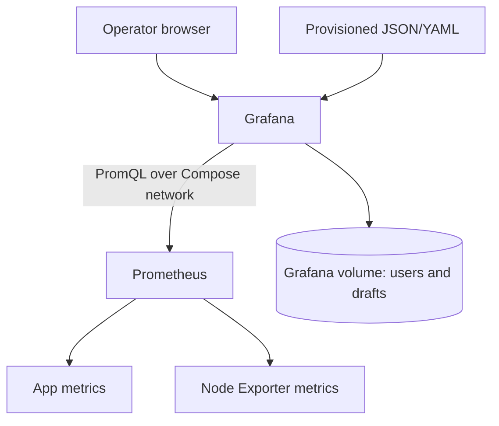
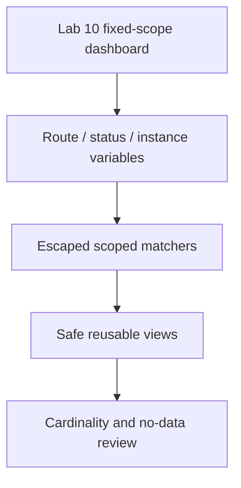

# Lab 10: Grafana Dashboard Fundamentals

## Purpose and Scope

> **Primary objective:** Build a dashboard from operator questions and verified query contracts, then export it as reviewed source-controlled JSON.

Grafana can make incorrect telemetry look convincing. Labs 05–09 established the hard parts first: label scope, counter math, histogram math, recording rules, and host signals.

Lab 10 uses this design order:

```text
audience -> decisions -> questions -> query contracts -> panels -> layout -> validation
```

You will start Grafana without the later log/trace stack, verify provisioned data sources, audit the baseline dashboard, create a learner-owned draft, build eight exact panels, test no-data and controlled-load behavior, export a provisioned copy to the repository, and review the resulting JSON as code.

---

## 10.1 Inherited State From Lab 09

Expected running services:

```text
app
db
node-exporter
prometheus
redis
```

Expected conditions:

- app, Prometheus, and Node Exporter targets are `UP`;
- OpenTelemetry is disabled;
- Loki, Tempo, Collector, Alertmanager, and Grafana are stopped;
- Prometheus has application recording rules; and
- Node Exporter provides VM metrics.

Lab 08’s optional route-level recording rule is not required by the dashboard.

---

## 10.2 Explicit Scope and Exclusions

Services used:

```text
db
redis
app
prometheus
node-exporter
grafana
```

Keep stopped:

```text
alertmanager
otel-collector
loki
tempo
```

Grafana will provision Loki and Tempo data-source definitions, but their health checks will fail intentionally because those backends are out of scope.

This lab does not teach:

- dashboard variables, repetition, or templating strategy;
- annotations or deployment overlays;
- logs or trace panels;
- alert management in Grafana;
- transformations beyond basic reductions;
- library panels;
- public dashboards;
- plugins;
- image rendering/reporting;
- RBAC, SSO, or multi-organization design; or
- dashboard-as-code generators/Terraform.

Those topics require the fundamentals built here. Variables begin in Lab 11.

---

## 10.3 Prerequisites

```bash
pwd
test -f .env
test -f labs/Lab-9.md
test -f labs/Lab-10.md
test -f config/grafana/provisioning/datasources/datasources.yaml
test -f config/grafana/provisioning/dashboards/dashboards.yaml
test -f config/grafana/dashboards/fastapi-overview.json

docker version
docker compose version
docker compose config --quiet
curl --version
jq --version
git --version
```

You need a browser that can reach the VM’s configured Grafana host port. Keep the shell available for API and source-control evidence.

---

## 10.4 Learning Objectives

By the end of Lab 10, you must be able to:

- define a dashboard’s audience and decisions before selecting metrics;
- distinguish dashboard, row, panel, query, visualization, field, and transformation;
- explain the Grafana server/data-source query path;
- start Grafana without pulling in later Compose dependencies;
- verify Grafana health through its HTTP API;
- verify the provisioned Prometheus data source;
- explain why configured and healthy data sources are different states;
- inspect a dashboard through the UI, HTTP API, and JSON source;
- audit query scope, units, thresholds, reduction, refresh, and no-data behavior;
- explain why `up` is a scrape signal rather than application availability;
- choose `min(up)` rather than `max(up)` when any failed replica must remain visible;
- use `$__rate_interval` for graph rate windows;
- match Grafana’s configured scrape interval to Prometheus;
- choose correct units for rates, ratios, durations, bytes, and percentages;
- distinguish value mappings from thresholds;
- avoid thresholds on metrics where “high” is not inherently bad;
- avoid smoothing that implies unobserved measurements;
- create a new dashboard with a stable UID;
- implement eight evidence-oriented panels;
- generate bounded traffic and verify panel response;
- test a target-down/no-data scenario and recover;
- inspect panel queries with the query inspector;
- export a dashboard through the API;
- create a separate provisioned source-controlled dashboard;
- validate JSON structure, unique panel IDs, data-source UIDs, and query expressions; and
- document known blind spots and the next diagnostic action.

---

## 10.5 Dashboard Signal Flow



The browser does not query Prometheus directly. Grafana’s server uses `http://prometheus:9090` inside the monitoring network.

---

## 10.6 Load the Environment

```bash
set -a
source .env
set +a

LAB_HTTP_HOST="${BIND_ADDRESS:-127.0.0.1}"
if [[ "$LAB_HTTP_HOST" == "0.0.0.0" || "$LAB_HTTP_HOST" == "::" ]]; then
  LAB_HTTP_HOST=127.0.0.1
fi

export APP_URL="http://$LAB_HTTP_HOST:${APP_HOST_PORT:-8000}"
export PROMETHEUS_URL="http://$LAB_HTTP_HOST:${PROMETHEUS_HOST_PORT:-9090}"
export GRAFANA_URL="http://$LAB_HTTP_HOST:${GRAFANA_HOST_PORT:-3000}"
export NODE_EXPORTER_URL="http://127.0.0.1:${NODE_EXPORTER_HOST_PORT:-9100}"
export LAB10_NOTEBOOK="lab-notes/Lab-10.md"

export GRAFANA_USER="${GRAFANA_ADMIN_USER:-admin}"
export GRAFANA_PASSWORD="${GRAFANA_ADMIN_PASSWORD:-admin_lab_password}"

mkdir -p lab-notes
test -f "$LAB10_NOTEBOOK" || printf '# Lab 10 Evidence\n\n' > "$LAB10_NOTEBOOK"
printf 'Started: %s\n' "$(date -u +%FT%TZ)" | tee -a "$LAB10_NOTEBOOK"
```

Do not print `GRAFANA_PASSWORD`, write it to the notebook, put it in shell history explicitly, or pass it in a URL. The `curl -u` form below can still be visible in local process inspection briefly; production automation should use scoped service-account tokens and a secret manager.

---

## 10.7 Define Query Helpers

```bash
prom_query() {
  local expression="$1"
  local response
  response="$(
    curl -fsS "$PROMETHEUS_URL/api/v1/query" \
      --data-urlencode "query=$expression"
  )"
  jq -e '.status == "success"' <<<"$response" >/dev/null
  printf '%s\n' "$response"
}

prom_value() {
  prom_query "$1" | jq -r '.data.result[0].value[1] // empty'
}

grafana_get() {
  local path="$1"
  curl -fsS \
    -u "$GRAFANA_USER:$GRAFANA_PASSWORD" \
    "$GRAFANA_URL$path"
}
```

---

## 10.8 Reconcile the Starting State

```bash
APP_OTEL_ENABLED=false docker compose up -d db redis app
docker compose up -d --no-deps prometheus node-exporter
docker compose stop alertmanager otel-collector loki tempo grafana

for attempt in {1..30}; do
  if curl -fsS "$APP_URL/health/ready" |
       jq -e '.status == "ready"' >/dev/null &&
     curl -fsS "$PROMETHEUS_URL/-/ready" | grep -q Ready &&
     curl -fsS "$NODE_EXPORTER_URL/metrics" >/dev/null; then
    break
  fi
  sleep 2
done

test "$(prom_value 'up{job="orders-api"}')" = "1"
test "$(prom_value 'up{job="node-exporter"}')" = "1"
```

Create a clean dashboard-as-code branch before the later export:

```bash
git status --short
if ! git diff --quiet || ! git diff --cached --quiet; then
  echo "Checkpoint tracked changes before Lab 10" >&2
  exit 1
fi

if git show-ref --verify --quiet refs/heads/lab-10-grafana-dashboard; then
  git switch lab-10-grafana-dashboard
else
  git switch -c lab-10-grafana-dashboard
fi
```

---

## 10.9 Inspect Grafana’s Compose Boundary

```bash
docker compose config |
  sed -n '/grafana:/,/^[^ ]/p'
```

Record:

- pinned image;
- host port and bind address;
- admin environment variables;
- sign-up and anonymous-auth settings;
- data volume;
- provisioning mounts;
- health check;
- memory limit;
- networks; and
- declared dependencies.

Prediction checkpoint:

> What would plain `docker compose up -d grafana` start because of `depends_on`?

You will use `--no-deps` to preserve the progressive lab boundary.

---

## 10.10 Start Only Grafana

```bash
docker compose up -d --no-deps grafana

for attempt in {1..45}; do
  health="$(curl -sS "$GRAFANA_URL/api/health" || true)"
  if jq -e '.database == "ok"' <<<"$health" >/dev/null 2>&1; then
    echo "Grafana is ready"
    break
  fi
  if [[ "$attempt" -eq 45 ]]; then
    docker compose ps grafana
    docker compose logs --tail=200 grafana
    exit 1
  fi
  sleep 2
done

curl -fsS "$GRAFANA_URL/api/health" |
  jq |
  tee -a "$LAB10_NOTEBOOK"
```

Confirm exact services:

```bash
running="$(docker compose ps --status running --services | sort)"
expected="$(
  printf '%s\n' app db grafana node-exporter prometheus redis | sort
)"
test "$running" = "$expected"
```

---

## 10.11 Access the UI Safely

If the VM has a desktop browser, open:

```text
http://127.0.0.1:3000
```

If you use SSH and kept `BIND_ADDRESS=127.0.0.1`, create a tunnel from your workstation:

```bash
ssh -L 3000:127.0.0.1:3000 your-user@your-vm
```

Then open `http://127.0.0.1:3000` locally. Sign in with the values in `.env`. Do not expose Grafana publicly just to avoid tunneling.

---

## 10.12 Inspect Provisioned Data Sources as Code

```bash
sed -n '1,260p' \
  config/grafana/provisioning/datasources/datasources.yaml
```

The data sources have stable UIDs:

| Name | UID | Internal URL | Expected health in Lab 10 |
|---|---|---|---|
| Prometheus | `prometheus` | `http://prometheus:9090` | Healthy |
| Loki | `loki` | `http://loki:3100` | Unhealthy/stopped |
| Tempo | `tempo` | `http://tempo:3200` | Unhealthy/stopped |
| Alertmanager | `alertmanager` | `http://alertmanager:9093` | Unhealthy/stopped |

Configuration existence is not connectivity.

---

## 10.13 Verify Data Sources Through the API

```bash
grafana_get '/api/datasources' |
  jq '[.[] | {
    name,
    uid,
    type,
    url,
    isDefault,
    access,
    editable
  }]' |
  tee -a "$LAB10_NOTEBOOK"
```

Check Prometheus:

```bash
grafana_get '/api/datasources/uid/prometheus/health' |
  jq |
  tee -a "$LAB10_NOTEBOOK"
```

The response should report success. Grafana’s backend has proven its internal network path to Prometheus.

---

## 10.14 Prove Stopped Data Sources Fail Independently

Capture status without failing the shell:

```bash
for uid in loki tempo alertmanager; do
  code="$(
    curl -sS -o "/tmp/lab10-$uid-health.json" \
      -w '%{http_code}' \
      -u "$GRAFANA_USER:$GRAFANA_PASSWORD" \
      "$GRAFANA_URL/api/datasources/uid/$uid/health"
  )"
  printf '%-12s HTTP %s ' "$uid" "$code"
  jq -c '{status, message}' "/tmp/lab10-$uid-health.json" 2>/dev/null ||
    cat "/tmp/lab10-$uid-health.json"
done
```

Do not start those backends. A multi-data-source dashboard can have healthy Prometheus panels and an intentionally failed logs panel.

---

## 10.15 Dashboard Vocabulary

| Term | Meaning |
|---|---|
| Dashboard | A time-scoped collection of related panels |
| Row | A layout/organization grouping |
| Panel | One visualization with one or more queries |
| Query | Data-source request returning fields/series |
| Visualization | Stat, time series, table, gauge, logs, and so on |
| Field | A returned numeric/string/time field with display configuration |
| Reduction | Converts a time series to one value, such as last non-null |
| Unit | Presentation interpretation, not a mathematical conversion guarantee |
| Threshold | Value-to-color/display boundary |
| Value mapping | Exact/range/special-value to text/color mapping |
| No data | Query returned no displayable value; not automatically zero |

Use these terms when reviewing rather than saying “the graph.”

---

## 10.16 Define the Dashboard Audience

Write this before opening the panel editor:

```text
Audience:
Primary use:
Time horizon:
Refresh need:
Decisions enabled:
Not covered:
```

Use this lab contract:

| Field | Decision |
|---|---|
| Audience | First-responder/on-call engineer |
| Primary use | Rapid service and VM triage |
| Default time | Last 1 hour |
| Refresh | 30 seconds |
| Service scope | `job="orders-api"` and native Prometheus-client metrics |
| Host scope | `job="node-exporter"` |
| Later signals | Logs, traces, alert state, variables, SLOs |

Thirty-second refresh avoids querying twice for every 15-second scrape while remaining responsive for a lab.

---

## 10.17 Turn Decisions Into Questions

The dashboard must answer:

1. Can Prometheus currently scrape every Orders API target?
2. Is user traffic flowing?
3. What fraction of traffic is returning 5xx?
4. What is whole-service p95 request latency?
5. Which route/status combinations carry traffic?
6. How do p50, p95, and p99 move together?
7. Is VM CPU or memory utilization elevated?
8. Which writable, non-pseudo filesystems have the least available capacity?

Each panel must map to one question. If a panel has no question, omit it.

---

## 10.18 Inspect the Provisioned Dashboard Provider

```bash
cat config/grafana/provisioning/dashboards/dashboards.yaml
```

Important behavior:

| Setting | Current value | Consequence |
|---|---|---|
| `updateIntervalSeconds` | 30 | Grafana polls for file updates |
| `allowUiUpdates` | false | Provisioned dashboard cannot be saved in place through UI |
| `disableDeletion` | true | Removing source does not automatically delete stored dashboard |
| folder UID | `observability-labs` | Stable folder target |

UI edits are not written back to the mounted JSON. Source-controlled provisioning must be an explicit export/review workflow.

---

## 10.19 Inspect the Baseline Dashboard Through Three Layers

Source:

```bash
jq '{
  title,
  uid,
  schemaVersion,
  refresh,
  time,
  panel_count: (.panels | length),
  panel_titles: [.panels[].title],
  variables: [.templating.list[].name]
}' config/grafana/dashboards/fastapi-overview.json
```

Runtime API:

```bash
grafana_get '/api/dashboards/uid/obslab-overview' \
  > /tmp/lab10-baseline-runtime.json

jq '{
  meta: {
    folderTitle: .meta.folderTitle,
    folderUid: .meta.folderUid,
    provisioned: .meta.provisioned,
    provisionedExternalId: .meta.provisionedExternalId
  },
  dashboard: {
    title: .dashboard.title,
    uid: .dashboard.uid,
    version: .dashboard.version,
    panels: [.dashboard.panels[].title]
  }
}' /tmp/lab10-baseline-runtime.json |
  tee -a "$LAB10_NOTEBOOK"
```

UI:

1. choose **Dashboards**;
2. open the **Observability Labs** folder;
3. open **Observable Orders API — Baseline**; and
4. set time range to **Last 1 hour**.

---

## 10.20 Audit the Baseline Rather Than Copying It Blindly

Inspect queries:

```bash
jq -r '
  .panels[]
  | .title as $title
  | .targets[]?
  | [$title, (.datasource.uid // "<panel default>"), (.expr // "")]
  | @tsv
' config/grafana/dashboards/fastapi-overview.json |
  tee /tmp/lab10-baseline-queries.tsv
```

Audit findings:

| Finding | Why it matters | Lab 10 response |
|---|---|---|
| 10-second refresh versus 15-second scrapes | Many refreshes cannot see a new source sample | Use 30 seconds |
| Several application queries omit `job`/source scope | Future pipelines/services could broaden results | Scope explicitly |
| Target stat uses `max(up)` | One healthy replica can hide a failed replica | Use `min(up)` for “all scraped” |
| Panel title says “Application Target” | `up` is collection status, not user health | Name it “Orders API scrape targets” |
| Error query ends with `or vector(0)` | No telemetry can look like healthy zero | Keep no-data visible; pair with scrape status |
| Route/status variables are global to the metric | Scope and variable behavior need dedicated design | Defer to Lab 11 |
| Some lines use smooth interpolation | Curves can imply unobserved intermediate behavior | Use linear lines |
| Loki panel errors while Loki is stopped | Expected scope boundary | Leave it as evidence; do not start Loki |

The baseline is a platform preview, not the final on-call contract.

---

## 10.21 Units Are Part of Correctness

| Value | PromQL output scale | Grafana unit |
|---|---:|---|
| Request rate | requests/second | Requests/sec |
| Error ratio | 0 to 1 | Percent (0.0–1.0) / `percentunit` |
| Duration | seconds | seconds |
| Host CPU/memory | 0 to 100 | Percent (0–100) / `percent` |
| Filesystem available | 0 to 100 | Percent (0–100) |
| Bytes | bytes | bytes (IEC/SI as contract requires) |

Selecting a unit formats a value. It does not repair a query returning the wrong scale.

---

## 10.22 Thresholds Are Decisions, Not Decoration

Use thresholds only when a boundary has meaning:

| Panel | Lab thresholds | Reason |
|---|---|---|
| Scrape targets | 0 red, 1 green | Binary collection outcome |
| Request rate | none | High traffic is not inherently bad |
| 5xx ratio | 1% orange, 5% red | Training policy, not an SLO |
| p95 latency | 0.5 s orange, 1 s red | Matches repository sample alert |
| CPU | 70% orange, 90% red | Triage guidance |
| Memory | 80% orange, 90% red | Triage guidance |
| Filesystem available | below 20% orange, below 10% red | Capacity margin |

Threshold colors should not imply an organizational objective that has never been agreed.

---

## 10.23 Reduction Controls a Stat’s Meaning

A time-series query returns many points. A Stat panel usually reduces them.

Use:

```text
Calculation: Last (not null)
```

Then ask:

- Is the latest sample what the panel title claims?
- How old can it be?
- What happens if the newest result is absent?
- Would maximum or mean over the displayed range answer a different question?

Do not use “mean” merely because it makes the number stable.

---

## 10.24 Why `$__rate_interval`

For a Grafana graph:

```promql
rate(counter[$__rate_interval])
```

Grafana derives `$__rate_interval` from panel resolution and configured scrape interval, using a lower bound designed to cover multiple scrapes. The provisioned Prometheus data source sets:

```yaml
timeInterval: 15s
```

That matches Prometheus.

Do not use `$__interval` directly for counter rates; it can become shorter than the scrape cadence. Recording rules continue using fixed windows because Grafana variables do not exist in Prometheus rule evaluation.

---

## 10.25 Create a Learner-Owned Draft Dashboard

Create a stable empty draft through the API so the UID and folder are deterministic:

```bash
draft_code="$(
  curl -sS -o /tmp/lab10-create-draft.json \
    -w '%{http_code}' \
    -u "$GRAFANA_USER:$GRAFANA_PASSWORD" \
    -H 'Content-Type: application/json' \
    -X POST "$GRAFANA_URL/api/dashboards/db" \
    --data-binary @- <<'JSON'
{
  "dashboard": {
    "id": null,
    "uid": "lab10-service-vm-draft",
    "title": "Lab 10 — Service and VM Triage (Draft)",
    "tags": ["lab-10", "training", "triage"],
    "timezone": "browser",
    "schemaVersion": 41,
    "version": 0,
    "refresh": "30s",
    "time": {
      "from": "now-1h",
      "to": "now"
    },
    "panels": []
  },
  "folderUid": "observability-labs",
  "message": "Create Lab 10 learner draft",
  "overwrite": false
}
JSON
)"

if [[ "$draft_code" = "200" ]]; then
  jq /tmp/lab10-create-draft.json
elif [[ "$draft_code" = "412" ]] &&
     grafana_get '/api/dashboards/uid/lab10-service-vm-draft' \
       >/dev/null; then
  echo "Draft already exists; continuing"
else
  printf 'Unexpected HTTP %s\n' "$draft_code" >&2
  cat /tmp/lab10-create-draft.json >&2
  exit 1
fi
```

Open:

```text
Dashboards -> Observability Labs -> Lab 10 — Service and VM Triage (Draft)
```

This draft is stored in Grafana’s persistent volume and is editable because it is not file-provisioned.

---

## 10.26 Panel Build Workflow

For every panel:

1. select **Add visualization**;
2. choose **Prometheus**;
3. switch the query editor to **Code** where needed;
4. paste the exact expression;
5. select the visualization type;
6. set title, unit, calculation, legend, and thresholds;
7. inspect the table/query output;
8. apply changes;
9. place the panel in the prescribed row; and
10. save the dashboard with a meaningful message.

Grafana labels move between releases. If a menu name differs, use the panel editor’s search and verify the resulting JSON/API rather than guessing.

---

## 10.27 Panel 1 — Orders API Scrape Targets

Question:

```text
Can Prometheus scrape every Orders API target?
```

Query:

```promql
min(up{job="orders-api"})
```

Configuration:

| Setting | Value |
|---|---|
| Title | Orders API scrape targets |
| Visualization | Stat |
| Query type | Instant preferred |
| Calculation | Last (not null) |
| Min/max | 0 / 1 |
| Value mapping | 0 = DOWN, 1 = UP |
| Base color | Red |
| Threshold | 1 = Green |
| No data | Leave visible as No data |
| Description | “Prometheus scrape state; not application readiness or user availability.” |

`min` makes any zero visible. In a replicated service, `max` would remain one while at least one replica is healthy.

---

## 10.28 Panel 2 — Request Rate

Question:

```text
How much native application traffic is Prometheus observing now?
```

Query:

```promql
sum(
  rate(
    obslab_http_requests_total{
      job="orders-api",
      telemetry_source="prometheus-client"
    }[$__rate_interval]
  )
)
```

Configuration:

| Setting | Value |
|---|---|
| Title | Request rate |
| Visualization | Stat |
| Unit | Requests/sec |
| Decimals | 2 |
| Calculation | Last (not null) |
| Graph mode | Area or line |
| Thresholds | None |
| Description | “Observed HTTP requests per second; high is not automatically unhealthy.” |

An empty result is different from a zero rate. Panel 1 provides collection context.

---

## 10.29 Panel 3 — 5xx Error Ratio

Question:

```text
What fraction of observed requests are returning server errors?
```

Use the reviewed recording rule:

```promql
job:http_5xx_ratio:rate5m{job="orders-api"}
```

Configuration:

| Setting | Value |
|---|---|
| Title | 5xx error ratio |
| Visualization | Stat |
| Unit | Percent (0.0–1.0) |
| Min/max | 0 / 1 |
| Decimals | 2 |
| Calculation | Last (not null) |
| Thresholds | Green base, orange 0.01, red 0.05 |
| Description | “Five-minute 5xx ratio. Thresholds are lab policy, not a formal SLO.” |

Do not append a global `or vector(0)` in the panel. Missing telemetry must remain distinguishable from healthy zero.

---

## 10.30 Panel 4 — Request Latency p95

Question:

```text
What is the whole-service five-minute p95 request duration?
```

Query:

```promql
job:http_request_duration_seconds:p95_5m{job="orders-api"}
```

Configuration:

| Setting | Value |
|---|---|
| Title | Request latency p95 |
| Visualization | Stat |
| Unit | Seconds |
| Decimals | 3 |
| Calculation | Last (not null) |
| Thresholds | Green base, orange 0.5, red 1 |
| Description | “Classic-histogram estimate over five minutes; whole-service population.” |

The recording rule’s label contract is `job` only. Do not call this “per-route p95.”

---

## 10.31 Arrange the Triage Summary Row

Place Panels 1–4 across the top in this order:

```text
scrape state | request rate | 5xx ratio | p95 latency
```

This reading order moves from telemetry confidence to demand, errors, and latency.

Keep all four the same height. Consistent size communicates peer-level importance; color should communicate state, not decoration.

---

## 10.32 Panel 5 — Request Rate by Route and Status

Question:

```text
Which route and status combinations contribute current traffic?
```

Query:

```promql
sum by (route, status_code) (
  rate(
    obslab_http_requests_total{
      job="orders-api",
      telemetry_source="prometheus-client"
    }[$__rate_interval]
  )
)
```

Configuration:

| Setting | Value |
|---|---|
| Title | Request rate by route and status |
| Visualization | Time series |
| Unit | Requests/sec |
| Draw style | Lines |
| Interpolation | Linear |
| Fill opacity | 5–10 |
| Points | Never |
| Stack | Off |
| Legend | Table, bottom |
| Legend name | `{{route}} · {{status_code}}` |
| Legend calculations | Last and max |
| Tooltip | All, descending |

Do not stack statuses by default: stacking can make an individual error line harder to compare.

---

## 10.33 Panel 6 — Latency Percentiles

Question:

```text
How do the center and tail of whole-service latency move?
```

Queries:

```promql
histogram_quantile(
  0.50,
  sum by (le) (
    rate(
      obslab_http_request_duration_seconds_bucket{
        job="orders-api",
        telemetry_source="prometheus-client"
      }[$__rate_interval]
    )
  )
)
```

```promql
histogram_quantile(
  0.95,
  sum by (le) (
    rate(
      obslab_http_request_duration_seconds_bucket{
        job="orders-api",
        telemetry_source="prometheus-client"
      }[$__rate_interval]
    )
  )
)
```

```promql
histogram_quantile(
  0.99,
  sum by (le) (
    rate(
      obslab_http_request_duration_seconds_bucket{
        job="orders-api",
        telemetry_source="prometheus-client"
      }[$__rate_interval]
    )
  )
)
```

Configuration:

| Setting | Value |
|---|---|
| Title | Request latency percentiles |
| Visualization | Time series |
| Unit | Seconds |
| Legends | p50, p95, p99 |
| Interpolation | Linear |
| Stack | Off |
| Legend calculations | Last and max |
| Tooltip | All, descending |
| Description | “Whole-service classic-histogram estimates; do not average percentile lines.” |

Percentiles are ordered but should not be stacked or summed.

---

## 10.34 Arrange the Application Detail Row

Place Panels 5 and 6 side by side beneath the summary row, each half width.

The left panel explains traffic composition; the right explains latency distribution. Both share the same time axis, which supports visual correlation without asserting causality.

---

## 10.35 Panel 7 — VM CPU and Memory

Question:

```text
Is host CPU or memory utilization elevated?
```

Query A:

```promql
100 * (
  1
  -
  avg by (instance) (
    rate(
      node_cpu_seconds_total{
        job="node-exporter",
        mode="idle"
      }[$__rate_interval]
    )
  )
)
```

Legend: `CPU · {{instance}}`

Query B:

```promql
100 * (
  1
  -
  node_memory_MemAvailable_bytes{
    job="node-exporter"
  }
  /
  node_memory_MemTotal_bytes{
    job="node-exporter"
  }
)
```

Legend: `Memory · {{instance}}`

Configuration:

| Setting | Value |
|---|---|
| Title | VM CPU and memory utilization |
| Visualization | Time series |
| Unit | Percent (0–100) |
| Min/max | 0 / 100 |
| Interpolation | Linear |
| Stack | Off |
| Thresholds | Optional display: 70 orange, 90 red |
| Description | “VM-wide utilization; not per-container attribution or saturation proof.” |

---

## 10.36 Panel 8 — Lowest Filesystem Availability

Question:

```text
Which writable durable filesystems have the least available capacity?
```

Query:

```promql
bottomk(
  5,
  (
    100
    *
    node_filesystem_avail_bytes{
      job="node-exporter",
      fstype!~"tmpfs|overlay|squashfs"
    }
    /
    node_filesystem_size_bytes{
      job="node-exporter",
      fstype!~"tmpfs|overlay|squashfs"
    }
  )
  and on (instance, device, mountpoint, fstype)
  node_filesystem_readonly{
    job="node-exporter"
  } == 0
)
```

Configuration:

| Setting | Value |
|---|---|
| Title | Lowest writable filesystem availability |
| Visualization | Bar gauge or table |
| Unit | Percent (0–100) |
| Min/max | 0 / 100 |
| Calculation | Last (not null) |
| Display name | `{{mountpoint}} · {{device}}` |
| Color policy | Red below 10, orange below 20, green at/above 20 |
| Description | “Available bytes only; inode capacity and growth rate are separate checks.” |

Grafana threshold editors normally apply colors upward from a base. Configure base red, threshold 10 orange, threshold 20 green to represent “higher availability is better.”

---

## 10.37 Arrange the VM Context Row

Place Panels 7 and 8 side by side below the application detail.

The dashboard now has three reading layers:

```text
row 1: immediate service triage
row 2: application traffic and latency detail
row 3: VM resource context
```

Do not add every Node Exporter metric. This is a triage dashboard, not a metric catalog.

---

## 10.38 Save With an Operational Message

Save the draft:

```text
Message: Add scoped service and VM triage panels
```

Then verify through the API:

```bash
grafana_get '/api/dashboards/uid/lab10-service-vm-draft' \
  > /tmp/lab10-draft-runtime.json

jq '{
  title: .dashboard.title,
  uid: .dashboard.uid,
  version: .dashboard.version,
  refresh: .dashboard.refresh,
  time: .dashboard.time,
  panel_count: (.dashboard.panels | length),
  panels: [
    .dashboard.panels[] |
    {
      id,
      title,
      type,
      targets: [
        .targets[]? |
        {
          refId,
          expr,
          instant,
          range
        }
      ]
    }
  ]
}' /tmp/lab10-draft-runtime.json |
  tee -a "$LAB10_NOTEBOOK"

test "$(
  jq '.dashboard.panels | length' /tmp/lab10-draft-runtime.json
)" -eq 8
```

If the count differs, reconcile intentionally before continuing.

---

## 10.39 Validate Panel Query Scope

List all expressions:

```bash
jq -r '
  .dashboard.panels[]
  | .title as $title
  | .targets[]?
  | [$title, .refId, .expr]
  | @tsv
' /tmp/lab10-draft-runtime.json |
  tee /tmp/lab10-draft-queries.tsv
```

Review:

- every application expression includes `job="orders-api"`;
- raw application metric expressions include `telemetry_source="prometheus-client"`;
- every host expression includes `job="node-exporter"`;
- classic histogram aggregation preserves `le`;
- counter functions occur before aggregation;
- no expression turns all absence into a global zero; and
- no query introduces raw path, user, order, or trace dimensions.

---

## 10.40 Inspect Queries From the Panel Editor

For Panels 5, 6, and 7:

1. choose the panel menu;
2. choose **Edit**;
3. open **Query inspector**;
4. run or refresh the query;
5. inspect request, response, query duration, and returned frames;
6. switch to table view; and
7. confirm label fields match the intended legend.

Capture one inspector screenshot or copy one request/response summary into the notebook. Avoid copying credentials or cookies.

The inspector proves what Grafana sent, not merely what the editor text appears to contain.

---

## 10.41 Generate a Bounded Dashboard Workload

Run the existing generator for three minutes with concurrency three:

```bash
scripts/generate-load.sh 180 3 |
  tee /tmp/lab10-load-output.txt &
load_pid=$!

printf 'Load PID=%s start=%s\n' \
  "$load_pid" "$(date -u +%FT%TZ)" |
  tee -a "$LAB10_NOTEBOOK"
```

In Grafana:

1. set time range to **Last 15 minutes**;
2. keep refresh at **30s**;
3. watch request rate by route/status;
4. watch p50/p95/p99;
5. observe the 5xx ratio;
6. hover at one timestamp across panels; and
7. note whether VM CPU changes.

Wait for completion:

```bash
wait "$load_pid"
printf 'Load finished: %s\n' "$(date -u +%FT%TZ)" |
  tee -a "$LAB10_NOTEBOOK"
```

The script intentionally includes errors and latency. It has a hard maximum duration/concurrency validation.

---

## 10.42 Prediction Checkpoint — Target Down

Before stopping the app, predict:

| Panel | Immediate behavior | After next scrape | After rate windows age |
|---|---|---|---|
| Scrape targets | ? | ? | ? |
| Request rate | ? | ? | ? |
| 5xx ratio | ? | ? | ? |
| p95 | ? | ? | ? |
| Host CPU/memory | ? | ? | ? |

The correct dashboard should not repaint all absence as green zero.

---

## 10.43 Controlled No-Data Experiment

Stop only the app:

```bash
docker compose stop app

for attempt in {1..12}; do
  target_value="$(prom_value 'up{job="orders-api"}')"
  if [[ "$target_value" = "0" ]]; then
    break
  fi
  sleep 5
done

test "$target_value" = "0"
```

In Grafana:

- the scrape-target stat should become **DOWN**;
- request/latency panels may retain recent window history before becoming empty;
- no-data must remain visually distinct from zero;
- VM panels should continue; and
- the baseline Loki panel remains independently unavailable.

Capture the time of each transition. Dashboard state depends on scrape, rate window, rule evaluation, and query refresh clocks.

---

## 10.44 Recover and Prove Current Data

```bash
APP_OTEL_ENABLED=false docker compose up -d --no-deps app

for attempt in {1..30}; do
  response="$(curl -sS "$APP_URL/health/ready" || true)"
  if jq -e '.status == "ready"' <<<"$response" >/dev/null 2>&1; then
    break
  fi
  sleep 2
done

for attempt in {1..12}; do
  if [[ "$(prom_value 'up{job="orders-api"}')" = "1" ]]; then
    break
  fi
  sleep 5
done

test "$(prom_value 'up{job="orders-api"}')" = "1"

for request in {1..10}; do
  curl -fsS "$APP_URL/api/v1/orders?limit=5" >/dev/null
done
sleep 30
```

Verify Grafana shows current request samples again.

---

## 10.45 No Data, Null, Zero, and Stale

| State | Meaning | Display guidance |
|---|---|---|
| Zero | A current query returned numeric zero | Show zero with normal unit |
| Null | A returned field/point lacks a numeric value | Do not bridge automatically without reason |
| No data | Query returned no displayable series/value | Display explicit No data |
| Stale | Prometheus no longer returns a formerly active series at current evaluation | Treat as absent; investigate target/source |
| Query error | Grafana/data source request failed | Display error, not No data or zero |

Avoid “connect null values” across unknown periods. A continuous line can invent confidence.

---

## 10.46 Time Range, Step, and Refresh Are Different

| Control | Meaning |
|---|---|
| Dashboard time range | Historical interval shown |
| Query step/resolution | Evaluation spacing requested from Prometheus |
| `$__rate_interval` | Counter input range per evaluation |
| Refresh interval | How often Grafana reruns queries |
| Scrape interval | How often Prometheus collects source |
| Rule interval | How often recording rules write output |

A 5-second dashboard refresh cannot create samples between 15-second scrapes. A smaller query step creates more evaluations, not more source observations.

---

## 10.47 Legends Must Carry Remaining Identity

After aggregation:

- Panel 5 retains `route` and `status_code`, so both belong in its legend.
- Panel 6 intentionally produces three unlabeled service-wide quantile values, so static legends `p50`, `p95`, and `p99` are sufficient.
- Panel 7 retains `instance`, so include instance with CPU/memory.
- Panel 8 retains mount/device identity, so display both.

A legend is not a substitute for correct grouping. Hidden labels still split series even if the legend text is identical.

---

## 10.48 Dashboard Descriptions and Links

Add a dashboard description:

```text
First-response view for the Observable Orders API lab. Prometheus scrape
state, RED signals, and VM resource context. Does not prove application
readiness or user availability; logs, traces, alert state, SLOs, and
container attribution are outside this dashboard.
```

For each panel, describe:

- question answered;
- population and window;
- unit;
- threshold meaning;
- known blind spot; and
- next investigation step.

Do not put credentials or internal secrets in descriptions or links.

---

## 10.49 Export the Draft Through the API

Refresh runtime JSON after all edits:

```bash
grafana_get '/api/dashboards/uid/lab10-service-vm-draft' \
  > /tmp/lab10-draft-final.json

jq -e '
  .dashboard.uid == "lab10-service-vm-draft"
  and (.dashboard.panels | length == 8)
' /tmp/lab10-draft-final.json
```

Create a separate provisioned dashboard source with a new stable UID:

```bash
jq '
  .dashboard
  | del(.id)
  | .uid = "lab10-service-vm"
  | .title = "Lab 10 — Service and VM Triage"
  | .version = 1
' /tmp/lab10-draft-final.json \
  > config/grafana/dashboards/lab10-service-vm.json

jq empty config/grafana/dashboards/lab10-service-vm.json
```

The new UID avoids a provisioning collision with the editable draft. The draft remains useful as working history; the file-backed copy becomes the reviewed deliverable.

---

## 10.50 Validate Dashboard JSON as Code

Basic structure:

```bash
jq -e '
  (.title | length > 0)
  and (.uid == "lab10-service-vm")
  and (.panels | length == 8)
  and (.refresh == "30s")
  and (.time.from == "now-1h")
' config/grafana/dashboards/lab10-service-vm.json
```

Unique positive panel IDs:

```bash
jq -e '
  [.panels[].id] as $ids
  | ($ids | length) == ($ids | unique | length)
  and all($ids[]; . > 0)
' config/grafana/dashboards/lab10-service-vm.json
```

All query expressions nonempty:

```bash
jq -e '
  [
    .panels[].targets[]?
    | select(.hide != true)
    | .expr
    | select(type == "string" and length > 0)
  ]
  | length >= 10
' config/grafana/dashboards/lab10-service-vm.json
```

Eight panels contain at least ten expressions because percentiles and VM utilization use multiple targets.

---

## 10.51 Validate Data-Source References

List panel and target UIDs:

```bash
jq -r '
  .panels[]
  | .title as $title
  | [
      $title,
      (.datasource.uid // "<none>"),
      (
        [.targets[]?.datasource.uid // empty]
        | unique
        | join(",")
      )
    ]
  | @tsv
' config/grafana/dashboards/lab10-service-vm.json
```

Every panel must resolve to provisioned UID `prometheus`. If the UI stored only panel-level or only target-level references, that is acceptable as long as runtime resolves correctly.

Reject unexpected data-source UIDs:

```bash
jq -e '
  [
    .panels[] |
    (
      [.datasource.uid // empty]
      +
      [.targets[]?.datasource.uid // empty]
    )[]
  ]
  | map(select(. != "-- Mixed --"))
  | all(. == "prometheus")
' config/grafana/dashboards/lab10-service-vm.json
```

If your Grafana export omits inherited UIDs, inspect the runtime data source field before adjusting this check.

---

## 10.52 Validate Query Safety Heuristics

List expressions for human review:

```bash
jq -r '
  .panels[]
  | .title as $title
  | .targets[]?
  | "\($title)\n\(.expr)\n"
' config/grafana/dashboards/lab10-service-vm.json |
  tee /tmp/lab10-final-queries.txt
```

Automated guard against global zero fill:

```bash
if grep -Fq 'or vector(0)' /tmp/lab10-final-queries.txt; then
  echo "Review required: global zero fill found" >&2
  exit 1
fi
```

Automated checks are heuristics. They cannot prove query semantics, units, ownership scope, or useful thresholds.

---

## 10.53 Wait for File Provisioning

The provider polls every 30 seconds:

```bash
provisioned=false
for attempt in {1..12}; do
  code="$(
    curl -sS -o /tmp/lab10-provisioned-runtime.json \
      -w '%{http_code}' \
      -u "$GRAFANA_USER:$GRAFANA_PASSWORD" \
      "$GRAFANA_URL/api/dashboards/uid/lab10-service-vm"
  )"

  if [[ "$code" = "200" ]] &&
     jq -e '.meta.provisioned == true' \
       /tmp/lab10-provisioned-runtime.json >/dev/null; then
    provisioned=true
    break
  fi
  sleep 5
done

test "$provisioned" = true
jq '{
  title: .dashboard.title,
  uid: .dashboard.uid,
  version: .dashboard.version,
  panel_count: (.dashboard.panels | length),
  provisioned: .meta.provisioned,
  source: .meta.provisionedExternalId
}' /tmp/lab10-provisioned-runtime.json |
  tee -a "$LAB10_NOTEBOOK"
```

Open the new dashboard in the UI and verify that it is marked provisioned/read-only.

---

## 10.54 Prove Source Is Authoritative

Change only the description in the JSON file using your editor, wait for provisioning, and confirm the UI/API update. Then restore the reviewed description before commit.

Do not expect UI changes to write back to this file. With `allowUiUpdates: false`, the source-controlled JSON is authoritative.

Verify file and runtime panel titles match:

```bash
jq -r '.panels[].title' \
  config/grafana/dashboards/lab10-service-vm.json |
  sort > /tmp/lab10-file-titles.txt

jq -r '.dashboard.panels[].title' \
  /tmp/lab10-provisioned-runtime.json |
  sort > /tmp/lab10-runtime-titles.txt

diff -u /tmp/lab10-file-titles.txt /tmp/lab10-runtime-titles.txt
```

---

## 10.55 Commit the Dashboard

```bash
git status --short
git diff --check
jq empty config/grafana/dashboards/lab10-service-vm.json

git add config/grafana/dashboards/lab10-service-vm.json
git commit -m "lab 10: add service and VM triage dashboard"
git status --short
```

The editable draft lives in Grafana’s volume; the reviewed provisioned copy lives in Git.

---

## 10.56 Dashboard Review Matrix

Review every panel:

| Review area | Required answer |
|---|---|
| Audience | Who uses this? |
| Question | What decision does it support? |
| Source | Which data source and telemetry path? |
| Scope | Which service/job/environment/instance? |
| Type | Counter, gauge, histogram, recorded metric? |
| Math | Rate before sum? Buckets before quantile? |
| Window | Fixed rule window or adaptive graph window? |
| Labels | What remains in output/legend? |
| Unit | Exact numeric scale and display unit? |
| Reduction | Last, max, mean, or none—and why? |
| Threshold | What policy/objective supports it? |
| Empty | What do zero, no data, and error display? |
| Freshness | How old can the value be? |
| Blind spot | What does it not prove? |
| Drilldown | Where should the operator go next? |

If any cell lacks an answer, the panel is not finished.

---

## 10.57 Accessibility and Visual Integrity

Apply:

- meaningful titles rather than abbreviations;
- units visible on axes and stats;
- color plus text/value, never color alone;
- sufficient contrast;
- stable panel order;
- restrained number of lines;
- legends that expose identity;
- linear interpolation for sampled operational signals;
- no decorative gauges when precise comparison needs a table; and
- descriptions for thresholds and blind spots.

Test at the browser width an on-call engineer will actually use.

---

## 10.58 Refresh and Query Budget

Estimate dashboard query calls:

```text
active queries per dashboard * refreshes per minute * concurrent viewers
```

This lab has at least ten active Prometheus queries and refreshes twice per minute:

```text
10 * 2 = at least 20 Prometheus data-source queries/minute/viewer
```

Grafana may batch requests, and caching/version behavior varies, but the logical demand remains useful for review. Recording rules reduce expression work, not the number of consumer requests.

---

## 10.59 Troubleshooting — Grafana Will Not Start

```bash
docker compose ps grafana
docker compose logs --tail=250 grafana
docker inspect obs-lab-grafana |
  jq '.[0] | {
    State,
    Mounts,
    Env: [
      .Config.Env[] |
      select(startswith("GF_"))
    ]
  }'
```

Check port conflicts, volume permissions, malformed provisioning, image architecture, memory pressure, and host disk availability.

---

## 10.60 Troubleshooting — Prometheus Data Source Fails

```bash
curl -fsS "$PROMETHEUS_URL/-/ready"

grafana_get '/api/datasources/uid/prometheus' | jq

curl -sS \
  -u "$GRAFANA_USER:$GRAFANA_PASSWORD" \
  "$GRAFANA_URL/api/datasources/uid/prometheus/health" |
  jq

docker compose exec grafana \
  wget -qO- http://prometheus:9090/-/ready
```

Do not configure the data source as host `localhost:9090`. Inside Grafana’s container, localhost means Grafana itself.

---

## 10.61 Troubleshooting — Panel Says No Data

Work outward:

1. Copy the exact expression from Query Inspector.
2. Run it in Prometheus at the same time range/evaluation time.
3. Check target `up`.
4. Inspect labels in table form.
5. Check rate window and scrape interval.
6. Check data-source UID.
7. Check panel time override.
8. Check transformation/reduction.
9. Distinguish empty from query error.
10. Check whether a recording rule exists and is fresh.

```bash
prom_query 'job:http_5xx_ratio:rate5m{job="orders-api"}' |
  jq '.data'

curl -fsS "$PROMETHEUS_URL/api/v1/rules" \
  --data-urlencode 'type=record' |
  jq '.data.groups[] |
    select(.name == "orders-api-recording") |
    {health, lastEvaluation, lastError}'
```

---

## 10.62 Troubleshooting — Dashboard Cannot Be Saved

If editing `Observable Orders API — Baseline` or the final provisioned copy, the provider intentionally has `allowUiUpdates: false`.

Use:

- the learner-owned draft for UI iteration; and
- the JSON source for the final provisioned dashboard.

Do not change provisioning to writable merely to bypass the intended workflow.

---

## 10.63 Troubleshooting — Threshold Colors Are Reversed

Grafana applies threshold steps upward. For filesystem availability, lower is worse:

```text
base red
10 -> orange
20 -> green
```

For utilization where higher is worse:

```text
base green
70 -> orange
90 -> red
```

Always test values on both sides of boundaries and document whether the metric is “higher is better” or “higher is worse.”

---

## 10.64 Troubleshooting — Query Works in Edit but Gaps on Dashboard

Check:

- Prometheus data-source scrape interval is 15 seconds;
- the query uses `$__rate_interval`;
- panel Min step has not overridden cadence incorrectly;
- dashboard width/resolution changed `$__interval`;
- the selected time range has enough source samples;
- no per-panel time override exists; and
- target gaps are not real.

The edit view and dashboard view can have different panel widths and resolution, which can change adaptive interval variables.

---

## 10.65 Evidence Matrix

| Evidence | What it proves |
|---|---|
| Grafana `/api/health` | Process/database health |
| Exact service set | Progressive isolation |
| Data-source inventory | Provisioned configuration |
| Prometheus data-source health | Grafana-to-Prometheus path |
| Stopped backends’ failures | Independent signal paths |
| Provider settings | File/UI ownership |
| Baseline source/API/UI | Three-layer dashboard state |
| Baseline audit | Critical review |
| Audience/question contract | Requirement-first design |
| Eight-panel runtime JSON | Implemented dashboard |
| Query Inspector evidence | Actual request/response |
| Bounded load response | Dynamic correctness |
| App-down transition | No-data/error honesty |
| Recovery | Current samples restored |
| Exported JSON checks | Reproducible structure |
| Data-source/query review | Scope and semantics |
| Provisioned runtime proof | File loaded by Grafana |
| Git commit | Reviewed artifact |

---

## 10.66 Production Implications

1. Design dashboards for named audiences and decisions.
2. Treat every panel as a query contract plus a display contract.
3. Scope all reusable queries to service, environment, tenant, and telemetry source as required.
4. Match data-source scrape interval configuration to reality.
5. Use `$__rate_interval` for interactive counter graphs.
6. Use recording rules for stable reused calculations when justified.
7. Keep no-data, zero, stale, and query error visually distinct.
8. Label `up` as scrape/collection state, not availability.
9. Make units and numeric scale explicit.
10. Derive thresholds from objectives or documented operating policies.
11. Avoid smoothing, stacking, and zero-fill that obscure evidence.
12. Test dashboards under load, failure, absence, and recovery.
13. Store reviewed dashboard JSON in version control.
14. Validate and preview dashboards in CI before rollout.
15. Protect Grafana with TLS, SSO/RBAC, secret management, backups, and network policy in production.
16. Monitor Grafana and its data sources independently.

---

## 10.67 Knowledge Check

Answer before reading the key:

1. What is the correct dashboard design order used here?
2. Does the browser query Prometheus directly in this architecture?
3. Why start Grafana with `--no-deps`?
4. Can a configured data source be unhealthy?
5. What does Prometheus data-source health prove?
6. Why does the Loki panel fail in Lab 10?
7. What does `allowUiUpdates: false` mean?
8. Does a UI edit write back to provisioned JSON?
9. Why is a 30-second refresh chosen?
10. What is the difference between refresh and scrape intervals?
11. Why use `min(up)` for “all targets scraped”?
12. Does `up=1` prove user availability?
13. Why avoid a global `or vector(0)`?
14. Which scale does `percentunit` expect?
15. Which scale does host CPU query return?
16. Why does request-rate Stat have no red high threshold?
17. What does Last (not null) reduction mean?
18. Why use `$__rate_interval`?
19. Why not use it inside Prometheus recording rules?
20. Why use linear rather than smooth interpolation?
21. Why must route and status appear in Panel 5’s legend?
22. Why must percentile lines not be stacked?
23. What does the host panel not prove?
24. Why monitor filesystem inodes separately?
25. Why create a draft and a separate provisioned UID?
26. What does unique panel-ID validation catch?
27. Can JSON schema/structure checks prove query meaning?
28. What should happen to panels when the app target stops?
29. Where should the final reproducible dashboard live?
30. What does Lab 11 add?

---

## 10.68 Knowledge Check Answers

1. Audience, decisions, questions, query contracts, panels, layout, validation.
2. No; Grafana’s backend queries Prometheus.
3. To avoid starting Loki, Tempo, and other later dependencies.
4. Yes.
5. Grafana’s server can query the configured Prometheus endpoint.
6. Loki is intentionally stopped and logs are outside scope.
7. File-provisioned dashboards cannot be saved in place through the UI.
8. No.
9. It is responsive without refreshing more often than new 15-second source samples justify.
10. Refresh reruns dashboard queries; scrape collects source telemetry.
11. Any zero remains visible; `max` can hide a failed replica.
12. No; it proves the latest metrics scrape succeeded.
13. It can make missing/unmonitored telemetry look like a healthy zero.
14. A ratio from zero to one.
15. A percentage from zero to 100.
16. High traffic alone is not an unhealthy condition.
17. Display the newest non-null point in the returned series.
18. It adapts rate windows to resolution while maintaining a scrape-aware lower bound.
19. Grafana variables do not exist in Prometheus rule evaluation; rules need fixed windows.
20. Smooth curves imply intermediate shapes not present in sampled evidence.
21. Those labels remain in the output identity and distinguish lines.
22. Percentiles are ordered statistics, not additive components.
23. Per-container attribution or saturation/causality.
24. Inodes can exhaust while bytes remain available.
25. To preserve an editable learning workspace while making file source authoritative without UID collision.
26. Duplicate panel identities that can cause update/import ambiguity.
27. No; semantic review is still required.
28. Scrape state should show DOWN, recent rate windows may decay, and absence must not be painted healthy.
29. As validated dashboard JSON in source control.
30. Safe dashboard variables and reuse.

---

## 10.69 Professional Scenarios

### Scenario A — Dashboard is green during telemetry outage

Every query ends in `or vector(0)` and zero maps to green. Add independent collection/freshness panels, preserve No data, and use zero-fill only when the domain explicitly defines absence as zero.

### Scenario B — One replica is down but target panel is UP

The panel uses `max(up)`. At least one healthy replica yields one. Use `min(up)` for all-target status and a separate count such as `sum(up) / count(up)` for fleet context.

### Scenario C — Dashboard works until OTLP rollout

Queries select an application metric without source/job scope. A second telemetry path creates overlapping signals or new names. Define one authoritative metric per panel and preserve telemetry-source identity during migration.

---

## 10.70 Required Lab Notebook

Include:

- UTC start and finish times;
- exact service set;
- Grafana health JSON;
- data-source inventory;
- Prometheus health response;
- intentional stopped-backend responses;
- dashboard audience/decision/question contract;
- baseline source/runtime metadata;
- baseline audit findings;
- one query contract for each of eight panels;
- final panel titles, types, queries, units, reductions, thresholds, and descriptions;
- Query Inspector evidence for one panel;
- bounded-load start/end and panel observations;
- app-down predictions and actual transition times;
- recovery proof;
- draft runtime dashboard summary;
- exported JSON validation output;
- provisioned runtime metadata;
- Git commit;
- all 30 knowledge answers; and
- three improvements deferred to Labs 11–12.

---

## 10.71 Completion Checklist

- [ ] The inherited app/Prometheus/Node Exporter state was healthy.
- [ ] Grafana started with `--no-deps`.
- [ ] Only the intended six services are running.
- [ ] Grafana health returned an OK database state.
- [ ] Prometheus data source was healthy.
- [ ] Loki, Tempo, and Alertmanager failures were correctly classified.
- [ ] Dashboard provider ownership was understood.
- [ ] Baseline dashboard was inspected through source, API, and UI.
- [ ] Baseline refresh, scope, max/up, zero-fill, variables, interpolation, and logs were audited.
- [ ] Audience and eight operator questions were written first.
- [ ] Units and threshold scales were reviewed.
- [ ] An editable draft with stable UID was created.
- [ ] Four summary panels were built.
- [ ] Two application detail panels were built.
- [ ] Two VM context panels were built.
- [ ] Every query has explicit job/source scope.
- [ ] Adaptive rate windows use `$__rate_interval`.
- [ ] Percentiles preserve `le` and are not stacked.
- [ ] Panel titles and descriptions state limitations.
- [ ] Query Inspector evidence was captured.
- [ ] Bounded workload changed expected panels.
- [ ] App-down/no-data behavior was tested.
- [ ] App and dashboard recovered.
- [ ] Draft was exported under a separate provisioned UID.
- [ ] JSON, IDs, data sources, and expressions were validated.
- [ ] Grafana loaded the file-backed dashboard.
- [ ] Dashboard JSON was committed.
- [ ] All 30 questions and notebook evidence are complete.

---

## 10.72 Upstream Reference Map

- [Grafana dashboard documentation](https://grafana.com/docs/grafana/latest/visualizations/dashboards/build-dashboards/) — dashboard construction and management.
- [Grafana visualization documentation](https://grafana.com/docs/grafana/latest/visualizations/) — panels, fields, units, thresholds, and visualization types.
- [Grafana provisioning documentation](https://grafana.com/docs/grafana/latest/administration/provisioning/) — file providers, polling, UI updates, and source precedence.
- [Grafana Prometheus template variables](https://grafana.com/docs/grafana/latest/datasources/prometheus/template-variables/) — `$__rate_interval` behavior.
- [Grafana HTTP API](https://grafana.com/docs/grafana/latest/developer-resources/api-reference/http-api/) — health, data sources, and dashboard automation.
- [Prometheus Grafana guide](https://prometheus.io/docs/visualization/grafana/) — PromQL in Grafana.

The repository pins Grafana 13.2.1. Verify UI and API migration notes before applying commands to a newer major release.

---

## 10.73 Final State and Transition to Lab 11

Verify runtime:

```bash
curl -fsS "$GRAFANA_URL/api/health" |
  jq -e '.database == "ok"'

grafana_get '/api/datasources/uid/prometheus/health' |
  jq -e '
    (.status == "OK")
    or (.status == "success")
    or (.message | test("success"; "i"))
  '

test "$(prom_value 'up{job="orders-api"}')" = "1"
test "$(prom_value 'up{job="node-exporter"}')" = "1"

jq empty config/grafana/dashboards/lab10-service-vm.json

running="$(docker compose ps --status running --services | sort)"
expected="$(
  printf '%s\n' app db grafana node-exporter prometheus redis | sort
)"
test "$running" = "$expected"

git status --short
```

Append final evidence:

```bash
{
  printf '\n## Final evidence\n'
  printf 'Finished: %s\n' "$(date -u +%FT%TZ)"
  printf 'Running services:\n%s\n' "$running"
  printf 'Provisioned dashboard UID: lab10-service-vm\n'
} >> "$LAB10_NOTEBOOK"
```

Leave Grafana and Node Exporter running. Lab 11 will make the dashboard reusable without giving variables the power to select unintended series:



Carry forward:

```text
configured data source != healthy data source
up != user availability
zero != no data
unit formatting != correct mathematics
threshold color != agreed objective
dashboard JSON valid != dashboard truthful
```
