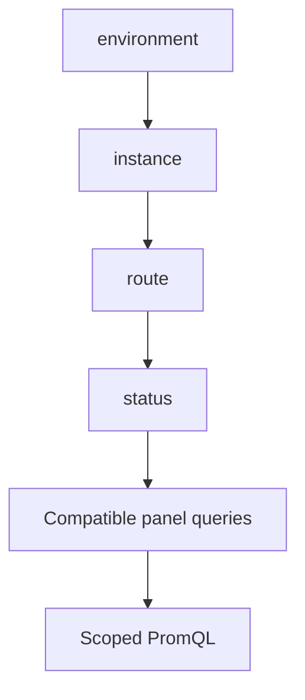
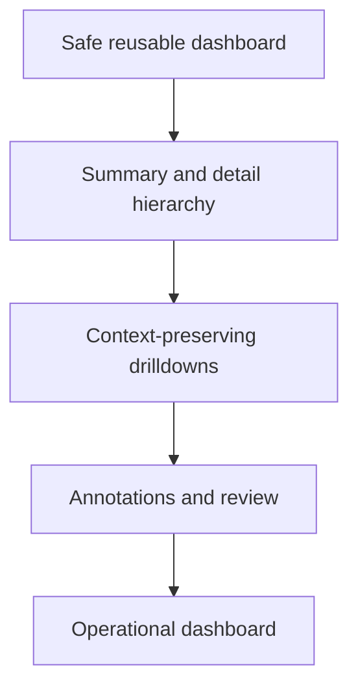

# Lab 11: Dashboard Variables and Safe Reuse

## Purpose and Scope

> **Primary objective:** Convert Lab 10's fixed-scope dashboard into a reusable dashboard whose variables narrow known telemetry populations without silently broadening queries or changing metric meaning.

Lab 10 proved that a dashboard is a collection of query and display contracts. Lab 11 adds controlled variability:

```text
fixed scope -> bounded variables -> explicit interpolation -> URL state -> validation
```

You will create four chained variables, update only compatible panels, test multi-value interpolation, demonstrate a broken exact matcher, verify URL-driven state, export the result, and review the dashboard JSON as code.

---

## 11.1 Inherited State From Lab 10

Expected running services:

```text
app
db
grafana
node-exporter
prometheus
redis
```

Expected source-controlled dashboard:

```text
config/grafana/dashboards/lab10-service-vm.json
```

Expected conditions:

- the Orders API and Node Exporter targets are `UP`;
- Grafana can query Prometheus;
- the Lab 10 dashboard has eight reviewed panels;
- Loki, Tempo, the Collector, and Alertmanager remain outside this lab; and
- the Lab 10 dashboard is file provisioned and read-only.

---

## 11.2 Explicit Scope and Exclusions

Services used:

```text
db
redis
app
prometheus
node-exporter
grafana
```

This lab teaches:

- query variables;
- chained dependencies;
- single-value and multi-value behavior;
- custom `All` values;
- Prometheus-aware interpolation;
- compatible versus incompatible panel dimensions;
- variable state in URLs; and
- dashboard JSON validation.

This lab does not teach:

- ad hoc/Filters variables;
- data-source switching;
- repeated panels or rows;
- cross-dashboard drilldowns;
- dashboard annotations;
- logs or traces;
- Grafana-managed alert rules;
- SSO, RBAC, or tenant boundaries; or
- Terraform/dashboard-generation frameworks.

Those features add power and therefore require a stronger review model. Lab 12 adds operational UX and drilldowns.

---

## 11.3 Prerequisites

```bash
pwd
test -f .env
test -f labs/Lab-10.md
test -f labs/Lab-11.md
test -f config/grafana/dashboards/lab10-service-vm.json

docker version
docker compose version
docker compose config --quiet
curl --version
jq --version
git --version
```

Complete Lab 10 before continuing. This lab intentionally uses the dashboard you created rather than a hidden answer file.

---

## 11.4 Learning Objectives

By the end of Lab 11, you must be able to:

- explain when one dashboard should replace many near-duplicate dashboards;
- distinguish a variable's display label, name, query, value, and formatted interpolation;
- build an environment variable from a deliberately scoped metric;
- chain instance, route, and status variables in dependency order;
- explain why multi-value variables require regex matchers;
- use `${variable:regex}` explicitly in PromQL;
- explain why a custom `All` value of `.+` is narrower than `.*`;
- keep fixed identity selectors such as `job` and `telemetry_source` outside variables;
- prevent user-controlled variables from selecting arbitrary metrics or labels;
- determine which labels exist on counters, histogram buckets, and recording rules;
- avoid applying a status selector to an error-ratio denominator;
- avoid applying an Orders API instance variable to Node Exporter series;
- replace a recorded aggregate with reviewed raw PromQL when finer filtering is required;
- inspect variable dependency order through dashboard JSON;
- pass variable state through a dashboard URL;
- distinguish URL state from authorization;
- test one, many, all, invalid, and empty-result selections;
- estimate variable cardinality and query fan-out;
- export a learner-owned dashboard under a new provisioned UID; and
- validate that every variable narrows an already bounded telemetry population.

---

## 11.5 Variable Signal Flow



The dependency direction matters. Changing `environment` refreshes every child. Changing `status` does not need to refresh its parents.

---

## 11.6 Load the Environment

```bash
set -a
source .env
set +a

LAB_HTTP_HOST="${BIND_ADDRESS:-127.0.0.1}"
if [[ "$LAB_HTTP_HOST" == "0.0.0.0" || "$LAB_HTTP_HOST" == "::" ]]; then
  LAB_HTTP_HOST=127.0.0.1
fi

export APP_URL="http://$LAB_HTTP_HOST:${APP_HOST_PORT:-8000}"
export PROMETHEUS_URL="http://$LAB_HTTP_HOST:${PROMETHEUS_HOST_PORT:-9090}"
export GRAFANA_URL="http://$LAB_HTTP_HOST:${GRAFANA_HOST_PORT:-3000}"
export GRAFANA_USER="${GRAFANA_ADMIN_USER:-admin}"
export GRAFANA_PASSWORD="${GRAFANA_ADMIN_PASSWORD:-admin_lab_password}"
export LAB11_NOTEBOOK="lab-notes/Lab-11.md"

mkdir -p lab-notes
test -f "$LAB11_NOTEBOOK" || printf '# Lab 11 Evidence\n\n' > "$LAB11_NOTEBOOK"
printf 'Started: %s\n' "$(date -u +%FT%TZ)" | tee -a "$LAB11_NOTEBOOK"
```

Do not put the Grafana password in the notebook or in shared command output.

---

## 11.7 Define Query Helpers

```bash
prom_query() {
  local expression="$1"
  local response
  response="$(
    curl -fsS "$PROMETHEUS_URL/api/v1/query" \
      --data-urlencode "query=$expression"
  )"
  jq -e '.status == "success"' <<<"$response" >/dev/null
  printf '%s\n' "$response"
}

grafana_get() {
  local path="$1"
  curl -fsS \
    -u "$GRAFANA_USER:$GRAFANA_PASSWORD" \
    "$GRAFANA_URL$path"
}
```

---

## 11.8 Reconcile the Starting State

```bash
APP_OTEL_ENABLED=false docker compose up -d db redis app
docker compose up -d --no-deps prometheus node-exporter grafana
docker compose stop alertmanager otel-collector loki tempo

for attempt in {1..30}; do
  if curl -fsS "$APP_URL/health/ready" |
       jq -e '.status == "ready"' >/dev/null &&
     curl -fsS "$PROMETHEUS_URL/-/ready" | grep -q Ready &&
     curl -fsS "$GRAFANA_URL/api/health" |
       jq -e '.database == "ok"' >/dev/null; then
    break
  fi
  sleep 2
done

curl -fsS -X POST "$PROMETHEUS_URL/-/reload"
sleep 20

curl -fsS "$APP_URL/health/ready" | jq
grafana_get '/api/datasources/uid/prometheus/health' | jq

prom_query 'up{job="orders-api",deployment_environment="lab"}' |
  jq -e '.data.result[0].value[1] == "1"'
```

Verify the exact service set:

```bash
running="$(docker compose ps --status running --services | sort)"
expected="$(printf '%s\n' app db grafana node-exporter prometheus redis | sort)"
test "$running" = "$expected"
printf '%s\n' "$running" | tee -a "$LAB11_NOTEBOOK"
```

---

## 11.9 Create a Clean Git Branch

```bash
git status --short
if ! git diff --quiet || ! git diff --cached --quiet; then
  echo "Checkpoint tracked changes before Lab 11" >&2
  exit 1
fi

if git show-ref --verify --quiet refs/heads/lab-11-dashboard-variables; then
  git switch lab-11-dashboard-variables
else
  git switch -c lab-11-dashboard-variables
fi
```

---

## 11.10 Inventory Real Label Values First

Never design a variable from memory. Ask Prometheus which values exist in the intended metric population.

```bash
prom_query 'count by (deployment_environment) (up{job="orders-api"})' |
  jq -r '.data.result[] | [.metric.deployment_environment, .value[1]] | @tsv'

prom_query 'count by (instance) (up{job="orders-api"})' |
  jq -r '.data.result[] | [.metric.instance, .value[1]] | @tsv'

prom_query 'count by (route) (obslab_http_requests_total{job="orders-api",telemetry_source="prometheus-client"})' |
  jq -r '.data.result[] | [.metric.route, .value[1]] | @tsv'

prom_query 'count by (status_code) (obslab_http_requests_total{job="orders-api",telemetry_source="prometheus-client"})' |
  jq -r '.data.result[] | [.metric.status_code, .value[1]] | @tsv'
```

If traffic is sparse, generate a bounded sample:

```bash
for path in / /health/live /health/ready /api/v1/orders; do
  curl -fsS -o /dev/null "$APP_URL$path"
done

curl -sS -o /dev/null "$APP_URL/api/v1/simulate/error?status_code=503" || true
sleep 20
```

---

## 11.11 Write the Variable Contract

Record this before touching Grafana:

| Variable | Source population | Values | Consumer scope | Selection mode |
|---|---|---|---|---|
| `environment` | Orders API target metadata | Deployment environments | Application and VM queries | Single |
| `instance` | Orders API `up` | App scrape targets | Application queries only | Multi + All |
| `route` | Native HTTP counter | Instrumented route templates | HTTP counter/histogram queries | Multi + All |
| `status` | Native HTTP counter | HTTP status codes | Traffic composition only | Multi + All |

Invariant:

```text
variable value narrows a fixed job/source population
```

Anti-pattern:

```text
variable value chooses the metric name, arbitrary label name, or unrestricted job
```

---

## 11.12 Variable Anatomy

| Property | Meaning |
|---|---|
| Label | Human-facing control name |
| Name | Identifier referenced as `$name` or `${name}` |
| Query | How available values are discovered |
| Current | Selected value or values |
| Refresh | When value discovery is rerun |
| Multi-value | Whether several options may be selected |
| Include All | Whether a combined selection is available |
| Custom all value | Explicit expression substituted for All |
| Hide/display | Where the control appears, not a security boundary |
| URL sync | Whether `var-name=value` controls the selection |

Variable names are API contracts. Renaming a variable without updating queries and links breaks the dashboard.

---

## 11.13 Clone the Reviewed Dashboard Into an Editable Draft

Retrieve Lab 10's provisioned source:

```bash
grafana_get '/api/dashboards/uid/lab10-service-vm' \
  > /tmp/lab11-source.json

jq -e '
  .meta.provisioned == true
  and .dashboard.uid == "lab10-service-vm"
  and (.dashboard.panels | length == 8)
' /tmp/lab11-source.json
```

Create an editable copy with a new UID:

```bash
jq '
  {
    dashboard: (
      .dashboard
      | del(.id)
      | .uid = "lab11-reusable-service-vm-draft"
      | .title = "Lab 11 — Reusable Service and VM Triage (Draft)"
      | .tags = ((.tags // []) + ["lab-11", "variables"] | unique)
      | .version = 0
    ),
    folderUid: "observability-labs",
    message: "Create Lab 11 variable draft",
    overwrite: false
  }
' /tmp/lab11-source.json > /tmp/lab11-create.json

create_code="$(
  curl -sS -o /tmp/lab11-create-response.json \
    -w '%{http_code}' \
    -u "$GRAFANA_USER:$GRAFANA_PASSWORD" \
    -H 'Content-Type: application/json' \
    -X POST "$GRAFANA_URL/api/dashboards/db" \
    --data-binary @/tmp/lab11-create.json
)"

if [[ "$create_code" = "200" ]]; then
  jq /tmp/lab11-create-response.json
elif [[ "$create_code" = "412" ]] &&
     grafana_get '/api/dashboards/uid/lab11-reusable-service-vm-draft' \
       >/dev/null; then
  echo "Lab 11 draft already exists; continuing"
else
  printf 'Unexpected HTTP %s\n' "$create_code" >&2
  cat /tmp/lab11-create-response.json >&2
  exit 1
fi
```

Open the editable draft:

```text
Dashboards -> Observability Labs -> Lab 11 — Reusable Service and VM Triage (Draft)
```

---

## 11.14 Create the `environment` Variable

Open **Edit dashboard -> Settings -> Variables -> New variable**.

| Setting | Value |
|---|---|
| Variable type | Query |
| Name | `environment` |
| Label | Environment |
| Data source | Prometheus |
| Query type | Label values |
| Metric | `up{job="orders-api"}` |
| Label | `deployment_environment` |
| Multi-value | Off |
| Include All | Off |
| Refresh | On dashboard load |
| Sort | Alphabetical ascending |
| URL sync | Enabled |

Equivalent classic query representation:

```promql
label_values(up{job="orders-api"}, deployment_environment)
```

The fixed `job` selector prevents an unrelated metric source from adding environments to this control.

---

## 11.15 Create the Chained `instance` Variable

Create the next variable below `environment`:

| Setting | Value |
|---|---|
| Name | `instance` |
| Label | Orders API instance |
| Type | Query / Label values |
| Metric | `up{job="orders-api",deployment_environment=~"${environment:regex}"}` |
| Label | `instance` |
| Multi-value | On |
| Include All | On |
| Custom all value | `.+` |
| Refresh | On dashboard load |
| Sort | Alphabetical ascending |

Equivalent query:

```promql
label_values(
  up{job="orders-api",deployment_environment=~"${environment:regex}"},
  instance
)
```

Select **All** after saving.

`instance` deliberately contains only Orders API targets. It must not be applied to Node Exporter queries, whose instance identity is different.

---

## 11.16 Why the Custom All Value Is `.+`

Compare:

```text
.*  matches empty and non-empty strings
.+  requires at least one character
```

Prometheus label matchers that match the empty string can also select series where that label is absent. `.+` prevents All from expanding into a missing-label population.

This is still not an authorization mechanism. It is a query-safety choice.

---

## 11.17 Create the Chained `route` Variable

| Setting | Value |
|---|---|
| Name | `route` |
| Label | Route |
| Type | Query / Label values |
| Metric | See below |
| Label | `route` |
| Multi-value | On |
| Include All | On |
| Custom all value | `.+` |
| Refresh | On dashboard load |
| Sort | Alphabetical ascending |

Metric selector:

```promql
obslab_http_requests_total{
  job="orders-api",
  telemetry_source="prometheus-client",
  deployment_environment=~"${environment:regex}",
  instance=~"${instance:regex}"
}
```

Equivalent classic query:

```promql
label_values(
  obslab_http_requests_total{
    job="orders-api",
    telemetry_source="prometheus-client",
    deployment_environment=~"${environment:regex}",
    instance=~"${instance:regex}"
  },
  route
)
```

Select **All**.

---

## 11.18 Create the Chained `status` Variable

The variable name is `status`; the actual metric label remains `status_code`.

| Setting | Value |
|---|---|
| Name | `status` |
| Label | HTTP status |
| Type | Query / Label values |
| Metric | See below |
| Label | `status_code` |
| Multi-value | On |
| Include All | On |
| Custom all value | `.+` |
| Refresh | On dashboard load |
| Sort | Numerical ascending |

Metric selector:

```promql
obslab_http_requests_total{
  job="orders-api",
  telemetry_source="prometheus-client",
  deployment_environment=~"${environment:regex}",
  instance=~"${instance:regex}",
  route=~"${route:regex}"
}
```

Select **All**, save the dashboard, and use this message:

```text
Add bounded environment, instance, route, and status variables
```

---

## 11.19 Inspect Dependency Order

In dashboard settings, use the variable dependency view if present. Expected order:

```text
environment -> instance -> route -> status
```

Also inspect runtime JSON:

```bash
grafana_get '/api/dashboards/uid/lab11-reusable-service-vm-draft' \
  > /tmp/lab11-runtime-before-panels.json

jq -r '
  .dashboard.templating.list[]
  | [
      .name,
      (.type // ""),
      (.multi | tostring),
      (.includeAll | tostring),
      (.allValue // "<none>"),
      (.definition // (.query.query // .query // ""))
    ]
  | @tsv
' /tmp/lab11-runtime-before-panels.json |
  tee -a "$LAB11_NOTEBOOK"
```

Verify names and order:

```bash
jq -e '
  [.dashboard.templating.list[].name]
  == ["environment", "instance", "route", "status"]
' /tmp/lab11-runtime-before-panels.json
```

---

## 11.20 Interpolation Contract

Use these forms deliberately:

| Form | Use |
|---|---|
| `$route` | Simple readable reference when no ambiguity exists |
| `${route}` | Variable adjacent to other characters |
| `${route:regex}` | Prometheus matcher with escaped multi-values |
| `${route:raw}` | Unescaped value; avoid for user-controlled PromQL |

All multi-value consumers in this lab use:

```promql
route=~"${route:regex}"
```

Do not use:

```promql
route="${route}"
```

The latter treats a multi-selection such as `routeA|routeB` as one literal value.

---

## 11.21 Panel Compatibility Matrix

| Panel | Environment | App instance | Route | Status | Reason |
|---|---:|---:|---:|---:|---|
| Orders API scrape targets | Yes | Yes | No | No | `up` has no HTTP dimensions |
| Request rate | Yes | Yes | Yes | Yes | Counter has all four labels |
| 5xx error ratio | Yes | Yes | Yes | **No** | Status defines numerator/denominator meaning |
| Request latency p95 | Yes | Yes | Yes | No | Histogram has no status label |
| Rate by route/status | Yes | Yes | Yes | Yes | Output is intentionally filtered |
| Latency percentiles | Yes | Yes | Yes | No | Histogram has no status label |
| VM CPU/memory | Yes | **No** | No | No | Node instance identity differs |
| Filesystem availability | Yes | **No** | No | No | Node instance identity differs |

Never add a label matcher to a metric merely because the dashboard has a variable with that name.

---

## 11.22 Update Panel 1 — Orders API Scrape Targets

Replace its query with:

```promql
min(
  up{
    job="orders-api",
    deployment_environment=~"${environment:regex}",
    instance=~"${instance:regex}"
  }
)
```

Keep its title, value mapping, thresholds, and no-data behavior unchanged.

---

## 11.23 Update Panel 2 — Request Rate

```promql
sum(
  rate(
    obslab_http_requests_total{
      job="orders-api",
      telemetry_source="prometheus-client",
      deployment_environment=~"${environment:regex}",
      instance=~"${instance:regex}",
      route=~"${route:regex}",
      status_code=~"${status:regex}"
    }[$__rate_interval]
  )
)
```

The title should remain **Request rate** because the dashboard controls show the active scope.

---

## 11.24 Update Panel 3 — 5xx Error Ratio

The Lab 10 recording rule aggregates to `job`; it cannot support route or instance filtering. Replace it with reviewed raw PromQL:

```promql
sum(
  rate(
    obslab_http_requests_total{
      job="orders-api",
      telemetry_source="prometheus-client",
      deployment_environment=~"${environment:regex}",
      instance=~"${instance:regex}",
      route=~"${route:regex}",
      status_code=~"5.."
    }[$__rate_interval]
  )
)
/
clamp_min(
  sum(
    rate(
      obslab_http_requests_total{
        job="orders-api",
        telemetry_source="prometheus-client",
        deployment_environment=~"${environment:regex}",
        instance=~"${instance:regex}",
        route=~"${route:regex}"
      }[$__rate_interval]
    )
  ),
  0.001
)
```

Do not apply `${status}`. Selecting `200` must not turn “5xx ratio” into “5xx divided by 2xx only,” and selecting `500` must not redefine the denominator as errors only.

Update the description to state that the window is adaptive and scope follows environment, instance, and route controls.

---

## 11.25 Update Panel 4 — Request Latency p95

The Lab 10 recording rule also loses route and instance. Use the raw classic histogram:

```promql
histogram_quantile(
  0.95,
  sum by (le) (
    rate(
      obslab_http_request_duration_seconds_bucket{
        job="orders-api",
        telemetry_source="prometheus-client",
        deployment_environment=~"${environment:regex}",
        instance=~"${instance:regex}",
        route=~"${route:regex}"
      }[$__rate_interval]
    )
  )
)
```

Status cannot be applied because the histogram does not carry `status_code`.

---

## 11.26 Update Panel 5 — Request Rate by Route and Status

```promql
sum by (route, status_code) (
  rate(
    obslab_http_requests_total{
      job="orders-api",
      telemetry_source="prometheus-client",
      deployment_environment=~"${environment:regex}",
      instance=~"${instance:regex}",
      route=~"${route:regex}",
      status_code=~"${status:regex}"
    }[$__rate_interval]
  )
)
```

Keep the legend:

```text
{{route}} · {{status_code}}
```

---

## 11.27 Update Panel 6 — Latency Percentiles

Apply the same selectors to each p50, p95, and p99 query. Example p50:

```promql
histogram_quantile(
  0.50,
  sum by (le) (
    rate(
      obslab_http_request_duration_seconds_bucket{
        job="orders-api",
        telemetry_source="prometheus-client",
        deployment_environment=~"${environment:regex}",
        instance=~"${instance:regex}",
        route=~"${route:regex}"
      }[$__rate_interval]
    )
  )
)
```

Change only the quantile argument for p95 and p99. Preserve `le` in the aggregation.

---

## 11.28 Update Panels 7–8 Without Misusing `instance`

Add only the environment selector to each Node Exporter selector:

```promql
node_cpu_seconds_total{
  job="node-exporter",
  deployment_environment=~"${environment:regex}",
  mode="idle"
}
```

```promql
node_memory_MemAvailable_bytes{
  job="node-exporter",
  deployment_environment=~"${environment:regex}"
}
```

```promql
node_filesystem_avail_bytes{
  job="node-exporter",
  deployment_environment=~"${environment:regex}",
  fstype!~"tmpfs|overlay|squashfs"
}
```

Do not add:

```promql
instance=~"${instance:regex}"
```

The Orders API value resembles `app:8000`; Node Exporter resembles `node-exporter:9100`. Applying the app variable would manufacture No data.

---

## 11.29 Save and Capture the Runtime Contract

Save with:

```text
Apply variables only to compatible metric dimensions
```

Then export runtime state:

```bash
grafana_get '/api/dashboards/uid/lab11-reusable-service-vm-draft' \
  > /tmp/lab11-runtime.json

jq '{
  uid: .dashboard.uid,
  title: .dashboard.title,
  version: .dashboard.version,
  variables: [
    .dashboard.templating.list[] |
    {
      name,
      current,
      multi,
      includeAll,
      allValue
    }
  ],
  panels: [
    .dashboard.panels[] |
    {
      id,
      title,
      expressions: [.targets[]?.expr]
    }
  ]
}' /tmp/lab11-runtime.json | tee -a "$LAB11_NOTEBOOK"
```

---

## 11.30 Prediction Checkpoint — Multi-Value With `=`

Before changing anything, predict:

1. What formatted value will Grafana create for two routes?
2. Will `route="routeA|routeB"` match either route?
3. Will `route=~"routeA|routeB"` match both?
4. What happens if one route contains regex punctuation?

Write answers in the notebook.

---

## 11.31 Controlled Broken-Matcher Experiment

Select two real route values. Temporarily change Panel 5's route matcher from:

```promql
route=~"${route:regex}"
```

to:

```promql
route="${route}"
```

Observe the query inspector and panel. The interpolated multi-selection is not one literal label value, so the exact matcher normally returns no series.

Restore:

```promql
route=~"${route:regex}"
```

Capture the broken and restored query/request results. Do not save the broken version.

---

## 11.32 Test the Five Required Selection States

Test and record:

| State | Expected behavior |
|---|---|
| One route | Only that route contributes |
| Two routes | Both contribute; values are escaped and joined |
| All routes | Every non-empty route in bounded source scope contributes |
| One status | Traffic panel narrows; error-ratio semantics do not change |
| Invalid URL value | Compatible panels show No data; query scope does not broaden |

Generate traffic between selections:

```bash
for iteration in {1..30}; do
  curl -fsS -o /dev/null "$APP_URL/health/live"
  curl -fsS -o /dev/null "$APP_URL/api/v1/orders"
  if (( iteration % 5 == 0 )); then
    curl -sS -o /dev/null \
      "$APP_URL/api/v1/simulate/error?status_code=503" || true
  fi
done
sleep 20
```

---

## 11.33 Prove Status Does Not Corrupt Error Ratio

In the dashboard:

1. select status `200`;
2. confirm Panel 5 narrows to `200`;
3. confirm Panel 3 still queries a `5..` numerator and an all-status denominator;
4. select status `503`; and
5. confirm Panel 3's expression remains unchanged.

The variable control may be global, but not every panel must consume it.

---

## 11.34 Prove Histogram Label Compatibility

Ask Prometheus which labels the histogram bucket carries:

```bash
prom_query 'count by (job, deployment_environment, instance, route, le) (obslab_http_request_duration_seconds_bucket{job="orders-api"})' |
  jq '.data.result[0:5]'

prom_query 'count by (status_code) (obslab_http_request_duration_seconds_bucket{job="orders-api"})' |
  jq '.data.result'
```

The second query does not prove that a `status_code=""` label exists; it reveals that grouping by an absent label cannot create real status populations.

---

## 11.35 Prove Recording-Rule Label Loss

```bash
prom_query 'job:http_5xx_ratio:rate5m{job="orders-api"}' |
  jq '.data.result[].metric'

prom_query 'job:http_request_duration_seconds:p95_5m{job="orders-api"}' |
  jq '.data.result[].metric'
```

Expected label contract:

```text
job
```

Prometheus external labels are added during remote communication such as delivery to Alertmanager; they are not local recording-rule dimensions. The separate `deployment_environment` target label is available on scraped series, but this recording rule aggregated it away.

Route and instance were aggregated away. A dashboard cannot recover discarded dimensions.

---

## 11.36 Build a Context-Preserving URL

Choose real values:

```bash
app_instance="$(
  prom_query 'up{job="orders-api"}' |
    jq -r '.data.result[0].metric.instance'
)"

route_value="$(
  prom_query 'count by (route) (obslab_http_requests_total{job="orders-api"})' |
    jq -r '.data.result[0].metric.route'
)"

instance_encoded="$(jq -rn --arg value "$app_instance" '$value | @uri')"
route_encoded="$(jq -rn --arg value "$route_value" '$value | @uri')"

dashboard_url="$GRAFANA_URL/d/lab11-reusable-service-vm-draft/lab-11-reusable-service-and-vm-triage-draft?var-environment=lab&var-instance=$instance_encoded&var-route=$route_encoded&var-status=200&from=now-15m&to=now"
printf '%s\n' "$dashboard_url" | tee -a "$LAB11_NOTEBOOK"
```

Open the URL and verify all four controls plus the time range.

The path slug is cosmetic; Grafana resolves by UID. The `var-` prefix is mandatory.

---

## 11.37 URL State Is Not Authorization

Anyone allowed to view the dashboard can alter `var-route`, `var-status`, or other URL parameters. Therefore:

- do not place secrets in variable values;
- do not use hidden variables as access controls;
- enforce tenant isolation in the data source, query layer, or authorization boundary;
- assume shared URLs may be logged; and
- keep variable queries bounded even when URL values are invalid.

---

## 11.38 Test an Invalid URL Selection

Open:

```text
/d/lab11-reusable-service-vm-draft/example?var-environment=does-not-exist
```

Expected:

- application panels display No data;
- queries still include fixed `job="orders-api"` and source selectors;
- Node panels also show No data because the `deployment_environment` target label does not match; and
- the dashboard does not fall back to an unrestricted selector.

Restore `environment=lab`.

---

## 11.39 Inspect Interpolated Queries

For Panel 5:

1. open the panel menu;
2. choose **Inspect -> Query** or **Query inspector**;
3. select one route and capture the request;
4. select two routes and capture the request;
5. select All and capture the request; and
6. confirm individual values are regex escaped.

Record actual expressions. Do not infer interpolation only from the query editor template.

---

## 11.40 Variable Cardinality Budget

Count options:

```bash
for label in deployment_environment instance route status_code; do
  metric='obslab_http_requests_total{job="orders-api",telemetry_source="prometheus-client"}'
  if [[ "$label" == "deployment_environment" ]]; then
    metric='up{job="orders-api"}'
  elif [[ "$label" == "instance" ]]; then
    metric='up{job="orders-api"}'
  fi

  prom_query "count(count by ($label) ($metric))" |
    jq -r --arg label "$label" '
      [$label, (.data.result[0].value[1] // "0")] | @tsv
    '
done | tee -a "$LAB11_NOTEBOOK"
```

Production questions:

- How many options does each variable return?
- Does selecting All multiply lines beyond a readable limit?
- Does a child query rerun on time-range change unnecessarily?
- Can a variable query scan a high-cardinality metric?
- Is the value set stable enough for bookmarked URLs?

---

## 11.41 Why Filters Variables Are Deferred

Grafana Filters variables can inject label filters into every compatible Prometheus query. That convenience can:

- change panels you did not intend to change;
- expose arbitrary label/value combinations;
- create high-cardinality queries;
- produce inconsistent semantics across metric families; and
- complicate review of the final PromQL.

They are useful in trusted exploration dashboards, but this operational dashboard uses explicit variables with named contracts.

---

## 11.42 Why Metric-Name Variables Are Rejected

This pattern is not allowed:

```promql
${metric_name}{job="orders-api"}
```

Different metrics have different types, units, labels, reset behavior, and aggregation rules. A variable that swaps metric names makes the panel's mathematical contract unstable.

---

## 11.43 Reuse Versus Dashboard Sprawl

Use variables when dashboards share:

- the same audience;
- the same questions;
- the same metric schema;
- the same units and thresholds; and
- the same next actions.

Use separate dashboards when those contracts differ. Do not force unrelated services into one generic dashboard merely to reduce file count.

---

## 11.44 Export the Reviewed Draft

```bash
grafana_get '/api/dashboards/uid/lab11-reusable-service-vm-draft' \
  > /tmp/lab11-final-runtime.json

jq -e '
  .dashboard.uid == "lab11-reusable-service-vm-draft"
  and (.dashboard.panels | length == 8)
  and (.dashboard.templating.list | length == 4)
' /tmp/lab11-final-runtime.json

jq '
  .dashboard
  | del(.id)
  | .uid = "lab11-reusable-service-vm"
  | .title = "Lab 11 — Reusable Service and VM Triage"
  | .version = 1
' /tmp/lab11-final-runtime.json \
  > config/grafana/dashboards/lab11-reusable-service-vm.json

jq empty config/grafana/dashboards/lab11-reusable-service-vm.json
```

---

## 11.45 Validate Variable Definitions

```bash
jq -e '
  [.templating.list[].name]
  == ["environment", "instance", "route", "status"]
  and (.templating.list[] | select(.name == "environment") | .multi == false)
  and all(
    .templating.list[]
    | select(.name == "instance" or .name == "route" or .name == "status");
    .multi == true and .includeAll == true and .allValue == ".+"
  )
' config/grafana/dashboards/lab11-reusable-service-vm.json
```

If Grafana serializes an omitted false field rather than `false`, inspect the runtime object before adapting the assertion. Never weaken the multi/All checks.

---

## 11.46 Validate Fixed Scopes Remain

```bash
jq -r '
  .panels[]
  | .title as $title
  | .targets[]?
  | select(.expr? and (.expr | length > 0))
  | [$title, .expr]
  | @tsv
' config/grafana/dashboards/lab11-reusable-service-vm.json \
  > /tmp/lab11-expressions.tsv

awk -F '\t' '
  $2 !~ /job=/ {
    print "Missing fixed job selector: " $1 > "/dev/stderr"
    failed=1
  }
  END { exit failed }
' /tmp/lab11-expressions.tsv
```

Review source selection:

```bash
grep -F 'obslab_' /tmp/lab11-expressions.tsv |
  grep -v 'telemetry_source="prometheus-client"' && {
    echo "Review native application query source scope" >&2
    exit 1
  }
true
```

The second check is a heuristic; recording rules would be a justified exception if retained.

---

## 11.47 Validate Variable Consumers

```bash
jq -r '[.panels[].targets[]?.expr // empty] | join("\n")' \
  config/grafana/dashboards/lab11-reusable-service-vm.json \
  > /tmp/lab11-promql.txt

for token in \
  '${environment:regex}' \
  '${instance:regex}' \
  '${route:regex}' \
  '${status:regex}'; do
  grep -Fq "$token" /tmp/lab11-promql.txt
done

if grep -Eq 'route="\$\{|status_code="\$\{' /tmp/lab11-promql.txt; then
  echo "Exact matcher found for a multi-value variable" >&2
  exit 1
fi
```

Inspect every match manually after the automated checks.

---

## 11.48 Validate Incompatible Dimensions Are Absent

```bash
jq -e '
  [
    .panels[]
    | select(
        .title == "VM CPU and memory utilization"
        or .title == "Lowest writable filesystem availability"
      )
    | .targets[]?.expr
    | contains("${instance:regex}")
  ]
  | any == false
' config/grafana/dashboards/lab11-reusable-service-vm.json
```

Check that status did not enter latency or error-ratio contracts:

```bash
jq -e '
  [
    .panels[]
    | select(
        .title == "5xx error ratio"
        or .title == "Request latency p95"
        or .title == "Request latency percentiles"
      )
    | .targets[]?.expr
    | contains("${status:regex}")
  ]
  | any == false
' config/grafana/dashboards/lab11-reusable-service-vm.json
```

---

## 11.49 Wait for File Provisioning

```bash
provisioned=false
for attempt in {1..12}; do
  code="$(
    curl -sS -o /tmp/lab11-provisioned.json \
      -w '%{http_code}' \
      -u "$GRAFANA_USER:$GRAFANA_PASSWORD" \
      "$GRAFANA_URL/api/dashboards/uid/lab11-reusable-service-vm"
  )"

  if [[ "$code" = "200" ]] &&
     jq -e '.meta.provisioned == true' \
       /tmp/lab11-provisioned.json >/dev/null; then
    provisioned=true
    break
  fi
  sleep 5
done

test "$provisioned" = true
jq '{
  uid: .dashboard.uid,
  version: .dashboard.version,
  panel_count: (.dashboard.panels | length),
  variable_count: (.dashboard.templating.list | length),
  provisioned: .meta.provisioned
}' /tmp/lab11-provisioned.json | tee -a "$LAB11_NOTEBOOK"
```

---

## 11.50 Commit the Dashboard

```bash
git status --short
git diff --check
jq empty config/grafana/dashboards/lab11-reusable-service-vm.json

git add config/grafana/dashboards/lab11-reusable-service-vm.json
git commit -m "lab 11: add bounded dashboard variables"
git status --short
```

---

## 11.51 Troubleshooting — Variable Has No Values

Check:

- Prometheus data-source health;
- metric and label spelling;
- fixed job/source selectors;
- parent variable current values;
- whether the metric has recent series;
- variable refresh policy;
- query inspector response; and
- whether URL state supplied an invalid parent.

Run the equivalent label inventory in Prometheus before blaming Grafana.

---

## 11.52 Troubleshooting — All Returns No Data

Check:

- matcher uses `=~`, not `=`;
- custom All value is valid RE2;
- query uses `${variable:regex}`;
- All is selected after configuration;
- a parent variable is not invalid; and
- the metric actually carries the matched label.

---

## 11.53 Troubleshooting — A Variable Empties Unrelated Panels

The likely cause is an incompatible label population. Compare actual labels and identities:

```bash
prom_query 'count by (instance) (up{job="orders-api"})' | jq '.data.result'
prom_query 'count by (instance) (up{job="node-exporter"})' | jq '.data.result'
```

Use separate variables or leave the unrelated panel fixed. Do not add an `or` fallback that hides the mismatch.

---

## 11.54 Troubleshooting — URL Selection Is Ignored

Verify:

- the parameter is `var-name=value`;
- `name` matches the variable name, not display label;
- URL sync is enabled;
- special characters are percent encoded;
- multiple values repeat the same parameter; and
- the requested value is allowed by the variable query.

---

## 11.55 Troubleshooting — Dashboard Becomes Slow

Inspect:

- variable option counts;
- chained refresh fan-out;
- panel line count under All;
- query range and resolution;
- repeated panels/rows;
- high-cardinality selectors;
- Prometheus query stats; and
- browser/network timings.

Variables reduce dashboard duplication; they do not automatically reduce query cost.

---

## 11.56 Evidence Matrix

| Evidence | What it proves |
|---|---|
| Label inventories | Variables use real dimensions |
| Variable contract | Scope was designed before UI work |
| Dependency order | Chaining is intentional |
| Runtime variable JSON | Grafana stored intended controls |
| Panel compatibility matrix | Variables are not applied blindly |
| Broken exact-matcher test | Multi-value regex requirement |
| One/many/All tests | Selection behavior |
| Status/error-ratio check | Metric meaning remains stable |
| Histogram label check | Compatible dimensions are evidence based |
| Recording-rule label check | Lost dimensions are understood |
| Context URL | Reproducible dashboard state |
| Invalid URL test | Bad state narrows to No data |
| Cardinality counts | Option/query budget |
| Source JSON checks | Reproducible implementation |
| Provisioned runtime check | Grafana loaded reviewed source |
| Git commit | Auditable artifact |

---

## 11.57 Production Implications

1. Variables are query inputs, not decorative controls.
2. Every variable needs a source-population and consumer contract.
3. Keep service, tenant, environment, and telemetry-source boundaries explicit.
4. Use `=~` plus Prometheus-aware escaping for multi-value variables.
5. Prefer `.+` to `.*` when All must not match missing labels.
6. Never treat hidden or constant variables as authorization.
7. Do not make metric names or arbitrary label names user-selectable in operational dashboards.
8. Apply a variable only to metric families that carry the corresponding dimension.
9. Do not let status filtering redefine error-rate mathematics.
10. Recording rules trade query cost for a fixed label contract.
11. Chained variables can create refresh fan-out and latency.
12. All selections need line-count and query-cost budgets.
13. Preserve variable and time state in incident links.
14. Test invalid and empty-result selections explicitly.
15. Review dashboard JSON and actual interpolated requests, not only editor templates.

---

## 11.58 Knowledge Check

Answer before reading the key:

1. What problem should variables solve?
2. What invariant constrains every variable in this lab?
3. Why is `environment` first?
4. Why does `instance` depend on `environment`?
5. Why does `status` depend on `route`?
6. Why use a fixed job selector in variable queries?
7. What does Multi-value change in the interpolated value?
8. Why must multi-value PromQL use `=~`?
9. What does `${route:regex}` add?
10. Why is `${route:raw}` avoided?
11. Why use custom All value `.+`?
12. Can variable hiding enforce authorization?
13. Why is app `instance` not applied to VM panels?
14. Why is status not applied to histogram queries?
15. Why is status not applied to the 5xx-ratio denominator?
16. Why could the Lab 10 error-ratio recording rule not filter by route?
17. Can a dashboard recover labels removed by aggregation?
18. Why replace a recording rule with raw PromQL here?
19. What does `var-route=` represent in a URL?
20. How are multiple URL values supplied?
21. What should an invalid environment produce?
22. Why preserve No data?
23. What does the query inspector prove?
24. Why count variable options?
25. Do variables necessarily reduce Prometheus query cost?
26. When should separate dashboards be preferred?
27. Why reject metric-name variables?
28. What must source validation check beyond valid JSON?
29. Why use a new UID for the provisioned copy?
30. What does Lab 12 add?

---

## 11.59 Knowledge Check Answers

1. Reuse the same stable questions and schema across bounded scopes.
2. Every value narrows a fixed job/source population.
3. It is the broadest intended parent scope.
4. Available app targets may differ by environment.
5. Only statuses present for selected routes need to be offered.
6. To prevent unrelated telemetry from populating the control.
7. Grafana combines selected values into a regex-compatible pattern.
8. Exact matching would search for the combined string as one label value.
9. Data-source-aware regex escaping and formatting.
10. It permits unescaped content to alter query structure or meaning.
11. It requires a non-empty label value and avoids matching absent labels.
12. No.
13. Orders API and Node Exporter use different target identities.
14. The histogram does not carry `status_code`.
15. It would change the denominator and corrupt the metric definition.
16. Its aggregation retained only the job-level result.
17. No.
18. The dashboard needs reviewed finer dimensions that the aggregate removed.
19. Dashboard state for the variable named `route`.
20. Repeat the same `var-route` query parameter.
21. Honest No data without scope broadening.
22. It distinguishes absent telemetry from a measured healthy zero.
23. The actual interpolated request sent to the data source.
24. To control usability, refresh cost, and query fan-out.
25. No; All and chained refreshes can increase cost.
26. When audience, questions, schema, units, thresholds, or actions differ.
27. Metric types and contracts are not interchangeable.
28. Variable scope, interpolation, consumers, data sources, IDs, and query meaning.
29. To avoid collision with the editable draft/source and preserve ownership.
30. Operational UX, drilldowns, annotations, accessibility, and review.

---

## 11.60 Professional Scenarios

### Scenario A — All environments leak cross-tenant data

The variable query is unrestricted and the dashboard assumes the dropdown is an authorization boundary. Enforce tenant scope before Grafana, then keep tenant selectors fixed and non-user-controlled.

### Scenario B — Status `200` makes error ratio zero

The status variable was applied to both numerator and denominator. Remove it from the error-ratio contract; status remains useful only in traffic-composition panels.

### Scenario C — Selecting an app instance blanks host panels

The same variable was applied across incompatible target identities. Use a dedicated host variable or leave VM panels at the environment scope.

---

## 11.61 Required Lab Notebook

Include:

- UTC start and finish times;
- exact service set;
- Grafana/Prometheus health evidence;
- label value inventories;
- the four-variable contract;
- dependency diagram/order;
- runtime variable definitions;
- panel compatibility matrix;
- final PromQL for all eight panels;
- broken exact-matcher prediction and observation;
- one, two, All, status, and invalid-selection results;
- recording-rule label inventory;
- histogram label inventory;
- one context-preserving URL with no credentials;
- query-inspector evidence for one/many/All;
- variable option counts;
- exported JSON validation output;
- provisioned runtime proof;
- Git commit; and
- all 30 knowledge answers.

---

## 11.62 Completion Checklist

- [ ] Lab 10's reviewed dashboard existed.
- [ ] Only the intended six services were running.
- [ ] Environment, instance, route, and status labels were inventoried.
- [ ] A variable contract was written before edits.
- [ ] An editable draft with a new UID was created.
- [ ] Four variables were created in dependency order.
- [ ] Multi-value variables use Include All and custom `.+`.
- [ ] Fixed job/source boundaries remain in variable queries.
- [ ] Application panels consume only compatible variables.
- [ ] VM panels do not consume the Orders API instance variable.
- [ ] Error-ratio semantics remain independent of status selection.
- [ ] Histogram queries do not pretend to have status labels.
- [ ] The broken exact-matcher experiment was completed and restored.
- [ ] One, many, All, invalid, and empty-result states were tested.
- [ ] Actual interpolated requests were inspected.
- [ ] A context-preserving URL was verified.
- [ ] Variable option cardinality was measured.
- [ ] The reviewed source was exported under a stable new UID.
- [ ] JSON and semantic safety checks passed.
- [ ] Grafana loaded the provisioned dashboard.
- [ ] The dashboard was committed.
- [ ] All questions and notebook evidence are complete.

---

## 11.63 Upstream Reference Map

- [Grafana Prometheus template variables](https://grafana.com/docs/grafana/latest/datasources/prometheus/template-variables/) — query types, multi-value interpolation, and regex matching.
- [Grafana variable syntax](https://grafana.com/docs/grafana/latest/visualizations/dashboards/variables/variable-syntax/) — explicit formatting options.
- [Grafana variable management](https://grafana.com/docs/grafana/latest/visualizations/dashboards/variables/) — variable configuration and dependencies.
- [Grafana dashboard URL variables](https://grafana.com/docs/grafana/latest/visualizations/dashboards/build-dashboards/create-dashboard-url-variables/) — `var-` parameters and multiple selections.
- [Prometheus querying basics](https://prometheus.io/docs/prometheus/latest/querying/basics/) — label matcher and empty-label semantics.

The repository pins Grafana 13.2.1. Validate UI labels and JSON shape before applying this guide to another major release.

---

## 11.64 Final State and Transition to Lab 12

Verify:

```bash
curl -fsS "$GRAFANA_URL/api/health" | jq -e '.database == "ok"'
curl -fsS "$PROMETHEUS_URL/-/ready" | grep -q Ready
jq empty config/grafana/dashboards/lab11-reusable-service-vm.json

grafana_get '/api/dashboards/uid/lab11-reusable-service-vm' |
  jq -e '
    .meta.provisioned == true
    and (.dashboard.templating.list | length == 4)
    and (.dashboard.panels | length == 8)
  '

git status --short
```

Append final evidence:

```bash
{
  printf '\n## Final evidence\n'
  printf 'Finished: %s\n' "$(date -u +%FT%TZ)"
  printf 'Provisioned UID: lab11-reusable-service-vm\n'
  printf 'Variables: environment -> instance -> route -> status\n'
} >> "$LAB11_NOTEBOOK"
```

Leave the six services running. Lab 12 will turn the reusable dashboard into an operational interface with explicit drilldowns, annotations, accessibility review, and an evidence-oriented handoff:



Carry forward:

```text
variable != authorization
All != unbounded
multi-value != exact matcher
missing dimension != empty dimension
reusable != universally generic
valid interpolation != correct metric meaning
```
