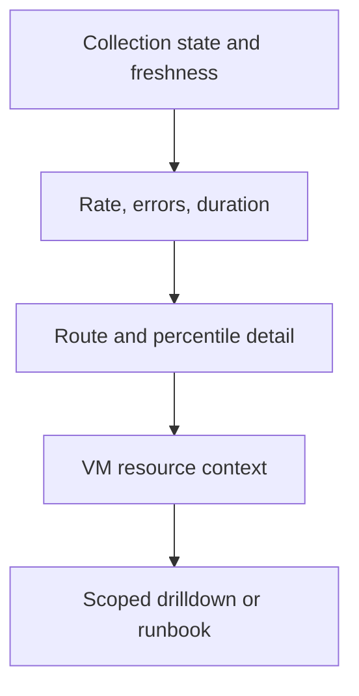
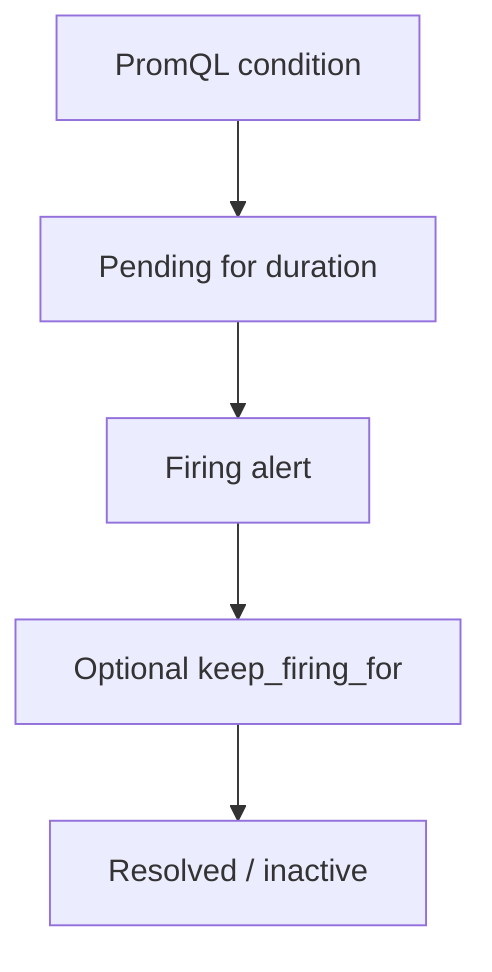

# Lab 12: Dashboard UX and Operational Review

## Purpose and Scope

> **Primary objective:** Turn the reusable Lab 11 dashboard into an operational interface that a tired on-call engineer can interpret, navigate, and verify without relying on color or tribal knowledge.

Lab 11 made scope reusable. Lab 12 makes the dashboard operational:

```text
signal hierarchy -> honest display -> context links -> event evidence -> review
```

You will audit the dashboard against concrete incident questions, add collection freshness, organize reading order, normalize units and thresholds, strengthen legends and descriptions, add a context-preserving data link, create change annotations, run bounded latency/error and scrape-gap experiments, export the dashboard, and perform an evidence-based peer review.

---

## 12.1 Inherited State From Lab 11

Expected running services:

```text
app
db
grafana
node-exporter
prometheus
redis
```

Expected source:

```text
config/grafana/dashboards/lab11-reusable-service-vm.json
```

Expected dashboard properties:

- eight panels;
- environment, Orders API instance, route, and status variables;
- fixed job and telemetry-source scope;
- honest No data behavior;
- file provisioning; and
- no logs, traces, or alert routing yet.

---

## 12.2 Explicit Scope and Exclusions

This lab covers:

- on-call reading order;
- signal freshness;
- units and numeric scale;
- threshold meaning;
- legends and field identity;
- descriptions and next actions;
- data links with variable/time context;
- manual operational annotations;
- accessibility and color-independent state;
- failure and recovery review; and
- dashboard-as-code validation.

This lab does not cover:

- alert-rule definition;
- Alertmanager routing;
- SLO-derived thresholds;
- log or trace drilldowns;
- deployment-event ingestion from CI/CD;
- reporting, snapshots, playlists, or public dashboards;
- Grafana-managed alerting;
- permissions, SSO, or folder RBAC; or
- dashboard generators.

The thresholds remain documented lab policy, not formal objectives. SLO work begins in Lab 16.

---

## 12.3 Prerequisites

```bash
pwd
test -f .env
test -f labs/Lab-11.md
test -f labs/Lab-12.md
test -f config/grafana/dashboards/lab11-reusable-service-vm.json

docker version
docker compose version
docker compose config --quiet
curl --version
jq --version
git --version
```

Use a browser at a normal on-call workstation width and once at a narrow width. Layout behavior is part of the review.

---

## 12.4 Learning Objectives

By the end of Lab 12, you must be able to:

- state the primary audience, entry question, and escalation path for a dashboard;
- arrange collection confidence before RED signals and cause-oriented context;
- distinguish scrape state from sample freshness;
- build a sample-age query with `time()` and `timestamp()`;
- select units that match the raw numeric scale;
- define whether higher or lower values are worse before adding thresholds;
- explain why decorative thresholds are harmful;
- preserve No data and query errors as distinct states;
- write titles that identify signal, scope, and statistic;
- write descriptions containing meaning, window, limitation, and next action;
- use text and value mappings so color is not the only state channel;
- keep legends short while preserving remaining label identity;
- avoid stacking non-additive series;
- avoid smooth interpolation that implies unobserved data;
- create a data link from a route series to a focused view;
- preserve current time and variable state in links;
- distinguish a link from an action;
- explain why dashboard actions are excluded from incident triage;
- add and retrieve a manual change annotation;
- distinguish annotations stored in Grafana from source-controlled dashboard JSON;
- test a dashboard under healthy load, errors, latency, telemetry gaps, and recovery;
- use the query inspector to verify actual requests;
- review panel density, refresh cadence, and result fan-out;
- perform a structured peer review with pass/fail evidence;
- export a stable file-provisioned dashboard; and
- identify what alerting must add in Lab 13.

---

## 12.5 Operational Reading Flow



This is a triage flow, not a proof of causality. Host correlation can suggest a hypothesis; it cannot prove the service is slow because the VM is busy.

---

## 12.6 Load the Environment

```bash
set -a
source .env
set +a

LAB_HTTP_HOST="${BIND_ADDRESS:-127.0.0.1}"
if [[ "$LAB_HTTP_HOST" == "0.0.0.0" || "$LAB_HTTP_HOST" == "::" ]]; then
  LAB_HTTP_HOST=127.0.0.1
fi

export APP_URL="http://$LAB_HTTP_HOST:${APP_HOST_PORT:-8000}"
export PROMETHEUS_URL="http://$LAB_HTTP_HOST:${PROMETHEUS_HOST_PORT:-9090}"
export GRAFANA_URL="http://$LAB_HTTP_HOST:${GRAFANA_HOST_PORT:-3000}"
export GRAFANA_USER="${GRAFANA_ADMIN_USER:-admin}"
export GRAFANA_PASSWORD="${GRAFANA_ADMIN_PASSWORD:-admin_lab_password}"
export LAB12_NOTEBOOK="lab-notes/Lab-12.md"

mkdir -p lab-notes
test -f "$LAB12_NOTEBOOK" || printf '# Lab 12 Evidence\n\n' > "$LAB12_NOTEBOOK"
printf 'Started: %s\n' "$(date -u +%FT%TZ)" | tee -a "$LAB12_NOTEBOOK"
```

---

## 12.7 Define Helpers

```bash
prom_query() {
  local expression="$1"
  local response
  response="$(
    curl -fsS "$PROMETHEUS_URL/api/v1/query" \
      --data-urlencode "query=$expression"
  )"
  jq -e '.status == "success"' <<<"$response" >/dev/null
  printf '%s\n' "$response"
}

grafana_get() {
  local path="$1"
  curl -fsS \
    -u "$GRAFANA_USER:$GRAFANA_PASSWORD" \
    "$GRAFANA_URL$path"
}
```

---

## 12.8 Reconcile the Starting State

```bash
APP_OTEL_ENABLED=false docker compose up -d db redis app
docker compose up -d --no-deps prometheus node-exporter grafana
docker compose stop alertmanager otel-collector loki tempo

for attempt in {1..30}; do
  if curl -fsS "$APP_URL/health/ready" |
       jq -e '.status == "ready"' >/dev/null &&
     curl -fsS "$PROMETHEUS_URL/-/ready" | grep -q Ready &&
     curl -fsS "$GRAFANA_URL/api/health" |
       jq -e '.database == "ok"' >/dev/null; then
    break
  fi
  sleep 2
done

test "$(
  docker compose ps --status running --services | sort
)" = "$(
  printf '%s\n' app db grafana node-exporter prometheus redis | sort
)"
```

---

## 12.9 Create a Review Branch

```bash
git status --short
if ! git diff --quiet || ! git diff --cached --quiet; then
  echo "Checkpoint tracked changes before Lab 12" >&2
  exit 1
fi

if git show-ref --verify --quiet refs/heads/lab-12-dashboard-review; then
  git switch lab-12-dashboard-review
else
  git switch -c lab-12-dashboard-review
fi
```

---

## 12.10 Clone Lab 11 Into an Editable Draft

```bash
grafana_get '/api/dashboards/uid/lab11-reusable-service-vm' \
  > /tmp/lab12-source.json

jq -e '
  .meta.provisioned == true
  and (.dashboard.templating.list | length == 4)
  and (.dashboard.panels | length == 8)
' /tmp/lab12-source.json

jq '
  {
    dashboard: (
      .dashboard
      | del(.id)
      | .uid = "lab12-operational-review-draft"
      | .title = "Lab 12 — Operational Review (Draft)"
      | .tags = ((.tags // []) + ["lab-12", "on-call", "reviewed"] | unique)
      | .version = 0
    ),
    folderUid: "observability-labs",
    message: "Create Lab 12 operational draft",
    overwrite: false
  }
' /tmp/lab12-source.json > /tmp/lab12-create.json

create_code="$(
  curl -sS -o /tmp/lab12-create-response.json \
    -w '%{http_code}' \
    -u "$GRAFANA_USER:$GRAFANA_PASSWORD" \
    -H 'Content-Type: application/json' \
    -X POST "$GRAFANA_URL/api/dashboards/db" \
    --data-binary @/tmp/lab12-create.json
)"

if [[ "$create_code" = "200" ]]; then
  jq /tmp/lab12-create-response.json
elif [[ "$create_code" = "412" ]] &&
     grafana_get '/api/dashboards/uid/lab12-operational-review-draft' \
       >/dev/null; then
  echo "Lab 12 draft already exists; continuing"
else
  printf 'Unexpected HTTP %s\n' "$create_code" >&2
  cat /tmp/lab12-create-response.json >&2
  exit 1
fi
```

---

## 12.11 Define the Operator Contract

Write these answers before editing:

| Question | Required answer |
|---|---|
| Primary audience | Orders API on-call engineer |
| Entry trigger | User report, alert link, or change review |
| First question | Is telemetry current enough to trust? |
| Service questions | What is request rate, 5xx ratio, and tail latency? |
| Narrowing controls | Environment, app instance, route, status |
| Cause context | VM CPU, memory, and filesystem availability |
| Next action | Focus a route, inspect target health, then use later logs/traces |
| Explicit blind spot | No direct user availability, SLO, logs, traces, or deploy feed yet |

---

## 12.12 Establish a Time-to-Answer Budget

For this training dashboard:

```text
10 seconds: collection confidence and RED state
30 seconds: affected route/status/instance
60 seconds: next evidence source or recovery action
```

This is a review heuristic, not an SLA. Ask a peer to use the dashboard without verbal guidance and measure where they hesitate.

---

## 12.13 Audit the Existing Reading Order

Capture panel positions:

```bash
grafana_get '/api/dashboards/uid/lab12-operational-review-draft' \
  > /tmp/lab12-before.json

jq -r '
  .dashboard.panels[]
  | [
      .id,
      .title,
      .type,
      .gridPos.y,
      .gridPos.x,
      .gridPos.w,
      .gridPos.h
    ]
  | @tsv
' /tmp/lab12-before.json |
  sort -n -k4,4 -k5,5 |
  tee -a "$LAB12_NOTEBOOK"
```

Verify that collection state precedes rate/errors/duration and VM context follows application detail.

---

## 12.14 Add a Dashboard Description

In dashboard settings, set a concise description containing:

```text
Audience: Orders API on-call. Start with scrape state and sample age, then RED signals. Variables narrow the displayed population. No data is not healthy zero. VM panels provide context, not causality. Thresholds are lab policy until Labs 16–17 define SLOs. Logs and traces begin in later labs.
```

Descriptions should explain the operational contract, not repeat the title.

---

## 12.15 Add Panel 9 — Orders API Sample Age

Question:

```text
How old is the least-current successful Orders API application-metric sample observed during the last five minutes?
```

Query:

```promql
max(
  time()
  -
  max_over_time(
    timestamp(
      obslab_build_info{
        job="orders-api",
        deployment_environment=~"${environment:regex}",
        instance=~"${instance:regex}"
      }
    )[5m:]
  )
)
```

Configuration:

| Setting | Value |
|---|---|
| Title | Orders API sample age |
| Visualization | Stat |
| Query | Instant |
| Calculation | Last (not null) |
| Unit | Seconds |
| Decimals | 0 |
| Base color | Green |
| Thresholds | 30 orange, 60 red |
| No data | Leave as No data |
| Description | “Age of each selected target's latest successful application-metric sample within five minutes, reduced to the oldest. It is telemetry freshness, not request or readiness freshness. No data means no successful sample remains in that window.” |

With a 15-second scrape interval, healthy values normally oscillate below roughly one interval plus scheduling/query delay. Thresholds allow two and four intervals for this lab. The subquery deliberately preserves the last successful sample across a short failed scrape; after five minutes with no successful sample, the result becomes **No data** instead of growing forever.

---

## 12.16 Scrape State and Freshness Answer Different Questions

| Signal | Question | Limitation |
|---|---|---|
| `up` | Did the latest scrape attempt succeed? | Its timestamp is refreshed even when the attempt records `up=0` |
| Successful app-sample age | How long since each selected target last exposed `obslab_build_info` successfully? | Five-minute lookback; not age of business data |
| `/health/ready` | Can declared dependencies serve now? | One probe path, not all user journeys |
| Request metrics | What completed observed requests did | Silent when traffic is absent |

Place scrape state and sample age adjacent at the start of the summary row.

---

## 12.17 Rebuild the Summary Reading Order

Use this order:

```text
scrape state | sample age | request rate | 5xx ratio | p95 latency
```

Keep the collection panels visually grouped. Do not make all five tiny merely to force one row on every screen. At narrower widths, allow a predictable wrap while preserving order.

---

## 12.18 Review Every Unit Against Raw Scale

Use this contract:

| Panel | Raw scale | Grafana unit |
|---|---|---|
| Scrape state | 0 or 1 | None plus value mapping |
| Sample age | Seconds | Seconds |
| Request rate | Requests per second | Requests/sec |
| 5xx ratio | 0 to 1 | Percent (0.0–1.0) |
| Request duration | Seconds | Seconds |
| CPU/memory | 0 to 100 | Percent (0–100) |
| Filesystem available | 0 to 100 | Percent (0–100) |

A unit formatter does not correct wrong mathematics or scale.

---

## 12.19 Review Threshold Direction

Record one of these for every thresholded panel:

```text
higher is worse
lower is worse
categorical state
no health meaning
```

Examples:

| Panel | Direction | Lab policy |
|---|---|---|
| 5xx ratio | Higher worse | 1% orange, 5% red |
| p95 latency | Higher worse | 0.5 s orange, 1 s red |
| CPU/memory | Higher worse | 70% orange, 90% red |
| Filesystem availability | Lower worse | Below 20% orange, below 10% red |
| Request rate | No inherent health meaning | No red-high threshold |

---

## 12.20 Avoid Threshold Theater

A threshold is defensible only when it comes from:

- an SLO or contractual objective;
- a capacity or safety limit;
- a tested operating policy;
- a physical boundary; or
- an explicitly labeled training assumption.

Coloring every high value red creates visual urgency without operational meaning.

---

## 12.21 Normalize Titles

Titles should answer `what + scope + statistic` where needed.

Recommended final titles:

```text
Orders API scrape targets
Orders API sample age
Request rate
5xx error ratio
Request latency p95
Request rate by route and status
Request latency percentiles
VM CPU and memory utilization
Lowest writable filesystem availability
```

The dashboard and variables already supply service/environment context, so avoid titles that become full sentences.

---

## 12.22 Standardize Panel Descriptions

Each description must contain four elements:

```text
meaning | window/population | limitation | next action
```

Example for error ratio:

```text
Fraction of selected Orders API requests returning 5xx over Grafana's adaptive rate window. Status control intentionally does not alter this ratio. No data is not zero errors. If elevated, focus the route series and then inspect logs/traces in later labs.
```

Do not paste a runbook into every panel. Link to the maintained source of truth when one exists.

---

## 12.23 Review Reduction Functions

For each Stat, ask:

- Is it an instant query or a range query?
- Does `Last (not null)` represent now?
- Would `Mean`, `Max`, or `Total` answer a different question?
- Can null removal hide a recent gap?
- Does panel time override differ from the dashboard?

Use instant queries for current scrape state and sample age. Use explicit range mathematics for rates and percentiles.

---

## 12.24 Review Legends as Remaining Identity

For route/status:

```text
{{route}} · {{status_code}}
```

For percentiles:

```text
p50
p95
p99
```

For VM utilization:

```text
CPU · {{instance}}
Memory · {{instance}}
```

A legend must preserve labels left after aggregation. It should not restate fixed dashboard scope.

---

## 12.25 Review Interpolation and Stacking

Use:

- linear interpolation for sampled time series;
- stack off for percentiles;
- stack off for CPU and memory;
- stack off by default for route/status lines; and
- connected nulls off unless the missing-data meaning is explicitly acceptable.

Smooth lines imply a curve that was never measured. Stacked percentiles are mathematically meaningless.

---

## 12.26 Review Axes and Bounds

Use fixed bounds only when the domain has fixed bounds:

```text
ratio: 0 to 1
percentage: 0 to 100
binary: 0 to 1
```

Do not force a latency upper bound that clips an incident. Do not share an axis between seconds and requests per second.

---

## 12.27 Accessibility Review

Every critical state needs more than color:

- scrape state uses `UP` and `DOWN` text mappings;
- sample age shows a numeric duration;
- error and latency show numeric values plus threshold color;
- No data remains explicit text;
- line series use readable names, not color alone;
- panel descriptions state interpretation; and
- dashboard order remains usable without relying on hue.

Test browser zoom at 200% and a narrow viewport. Check clipped legends, overlapping controls, and unreadable decimals.

---

## 12.28 Create a Route-Focus Data Link

Edit **Request rate by route and status -> Field -> Data links**.

| Setting | Value |
|---|---|
| Title | `Focus route ${__field.labels.route}` |
| URL | See below |
| Open in new tab | On |

URL:

```text
/d/lab12-operational-review-draft/lab-12-operational-review?from=${__from}&to=${__to}&${environment:queryparam}&${instance:queryparam}&var-route=${__field.labels.route:percentencode}&${status:queryparam}
```

This preserves:

- absolute viewed time range;
- environment selection;
- app instance selection;
- clicked route; and
- status selection.

Use Grafana's `queryparam` formatter for template variables so multi-values become repeated parameters.

---

## 12.29 A Data Link Is Not an Action

| Feature | Behavior | Incident risk |
|---|---|---|
| Data link | Navigates to evidence/context | Low when URL is reviewed |
| Dashboard link | Navigates to another dashboard/resource | Low when context is preserved |
| Action | Sends an unauthenticated API request from a panel | Can mutate systems |

This lab does not add actions. Recovery operations require authentication, authorization, confirmation, idempotency, audit, and a separately reviewed control plane.

---

## 12.30 Test the Data Link

1. Select one environment and app instance.
2. Select All routes and at least two statuses.
3. Click a route series or point.
4. Open **Focus route ...**.
5. Confirm the new dashboard view uses that route.
6. Confirm `from` and `to` match the prior absolute range.
7. Confirm the status multi-selection survives.

Capture the generated URL without credentials.

---

## 12.31 Add a Dashboard Link for the Fixed Baseline

In dashboard settings, add a dashboard link:

| Setting | Value |
|---|---|
| Type | Dashboard |
| Title | Compare fixed Lab 10 baseline |
| Target | Lab 10 — Service and VM Triage |
| Include current time range | On |
| Include current variables | Off |
| Open in new tab | On |

Lab 10 has no matching variable contract, so forwarding variables would be misleading.

---

## 12.32 Enable and Review Built-In Annotations

Open dashboard settings -> Annotations. Ensure the built-in **Annotations & Alerts** query is enabled.

Manual annotations are stored in Grafana's database, not in dashboard JSON. The dashboard source contains the annotation-query configuration, while individual annotation events live in the Grafana volume.

---

## 12.33 Create a Change Annotation Through the API

The repository pins Grafana 13.2.1. Its legacy annotation endpoint remains available but is deprecated in Grafana 13, so treat this command as pinned-version lab automation.

```bash
annotation_time_ms="$(( $(date -u +%s) * 1000 ))"

jq -n \
  --arg uid 'lab12-operational-review-draft' \
  --argjson time "$annotation_time_ms" \
  '{
    dashboardUID: $uid,
    time: $time,
    tags: ["lab-12", "change", "bounded-test"],
    text: "Lab 12 controlled latency and error experiment started"
  }' > /tmp/lab12-annotation.json

curl -fsS \
  -u "$GRAFANA_USER:$GRAFANA_PASSWORD" \
  -H 'Content-Type: application/json' \
  -X POST "$GRAFANA_URL/api/annotations" \
  --data-binary @/tmp/lab12-annotation.json |
  tee /tmp/lab12-annotation-response.json |
  jq

jq -e '.id > 0' /tmp/lab12-annotation-response.json
```

---

## 12.34 Retrieve Annotation Evidence

```bash
grafana_get "/api/annotations?dashboardUID=lab12-operational-review-draft&tags=lab-12&limit=20" \
  > /tmp/lab12-annotations.json

jq -e '
  length >= 1
  and any(.[]; (.tags | index("lab-12")) != null)
' /tmp/lab12-annotations.json

jq -r '.[] | [.id, .time, (.tags | join(",")), .text] | @tsv' \
  /tmp/lab12-annotations.json |
  tee -a "$LAB12_NOTEBOOK"
```

Verify the marker appears on time-series panels within the selected time range.

---

## 12.35 Prediction Checkpoint — Controlled Degradation

Predict which panels should change during a burst containing healthy requests, 503s, and 1.2-second requests:

| Panel | Prediction |
|---|---|
| Scrape targets | Remains UP |
| Sample age | Remains near scrape cadence |
| Request rate | Increases |
| 5xx ratio | Increases |
| p95 latency | May cross 1 second if slow observations dominate tail |
| Route/status detail | Shows 503 contributors |
| Percentiles | Tail rises more than median if slow traffic is minority |
| VM panels | May change slightly; no causal conclusion |

Write predictions before traffic.

---

## 12.36 Run a Bounded Mixed Experiment

```bash
experiment_end="$((SECONDS + 75))"

(
  while (( SECONDS < experiment_end )); do
    curl -fsS -o /dev/null "$APP_URL/health/live"
    curl -sS -o /dev/null \
      "$APP_URL/api/v1/simulate/error?status_code=503" || true
    sleep 0.25
  done
) > /tmp/lab12-error-load.log 2>&1 &
error_pid=$!

(
  for request in {1..30}; do
    curl -fsS -o /dev/null \
      "$APP_URL/api/v1/simulate/latency?seconds=1.2"
  done
) > /tmp/lab12-latency-load.log 2>&1 &
latency_pid=$!

wait "$error_pid"
wait "$latency_pid"
sleep 20
```

The application caps simulation parameters and Compose limits its CPU/memory. Do not increase duration or concurrency on a shared VM.

---

## 12.37 Capture Signal Evidence

```bash
prom_query 'sum(rate(obslab_http_requests_total{job="orders-api"}[1m]))' |
  jq '.data.result' | tee -a "$LAB12_NOTEBOOK"

prom_query 'sum(rate(obslab_http_requests_total{job="orders-api",status_code=~"5.."}[1m])) / clamp_min(sum(rate(obslab_http_requests_total{job="orders-api"}[1m])), 0.001)' |
  jq '.data.result' | tee -a "$LAB12_NOTEBOOK"

prom_query 'histogram_quantile(0.95, sum by (le) (rate(obslab_http_request_duration_seconds_bucket{job="orders-api"}[1m])))' |
  jq '.data.result' | tee -a "$LAB12_NOTEBOOK"
```

Compare actual panel behavior with predictions. Explain discrepancies using window length, scrape timing, traffic mixture, and histogram buckets.

---

## 12.38 Add an Experiment-End Annotation

```bash
end_time_ms="$(( $(date -u +%s) * 1000 ))"

jq -n \
  --arg uid 'lab12-operational-review-draft' \
  --argjson time "$end_time_ms" \
  '{
    dashboardUID: $uid,
    time: $time,
    tags: ["lab-12", "change", "bounded-test"],
    text: "Lab 12 controlled latency and error experiment ended"
  }' |
  curl -fsS \
    -u "$GRAFANA_USER:$GRAFANA_PASSWORD" \
    -H 'Content-Type: application/json' \
    -X POST "$GRAFANA_URL/api/annotations" \
    --data-binary @- |
  jq -e '.id > 0'
```

The annotation marks correlation in time. It does not prove the change caused every observed effect.

---

## 12.39 Query Inspector Review

Inspect one variable-heavy rate panel and one histogram panel. Record:

- final interpolated expression;
- time range;
- step;
- data-source UID;
- HTTP status;
- returned frame/series count;
- execution duration; and
- any warnings.

The editor expression is a template. The inspector shows what Grafana actually asked.

---

## 12.40 Prediction Checkpoint — Scrape Gap

Before stopping the app, predict this sequence:

```text
app healthy
-> next scrape fails
-> up becomes 0
-> application metrics become stale for instant selectors
-> range-backed successful-sample age rises
-> recent rates decay
-> app restarts
-> up returns 1
-> sample age returns near cadence
```

No business request metric is collected while the target cannot be scraped.

---

## 12.41 Controlled 45-Second Scrape Gap

```bash
gap_started="$(date -u +%FT%TZ)"
docker compose stop app

for attempt in {1..12}; do
  state="$(
    prom_query 'up{job="orders-api"}' |
      jq -r '.data.result[0].value[1] // "absent"'
  )"
  age="$(
    prom_query 'max(time() - max_over_time(timestamp(obslab_build_info{job="orders-api"})[5m:]))' |
      jq -r '.data.result[0].value[1] // "absent"'
  )"
  printf '%s state=%s age=%s\n' "$(date -u +%FT%TZ)" "$state" "$age" |
    tee -a "$LAB12_NOTEBOOK"
  [[ "$state" == "0" ]] && break
  sleep 5
done

sleep 30
```

Inspect the dashboard. `up=0` is a recent failed-attempt sample, while the range-backed panel ages the last successful application-metric sample. These two signals must disagree in this controlled way.

---

## 12.42 Recover and Prove Freshness

```bash
APP_OTEL_ENABLED=false docker compose up -d app

recovered=false
for attempt in {1..30}; do
  ready=false
  if curl -fsS "$APP_URL/health/ready" |
       jq -e '.status == "ready"' >/dev/null; then
    ready=true
  fi

  state="$(
    prom_query 'up{job="orders-api"}' |
      jq -r '.data.result[0].value[1] // "absent"'
  )"

  if [[ "$ready" == true && "$state" == "1" ]]; then
    recovered=true
    break
  fi
  sleep 5
done

test "$recovered" = true

prom_query 'max(time() - max_over_time(timestamp(obslab_build_info{job="orders-api"})[5m:]))' |
  jq '.data.result' | tee -a "$LAB12_NOTEBOOK"
printf 'Gap started: %s\nRecovered: %s\n' \
  "$gap_started" "$(date -u +%FT%TZ)" >> "$LAB12_NOTEBOOK"
```

---

## 12.43 No Data, Zero, Stale, and Query Error

| State | Meaning | Required display response |
|---|---|---|
| Zero | A measured calculation returned zero | Show zero with correct meaning |
| No data | No matching series/points | Show No data |
| Stale | Previously known series aged out | Show absence/freshness context |
| Query error | Data source rejected/failed query | Show error, not zero |
| Down | Latest `up` sample is zero | Show DOWN text plus color |

Never use a global zero fallback to make all five states visually green.

---

## 12.44 Refresh Cadence Review

The dashboard refresh is 30 seconds while Prometheus scrapes every 15 seconds. Record:

- number of Prometheus-backed panel targets;
- variable refresh policy;
- selected time range;
- typical series count under All; and
- whether 30 seconds is sufficient for the operator decision.

Refreshing faster than source collection mostly repeats queries against unchanged samples.

---

## 12.45 Result Density Review

For each time-series panel under All:

```text
count visible lines
identify top/bottom contributors
check legend readability
check tooltip usability
decide whether aggregation or a separate detail dashboard is needed
```

Do not hide an important outlier merely to reduce line count. Split incompatible magnitudes or audiences instead.

---

## 12.46 Responsive Layout Review

Test:

1. full-width desktop;
2. half-width browser;
3. 200% zoom;
4. controls with long route selections; and
5. collapsed/expanded legends.

Capture only observations and fixes, not sensitive browser content.

---

## 12.47 Dashboard Review Matrix

Mark each row pass/fail with evidence:

| Area | Pass condition |
|---|---|
| Audience | Named primary user and entry trigger |
| Confidence | Scrape state and sample age first |
| RED | Rate, errors, duration visible |
| Variables | Bounded and semantically compatible |
| Math | Rates, ratios, and histograms correct |
| Units | Match raw numeric scale |
| Thresholds | Direction and source documented |
| No data | Not converted to healthy zero |
| Legends | Preserve remaining identity |
| Descriptions | Meaning, scope, limitation, next action |
| Drilldown | Preserves time and variable context |
| Events | Change annotations visible |
| Accessibility | Critical state not color-only |
| Density | Line count and layout usable |
| Cost | Refresh and query fan-out reviewed |
| Ownership | JSON source and review path clear |

---

## 12.48 Peer Handoff Test

Ask another learner to answer without explanation:

1. Is telemetry current?
2. Is the service receiving traffic?
3. Are 5xx responses elevated?
4. Is tail latency elevated?
5. Which route/status contributes?
6. Is host pressure a plausible context signal?
7. What changed near the event?
8. What should be inspected next?

Record time-to-answer and every ambiguity. If no peer is available, wait one hour and perform the test from the saved URL without your build notes.

---

## 12.49 Save With an Operational Message

Use:

```text
Add freshness, drilldown, annotations, and on-call review metadata
```

Then capture runtime:

```bash
grafana_get '/api/dashboards/uid/lab12-operational-review-draft' \
  > /tmp/lab12-runtime.json

jq '{
  uid: .dashboard.uid,
  title: .dashboard.title,
  description: .dashboard.description,
  refresh: .dashboard.refresh,
  panel_count: (.dashboard.panels | length),
  panels: [
    .dashboard.panels[] |
    {
      id,
      title,
      type,
      unit: .fieldConfig.defaults.unit,
      description: .description,
      links: .fieldConfig.defaults.links
    }
  ],
  links: .dashboard.links,
  annotations: .dashboard.annotations
}' /tmp/lab12-runtime.json | tee -a "$LAB12_NOTEBOOK"
```

---

## 12.50 Export the Reviewed Dashboard

```bash
jq -e '
  .dashboard.uid == "lab12-operational-review-draft"
  and ([.dashboard.panels[] | select(.type != "row")] | length >= 9)
  and (.dashboard.templating.list | length == 4)
' /tmp/lab12-runtime.json

jq '
  .dashboard
  | del(.id)
  | .uid = "lab12-operational-review"
  | .title = "Lab 12 — Operational Review"
  | .version = 1
' /tmp/lab12-runtime.json \
  > config/grafana/dashboards/lab12-operational-review.json

jq empty config/grafana/dashboards/lab12-operational-review.json
```

---

## 12.51 Validate Identity and Structure

```bash
jq -e '
  .uid == "lab12-operational-review"
  and (.title == "Lab 12 — Operational Review")
  and (.description | length > 80)
  and (.refresh == "30s")
  and ([.panels[] | select(.type != "row")] | length >= 9)
  and (.templating.list | length == 4)
' config/grafana/dashboards/lab12-operational-review.json

jq -e '
  [.panels[].id] as $ids
  | ($ids | length) == ($ids | unique | length)
  and all($ids[]; . > 0)
' config/grafana/dashboards/lab12-operational-review.json
```

---

## 12.52 Validate Sample-Age Panel

```bash
jq -e '
  any(
    .panels[];
    .title == "Orders API sample age"
    and .type == "stat"
    and .fieldConfig.defaults.unit == "s"
    and any(.targets[]?; .expr | contains("timestamp"))
    and any(.targets[]?; .expr | contains("max_over_time"))
    and any(.targets[]?; .expr | contains("obslab_build_info"))
    and any(.targets[]?; .expr | contains("[5m:]"))
    and any(.targets[]?; .expr | contains("job=\"orders-api\""))
  )
' config/grafana/dashboards/lab12-operational-review.json
```

Grafana may serialize the seconds unit as `s`, `seconds`, or another compatible identifier depending on the editor. Inspect the source and update only the expected literal if required.

---

## 12.53 Validate Links Carry Context

```bash
jq -r '
  .panels[]
  | .fieldConfig.defaults.links[]?
  | [.title, .url]
  | @tsv
' config/grafana/dashboards/lab12-operational-review.json \
  > /tmp/lab12-data-links.tsv

grep -F 'var-route=' /tmp/lab12-data-links.tsv
grep -F '${__from}' /tmp/lab12-data-links.tsv
grep -F '${__to}' /tmp/lab12-data-links.tsv
grep -F '${environment:queryparam}' /tmp/lab12-data-links.tsv
grep -F '${instance:queryparam}' /tmp/lab12-data-links.tsv
grep -F '${status:queryparam}' /tmp/lab12-data-links.tsv
grep -F '${__field.labels.route:percentencode}' /tmp/lab12-data-links.tsv
```

Check dashboard links separately:

```bash
jq -e '
  any(
    .links[]?;
    (.title | contains("Lab 10"))
    and .keepTime == true
  )
' config/grafana/dashboards/lab12-operational-review.json
```

---

## 12.54 Validate Descriptions and Units

```bash
jq -e '
  all(
    .panels[]
    | select(.type != "row" and .type != "text");
    (.description // "" | length) >= 40
  )
' config/grafana/dashboards/lab12-operational-review.json

jq -r '
  .panels[]
  | select(.type != "row")
  | [
      .title,
      (.type // ""),
      (.fieldConfig.defaults.unit // "<none>"),
      ((.fieldConfig.defaults.thresholds.steps // []) | tostring)
    ]
  | @tsv
' config/grafana/dashboards/lab12-operational-review.json |
  tee -a "$LAB12_NOTEBOOK"
```

Automated length checks cannot prove a useful description. Perform semantic review.

---

## 12.55 Validate Query and Data-Source Safety

```bash
jq -e '
  [
    .panels[]
    | .targets[]?
    | select(.hide != true)
    | .expr
    | select(type == "string" and length > 0)
  ]
  | length >= 11
' config/grafana/dashboards/lab12-operational-review.json

jq -e '
  [
    .panels[] |
    (
      [.datasource.uid // empty]
      + [.targets[]?.datasource.uid // empty]
    )[]
  ]
  | map(select(. != "-- Mixed --"))
  | all(. == "prometheus")
' config/grafana/dashboards/lab12-operational-review.json
```

Reject global zero fill:

```bash
if jq -r '.panels[].targets[]?.expr // empty' \
     config/grafana/dashboards/lab12-operational-review.json |
     grep -Fq 'or vector(0)'; then
  echo "Global zero fill requires review" >&2
  exit 1
fi
```

---

## 12.56 Wait for Provisioning

```bash
provisioned=false
for attempt in {1..12}; do
  code="$(
    curl -sS -o /tmp/lab12-provisioned.json \
      -w '%{http_code}' \
      -u "$GRAFANA_USER:$GRAFANA_PASSWORD" \
      "$GRAFANA_URL/api/dashboards/uid/lab12-operational-review"
  )"

  if [[ "$code" = "200" ]] &&
     jq -e '.meta.provisioned == true' \
       /tmp/lab12-provisioned.json >/dev/null; then
    provisioned=true
    break
  fi
  sleep 5
done

test "$provisioned" = true
jq '{
  uid: .dashboard.uid,
  version: .dashboard.version,
  panels: (.dashboard.panels | length),
  provisioned: .meta.provisioned,
  source: .meta.provisionedExternalId
}' /tmp/lab12-provisioned.json | tee -a "$LAB12_NOTEBOOK"
```

---

## 12.57 Commit the Reviewed Dashboard

```bash
git status --short
git diff --check
jq empty config/grafana/dashboards/lab12-operational-review.json

git add config/grafana/dashboards/lab12-operational-review.json
git commit -m "lab 12: complete operational dashboard review"
git status --short
```

---

## 12.58 Troubleshooting — Annotation Is Missing

Check:

- dashboard UID in the event;
- dashboard time range includes the event time;
- built-in annotation query is enabled;
- tag filters do not exclude the event;
- API response contained an ID;
- browser timezone versus UTC timestamp;
- the panel type supports annotations; and
- Grafana database/volume persistence.

---

## 12.59 Troubleshooting — Data Link Loses Variables

Check:

- variable names, not labels, are used;
- `${name:queryparam}` format is present for each template variable;
- ampersands separate different variables;
- the target dashboard defines matching variables;
- multi-values render as repeated parameters;
- the route field actually carries a `route` label; and
- absolute `from` and `to` are included.

---

## 12.60 Troubleshooting — Sample Age Never Rises

Check:

- query is instant;
- `time()`, `timestamp(obslab_build_info)`, `max_over_time`, and the five-minute subquery are present;
- panel reduction is not averaging a range;
- target truly stopped long enough to miss a scrape;
- Grafana is not showing an old cached response; and
- variable selection matches the stopped target.

---

## 12.61 Troubleshooting — Threshold Colors Are Reversed

State threshold direction first. For filesystem availability, configure:

```text
base red
10 -> orange
20 -> green
```

For utilization, configure:

```text
base green
70 -> orange
90 -> red
```

Test values on both sides rather than trusting the editor preview.

---

## 12.62 Troubleshooting — Dashboard Looks Healthy During No Data

Search for:

- `or vector(0)`;
- field null-value mappings;
- transformations replacing null with zero;
- connected nulls;
- hidden query errors;
- panels lacking scrape/freshness context; and
- stale browser time range.

Fix semantics, not only color.

---

## 12.63 Evidence Matrix

| Evidence | What it proves |
|---|---|
| Operator contract | Named audience and decisions |
| Position inventory | Reading order before changes |
| Sample-age query | Collection freshness visibility |
| Unit matrix | Display scale correctness |
| Threshold-direction matrix | Color meaning is explicit |
| Descriptions | Limitations and next actions |
| Accessibility review | State is not color-only |
| Generated data-link URL | Time and variable context survives |
| Annotation API/marker | Event evidence exists |
| Degradation predictions/results | Panels respond as designed |
| Scrape-gap timeline | Down and freshness are distinct |
| Recovery proof | Current collection restored |
| Query inspector | Actual request contract |
| Density/responsive review | Dashboard remains usable |
| Peer handoff | Time-to-answer evidence |
| JSON checks | Reproducible implementation |
| Provisioned runtime | Grafana loaded source |
| Git commit | Reviewed change history |

---

## 12.64 Production Implications

1. Dashboards are operational interfaces, not metric galleries.
2. Put telemetry confidence before conclusions derived from telemetry.
3. Separate collection freshness, target health, readiness, and user experience.
4. Design for a named audience and time-to-answer budget.
5. Use RED for user-facing service symptoms and USE for resource context.
6. Units must match numeric scale.
7. Thresholds need objectives, limits, or documented policy.
8. Preserve No data and query errors.
9. Do not use color as the only state channel.
10. Legends must preserve remaining identity without noise.
11. Avoid smoothing and stacking that change interpretation.
12. Links should preserve time and variable context.
13. Dashboard actions require a separately secured control-plane review.
14. Annotations establish temporal context, not causality.
15. Automate change annotations from CI/CD in real environments.
16. Review dashboards under failure, load, absence, recovery, narrow screens, and zoom.
17. Store approved dashboards as reviewed code.
18. Measure dashboard query cost and usage over time.

---

## 12.65 Knowledge Check

Answer before reading the key:

1. Who is the primary audience in this lab?
2. What is the first dashboard question?
3. Why place collection confidence first?
4. What does `up` measure?
5. What does sample age measure?
6. Does sample age prove readiness freshness?
7. Why use `max` across selected sample ages?
8. Why is request rate not red when high?
9. Which percent unit expects a zero-to-one ratio?
10. Which scale does CPU return here?
11. Why document threshold direction?
12. What makes a threshold defensible?
13. Why preserve No data?
14. Why avoid smooth interpolation?
15. Why not stack percentiles?
16. What should a legend preserve?
17. What four elements belong in a panel description?
18. What does `${instance:queryparam}` do?
19. Why include `from` and `to` in a data link?
20. Is a hidden data link an authorization control?
21. Why are dashboard actions excluded?
22. Where are manual annotation events stored?
23. Does an annotation prove causality?
24. Why is the annotation endpoint called pinned-version automation?
25. What should happen to sample age during a scrape gap?
26. Why might p95 not exceed the injected latency immediately?
27. What does the query inspector add?
28. Why test at 200% zoom?
29. What does a peer handoff reveal?
30. What lifecycle does Lab 13 introduce?

---

## 12.66 Knowledge Check Answers

1. The Orders API on-call engineer.
2. Whether telemetry is current enough to trust.
3. Derived RED conclusions are unsafe when collection is broken or stale.
4. Whether the latest Prometheus scrape succeeded.
5. Age of the latest successful selected application-metric sample within the five-minute evidence window.
6. No.
7. The least-current selected target remains visible.
8. Demand alone is not a failure condition.
9. Percent (0.0–1.0).
10. Zero to 100 percent.
11. The same thresholds invert between availability and utilization.
12. An objective, capacity/safety limit, tested policy, physical boundary, or explicit training assumption.
13. It is different from a measured zero.
14. It implies an unmeasured curve between samples.
15. Percentiles are ordered statistics, not additive quantities.
16. Labels that remain after aggregation and distinguish series.
17. Meaning, window/population, limitation, and next action.
18. Produces URL query parameters for the current single/multi/All selection.
19. The destination must inspect the same incident interval.
20. No.
21. They can mutate systems and need a secured, audited control plane.
22. Grafana's database/volume.
23. No; it marks temporal correlation.
24. Grafana 13 deprecates legacy `/api` routes although the pinned release keeps them operative.
25. It rises from the last successful application-metric sample while the separately refreshed `up=0` records failed attempts; after the five-minute evidence window it becomes No data.
26. Window mixture, scrape timing, and histogram estimation affect it.
27. The actual interpolated query, request parameters, response, and timing.
28. To reveal clipping and layouts that exclude users needing zoom.
29. Ambiguous titles, order, controls, descriptions, and next actions.
30. Inactive, pending, firing, retained-firing, and resolved alert behavior.

---

## 12.67 Professional Scenarios

### Scenario A — Green dashboard after exporter failure

Every panel replaces absence with zero and no collection panels exist. Restore No data/error behavior and add independent scrape state plus freshness.

### Scenario B — Alert link opens the wrong time and route

The link forwards only a dashboard UID. Include absolute `from`/`to` and matching variable query parameters.

### Scenario C — Deploy marker aligns with latency spike

Treat the marker as a hypothesis generator. Confirm with request, dependency, log, trace, and deploy evidence before assigning cause.

---

## 12.68 Required Lab Notebook

Include:

- UTC start and finish times;
- exact service set and health;
- operator and time-to-answer contracts;
- panel-position inventory;
- sample-age query and normal values;
- unit and threshold-direction matrices;
- final titles and descriptions;
- accessibility and responsive-layout findings;
- data-link template and generated URL;
- dashboard-link settings;
- annotation creation/retrieval evidence;
- degradation predictions and actual behavior;
- Prometheus results during the experiment;
- scrape-gap state/age timeline;
- recovery evidence;
- query-inspector details;
- refresh and result-density review;
- peer handoff results;
- completed review matrix;
- exported/provisioned JSON checks;
- Git commit; and
- all 30 knowledge answers.

---

## 12.69 Completion Checklist

- [ ] Lab 11 source was healthy and provisioned.
- [ ] An editable Lab 12 draft was created.
- [ ] The audience and time-to-answer budget were written.
- [ ] Existing panel order was audited.
- [ ] The dashboard description states scope and blind spots.
- [ ] Orders API sample age was added.
- [ ] Scrape state and freshness are adjacent and distinct.
- [ ] Every panel's unit matches its raw scale.
- [ ] Every threshold has direction and source.
- [ ] Request rate has no decorative high-is-bad threshold.
- [ ] Titles and descriptions were standardized.
- [ ] Legends preserve remaining identity.
- [ ] Non-additive series are not stacked.
- [ ] Critical state is not color-only.
- [ ] A route-focus data link preserves context.
- [ ] The generated data link was tested.
- [ ] A fixed-baseline dashboard link was added.
- [ ] Start/end annotations were created and retrieved.
- [ ] Bounded degradation changed expected panels.
- [ ] A scrape gap changed scrape state and sample age.
- [ ] Recovery restored current telemetry.
- [ ] Query inspector evidence was captured.
- [ ] Refresh, density, zoom, and responsive layout were reviewed.
- [ ] A peer handoff or delayed self-review was completed.
- [ ] The review matrix passed or exceptions were documented.
- [ ] The dashboard was exported and provisioned.
- [ ] JSON and semantic checks passed.
- [ ] The change was committed.
- [ ] All questions and notebook evidence are complete.

---

## 12.70 Upstream Reference Map

- [Grafana dashboard best practices](https://grafana.com/docs/grafana/latest/visualizations/dashboards/build-dashboards/best-practices/) — RED/USE, hierarchy, directed browsing, and dashboard maturity.
- [Grafana data links and actions](https://grafana.com/docs/grafana/latest/visualizations/panels-visualizations/configure-data-links/) — field, time, and template-variable link context.
- [Grafana annotations](https://grafana.com/docs/grafana/latest/visualizations/dashboards/build-dashboards/annotate-visualizations/) — operational event markers.
- [Grafana annotations HTTP API](https://grafana.com/docs/grafana/latest/developer-resources/api-reference/http-api/api-legacy/annotations/) — pinned legacy create/query endpoints and Grafana 13 migration note.
- [Grafana visualization documentation](https://grafana.com/docs/grafana/latest/visualizations/) — fields, units, thresholds, and panel types.
- [Prometheus query functions](https://prometheus.io/docs/prometheus/latest/querying/functions/) — `time()`, `timestamp()`, and `max_over_time()` semantics.
- [Prometheus querying basics](https://prometheus.io/docs/prometheus/latest/querying/basics/) — staleness and subquery behavior.

---

## 12.71 Final State and Transition to Lab 13

Verify:

```bash
curl -fsS "$APP_URL/health/ready" | jq -e '.status == "ready"'
curl -fsS "$PROMETHEUS_URL/-/ready" | grep -q Ready
curl -fsS "$GRAFANA_URL/api/health" | jq -e '.database == "ok"'

jq empty config/grafana/dashboards/lab12-operational-review.json
grafana_get '/api/dashboards/uid/lab12-operational-review' |
  jq -e '
    .meta.provisioned == true
    and ([.dashboard.panels[] | select(.type != "row")] | length >= 9)
  '

test "$(
  prom_query 'up{job="orders-api"}' |
    jq -r '.data.result[0].value[1]'
)" = "1"

git status --short
```

Append final evidence:

```bash
{
  printf '\n## Final evidence\n'
  printf 'Finished: %s\n' "$(date -u +%FT%TZ)"
  printf 'Provisioned UID: lab12-operational-review\n'
  printf 'Operational review: complete\n'
} >> "$LAB12_NOTEBOOK"
```

Leave the six services running. Lab 13 will start Alertmanager and move from visual observation to a tested Prometheus alert-rule lifecycle:



Carry forward:

```text
dashboard threshold != alert rule
temporal correlation != causality
scrape state != freshness
freshness != readiness
link != action
valid JSON != operational UX
```
