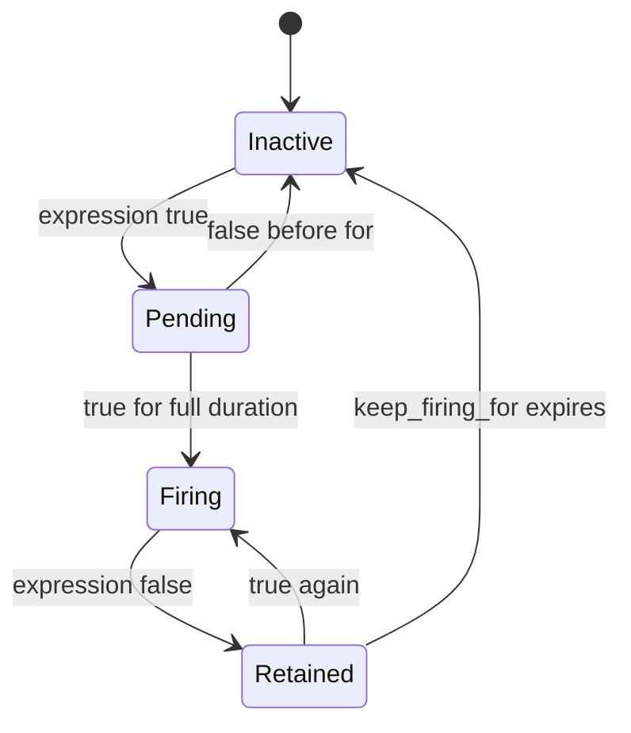
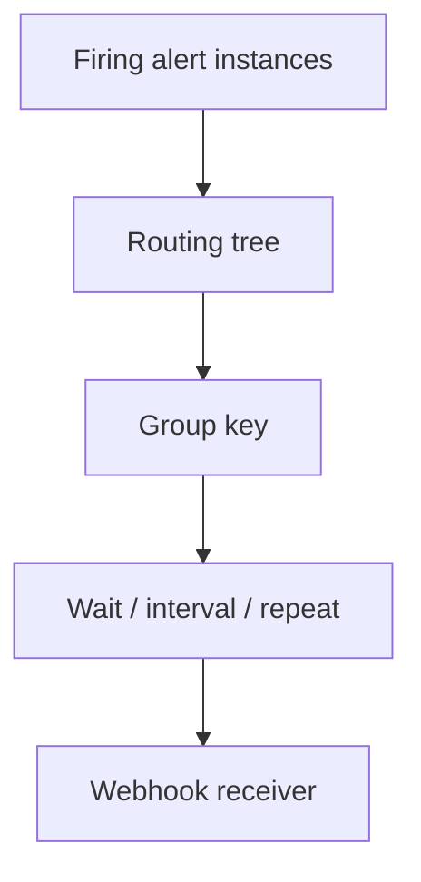

# Lab 13: Prometheus Alert Rule Lifecycle

## Purpose and Scope

> **Primary objective:** Design, unit-test, load, observe, and recover one Prometheus alert rule while proving the difference between inactive, pending, firing, retained-firing, and resolved behavior.

Dashboards answer questions when a person is looking. Alert rules continuously evaluate a precise condition and produce labeled alert instances:

```text
metric samples -> PromQL condition -> for -> firing -> keep_firing_for -> inactive
```

You will create a lab-scoped high-error-ratio alert, test threshold and duration behavior with synthetic time series, reload Prometheus safely, drive a bounded real workload, inspect the rule API and synthetic `ALERTS` series, verify delivery to Alertmanager, let the condition recover, and prove atomic rejection of an invalid rule reload.

---

## 13.1 Inherited State From Lab 12

Expected running services:

```text
app
db
grafana
node-exporter
prometheus
redis
```

Expected source:

```text
config/grafana/dashboards/lab12-operational-review.json
```

Alertmanager is configured in Prometheus but has not been part of the progressive running set. Lab 13 starts it only to prove handoff; routing policy is Lab 14.

---

## 13.2 Explicit Scope and Exclusions

This lab covers:

- alert-rule anatomy;
- expression and label identity;
- evaluation cadence;
- `for` state retention;
- `keep_firing_for` recovery hysteresis;
- annotations versus labels;
- `promtool` syntax and unit tests;
- safe reload and atomic failure;
- Prometheus rule/alert APIs;
- `ALERTS` and `ALERTS_FOR_STATE` series;
- one real bounded workload; and
- basic Prometheus-to-Alertmanager delivery proof.

This lab does not cover:

- notification receiver design;
- routing trees, grouping, or repeat timing;
- silences or inhibition;
- SLI/SLO selection or burn-rate alerts;
- multi-replica Prometheus rule evaluation;
- Grafana-managed alerting;
- paging integrations; or
- HA deduplication.

---

## 13.3 Prerequisites

```bash
pwd
test -f .env
test -f labs/Lab-12.md
test -f labs/Lab-13.md
test -f config/prometheus/prometheus.yml
test -f config/prometheus/rules/application.yml
test -f config/alertmanager/alertmanager.yml

docker version
docker compose version
docker compose config --quiet
curl --version
jq --version
git --version
```

The lab takes several minutes because it observes real evaluation and scrape intervals rather than replacing time with screenshots.

---

## 13.4 Learning Objectives

By the end of Lab 13, you must be able to:

- distinguish a dashboard threshold from an alert condition;
- state the user symptom and intended responder before writing PromQL;
- define a ratio with a matching numerator and denominator population;
- explain why `rate` is applied before aggregation;
- separate lookback window, rule-group interval, `for`, and `keep_firing_for`;
- explain alert identity as the final label set;
- keep volatile values in annotations rather than labels;
- choose stable ownership, severity, service, and lab labels;
- explain inactive, pending, firing, and retained-firing states;
- predict how a flapping expression interacts with `for`;
- validate rule syntax with `promtool`;
- unit-test both non-firing and firing cases;
- prove that a rule does not fire before its `for` duration;
- reload Prometheus without restarting the process;
- inspect loaded rule health and last evaluation;
- inspect active alert instances through the rules API;
- inspect `ALERTS` synthetic series;
- explain `ALERTS_FOR_STATE` timestamps;
- generate a bounded real high-error condition;
- correlate workload, expression truth, and state transitions;
- prove Alertmanager received the firing alert;
- stop the condition and observe retained-firing behavior;
- distinguish rule resolution from notification resolution;
- prove a bad reload leaves the last good rules active;
- restore a clean final state; and
- identify what routing and grouping must add in Lab 14.

---

## 13.5 Alert Lifecycle



`Retained` is a conceptual label used in this guide. Prometheus continues reporting the alert as firing during `keep_firing_for`.

---

## 13.6 Load the Environment

```bash
set -a
source .env
set +a

LAB_HTTP_HOST="${BIND_ADDRESS:-127.0.0.1}"
if [[ "$LAB_HTTP_HOST" == "0.0.0.0" || "$LAB_HTTP_HOST" == "::" ]]; then
  LAB_HTTP_HOST=127.0.0.1
fi

export APP_URL="http://$LAB_HTTP_HOST:${APP_HOST_PORT:-8000}"
export PROMETHEUS_URL="http://$LAB_HTTP_HOST:${PROMETHEUS_HOST_PORT:-9090}"
export ALERTMANAGER_URL="http://$LAB_HTTP_HOST:${ALERTMANAGER_HOST_PORT:-9093}"
export LAB13_NOTEBOOK="lab-notes/Lab-13.md"

mkdir -p lab-notes config/prometheus/tests
test -f "$LAB13_NOTEBOOK" || printf '# Lab 13 Evidence\n\n' > "$LAB13_NOTEBOOK"
printf 'Started: %s\n' "$(date -u +%FT%TZ)" | tee -a "$LAB13_NOTEBOOK"
```

---

## 13.7 Define Prometheus Helpers

```bash
prom_query() {
  local expression="$1"
  local response
  response="$(
    curl -fsS "$PROMETHEUS_URL/api/v1/query" \
      --data-urlencode "query=$expression"
  )"
  jq -e '.status == "success"' <<<"$response" >/dev/null
  printf '%s\n' "$response"
}

lab13_rule_json() {
  curl -fsSG "$PROMETHEUS_URL/api/v1/rules" \
    --data-urlencode 'type=alert' \
    --data-urlencode 'rule_name[]=Lab13HighErrorRatio'
}

lab13_rule_state() {
  lab13_rule_json |
    jq -r '
      [
        .data.groups[].rules[]
        | select(.name == "Lab13HighErrorRatio")
        | .state
      ][0] // "missing"
    '
}
```

---

## 13.8 Reconcile and Start Alertmanager

```bash
APP_OTEL_ENABLED=false docker compose up -d db redis app
docker compose up -d --no-deps prometheus node-exporter grafana alertmanager
docker compose stop otel-collector loki tempo

for attempt in {1..30}; do
  if curl -fsS "$APP_URL/health/ready" |
       jq -e '.status == "ready"' >/dev/null &&
     curl -fsS "$PROMETHEUS_URL/-/ready" | grep -q Ready &&
     curl -fsS "$ALERTMANAGER_URL/-/ready" >/dev/null; then
    break
  fi
  sleep 2
done

curl -fsS -X POST "$PROMETHEUS_URL/-/reload"
sleep 20
test "$(
  prom_query 'up{job="alertmanager"}' |
    jq -r '.data.result[0].value[1]'
)" = "1"
```

Expected running set:

```bash
running="$(docker compose ps --status running --services | sort)"
expected="$(
  printf '%s\n' alertmanager app db grafana node-exporter prometheus redis | sort
)"
test "$running" = "$expected"
printf '%s\n' "$running" | tee -a "$LAB13_NOTEBOOK"
```

Existing platform alerts may be active because Loki, Tempo, and the Collector are intentionally stopped. Filter all observations by `lab="13"` or the exact alert name.

---

## 13.9 Create a Rule Branch

```bash
git status --short
if ! git diff --quiet || ! git diff --cached --quiet; then
  echo "Checkpoint tracked changes before Lab 13" >&2
  exit 1
fi

if git show-ref --verify --quiet refs/heads/lab-13-alert-lifecycle; then
  git switch lab-13-alert-lifecycle
else
  git switch -c lab-13-alert-lifecycle
fi
```

---

## 13.10 Define the Alert Contract Before YAML

| Contract field | Decision |
|---|---|
| User symptom | Sustained elevated server-error ratio |
| Population | Native Orders API HTTP requests |
| Window | One-minute rate window for a short lab |
| Threshold | Greater than 20% |
| Persistence | 30 seconds continuously true |
| Recovery hysteresis | Keep firing 20 seconds after condition clears |
| Severity | Warning |
| Owner | Application team |
| Identity | Alert name + stable labels only |
| Dashboard | `lab12-operational-review` |
| Production caveat | Threshold/window are lab values, not an SLO |

An alert must tell a responder what user-visible symptom needs investigation and who owns the first response.

---

## 13.11 Build the Expression Independently

Numerator:

```promql
sum(
  rate(
    obslab_http_requests_total{
      job="orders-api",
      telemetry_source="prometheus-client",
      status_code=~"5.."
    }[1m]
  )
)
```

Denominator:

```promql
sum(
  rate(
    obslab_http_requests_total{
      job="orders-api",
      telemetry_source="prometheus-client"
    }[1m]
  )
)
```

Final expression:

```promql
(
  sum(
    rate(
      obslab_http_requests_total{
        job="orders-api",
        telemetry_source="prometheus-client",
        status_code=~"5.."
      }[1m]
    )
  )
  /
  clamp_min(
    sum(
      rate(
        obslab_http_requests_total{
          job="orders-api",
          telemetry_source="prometheus-client"
        }[1m]
      )
    ),
    0.001
  )
) > 0.20
```

The numerator and denominator share job, source, and time window. Only the intended outcome filter differs.

---

## 13.12 Why `rate` Comes Before `sum`

Correct:

```promql
sum(rate(counter[1m]))
```

Unsafe pattern:

```promql
rate(sum(counter)[1m:])
```

Prometheus must detect resets in each counter series before series are aggregated. Aggregating first can hide an individual process reset.

---

## 13.13 Four Different Time Controls

| Control | Value | Meaning |
|---|---:|---|
| Scrape interval | 15s | Source collection cadence |
| Rule group interval | 5s | Condition evaluation cadence |
| Lookback window | 1m | Samples used by `rate` |
| `for` | 30s | Continuous truth required before firing |
| `keep_firing_for` | 20s | Firing retained after last true evaluation |

These controls interact but are not interchangeable.

---

## 13.14 Create the Alert Rule

```bash
tee config/prometheus/rules/lab13.yml >/dev/null <<'YAML'
groups:
  - name: lab13-alert-lifecycle
    interval: 5s
    rules:
      - alert: Lab13HighErrorRatio
        expr: |
          (
            sum(
              rate(
                obslab_http_requests_total{
                  job="orders-api",
                  telemetry_source="prometheus-client",
                  status_code=~"5.."
                }[1m]
              )
            )
            /
            clamp_min(
              sum(
                rate(
                  obslab_http_requests_total{
                    job="orders-api",
                    telemetry_source="prometheus-client"
                  }[1m]
                )
              ),
              0.001
            )
          ) > 0.20
        for: 30s
        keep_firing_for: 20s
        labels:
          severity: warning
          team: application
          service: orders-api
          lab: "13"
        annotations:
          summary: "Orders API error ratio is elevated in Lab 13"
          description: "More than 20% of native Orders API requests are 5xx; the threshold and window are lab policy."
          dashboard_uid: "lab12-operational-review"
YAML
```

---

## 13.15 Labels Versus Annotations

Labels participate in alert identity, routing, grouping, inhibition, and silences. Annotations provide human context.

Stable labels:

```text
alertname
severity
team
service
lab
```

Never place these in labels:

```text
current numeric value
timestamp
request ID
trace ID
error message
free-form summary
```

Changing a label value creates a different alert instance and can defeat deduplication.

---

## 13.16 Validate Rule Syntax

```bash
docker compose exec -T prometheus \
  promtool check rules /etc/prometheus/rules/lab13.yml |
  tee -a "$LAB13_NOTEBOOK"
```

Syntax validation proves the rule file can be parsed. It does not prove the query population, threshold, ownership, or response value.

---

## 13.17 Create Deterministic Unit Tests

Keep tests outside `config/prometheus/rules/`; Prometheus loads every `*.yml` in that directory as a rule file.

```bash
tee config/prometheus/tests/lab13.test.yml >/dev/null <<'YAML'
rule_files:
  - /work/rules/lab13.yml

evaluation_interval: 5s

tests:
  - name: healthy error ratio never fires
    interval: 5s
    input_series:
      - series: 'obslab_http_requests_total{job="orders-api",telemetry_source="prometheus-client",status_code="200"}'
        values: '0+9x24'
      - series: 'obslab_http_requests_total{job="orders-api",telemetry_source="prometheus-client",status_code="503"}'
        values: '0+1x24'
    alert_rule_test:
      - eval_time: 1m
        alertname: Lab13HighErrorRatio
        exp_alerts: []

  - name: sustained eighty-percent errors respect for duration
    interval: 5s
    input_series:
      - series: 'obslab_http_requests_total{job="orders-api",telemetry_source="prometheus-client",status_code="200"}'
        values: '0+1x24'
      - series: 'obslab_http_requests_total{job="orders-api",telemetry_source="prometheus-client",status_code="503"}'
        values: '0+4x24'
    alert_rule_test:
      - eval_time: 30s
        alertname: Lab13HighErrorRatio
        exp_alerts: []
      - eval_time: 40s
        alertname: Lab13HighErrorRatio
        exp_alerts:
          - exp_labels:
              severity: warning
              team: application
              service: orders-api
              lab: "13"
            exp_annotations:
              summary: "Orders API error ratio is elevated in Lab 13"
              description: "More than 20% of native Orders API requests are 5xx; the threshold and window are lab policy."
              dashboard_uid: "lab12-operational-review"
YAML
```

---

## 13.18 Run the Unit Tests

```bash
docker run --rm \
  --entrypoint /bin/promtool \
  -v "$PWD/config/prometheus:/work:ro" \
  prom/prometheus:v3.14.0 \
  test rules /work/tests/lab13.test.yml |
  tee -a "$LAB13_NOTEBOOK"
```

The first case proves the threshold boundary. The second proves that a true expression has not yet fired at 30 seconds but has fired by 40 seconds under a 5-second evaluation cadence.

---

## 13.19 Understand What the Unit Test Does Not Prove

It does not prove:

- the app emits the expected labels;
- Prometheus scrapes the intended target;
- production traffic makes the threshold meaningful;
- Alertmanager is reachable;
- routing reaches a human;
- annotations contain an actionable runbook; or
- responders can recover service.

Static tests and runtime experiments are complementary.

---

## 13.20 Reload Prometheus Safely

```bash
reload_code="$(
  curl -sS -o /tmp/lab13-reload.txt \
    -w '%{http_code}' \
    -X POST "$PROMETHEUS_URL/-/reload"
)"

test "$reload_code" = "200"
sleep 10
```

The repository enables `--web.enable-lifecycle`; do not expose the lifecycle endpoint to untrusted networks.

---

## 13.21 Verify the Loaded Rule

```bash
lab13_rule_json > /tmp/lab13-rule-initial.json

jq -e '
  .status == "success"
  and any(
    .data.groups[].rules[];
    .name == "Lab13HighErrorRatio"
    and .health == "ok"
    and .state == "inactive"
  )
' /tmp/lab13-rule-initial.json

jq '
  .data.groups[]
  | select(.name == "lab13-alert-lifecycle")
  | {
      name,
      file,
      interval,
      lastEvaluation,
      evaluationTime,
      rules: [
        .rules[] |
        {
          name,
          query,
          duration,
          keepFiringFor,
          state,
          health,
          lastError
        }
      ]
    }
' /tmp/lab13-rule-initial.json | tee -a "$LAB13_NOTEBOOK"
```

Field names can gain additions between Prometheus releases; the pinned image controls this lab's response.

---

## 13.22 Confirm Initial Expression Value

```bash
prom_query '(
  sum(rate(obslab_http_requests_total{job="orders-api",telemetry_source="prometheus-client",status_code=~"5.."}[1m]))
  /
  clamp_min(sum(rate(obslab_http_requests_total{job="orders-api",telemetry_source="prometheus-client"}[1m])), 0.001)
)' |
  jq '.data.result' | tee -a "$LAB13_NOTEBOOK"
```

If the value already exceeds 0.20 from a recent lab experiment, wait for the one-minute window to recover before starting the state timeline.

```bash
for attempt in {1..24}; do
  [[ "$(lab13_rule_state)" == "inactive" ]] && break
  sleep 5
done
test "$(lab13_rule_state)" = "inactive"
```

---

## 13.23 Clear Webhook Evidence

```bash
curl -fsS -X DELETE "$APP_URL/api/v1/lab/alerts" |
  jq | tee -a "$LAB13_NOTEBOOK"
```

This clears only the app's in-memory lab notification history. It does not delete Prometheus or Alertmanager alert state.

---

## 13.24 Prediction Checkpoint — State Timeline

Predict:

1. When will the expression first become true relative to scrape time?
2. When does the alert become pending?
3. Can it fire before 30 seconds of continuous truth?
4. What resets pending state?
5. After traffic stops, how long can the one-minute rate remain above threshold?
6. After it falls below threshold, what does `keep_firing_for: 20s` do?

Write a timestamped prediction.

---

## 13.25 Start a Bounded High-Error Workload

```bash
(
  deadline="$((SECONDS + 240))"
  while (( SECONDS < deadline )); do
    for request in {1..4}; do
      curl -sS -o /dev/null \
        "$APP_URL/api/v1/simulate/error?status_code=503" || true
    done
    curl -fsS -o /dev/null "$APP_URL/health/live"
    sleep 0.25
  done
) > /tmp/lab13-load.log 2>&1 &
export LAB13_LOAD_PID=$!

printf 'Load PID: %s\nLoad started: %s\n' \
  "$LAB13_LOAD_PID" "$(date -u +%FT%TZ)" |
  tee -a "$LAB13_NOTEBOOK"
```

The loop stops automatically after four minutes even if later commands fail.

---

## 13.26 Observe Inactive to Pending

```bash
pending_seen=false
for attempt in {1..30}; do
  state="$(lab13_rule_state)"
  ratio="$(
    prom_query 'sum(rate(obslab_http_requests_total{job="orders-api",status_code=~"5.."}[1m])) / clamp_min(sum(rate(obslab_http_requests_total{job="orders-api"}[1m])), 0.001)' |
      jq -r '.data.result[0].value[1] // "absent"'
  )"
  printf '%s state=%s ratio=%s\n' \
    "$(date -u +%FT%TZ)" "$state" "$ratio" |
    tee -a "$LAB13_NOTEBOOK"

  if [[ "$state" == "pending" ]]; then
    pending_seen=true
    break
  fi
  sleep 5
done

test "$pending_seen" = true
```

---

## 13.27 Inspect the Pending Alert Instance

```bash
lab13_rule_json > /tmp/lab13-pending.json

jq '
  .data.groups[].rules[]
  | select(.name == "Lab13HighErrorRatio")
  | {
      state,
      health,
      alerts: [
        .alerts[]? |
        {
          state,
          activeAt,
          value,
          labels,
          annotations
        }
      ]
    }
' /tmp/lab13-pending.json | tee -a "$LAB13_NOTEBOOK"
```

The alert's `activeAt` anchors the continuous-true interval for that label set.

---

## 13.28 Inspect the Synthetic Pending Series

```bash
prom_query 'ALERTS{alertname="Lab13HighErrorRatio",alertstate="pending",lab="13"}' |
  jq '.data.result' | tee -a "$LAB13_NOTEBOOK"

prom_query 'ALERTS_FOR_STATE{alertname="Lab13HighErrorRatio",lab="13"}' |
  jq '.data.result' | tee -a "$LAB13_NOTEBOOK"
```

`ALERTS` has value 1 while the instance is active in that state. `ALERTS_FOR_STATE` exposes the active-state start time as a Unix timestamp value.

---

## 13.29 Observe Pending to Firing

```bash
firing_seen=false
for attempt in {1..24}; do
  state="$(lab13_rule_state)"
  printf '%s state=%s\n' "$(date -u +%FT%TZ)" "$state" |
    tee -a "$LAB13_NOTEBOOK"
  if [[ "$state" == "firing" ]]; then
    firing_seen=true
    break
  fi
  sleep 5
done

test "$firing_seen" = true
```

Compare the transition timestamp with `activeAt`. Allow one evaluation interval of observation granularity.

---

## 13.30 Inspect the Firing Alert

```bash
lab13_rule_json > /tmp/lab13-firing.json

jq -e '
  any(
    .data.groups[].rules[];
    .name == "Lab13HighErrorRatio"
    and .state == "firing"
    and any(.alerts[]?; .state == "firing")
  )
' /tmp/lab13-firing.json

prom_query 'ALERTS{alertname="Lab13HighErrorRatio",alertstate="firing",lab="13"}' |
  jq -e '.data.result | length >= 1'
```

---

## 13.31 Inspect Prometheus's Alert Inventory

```bash
curl -fsS "$PROMETHEUS_URL/api/v1/alerts" \
  > /tmp/lab13-alerts.json

jq '
  .data.alerts[]
  | select(.labels.alertname == "Lab13HighErrorRatio")
  | {
      state,
      activeAt,
      value,
      labels,
      annotations
    }
' /tmp/lab13-alerts.json | tee -a "$LAB13_NOTEBOOK"
```

The rules endpoint is best for rule health/configuration; the alerts endpoint is a direct active-alert inventory.

---

## 13.32 Verify Handoff to Alertmanager

Prometheus sends only firing alerts, not pending alerts.

```bash
delivered=false
for attempt in {1..24}; do
  if curl -fsS "$ALERTMANAGER_URL/api/v2/alerts" |
       jq -e '
         any(
           .[];
           .labels.alertname == "Lab13HighErrorRatio"
           and .labels.lab == "13"
         )
       ' >/dev/null; then
    delivered=true
    break
  fi
  sleep 5
done

test "$delivered" = true

curl -fsS "$ALERTMANAGER_URL/api/v2/alerts" |
  jq '
    .[]
    | select(.labels.alertname == "Lab13HighErrorRatio")
    | {
        labels,
        annotations,
        startsAt,
        endsAt,
        status,
        receivers
      }
  ' | tee -a "$LAB13_NOTEBOOK"
```

Routing details are evidence only here; they are studied in Lab 14.

---

## 13.33 Verify the Local Webhook Eventually Receives It

```bash
webhook_seen=false
for attempt in {1..30}; do
  if curl -fsS "$APP_URL/api/v1/lab/alerts" |
       jq -e '
         any(
           .alerts[];
           .labels.alertname == "Lab13HighErrorRatio"
           and .labels.lab == "13"
         )
       ' >/dev/null; then
    webhook_seen=true
    break
  fi
  sleep 5
done

test "$webhook_seen" = true

curl -fsS "$APP_URL/api/v1/lab/alerts" |
  jq '
    .alerts[]
    | select(.labels.alertname == "Lab13HighErrorRatio")
  ' | tee -a "$LAB13_NOTEBOOK"
```

The local webhook is a lab evidence sink, not a production paging integration.

---

## 13.34 Stop the Triggering Workload

```bash
if kill -0 "$LAB13_LOAD_PID" 2>/dev/null; then
  kill "$LAB13_LOAD_PID"
fi
wait "$LAB13_LOAD_PID" 2>/dev/null || true

printf 'Load stopped: %s\n' "$(date -u +%FT%TZ)" |
  tee -a "$LAB13_NOTEBOOK"
```

Generate a small healthy stream so the ratio denominator remains meaningful while old errors leave the one-minute window:

```bash
(
  for request in {1..120}; do
    curl -fsS -o /dev/null "$APP_URL/health/live"
    sleep 0.25
  done
) > /tmp/lab13-recovery-load.log 2>&1 &
recovery_pid=$!
```

---

## 13.35 Observe Expression Recovery and Retained Firing

```bash
condition_cleared_at=''
inactive_at=''

for attempt in {1..48}; do
  timestamp="$(date -u +%FT%TZ)"
  state="$(lab13_rule_state)"
  condition_count="$(
    prom_query '(
      sum(rate(obslab_http_requests_total{job="orders-api",telemetry_source="prometheus-client",status_code=~"5.."}[1m]))
      /
      clamp_min(sum(rate(obslab_http_requests_total{job="orders-api",telemetry_source="prometheus-client"}[1m])), 0.001)
    ) > 0.20' |
      jq '.data.result | length'
  )"

  printf '%s state=%s condition_vectors=%s\n' \
    "$timestamp" "$state" "$condition_count" |
    tee -a "$LAB13_NOTEBOOK"

  if [[ "$condition_count" == "0" && -z "$condition_cleared_at" ]]; then
    condition_cleared_at="$timestamp"
  fi
  if [[ "$state" == "inactive" ]]; then
    inactive_at="$timestamp"
    break
  fi
  sleep 5
done

wait "$recovery_pid"
test -n "$condition_cleared_at"
test -n "$inactive_at"
printf 'Condition cleared: %s\nRule inactive: %s\n' \
  "$condition_cleared_at" "$inactive_at" |
  tee -a "$LAB13_NOTEBOOK"
```

There should be a retained-firing interval after the condition returns no vector and before the rule becomes inactive.

---

## 13.36 `for` Resets; `keep_firing_for` Retains

| Situation | Result |
|---|---|
| Condition false while pending | Pending instance becomes inactive; elapsed `for` time is lost |
| Condition remains true through `for` | Instance becomes firing |
| Condition false while firing, no keep | Inactive on next evaluation |
| Condition false while firing, keep configured | Remains firing for retention duration |
| Condition true again during retention | Returns/continues as firing without a fresh pending wait |

Use persistence to reject short noise; use recovery hysteresis sparingly to reduce false resolutions and flapping.

---

## 13.37 Resolution Is a State Transition, Not Data Deletion

After the alert becomes inactive:

```bash
test "$(lab13_rule_state)" = "inactive"

prom_query 'ALERTS{alertname="Lab13HighErrorRatio",lab="13"}' |
  jq '.data.result' | tee -a "$LAB13_NOTEBOOK"

curl -fsS "$PROMETHEUS_URL/api/v1/alerts" |
  jq '[
    .data.alerts[]
    | select(.labels.alertname == "Lab13HighErrorRatio")
  ]' | tee -a "$LAB13_NOTEBOOK"
```

The active series becomes stale and disappears from instant queries, while historical samples remain queryable within retention.

---

## 13.38 Observe Alertmanager Resolution Separately

```bash
for attempt in {1..30}; do
  active="$(
    curl -fsS "$ALERTMANAGER_URL/api/v2/alerts" |
      jq '[
        .[]
        | select(
            .labels.alertname == "Lab13HighErrorRatio"
            and .status.state == "active"
          )
      ] | length'
  )"
  [[ "$active" == "0" ]] && break
  sleep 5
done

test "$active" = "0"
```

Prometheus resolution and receiver `send_resolved` notification timing are different layers.

---

## 13.39 Inspect Alerting Self-Metrics

```bash
for expression in \
  'prometheus_rule_group_rules{rule_group=~".*lab13-alert-lifecycle.*"}' \
  'prometheus_rule_group_last_duration_seconds{rule_group=~".*lab13-alert-lifecycle.*"}' \
  'prometheus_rule_evaluation_failures_total' \
  'prometheus_notifications_errors_total'; do
  printf '\nExpression: %s\n' "$expression" | tee -a "$LAB13_NOTEBOOK"
  prom_query "$expression" | jq '.data.result' | tee -a "$LAB13_NOTEBOOK"
done
```

Metric labels can evolve. Inventory the pinned Prometheus `/metrics` output if a self-metric name differs.

---

## 13.40 Prediction Checkpoint — Invalid Reload

Predict:

1. Will the reload endpoint return success?
2. Will the last good rule disappear?
3. Will the Prometheus process restart?
4. Where will the parse error appear?

Prometheus should reject an invalid configuration atomically and continue using the last good rules.

---

## 13.41 Create an Invalid Rule Temporarily

```bash
cp config/prometheus/rules/lab13.yml /tmp/lab13.yml.good
printf '\n  invalid_yaml: [\n' >> config/prometheus/rules/lab13.yml

if docker compose exec -T prometheus \
     promtool check rules /etc/prometheus/rules/lab13.yml; then
  echo "Expected promtool validation to fail" >&2
  exit 1
else
  echo "Invalid rule rejected by promtool as expected"
fi
```

---

## 13.42 Prove Reload Failure Is Atomic

```bash
bad_reload_code="$(
  curl -sS -o /tmp/lab13-bad-reload.txt \
    -w '%{http_code}' \
    -X POST "$PROMETHEUS_URL/-/reload"
)"

test "$bad_reload_code" != "200"
cat /tmp/lab13-bad-reload.txt | tee -a "$LAB13_NOTEBOOK"

test "$(lab13_rule_state)" != "missing"
curl -fsS "$PROMETHEUS_URL/-/ready" | grep -q Ready
docker compose ps prometheus
```

The loaded in-memory configuration remains the previous valid version.

---

## 13.43 Restore and Reload the Valid Rule

```bash
mv /tmp/lab13.yml.good config/prometheus/rules/lab13.yml

docker compose exec -T prometheus \
  promtool check rules /etc/prometheus/rules/lab13.yml

curl -fsS -X POST "$PROMETHEUS_URL/-/reload"
sleep 10

lab13_rule_json |
  jq -e '
    any(
      .data.groups[].rules[];
      .name == "Lab13HighErrorRatio"
      and .health == "ok"
    )
  '
```

---

## 13.44 Alert Quality Review

Review the lab alert:

| Area | Required answer |
|---|---|
| Symptom | User-visible failure represented? |
| Signal | Correct metric type and source? |
| Population | Numerator and denominator aligned? |
| Window | Long enough for stable math? |
| Persistence | Short spikes rejected? |
| Recovery | Hysteresis justified? |
| Severity | Response urgency defined? |
| Owner | First responder routable? |
| Identity | Only stable labels? |
| Context | Summary, description, dashboard/runbook? |
| Absence | Missing telemetry handled separately? |
| Test | Boundary, duration, and firing tested? |

The lab rule is intentionally fast. Production values require traffic-volume analysis and an SLO/incident policy.

---

## 13.45 Why This Is Not Yet a Production Alert

The rule still needs:

- an agreed availability SLI and SLO;
- a minimum-traffic strategy;
- multi-window burn-rate logic;
- deployment/maintenance context;
- a real runbook;
- paging versus ticket severity policy;
- receiver ownership and escalation;
- notification delivery monitoring;
- HA rule-evaluation design; and
- post-incident tuning evidence.

Labs 16–17 address SLO and burn-rate design.

---

## 13.46 Commit Rule and Tests

```bash
git status --short
git diff --check

docker compose exec -T prometheus \
  promtool check rules /etc/prometheus/rules/lab13.yml

docker run --rm \
  --entrypoint /bin/promtool \
  -v "$PWD/config/prometheus:/work:ro" \
  prom/prometheus:v3.14.0 \
  test rules /work/tests/lab13.test.yml

git add \
  config/prometheus/rules/lab13.yml \
  config/prometheus/tests/lab13.test.yml
git commit -m "lab 13: add tested alert lifecycle rule"
git status --short
```

---

## 13.47 Troubleshooting — Rule Is Missing

Check:

- file extension is `.yml` under the mounted rules directory;
- `rule_files` glob includes it;
- YAML indentation;
- `promtool check rules` output;
- reload HTTP status;
- Prometheus logs around reload;
- rules API file/group filters; and
- the last good configuration remains loaded after a failure.

---

## 13.48 Troubleshooting — Rule Health Is Error

Inspect `.lastError`, the expression in the Prometheus UI, metric/label names, mixed sample types, and query warnings. Parsing success does not guarantee evaluation success.

---

## 13.49 Troubleshooting — Alert Never Becomes Pending

Check:

- the final comparison returns a non-empty vector;
- current error ratio exceeds 0.20;
- target is being scraped;
- the one-minute window has enough samples;
- source/job selectors match;
- rule has reloaded; and
- system time is sane.

An empty expression result means false for alerting purposes.

---

## 13.50 Troubleshooting — Pending Never Becomes Firing

Check the expression at every evaluation. A single false/empty evaluation resets pending time. Compare `activeAt`, group interval, `for`, target gaps, and traffic mixture.

---

## 13.51 Troubleshooting — Alert Does Not Resolve

Check:

- recent errors still exist in the rate window;
- healthy denominator traffic continues;
- `keep_firing_for` is still active;
- the condition vector is truly empty;
- a second label set is firing; and
- Prometheus versus Alertmanager state is not being confused.

---

## 13.52 Troubleshooting — Unit Test Timing Differs

Remember:

- test time begins at zero;
- the rate needs at least two samples;
- rules evaluate on the test evaluation interval;
- `for` starts when a vector first becomes active;
- `eval_time` is measured from test time zero; and
- expected alerts list only firing instances.

Use a later unambiguous assertion such as 40 seconds instead of assuming sub-interval transitions.

---

## 13.53 Evidence Matrix

| Evidence | What it proves |
|---|---|
| Alert contract | Symptom, ownership, and time semantics designed first |
| Independent PromQL | Population/math reviewed |
| Rule YAML | Reproducible definition |
| `promtool check` | Syntax and schema valid |
| Unit tests | Threshold and `for` behavior |
| Loaded rule API | Runtime health and source file |
| Initial inactive state | Clean baseline |
| Bounded workload PID/deadline | Blast radius controlled |
| Pending API/series | Continuous truth began |
| Firing API/series | `for` completed |
| Alertmanager inventory | Prometheus handoff |
| Webhook history | Receiver delivery path completed |
| Condition/state timeline | Lookback and retention separated |
| Final inactive state | Recovery completed |
| Invalid reload response | Bad change rejected atomically |
| Restored rule health | Valid configuration recovered |
| Git commit | Auditable rule and tests |

---

## 13.54 Production Implications

1. Alert on actionable user symptoms whenever possible.
2. Define responder and urgency before labels.
3. Keep alert identity stable.
4. Put changing context in annotations, not labels.
5. Align numerator and denominator population/window.
6. Apply rate before aggregation for counters.
7. Treat lookback, evaluation, `for`, and recovery retention as separate controls.
8. Use `for` to reject short noise, not to hide an urgent fast failure.
9. Use `keep_firing_for` only with a documented anti-flap reason.
10. Test non-firing, boundary, pending-duration, firing, and recovery behavior.
11. Validate before reload and monitor rule evaluation health.
12. Make reload failure atomic and observable.
13. Monitor the Prometheus-to-Alertmanager delivery path.
14. Separate detection from routing, grouping, silencing, and escalation.
15. Tune alerts from SLOs and incident evidence rather than intuition alone.

---

## 13.55 Knowledge Check

Answer before reading the key:

1. How does an alert rule differ from a dashboard threshold?
2. What makes an alert expression active?
3. What is the rule's numerator?
4. Why must numerator and denominator share scope/window?
5. Why is `rate` applied before `sum`?
6. What does the one-minute range control?
7. What does the five-second group interval control?
8. What does `for: 30s` control?
9. What does `keep_firing_for: 20s` control?
10. What happens if the condition is false once while pending?
11. How is an alert instance identified?
12. Why should current value not be a label?
13. What belongs in annotations?
14. What does `promtool check rules` prove?
15. What does the healthy unit test prove?
16. Why assert no alert at 30 seconds and firing at 40 seconds?
17. What does rule health `ok` mean?
18. What does `activeAt` represent?
19. What is the value of an active `ALERTS` sample?
20. What does `ALERTS_FOR_STATE` expose?
21. Are pending alerts sent to Alertmanager?
22. Why can recovery take longer than one minute after load stops?
23. What is retained firing?
24. Does resolution delete historical samples?
25. Why can Alertmanager still show state after Prometheus changes?
26. What should happen on an invalid reload?
27. Why keep test YAML outside the rule glob?
28. Why is the webhook not a production pager?
29. What major production logic is still missing?
30. What does Lab 14 add?

---

## 13.56 Knowledge Check Answers

1. A dashboard threshold changes display; an alert expression creates continuously evaluated alert instances.
2. The expression returns one or more vector elements.
3. The summed per-series one-minute rate of native 5xx request counters.
4. Otherwise the ratio compares different populations and loses meaning.
5. To detect each series reset before aggregation.
6. Which samples the rate calculation uses.
7. How often the rule group evaluates.
8. How long each label set must remain active before firing.
9. How long firing is retained after the condition last matched.
10. It becomes inactive and loses elapsed pending time.
11. By alert name plus its final label set.
12. Each value change creates new identity and harms deduplication.
13. Human context such as summary, description, dashboard, and runbook.
14. Syntax/schema parseability.
15. A 10% error ratio does not fire at the selected evaluation time.
16. To prove persistence without assuming an exact sub-interval boundary.
17. The last rule evaluation succeeded.
18. When that alert label set first became continuously active.
19. One.
20. The active-state start time as a Unix timestamp value.
21. No; Prometheus sends firing alerts.
22. Old errors remain in the rate window, then recovery retention applies.
23. Prometheus reports firing during `keep_firing_for` after the expression clears.
24. No; active series go stale while history remains until retention.
25. Delivery, grouping, timeout, and resolved-notification processing are separate.
26. Reject the change and continue with the last valid in-memory configuration.
27. Prometheus would otherwise try to parse it as a rule file.
28. It has no real escalation, ownership acknowledgement, or external reliability guarantee.
29. SLO/burn-rate and minimum-traffic logic plus operational routing/runbooks.
30. Alertmanager routing, grouping, receiver selection, and notification timing.

---

## 13.57 Professional Scenarios

### Scenario A — Alert creates a new incident every evaluation

The current value or timestamp is placed in labels. Move volatile context to annotations and preserve stable identity labels.

### Scenario B — Five-second spikes page the on-call

Review symptom urgency, lookback, `for`, traffic volume, and SLO burn. Do not blindly increase `for`; urgent hard-down signals may need immediate firing.

### Scenario C — Validated YAML fails at runtime

The expression can parse yet fail evaluation or select no intended data. Inspect rule health/last error, run PromQL against real labels, and add semantic unit/runtime tests.

---

## 13.58 Required Lab Notebook

Include:

- UTC start and finish times;
- exact running services;
- alert contract;
- independent numerator, denominator, and ratio results;
- time-control table;
- final rule YAML hash;
- `promtool` check and unit-test output;
- loaded rule health and evaluation metadata;
- initial inactive state;
- state-transition predictions;
- bounded workload PID/start/stop;
- pending state, `activeAt`, value, labels, and annotations;
- pending `ALERTS` and `ALERTS_FOR_STATE` evidence;
- firing timestamp and synthetic series;
- Alertmanager and webhook delivery evidence;
- expression-clear and rule-inactive timestamps;
- retained-firing observation;
- final Prometheus and Alertmanager resolution evidence;
- invalid reload status/error;
- last-good rule continuity;
- restored rule health;
- alert quality review;
- Git commit; and
- all 30 knowledge answers.

---

## 13.59 Completion Checklist

- [ ] Alertmanager started without later telemetry backends.
- [ ] The exact seven-service running set was verified.
- [ ] The alert contract was written before YAML.
- [ ] Numerator and denominator were independently reviewed.
- [ ] Counter rates precede aggregation.
- [ ] Lookback, evaluation, `for`, and retention were distinguished.
- [ ] Stable labels and contextual annotations were separated.
- [ ] Rule syntax validation passed.
- [ ] Healthy and firing unit tests passed.
- [ ] Prometheus reloaded successfully.
- [ ] The rule was loaded, healthy, and initially inactive.
- [ ] The workload had a fixed deadline.
- [ ] Pending state and `activeAt` were captured.
- [ ] Pending synthetic series were captured.
- [ ] Firing occurred only after persistence.
- [ ] Firing `ALERTS` evidence was captured.
- [ ] Prometheus alert inventory was inspected.
- [ ] Alertmanager received the alert.
- [ ] The local webhook received the alert.
- [ ] Triggering load was stopped.
- [ ] Healthy recovery traffic was bounded.
- [ ] Condition-clear and inactive timestamps were captured.
- [ ] Retained-firing behavior was observed.
- [ ] Prometheus and Alertmanager resolution were distinguished.
- [ ] An invalid reload failed without replacing good rules.
- [ ] The valid rule was restored and healthy.
- [ ] Rule and tests were committed.
- [ ] All questions and evidence are complete.

---

## 13.60 Upstream Reference Map

- [Prometheus alerting rules](https://prometheus.io/docs/prometheus/latest/configuration/alerting_rules/) — active, pending, firing, `for`, `keep_firing_for`, templates, and synthetic series.
- [Prometheus rule unit testing](https://prometheus.io/docs/prometheus/latest/configuration/unit_testing_rules/) — test schema and expanding series notation.
- [Prometheus HTTP API](https://prometheus.io/docs/prometheus/latest/querying/api/#rules) — rules and alerts runtime inspection.
- [Prometheus management API](https://prometheus.io/docs/prometheus/latest/management_api/) — readiness and lifecycle reload.
- [Prometheus alerting overview](https://prometheus.io/docs/alerting/latest/overview/) — separation between detection and notification handling.
- [Prometheus alerting best practices](https://prometheus.io/docs/practices/alerting/) — actionable alert design and tolerance for small failures.

---

## 13.61 Final State and Transition to Lab 14

```bash
test "$(lab13_rule_state)" = "inactive"

docker compose exec -T prometheus \
  promtool check rules /etc/prometheus/rules/lab13.yml

docker run --rm \
  --entrypoint /bin/promtool \
  -v "$PWD/config/prometheus:/work:ro" \
  prom/prometheus:v3.14.0 \
  test rules /work/tests/lab13.test.yml

curl -fsS "$PROMETHEUS_URL/-/ready" | grep -q Ready
curl -fsS "$ALERTMANAGER_URL/-/ready" >/dev/null
git status --short
```

Append final evidence:

```bash
{
  printf '\n## Final evidence\n'
  printf 'Finished: %s\n' "$(date -u +%FT%TZ)"
  printf 'Rule state: %s\n' "$(lab13_rule_state)"
  printf 'Rule/test validation: passed\n'
} >> "$LAB13_NOTEBOOK"
```

Leave Alertmanager running. Lab 14 will separate detection from notification policy and prove how alert labels traverse a routing tree, form notification groups, and interact with delivery timers:



Carry forward:

```text
dashboard threshold != alert condition
pending != firing
expression window != for duration
alert label != annotation
rule resolution != notification delivery
valid YAML != actionable alert
```
