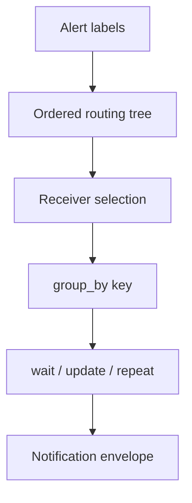
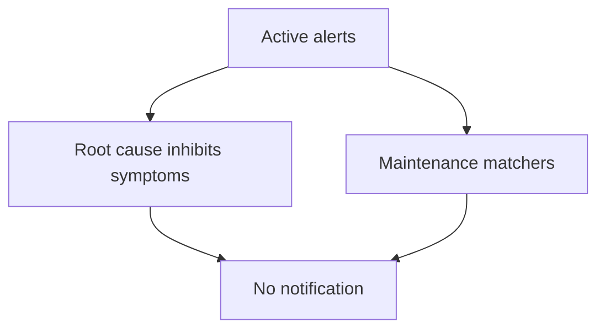

# Lab 14: Alertmanager Routing and Grouping

## Purpose and Scope

> **Primary objective:** Prove how Alertmanager turns labeled firing alerts into receiver-specific notification groups, and distinguish route matching from `group_wait`, `group_interval`, and `repeat_interval` timing.

Prometheus detects conditions. Alertmanager applies notification policy:

```text
firing alerts -> routing tree -> receiver + group key -> timers -> notification
```

You will build a lab-specific routing tree, validate it offline, test receivers with `amtool`, run Alertmanager with the alternate file, inject bounded synthetic alerts through API v2, prove first-match and `continue` behavior, observe grouping across instances, measure notification timers, inspect the webhook delivery envelope, resolve test alerts, and restore a clean state.

---

## 14.1 Inherited State From Lab 13

Expected running services:

```text
alertmanager
app
db
grafana
node-exporter
prometheus
redis
```

Expected alert rule:

```text
config/prometheus/rules/lab13.yml
```

The Lab 13 alert should be inactive. The baseline Alertmanager configuration is still mounted.

---

## 14.2 Explicit Scope and Exclusions

This lab covers:

- root and child routes;
- label matchers;
- route order and first-match behavior;
- `continue: true` fan-out;
- inherited route settings;
- receiver selection;
- group keys and `group_by`;
- initial, update, and repeat notification timers;
- notification deduplication;
- resolved notifications;
- offline route tests;
- Alertmanager API v2 inspection; and
- webhook envelope evidence.

This lab does not cover:

- inhibition;
- silences or maintenance windows;
- real email/chat/on-call provider credentials;
- Go notification templates;
- HA peer gossip and cross-replica deduplication;
- notification retry backoff internals;
- Grafana-managed Alertmanager; or
- SLO-derived paging policy.

Inhibition and silences are Lab 15.

---

## 14.3 Prerequisites

```bash
pwd
test -f .env
test -f labs/Lab-13.md
test -f labs/Lab-14.md
test -f config/alertmanager/alertmanager.yml
test -f config/prometheus/rules/lab13.yml

docker version
docker compose version
docker compose config --quiet
curl --version
jq --version
git --version
```

The app image must include the lab webhook evidence fields `notification.receiver`, `notification.group_key`, and `received_at_unix_ns`. A repository built from this guide already includes them.

---

## 14.4 Learning Objectives

By the end of Lab 14, you must be able to:

- separate Prometheus rule evaluation from Alertmanager notification policy;
- explain why the top-level route cannot have matchers;
- trace an alert through ordered child routes;
- explain default first-match behavior;
- use `continue: true` intentionally for multiple receivers;
- distinguish labels used for routing from annotations used for context;
- validate Alertmanager YAML with `amtool check-config`;
- test receiver outcomes with `amtool config routes test`;
- explain setting inheritance from parent to child routes;
- define a notification group key with `group_by`;
- explain why instance is often excluded from grouping;
- explain the risks of grouping by too few or too many labels;
- distinguish `group_wait`, `group_interval`, and `repeat_interval`;
- explain why repeat interval should align with group interval;
- inject synthetic alerts only for controlled integration testing;
- inspect active alerts and groups through API v2;
- prove two instances share one notification envelope;
- prove a new alert waits for the group-update interval;
- observe an unchanged group's repeat notification;
- prove a short-lived alert can resolve during `group_wait` without notifying;
- inspect firing and resolved webhook payloads;
- resolve synthetic alerts without waiting for expiry;
- monitor notification delivery failures;
- identify the self-dependency risk of sending app-down alerts to the app;
- preserve a source-controlled route test artifact; and
- explain why suppression policy belongs in Lab 15.

---

## 14.5 Routing and Grouping Flow



Routing selects destinations. Grouping selects which alerts share a notification. Timers select when that notification is sent.

---

## 14.6 Load the Environment

```bash
set -a
source .env
set +a

LAB_HTTP_HOST="${BIND_ADDRESS:-127.0.0.1}"
if [[ "$LAB_HTTP_HOST" == "0.0.0.0" || "$LAB_HTTP_HOST" == "::" ]]; then
  LAB_HTTP_HOST=127.0.0.1
fi

export APP_URL="http://$LAB_HTTP_HOST:${APP_HOST_PORT:-8000}"
export PROMETHEUS_URL="http://$LAB_HTTP_HOST:${PROMETHEUS_HOST_PORT:-9090}"
export ALERTMANAGER_URL="http://$LAB_HTTP_HOST:${ALERTMANAGER_HOST_PORT:-9093}"
export LAB14_NOTEBOOK="lab-notes/Lab-14.md"

mkdir -p lab-notes
test -f "$LAB14_NOTEBOOK" || printf '# Lab 14 Evidence\n\n' > "$LAB14_NOTEBOOK"
printf 'Started: %s\n' "$(date -u +%FT%TZ)" | tee -a "$LAB14_NOTEBOOK"
```

---

## 14.7 Define Inspection Helpers

```bash
am_alerts() {
  curl -fsS "$ALERTMANAGER_URL/api/v2/alerts"
}

am_groups() {
  curl -fsS "$ALERTMANAGER_URL/api/v2/alerts/groups"
}

webhook_history() {
  curl -fsS "$APP_URL/api/v1/lab/alerts"
}

lab14_history() {
  webhook_history |
    jq '[.alerts[] | select(.labels.lab == "14")]'
}
```

---

## 14.8 Reconcile the Baseline State

```bash
APP_OTEL_ENABLED=false docker compose up -d db redis app
docker compose up -d --no-deps prometheus node-exporter grafana alertmanager
docker compose stop otel-collector loki tempo

for attempt in {1..30}; do
  if curl -fsS "$APP_URL/health/ready" |
       jq -e '.status == "ready"' >/dev/null &&
     curl -fsS "$PROMETHEUS_URL/-/ready" | grep -q Ready &&
     curl -fsS "$ALERTMANAGER_URL/-/ready" >/dev/null; then
    break
  fi
  sleep 2
done

curl -fsS "$ALERTMANAGER_URL/api/v2/status" |
  jq '{version: .versionInfo.version, uptime, cluster: .cluster.status}' |
  tee -a "$LAB14_NOTEBOOK"
```

---

## 14.9 Create a Routing Branch

```bash
git status --short
if ! git diff --quiet || ! git diff --cached --quiet; then
  echo "Checkpoint tracked changes before Lab 14" >&2
  exit 1
fi

if git show-ref --verify --quiet refs/heads/lab-14-alert-routing; then
  git switch lab-14-alert-routing
else
  git switch -c lab-14-alert-routing
fi
```

---

## 14.10 Inventory the Baseline Route

```bash
sed -n '1,240p' config/alertmanager/alertmanager.yml |
  tee -a "$LAB14_NOTEBOOK"

docker compose exec -T alertmanager \
  amtool check-config /etc/alertmanager/alertmanager.yml
```

Identify:

- root receiver;
- root `group_by`;
- child order;
- default `continue` behavior;
- receiver endpoints;
- resolved-notification policy; and
- the existing app-down self-dependency safeguard.

---

## 14.11 Route Evaluation Model

Every alert starts at the root route. The root route must match all alerts and therefore cannot define matchers. Alertmanager then evaluates child routes in listed order.

```text
matching child + continue false -> stop sibling evaluation
matching child + continue true  -> also evaluate later siblings
no matching child               -> use current/root receiver
```

Nested children are evaluated after their parent matches.

---

## 14.12 Define the Lab Routing Contract

| Alert labels | Expected receiver(s) |
|---|---|
| `team=platform,severity=warning` | `lab14-platform` |
| `team=application,severity=warning` | `lab14-application` |
| `team=platform,severity=critical` | `lab14-critical-audit`, then `lab14-platform` |
| `team=application,severity=critical` | `lab14-critical-audit`, then `lab14-application` |
| `severity=info` | `lab14-audit` |
| no recognized team/severity | `lab14-default` |

Critical audit fan-out is deliberate and uses `continue: true`. Do not use `continue` accidentally; it can duplicate pages.

---

## 14.13 Create the Lab 14 Configuration

```bash
tee config/alertmanager/lab14-routing.yml >/dev/null <<'YAML'
global:
  resolve_timeout: 1m

route:
  receiver: lab14-default
  group_by: ["alertname", "service", "severity"]
  group_wait: 10s
  group_interval: 20s
  repeat_interval: 1m
  routes:
    - receiver: lab14-critical-audit
      matchers:
        - severity="critical"
      continue: true

    - receiver: lab14-audit
      matchers:
        - severity="info"

    - receiver: lab14-platform
      matchers:
        - team="platform"

    - receiver: lab14-application
      matchers:
        - team="application"

receivers:
  - name: lab14-default
    webhook_configs:
      - url: http://app:8000/internal/alertmanager/webhook
        send_resolved: true
        max_alerts: 20

  - name: lab14-critical-audit
    webhook_configs:
      - url: http://app:8000/internal/alertmanager/webhook
        send_resolved: true
        max_alerts: 20

  - name: lab14-audit
    webhook_configs:
      - url: http://app:8000/internal/alertmanager/webhook
        send_resolved: true
        max_alerts: 20

  - name: lab14-platform
    webhook_configs:
      - url: http://app:8000/internal/alertmanager/webhook
        send_resolved: true
        max_alerts: 20

  - name: lab14-application
    webhook_configs:
      - url: http://app:8000/internal/alertmanager/webhook
        send_resolved: true
        max_alerts: 20
YAML
```

The receivers share one evidence endpoint only for this lab. Real receivers would be independently owned integrations.

---

## 14.14 Validate the Configuration Offline

```bash
docker run --rm \
  --entrypoint /bin/amtool \
  -v "$PWD/config/alertmanager:/work:ro" \
  prom/alertmanager:v0.34.0 \
  check-config /work/lab14-routing.yml |
  tee -a "$LAB14_NOTEBOOK"
```

Validation checks syntax, receiver references, and configuration structure. It does not send notifications or prove policy intent.

---

## 14.15 Test the Routing Tree Offline

```bash
amtool_image='prom/alertmanager:v0.34.0'

docker run --rm \
  --entrypoint /bin/amtool \
  -v "$PWD/config/alertmanager:/work:ro" \
  "$amtool_image" \
  config routes test \
  --config.file=/work/lab14-routing.yml \
  --tree \
  --verify.receivers=lab14-platform \
  alertname=Lab14Test service=orders-api team=platform severity=warning

docker run --rm \
  --entrypoint /bin/amtool \
  -v "$PWD/config/alertmanager:/work:ro" \
  "$amtool_image" \
  config routes test \
  --config.file=/work/lab14-routing.yml \
  --tree \
  --verify.receivers=lab14-application \
  alertname=Lab14Test service=orders-api team=application severity=warning
```

---

## 14.16 Test `continue: true` Fan-Out

```bash
docker run --rm \
  --entrypoint /bin/amtool \
  -v "$PWD/config/alertmanager:/work:ro" \
  prom/alertmanager:v0.34.0 \
  config routes test \
  --config.file=/work/lab14-routing.yml \
  --tree \
  --verify.receivers=lab14-critical-audit,lab14-platform \
  alertname=Lab14Test service=orders-api team=platform severity=critical
```

The critical route matches, selects the audit receiver, and continues to the later team route.

---

## 14.17 Test First-Match Ordering and Fallback

```bash
docker run --rm \
  --entrypoint /bin/amtool \
  -v "$PWD/config/alertmanager:/work:ro" \
  prom/alertmanager:v0.34.0 \
  config routes test \
  --config.file=/work/lab14-routing.yml \
  --verify.receivers=lab14-audit \
  alertname=Lab14Test service=orders-api team=platform severity=info

docker run --rm \
  --entrypoint /bin/amtool \
  -v "$PWD/config/alertmanager:/work:ro" \
  prom/alertmanager:v0.34.0 \
  config routes test \
  --config.file=/work/lab14-routing.yml \
  --verify.receivers=lab14-default \
  alertname=Lab14Test service=orders-api team=unknown severity=notice
```

The info route precedes the platform route and stops sibling evaluation. Unmatched alerts inherit the root receiver.

---

## 14.18 Inspect the Route Tree

```bash
docker run --rm \
  --entrypoint /bin/amtool \
  -v "$PWD/config/alertmanager:/work:ro" \
  prom/alertmanager:v0.34.0 \
  config routes show \
  --config.file=/work/lab14-routing.yml |
  tee -a "$LAB14_NOTEBOOK"
```

Route tests validate receiver selection, not grouping behavior or inhibition.

---

## 14.19 Start Alertmanager With the Alternate File

The Compose file supports an explicit configuration filename:

```bash
ALERTMANAGER_CONFIG_FILE=lab14-routing.yml \
  docker compose up -d --force-recreate --no-deps alertmanager

for attempt in {1..30}; do
  curl -fsS "$ALERTMANAGER_URL/-/ready" >/dev/null && break
  sleep 2
done

curl -fsS "$ALERTMANAGER_URL/-/ready" >/dev/null
```

---

## 14.20 Prove Which Configuration Is Live

```bash
curl -fsS "$ALERTMANAGER_URL/api/v2/status" \
  > /tmp/lab14-status.json

jq -e '
  .versionInfo.version == "0.34.0"
  and (.config.original | contains("lab14-critical-audit"))
  and (.config.original | contains("group_wait: 10s"))
' /tmp/lab14-status.json

jq '{
  version: .versionInfo.version,
  uptime,
  cluster: .cluster.status,
  config_contains_lab14: (.config.original | contains("lab14-platform"))
}' /tmp/lab14-status.json | tee -a "$LAB14_NOTEBOOK"
```

The source file on disk and live in-memory configuration are separate states; verify both.

---

## 14.21 Clear the Evidence Sink

```bash
curl -fsS -X DELETE "$APP_URL/api/v1/lab/alerts" |
  jq | tee -a "$LAB14_NOTEBOOK"
```

Existing non-lab alerts may continue arriving. Every query below filters `labels.lab == "14"`.

---

## 14.22 Define Synthetic Alert Helpers

Direct API injection is appropriate for this bounded routing integration test. Production alert generation should come from Prometheus rules.

```bash
post_lab14_alert() {
  local alertname="$1"
  local team="$2"
  local severity="$3"
  local instance="$4"
  local lifetime_seconds="${5:-300}"
  local starts_at ends_at

  starts_at="$(date -u +%Y-%m-%dT%H:%M:%SZ)"
  ends_at="$(
    date -u -d "+${lifetime_seconds} seconds" +%Y-%m-%dT%H:%M:%SZ
  )"

  jq -n \
    --arg alertname "$alertname" \
    --arg team "$team" \
    --arg severity "$severity" \
    --arg instance "$instance" \
    --arg startsAt "$starts_at" \
    --arg endsAt "$ends_at" \
    '[{
      labels: {
        alertname: $alertname,
        team: $team,
        severity: $severity,
        service: "orders-api",
        environment: "lab",
        instance: $instance,
        lab: "14"
      },
      annotations: {
        summary: ("Lab 14 synthetic alert " + $alertname),
        description: "Controlled routing and grouping experiment"
      },
      startsAt: $startsAt,
      endsAt: $endsAt,
      generatorURL: "https://example.invalid/labs/14"
    }]'
  
  jq -n \
    --arg alertname "$alertname" \
    --arg team "$team" \
    --arg severity "$severity" \
    --arg instance "$instance" \
    --arg startsAt "$starts_at" \
    --arg endsAt "$ends_at" \
    '[{
      labels: {
        alertname: $alertname,
        team: $team,
        severity: $severity,
        service: "orders-api",
        environment: "lab",
        instance: $instance,
        lab: "14"
      },
      annotations: {
        summary: ("Lab 14 synthetic alert " + $alertname),
        description: "Controlled routing and grouping experiment"
      },
      startsAt: $startsAt,
      endsAt: $endsAt,
      generatorURL: "https://example.invalid/labs/14"
    }]' |
    curl -fsS \
      -H 'Content-Type: application/json' \
      -X POST "$ALERTMANAGER_URL/api/v2/alerts" \
      --data-binary @-
}

resolve_lab14_alert() {
  local alertname="$1"
  local team="$2"
  local severity="$3"
  local instance="$4"
  local starts_at ends_at

  starts_at="$(date -u -d '-1 minute' +%Y-%m-%dT%H:%M:%SZ)"
  ends_at="$(date -u +%Y-%m-%dT%H:%M:%SZ)"

  jq -n \
    --arg alertname "$alertname" \
    --arg team "$team" \
    --arg severity "$severity" \
    --arg instance "$instance" \
    --arg startsAt "$starts_at" \
    --arg endsAt "$ends_at" \
    '[{
      labels: {
        alertname: $alertname,
        team: $team,
        severity: $severity,
        service: "orders-api",
        environment: "lab",
        instance: $instance,
        lab: "14"
      },
      annotations: {summary: "Lab 14 resolved"},
      startsAt: $startsAt,
      endsAt: $endsAt,
      generatorURL: "https://example.invalid/labs/14"
    }]' |
    curl -fsS \
      -H 'Content-Type: application/json' \
      -X POST "$ALERTMANAGER_URL/api/v2/alerts" \
      --data-binary @-
}
```

The first `jq` command inside `post_lab14_alert` prints the exact payload for notebook inspection; the second sends the same payload.

---

## 14.23 Prediction Checkpoint — First Notification

Before posting, predict:

- selected receiver;
- group labels;
- whether `instance` enters the group key;
- earliest notification time; and
- whether two instances posted within ten seconds share one envelope.

---

## 14.24 Post Two Alerts Into One Group

```bash
group_posted_ns="$(date -u +%s%N)"

post_lab14_alert Lab14GroupedWarning platform warning app-a 300 \
  | tee -a "$LAB14_NOTEBOOK"
post_lab14_alert Lab14GroupedWarning platform warning app-b 300 \
  | tee -a "$LAB14_NOTEBOOK"
```

The alerts differ only by `instance`. Because instance is not in `group_by`, they should share a notification group.

---

## 14.25 Inspect Active Alerts Before Notification

```bash
am_alerts |
  jq '[
    .[]
    | select(
        .labels.lab == "14"
        and .labels.alertname == "Lab14GroupedWarning"
      )
    | {
        labels,
        startsAt,
        endsAt,
        status,
        receivers
      }
  ]' | tee -a "$LAB14_NOTEBOOK"
```

Alert ingestion and notification delivery are different. The API can show active alerts during `group_wait` before the webhook receives anything.

---

## 14.26 Wait for the First Grouped Delivery

```bash
grouped_seen=false
for attempt in {1..12}; do
  grouped_count="$(
    lab14_history |
      jq '[
        .[]
        | select(.labels.alertname == "Lab14GroupedWarning")
      ] | length'
  )"
  if (( grouped_count >= 2 )); then
    grouped_seen=true
    break
  fi
  sleep 3
done

test "$grouped_seen" = true

lab14_history > /tmp/lab14-history-first.json
jq '[
  .[]
  | select(.labels.alertname == "Lab14GroupedWarning")
  | {
      instance: .labels.instance,
      receiver: .notification.receiver,
      group_key: .notification.group_key,
      group_labels: .notification.group_labels,
      received_at_unix_ns
    }
]' /tmp/lab14-history-first.json | tee -a "$LAB14_NOTEBOOK"
```

---

## 14.27 Prove One Notification Envelope Contained Both Alerts

```bash
jq -e '
  [
    .[]
    | select(.labels.alertname == "Lab14GroupedWarning")
  ] as $alerts
  | ($alerts | length) >= 2
  and ([$alerts[].labels.instance] | unique | length) == 2
  and ([$alerts[].notification.receiver] | unique) == ["lab14-platform"]
  and ([$alerts[].notification.group_key] | unique | length) == 1
  and ([$alerts[].received_at_unix_ns] | unique | length) == 1
' /tmp/lab14-history-first.json
```

The app assigns one receipt timestamp to every alert in the same webhook POST. Shared timestamp plus shared group key proves one envelope.

---

## 14.28 Measure `group_wait`

```bash
first_received_ns="$(
  jq -r '
    [
      .[]
      | select(.labels.alertname == "Lab14GroupedWarning")
      | .received_at_unix_ns
    ]
    | min
  ' /tmp/lab14-history-first.json
)"

jq -n \
  --argjson posted "$group_posted_ns" \
  --argjson received "$first_received_ns" \
  '{group_wait_observed_seconds: (($received - $posted) / 1000000000)}' |
  tee -a "$LAB14_NOTEBOOK"
```

Expect approximately ten seconds plus scheduler/network overhead. Do not demand nanosecond precision from an asynchronous notification system.

---

## 14.29 Inspect Alert Groups Through API v2

```bash
am_groups |
  jq '[
    .[]
    | select(
        any(
          .alerts[];
          .labels.lab == "14"
          and .labels.alertname == "Lab14GroupedWarning"
        )
      )
    | {
        labels,
        receiver,
        alert_count: (.alerts | length),
        instances: [.alerts[].labels.instance],
        group_labels: .groupLabels,
        route_labels: .routeLabels
      }
  ]' | tee -a "$LAB14_NOTEBOOK"
```

API fields may gain additions; inspect the pinned version rather than scripting against undocumented assumptions.

---

## 14.30 `group_by` Controls Notification Identity

Current group key dimensions:

```text
alertname
service
severity
```

Consequences:

- instances of the same symptom group together;
- warning and critical remain separate;
- different services remain separate; and
- different alert names remain separate.

If `instance` were included, every target could page independently. If only `service` were included, unrelated symptoms could become one unreadable notification.

---

## 14.31 Why `group_by: ['...']` Is Dangerous

The special value `...` groups by all labels, effectively preventing useful aggregation when instance/pod/replica labels differ. Use it only when every distinct alert identity must notify separately.

Group labels are an operational design decision, not a copy of every alert label.

---

## 14.32 Prediction Checkpoint — Group Update

After the first notification, a new alert joining the same group should not notify immediately. It waits until the next `group_interval` opportunity.

Predict the earliest and latest likely delivery time before posting instance `app-c`.

---

## 14.33 Post a New Alert Into the Existing Group

```bash
update_posted_ns="$(date -u +%s%N)"
post_lab14_alert Lab14GroupedWarning platform warning app-c 300 \
  | tee -a "$LAB14_NOTEBOOK"

initial_c_count="$(
  lab14_history |
    jq '[
      .[]
      | select(
          .labels.alertname == "Lab14GroupedWarning"
          and .labels.instance == "app-c"
        )
    ] | length'
)"
test "$initial_c_count" = "0"
```

---

## 14.34 Observe `group_interval`

```bash
update_seen=false
for attempt in {1..15}; do
  c_received_ns="$(
    lab14_history |
      jq -r '[
        .[]
        | select(
            .labels.alertname == "Lab14GroupedWarning"
            and .labels.instance == "app-c"
          )
        | .received_at_unix_ns
      ] | min // empty'
  )"

  if [[ -n "$c_received_ns" ]]; then
    update_seen=true
    break
  fi
  sleep 3
done

test "$update_seen" = true

jq -n \
  --argjson posted "$update_posted_ns" \
  --argjson received "$c_received_ns" \
  '{group_update_delay_seconds: (($received - $posted) / 1000000000)}' |
  tee -a "$LAB14_NOTEBOOK"
```

`group_interval` is measured relative to group notification scheduling, not simply as a per-alert sleep.

---

## 14.35 Observe `repeat_interval`

Record distinct delivery timestamps for one unchanged instance:

```bash
before_repeat="$(
  lab14_history |
    jq '[
      .[]
      | select(
          .labels.alertname == "Lab14GroupedWarning"
          and .labels.instance == "app-a"
        )
      | .received_at_unix_ns
    ] | unique | length'
)"

repeat_seen=false
for attempt in {1..24}; do
  after_repeat="$(
    lab14_history |
      jq '[
        .[]
        | select(
            .labels.alertname == "Lab14GroupedWarning"
            and .labels.instance == "app-a"
          )
        | .received_at_unix_ns
      ] | unique | length'
  )"
  if (( after_repeat > before_repeat )); then
    repeat_seen=true
    break
  fi
  sleep 5
done

test "$repeat_seen" = true
printf 'Distinct app-a deliveries before=%s after=%s\n' \
  "$before_repeat" "$after_repeat" |
  tee -a "$LAB14_NOTEBOOK"
```

The one-minute repeat is checked on group-interval boundaries. Production repeat intervals are usually much longer and aligned with escalation policy.

---

## 14.36 Distinguish the Three Timers

| Timer | Starts/controls | Lab value |
|---|---|---:|
| `group_wait` | Delay before first notification for a new group | 10s |
| `group_interval` | Minimum scheduling interval before notifying changes to an existing group | 20s |
| `repeat_interval` | Time before resending an unchanged still-firing group | 1m |

If an alert resolves before `group_wait`, no notification may be sent. If a new alert arrives after the first send, it waits for group update. If nothing changes, repeat timing governs reminders.

---

## 14.37 Test Critical Fan-Out Live

```bash
post_lab14_alert Lab14CriticalFanout platform critical platform-a 180 \
  | tee -a "$LAB14_NOTEBOOK"

fanout_seen=false
for attempt in {1..15}; do
  receivers="$(
    lab14_history |
      jq -r '[
        .[]
        | select(.labels.alertname == "Lab14CriticalFanout")
        | .notification.receiver
      ] | unique | sort | join(",")'
  )"
  if [[ "$receivers" == "lab14-critical-audit,lab14-platform" ]]; then
    fanout_seen=true
    break
  fi
  sleep 3
done

test "$fanout_seen" = true
printf 'Critical receivers: %s\n' "$receivers" |
  tee -a "$LAB14_NOTEBOOK"
```

One alert produces two independently timed receiver groups because `continue: true` allows both routes.

---

## 14.38 Test First-Match Order Live

```bash
post_lab14_alert Lab14InfoOrder platform info platform-info 180 \
  | tee -a "$LAB14_NOTEBOOK"

info_seen=false
for attempt in {1..12}; do
  info_receivers="$(
    lab14_history |
      jq -r '[
        .[]
        | select(.labels.alertname == "Lab14InfoOrder")
        | .notification.receiver
      ] | unique | sort | join(",")'
  )"
  if [[ "$info_receivers" == "lab14-audit" ]]; then
    info_seen=true
    break
  fi
  sleep 3
done

test "$info_seen" = true
```

Although `team=platform`, the earlier info route matches first and stops because `continue` defaults to false.

---

## 14.39 Test Root Fallback Live

```bash
post_lab14_alert Lab14Fallback unknown notice mystery-a 180 \
  | tee -a "$LAB14_NOTEBOOK"

fallback_seen=false
for attempt in {1..12}; do
  fallback_receiver="$(
    lab14_history |
      jq -r '[
        .[]
        | select(.labels.alertname == "Lab14Fallback")
        | .notification.receiver
      ][0] // empty'
  )"
  if [[ "$fallback_receiver" == "lab14-default" ]]; then
    fallback_seen=true
    break
  fi
  sleep 3
done

test "$fallback_seen" = true
```

A root receiver prevents unmatched alerts from being silently dropped. In production it should route to a monitored triage destination.

---

## 14.40 Test Resolution During `group_wait`

Post an alert that expires in five seconds, shorter than the ten-second initial wait:

```bash
post_lab14_alert Lab14ShortLived application warning short-a 5 \
  | tee -a "$LAB14_NOTEBOOK"
sleep 15

short_notifications="$(
  lab14_history |
    jq '[.[] | select(.labels.alertname == "Lab14ShortLived")] | length'
)"

test "$short_notifications" = "0"
printf 'Short-lived notification count: %s\n' "$short_notifications" |
  tee -a "$LAB14_NOTEBOOK"
```

This is one purpose of `group_wait`: allow an inhibiting/root-cause alert to arrive and avoid notifying on a condition that disappears immediately.

---

## 14.41 Inspect the Webhook Envelope

```bash
lab14_history |
  jq '[
    .[]
    | {
        alertname: .labels.alertname,
        instance: .labels.instance,
        alert_status: .status,
        receiver: .notification.receiver,
        notification_status: .notification.notification_status,
        group_key: .notification.group_key,
        group_labels: .notification.group_labels,
        common_labels: .notification.common_labels,
        truncated: .notification.truncated_alerts,
        received_at_unix_ns
      }
  ]' | tee -a "$LAB14_NOTEBOOK"
```

The envelope's `receiver`, `groupKey`, group/common labels, overall status, and alert list are notification-level data. They are not part of each Prometheus alert's identity.

---

## 14.42 Resolve All Long-Lived Lab Alerts

```bash
for instance in app-a app-b app-c; do
  resolve_lab14_alert Lab14GroupedWarning platform warning "$instance"
done

resolve_lab14_alert Lab14CriticalFanout platform critical platform-a
resolve_lab14_alert Lab14InfoOrder platform info platform-info
resolve_lab14_alert Lab14Fallback unknown notice mystery-a
```

Posting the same label set with an expired/current `endsAt` updates the same fingerprint to resolved.

---

## 14.43 Observe Resolved Notifications

```bash
resolved_seen=false
for attempt in {1..24}; do
  resolved_count="$(
    lab14_history |
      jq '[
        .[]
        | select(
            .notification.notification_status == "resolved"
            or .status == "resolved"
          )
      ] | length'
  )"
  if (( resolved_count >= 1 )); then
    resolved_seen=true
    break
  fi
  sleep 5
done

test "$resolved_seen" = true
printf 'Resolved webhook records: %s\n' "$resolved_count" |
  tee -a "$LAB14_NOTEBOOK"
```

`send_resolved: true` controls receiver notification. It does not control when the upstream alert condition resolves.

---

## 14.44 Verify Active Lab Alerts Are Gone

```bash
for attempt in {1..20}; do
  active_lab14="$(
    am_alerts |
      jq '[
        .[]
        | select(.labels.lab == "14" and .status.state == "active")
      ] | length'
  )"
  [[ "$active_lab14" == "0" ]] && break
  sleep 3
done

test "$active_lab14" = "0"
```

---

## 14.45 Inspect Notification Self-Metrics

```bash
for expression in \
  'sum by (integration) (rate(alertmanager_notifications_total[5m]))' \
  'sum by (integration) (rate(alertmanager_notifications_failed_total[5m]))' \
  'alertmanager_alerts{state=~"active|suppressed"}' \
  'alertmanager_notification_requests_total'; do
  printf '\nExpression: %s\n' "$expression" | tee -a "$LAB14_NOTEBOOK"
  curl -fsS "$PROMETHEUS_URL/api/v1/query" \
    --data-urlencode "query=$expression" |
    jq '.data.result' | tee -a "$LAB14_NOTEBOOK"
done
```

Not every self-metric is guaranteed across versions. Inventory `/metrics` on the pinned Alertmanager if a name is absent.

---

## 14.46 Receiver Self-Dependency Review

The lab sends notifications to the Orders API. If the Orders API itself is down:

```text
alert condition fires -> Alertmanager tries app webhook -> app unavailable -> delivery fails
```

The baseline configuration routes `OrdersApiDown` to a non-webhook receiver to avoid that circular dependency. Production paging must live in an independent failure domain.

---

## 14.47 Grouping Tradeoff Matrix

| Strategy | Benefit | Risk |
|---|---|---|
| Group by service + symptom | One incident-oriented notification | Can hide instance count without good template |
| Group by instance | Precise per-target notification | Page storm during fleet failure |
| Group by severity | Preserves urgency separation | Unrelated symptoms may combine if too broad |
| Group by all labels | Maximum separation | Almost no deduplication/grouping |
| Group by too few labels | Fewer messages | Huge, incoherent notifications |

Templates should expose count and representative labels when instances are grouped.

---

## 14.48 Timing Tradeoff Matrix

| Setting too short | Consequence |
|---|---|
| `group_wait` | Root cause/inhibitor may arrive after symptom notifications |
| `group_interval` | Frequent updates during a changing incident |
| `repeat_interval` | Reminder/page fatigue |

| Setting too long | Consequence |
|---|---|
| `group_wait` | Urgent first notification delayed |
| `group_interval` | New important alerts delayed |
| `repeat_interval` | Unacknowledged incident reminders delayed |

Values must follow urgency and escalation policy, not generic internet defaults.

---

## 14.49 Validate Live Reload Behavior

The alternate file is mounted read-only into the container. Validate before any reload:

```bash
docker compose exec -T alertmanager \
  amtool check-config /etc/alertmanager/alertmanager.yml

reload_code="$(
  curl -sS -o /tmp/lab14-reload.txt \
    -w '%{http_code}' \
    -X POST "$ALERTMANAGER_URL/-/reload"
)"
test "$reload_code" = "200"
```

Alertmanager rejects malformed reloads and keeps the previous valid configuration. Use validation as a pre-deployment gate, not as the only policy test.

---

## 14.50 Commit the Routing Artifact

```bash
git status --short
git diff --check

docker run --rm \
  --entrypoint /bin/amtool \
  -v "$PWD/config/alertmanager:/work:ro" \
  prom/alertmanager:v0.34.0 \
  check-config /work/lab14-routing.yml

git add config/alertmanager/lab14-routing.yml
git commit -m "lab 14: add tested routing and grouping policy"
git status --short
```

---

## 14.51 Troubleshooting — Alternate File Is Not Live

Check:

- `ALERTMANAGER_CONFIG_FILE=lab14-routing.yml` was supplied to `docker compose up`;
- container was force-recreated;
- filename exists under `config/alertmanager`;
- resolved Compose mount with `docker compose config`;
- container logs;
- `/api/v2/status` live configuration; and
- no second Alertmanager owns the host port.

---

## 14.52 Troubleshooting — Route Test Returns Wrong Receiver

Check child order, matcher quoting, label spelling, default `continue: false`, parent/child nesting, and whether an earlier route matched. Use `--tree` and exact input labels.

---

## 14.53 Troubleshooting — Alerts Do Not Group

Compare every `group_by` label value. Different alert name, service, or severity creates a different group. Also check receiver: alerts routed to different receivers cannot share one notification group.

---

## 14.54 Troubleshooting — No Webhook Arrives

Check:

- alert appears in `/api/v2/alerts`;
- group appears in `/api/v2/alerts/groups`;
- `group_wait` has elapsed;
- receiver URL resolves from Alertmanager's container network;
- app is healthy;
- `alertmanager_notifications_failed_total`;
- Alertmanager logs; and
- history query filters `lab="14"` correctly.

---

## 14.55 Troubleshooting — Unexpected Duplicate Notifications

Check:

- matching routes with `continue: true`;
- repeated unchanged groups;
- group labels changing;
- alert labels changing/fingerprints splitting;
- Alertmanager restart/retention;
- receiver retries after ambiguous failure; and
- multiple Alertmanager replicas without expected HA behavior.

---

## 14.56 Evidence Matrix

| Evidence | What it proves |
|---|---|
| Baseline route inventory | Starting notification policy understood |
| Routing contract | Expected labels-to-receivers designed first |
| `amtool check-config` | Configuration parses |
| Route tests | First-match, fallback, and fan-out outcomes |
| Live status config | Alternate file is active |
| API alert inventory | Synthetic alerts ingested |
| Shared group key/timestamp | Two instances shared one envelope |
| `group_wait` delay | First notification timing |
| Group API | Receiver and group membership |
| New instance delay | Group-update timing |
| Repeated receipt | Unchanged-group reminder |
| Critical receiver set | `continue` fan-out |
| Info receiver | Route order/stop behavior |
| Fallback receiver | Root catch-all |
| Short-lived count zero | Resolution during initial wait |
| Resolved webhook | `send_resolved` behavior |
| Active count zero | Cleanup completed |
| Self-metrics | Delivery health |
| Git commit | Auditable policy source |

---

## 14.57 Production Implications

1. Detection and notification policy are separate systems.
2. Route using stable ownership, service, urgency, and environment labels.
3. Keep the root route matcher-free with a monitored fallback receiver.
4. Treat child order as executable policy.
5. Use `continue` only for intentional fan-out.
6. Validate receiver outcomes, not just YAML syntax.
7. Group by incident meaning rather than every target identity.
8. Preserve severity separation unless escalation policy says otherwise.
9. Choose timer values from urgency and response policy.
10. Align repeat interval with group scheduling.
11. Monitor delivery success and failure independently from alert state.
12. Keep notification receivers outside the monitored service's failure domain.
13. Protect Alertmanager write APIs and management endpoints.
14. Use synthetic API alerts only for controlled integration testing.
15. Test firing, update, repeat, resolution, and fallback paths before production.

---

## 14.58 Knowledge Check

Answer before reading the key:

1. Which system detects the metric condition?
2. Which system applies notification policy?
3. Why can the root route not have matchers?
4. In what order are child routes evaluated?
5. What is default `continue` behavior?
6. What does `continue: true` do?
7. Why can it cause duplicate pages?
8. Which labels route a platform warning?
9. Why does a platform info alert go to audit only?
10. What happens to an unmatched alert?
11. What does `amtool check-config` prove?
12. What does `config routes test` prove?
13. What does it not test?
14. What labels form the Lab 14 group key?
15. Why is instance excluded?
16. Can alerts routed to different receivers share one notification group?
17. What does `group_wait` control?
18. What does `group_interval` control?
19. What does `repeat_interval` control?
20. Why should repeat align with group interval?
21. Why did two instances share one webhook envelope?
22. What proves they shared one envelope?
23. Why did the five-second alert not notify?
24. What does `send_resolved` control?
25. Does it resolve the Prometheus condition?
26. Why is `group_by: ['...']` usually risky?
27. Why is the app webhook a self-dependency?
28. Why filter evidence by `lab="14"`?
29. Why are synthetic API alerts not the production design?
30. What does Lab 15 add?

---

## 14.59 Knowledge Check Answers

1. Prometheus.
2. Alertmanager.
3. Every alert must enter the routing tree.
4. In listed order after the parent matches.
5. Stop after the first matching sibling route.
6. Continues evaluating later sibling routes after a match.
7. One alert can be delivered to several receivers.
8. `team=platform` after critical/info routes are considered.
9. The earlier info route matches and stops sibling evaluation.
10. It uses the root receiver.
11. Syntax, references, and structural validity.
12. Expected receiver selection for one supplied label set.
13. Grouping, inhibition, delivery, retry, and timing behavior.
14. Alert name, service, and severity.
15. Replicas of one symptom should be summarized rather than page separately.
16. No.
17. Delay before the first notification for a new group.
18. Scheduling interval before notification about group changes.
19. Time before resending an unchanged firing group.
20. Repeats are checked on group-interval boundaries.
21. They differed only in a label omitted from `group_by` and shared receiver.
22. Same group key and common webhook receipt timestamp.
23. It resolved before the ten-second initial group wait elapsed.
24. Whether a receiver gets a resolved notification.
25. No.
26. It groups by every differing label and defeats useful aggregation.
27. It cannot receive notifications when the app itself is down.
28. Other intentionally stopped backends can generate unrelated baseline alerts.
29. Prometheus rules handle state, persistence, resend, and recovery semantics.
30. Inhibition, silences, maintenance-window governance, and suppression evidence.

---

## 14.60 Professional Scenarios

### Scenario A — Every pod sends a page

`instance` or `pod` is included in `group_by`. Group around service/symptom/urgency and expose affected-instance count in the notification template.

### Scenario B — Critical alert reaches audit but not on-call

The critical route matches first but lacks `continue: true`, so later ownership routes are never evaluated. Test exact receiver sets in CI.

### Scenario C — App-down page never arrives

The receiver is hosted by the failing application. Route hard-down alerts to an independent notification system and monitor that delivery path.

---

## 14.61 Required Lab Notebook

Include:

- UTC start and finish times;
- baseline version, uptime, and route inventory;
- route contract;
- Lab 14 configuration hash;
- offline validation output;
- all route-test outputs;
- live-configuration proof;
- synthetic payloads and post times;
- Alertmanager alert/group evidence;
- shared group key and receipt timestamp;
- measured first notification delay;
- measured group-update delay;
- repeat evidence;
- critical fan-out receiver set;
- first-match and fallback receiver evidence;
- short-lived alert notification count;
- webhook envelope fields;
- resolved notification evidence;
- active Lab 14 count after cleanup;
- delivery self-metrics;
- receiver self-dependency analysis;
- Git commit; and
- all 30 knowledge answers.

---

## 14.62 Completion Checklist

- [ ] Baseline Alertmanager state was healthy.
- [ ] A clean routing branch was created.
- [ ] Route outcomes were designed before YAML.
- [ ] Lab 14 config passed `amtool check-config`.
- [ ] Platform/application route tests passed.
- [ ] Critical `continue` fan-out test passed.
- [ ] Info first-match and fallback tests passed.
- [ ] The alternate file was live and verified through status API.
- [ ] Webhook history was cleared.
- [ ] Synthetic test alerts had bounded expiry.
- [ ] Two instances were active before notification.
- [ ] They shared one group key and receipt timestamp.
- [ ] Approximate `group_wait` was measured.
- [ ] Group API membership was inspected.
- [ ] A new group member waited for update scheduling.
- [ ] An unchanged group repeated.
- [ ] Critical live fan-out reached two receivers.
- [ ] Info routing stopped at the first matching route.
- [ ] Unmatched alert used the root receiver.
- [ ] A short-lived alert resolved during `group_wait` without delivery.
- [ ] Firing webhook envelopes were inspected.
- [ ] All long-lived test alerts were resolved.
- [ ] At least one resolved notification was observed.
- [ ] No active Lab 14 alerts remained.
- [ ] Delivery self-metrics were inspected.
- [ ] Receiver self-dependency was documented.
- [ ] Config was committed.
- [ ] All questions and evidence are complete.

---

## 14.63 Upstream Reference Map

- [Alertmanager configuration](https://prometheus.io/docs/alerting/latest/configuration/) — routing tree, grouping, timers, receivers, reload, and webhook payload.
- [Alertmanager concepts](https://prometheus.io/docs/alerting/latest/alertmanager/) — deduplication, grouping, routing, silences, and inhibition.
- [Alertmanager repository and `amtool`](https://github.com/prometheus/alertmanager) — route tree and receiver verification commands.
- [Alertmanager Alerts API](https://prometheus.io/docs/alerting/0.34/alerts_api/) — controlled API v2 alert injection and production guidance.
- [Alertmanager API v2 specification](https://github.com/prometheus/alertmanager/blob/main/api/v2/openapi.yaml) — alert/group/status response contracts.
- [Alertmanager notification template reference](https://prometheus.io/docs/alerting/latest/notifications/) — notification group data and receiver context.

---

## 14.64 Final State and Transition to Lab 15

Verify:

```bash
docker compose exec -T alertmanager \
  amtool check-config /etc/alertmanager/alertmanager.yml

curl -fsS "$ALERTMANAGER_URL/api/v2/status" |
  jq -e '.config.original | contains("lab14-critical-audit")'

test "$(
  am_alerts |
    jq '[.[] | select(.labels.lab == "14" and .status.state == "active")] | length'
)" = "0"

curl -fsS "$APP_URL/health/ready" | jq -e '.status == "ready"'
git status --short
```

Append final evidence:

```bash
{
  printf '\n## Final evidence\n'
  printf 'Finished: %s\n' "$(date -u +%FT%TZ)"
  printf 'Active Lab 14 alerts: 0\n'
  printf 'Live config: lab14-routing.yml\n'
} >> "$LAB14_NOTEBOOK"
```

Leave the Lab 14 Alertmanager running. Lab 15 will replace its alternate file with a suppression policy and prove that inhibition and silences mute notifications without changing upstream Prometheus evaluation:



Carry forward:

```text
route != group
group != alert identity
group_wait != group_interval
group_interval != repeat_interval
continue != escalation acknowledgement
notification received != incident owned
```
