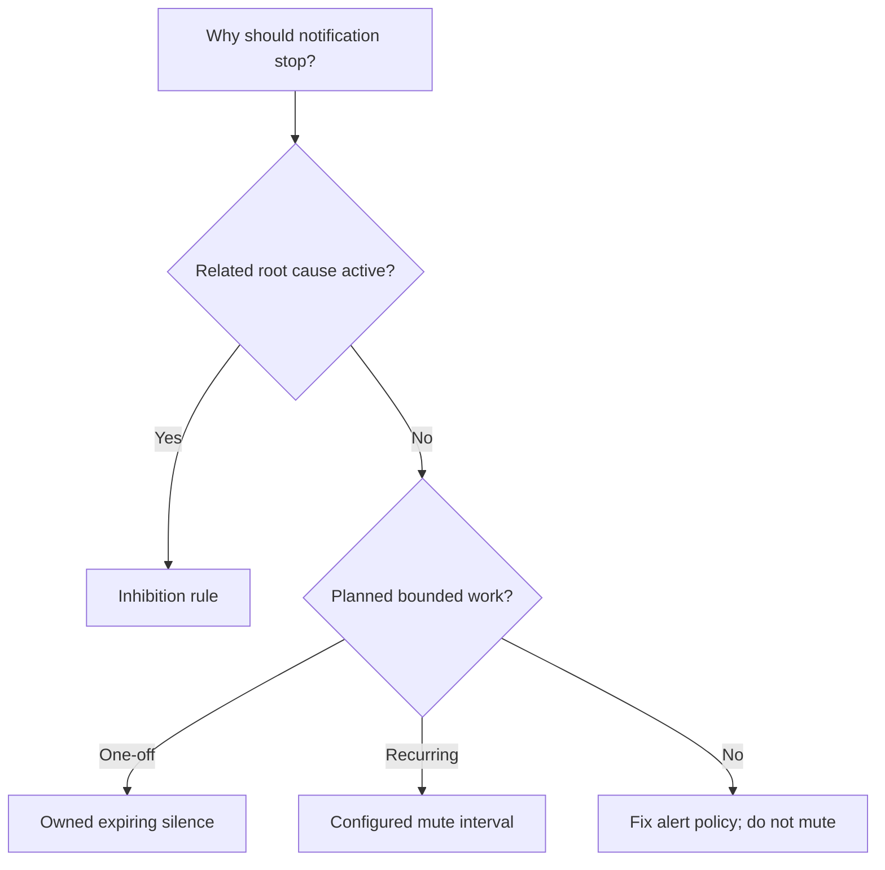
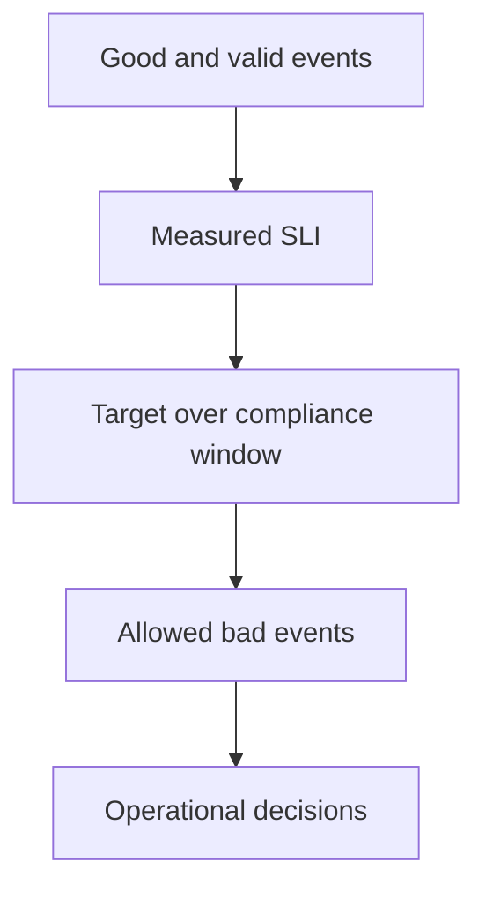

# Lab 15: Inhibition, Silences, and Maintenance

## Purpose and Scope

> **Primary objective:** Suppress symptom notifications safely while keeping root-cause and maintenance state visible, auditable, narrowly scoped, time bounded, and reversible.

Lab 14 routed and grouped alerts. Lab 15 controls notification noise without disabling detection:

```text
active alerts -> inhibition or silence match -> suppressed notification -> expiry/recovery
```

You will create a root-cause inhibition policy, prove target suppression and equality behavior, demonstrate the missing-label trap, create a governed maintenance silence through API v2, verify `inhibitedBy` and `silencedBy` evidence, prove a narrow silence does not mute another environment, expire the silence, observe notification resumption, resolve all synthetic alerts, and restore the baseline Alertmanager configuration.

---

## 15.1 Inherited State From Lab 14

Expected running services:

```text
alertmanager
app
db
grafana
node-exporter
prometheus
redis
```

Expected alternate Alertmanager source:

```text
config/alertmanager/lab14-routing.yml
```

Expected conditions:

- no active synthetic Lab 14 alerts;
- Lab 14 routing config is live;
- the local webhook preserves receiver/group evidence;
- Alertmanager's data volume persists silences; and
- Loki, Tempo, and the Collector remain stopped.

---

## 15.2 Explicit Scope and Exclusions

This lab covers:

- inhibition source and target matchers;
- equality labels;
- root-cause versus symptom design;
- active versus suppressed alert states;
- `inhibitedBy` and `silencedBy` evidence;
- exact-match silence creation through API v2;
- silence ownership, comments, start/end time, and expiry;
- notification resumption after suppression ends;
- manual maintenance workflow; and
- cleanup/restoration.

This lab does not cover:

- deleting or disabling Prometheus alert rules for maintenance;
- recurring production maintenance schedules;
- Alertmanager HA silence replication;
- Grafana silence permissions;
- external paging-provider maintenance APIs;
- time-interval timezone/DST design;
- tenant-specific authorization;
- SLO burn-rate policy; or
- automatic change-calendar integration.

Recurring `mute_time_intervals` are explained but not activated. A single VM cannot prove multi-replica silence consistency or notification-provider maintenance behavior.

---

## 15.3 Prerequisites

```bash
pwd
test -f .env
test -f labs/Lab-14.md
test -f labs/Lab-15.md
test -f config/alertmanager/alertmanager.yml
test -f config/alertmanager/lab14-routing.yml

docker version
docker compose version
docker compose config --quiet
curl --version
jq --version
git --version
date --version | head -n 1
```

The timestamp commands use GNU `date`, expected on the Linux VM described by the repository prerequisites.

---

## 15.4 Learning Objectives

By the end of Lab 15, you must be able to:

- distinguish inhibition, silence, routing, grouping, and rule deactivation;
- explain why suppression affects notifications rather than upstream evaluation;
- define a root-cause source and symptom target that cannot match the same alert;
- choose equality labels that bind source and target to the same failure domain;
- explain missing-label equals empty-label behavior in inhibition;
- validate an inhibition configuration before deployment;
- prove a warning notifies when no inhibitor exists;
- prove a critical source remains visible while related warnings are suppressed;
- inspect source fingerprint references in `inhibitedBy`;
- prove an environment mismatch prevents inhibition;
- demonstrate unintended inhibition when both equality labels are missing;
- explain why `amtool config routes test` cannot prove inhibition;
- define narrow silence matchers;
- create a silence with owner, ticket/comment, start, and expiry;
- inspect pending, active, and expired silence states;
- prove a matching alert remains stored but is suppressed;
- inspect silence ID references in `silencedBy`;
- prove a nonmatching environment still notifies;
- explain the danger of severity-only silences;
- expire a silence early through API v2;
- observe an active alert notify after silence expiry;
- distinguish silence expiry from alert resolution;
- decide when a silence or configured mute interval is appropriate;
- write a maintenance pre-check/post-check workflow;
- remove all active lab suppression state; and
- restore and validate the baseline Alertmanager configuration.

---

## 15.5 Suppression Decision Map



Silencing a noisy but valid production symptom indefinitely is not alert engineering.

---

## 15.6 Load the Environment

```bash
set -a
source .env
set +a

LAB_HTTP_HOST="${BIND_ADDRESS:-127.0.0.1}"
if [[ "$LAB_HTTP_HOST" == "0.0.0.0" || "$LAB_HTTP_HOST" == "::" ]]; then
  LAB_HTTP_HOST=127.0.0.1
fi

export APP_URL="http://$LAB_HTTP_HOST:${APP_HOST_PORT:-8000}"
export PROMETHEUS_URL="http://$LAB_HTTP_HOST:${PROMETHEUS_HOST_PORT:-9090}"
export ALERTMANAGER_URL="http://$LAB_HTTP_HOST:${ALERTMANAGER_HOST_PORT:-9093}"
export LAB15_NOTEBOOK="lab-notes/Lab-15.md"

mkdir -p lab-notes
test -f "$LAB15_NOTEBOOK" || printf '# Lab 15 Evidence\n\n' > "$LAB15_NOTEBOOK"
printf 'Started: %s\n' "$(date -u +%FT%TZ)" | tee -a "$LAB15_NOTEBOOK"
```

---

## 15.7 Define Inspection Helpers

```bash
am_alerts() {
  curl -fsS "$ALERTMANAGER_URL/api/v2/alerts"
}

lab15_alerts() {
  am_alerts | jq '[.[] | select(.labels.lab == "15")]'
}

lab15_history() {
  curl -fsS "$APP_URL/api/v1/lab/alerts" |
    jq '[.alerts[] | select(.labels.lab == "15")]'
}

lab15_silences() {
  curl -fsSG "$ALERTMANAGER_URL/api/v2/silences" \
    --data-urlencode 'filter=lab="15"'
}
```

---

## 15.8 Reconcile the Lab 14 Final State

```bash
for attempt in {1..30}; do
  if curl -fsS "$APP_URL/health/ready" |
       jq -e '.status == "ready"' >/dev/null &&
     curl -fsS "$PROMETHEUS_URL/-/ready" | grep -q Ready &&
     curl -fsS "$ALERTMANAGER_URL/-/ready" >/dev/null; then
    break
  fi
  sleep 2
done

curl -fsS "$ALERTMANAGER_URL/api/v2/status" |
  jq -e '.config.original | contains("lab14-critical-audit")'

test "$(
  am_alerts |
    jq '[.[] | select(.labels.lab == "14" and .status.state == "active")] | length'
)" = "0"
```

---

## 15.9 Create a Suppression Branch

```bash
git status --short
if ! git diff --quiet || ! git diff --cached --quiet; then
  echo "Checkpoint tracked changes before Lab 15" >&2
  exit 1
fi

if git show-ref --verify --quiet refs/heads/lab-15-suppression; then
  git switch lab-15-suppression
else
  git switch -c lab-15-suppression
fi
```

---

## 15.10 Five Different Controls

| Control | Defined in | Purpose | Alert still evaluated/stored? |
|---|---|---|---:|
| Prometheus `for` | Alert rule | Reject short condition truth | Yes |
| Alertmanager route | Configuration | Select receiver/group/timing | Yes |
| Inhibition | Configuration | Mute symptoms while a source alert is active | Yes |
| Silence | Runtime state | Mute matching alerts for a bounded period | Yes |
| Disable/delete rule | Prometheus config | Stop detection entirely | No |

Maintenance should normally preserve detection evidence. Disabling the rule removes exactly the evidence needed to verify the change.

---

## 15.11 Define the Inhibition Contract

| Role | Match |
|---|---|
| Source/root cause | `alertname="Lab15ServiceDown"`, `severity="critical"`, `lab="15"` |
| Target/symptom | `severity="warning"`, `lab="15"` |
| Required equality | `service`, `environment` |
| Expected visible notification | Critical source |
| Expected suppressed notifications | Warnings for the same service/environment |
| Nonmatching warning | Different service or environment must remain active/notified |

The source and target matcher sets cannot match the same alert because severity differs and the source has an exact alert name.

---

## 15.12 Create the Lab 15 Configuration

```bash
tee config/alertmanager/lab15-suppression.yml >/dev/null <<'YAML'
global:
  resolve_timeout: 1m

route:
  receiver: lab15-webhook
  group_by: ["alertname", "service", "environment", "severity"]
  group_wait: 5s
  group_interval: 10s
  repeat_interval: 2m

inhibit_rules:
  - source_matchers:
      - alertname="Lab15ServiceDown"
      - severity="critical"
      - lab="15"
    target_matchers:
      - severity="warning"
      - lab="15"
    equal: ["service", "environment"]

receivers:
  - name: lab15-webhook
    webhook_configs:
      - url: http://app:8000/internal/alertmanager/webhook
        send_resolved: true
        max_alerts: 20
YAML
```

---

## 15.13 Validate the Configuration Offline

```bash
docker run --rm \
  --entrypoint /bin/amtool \
  -v "$PWD/config/alertmanager:/work:ro" \
  prom/alertmanager:v0.34.0 \
  check-config /work/lab15-suppression.yml |
  tee -a "$LAB15_NOTEBOOK"
```

---

## 15.14 Route Tests Cannot Prove Inhibition

You can confirm that a warning reaches the receiver when considered alone:

```bash
docker run --rm \
  --entrypoint /bin/amtool \
  -v "$PWD/config/alertmanager:/work:ro" \
  prom/alertmanager:v0.34.0 \
  config routes test \
  --config.file=/work/lab15-suppression.yml \
  --verify.receivers=lab15-webhook \
  alertname=Lab15HighLatency service=orders-api environment=lab \
  severity=warning lab=15
```

`amtool config routes test` evaluates one alert against routes. Inhibition requires a simultaneous source and target, so it must be verified live or with a separate policy-testing framework.

---

## 15.15 Start Alertmanager With the Suppression File

```bash
ALERTMANAGER_CONFIG_FILE=lab15-suppression.yml \
  docker compose up -d --force-recreate --no-deps alertmanager

for attempt in {1..30}; do
  curl -fsS "$ALERTMANAGER_URL/-/ready" >/dev/null && break
  sleep 2
done

curl -fsS "$ALERTMANAGER_URL/api/v2/status" \
  > /tmp/lab15-status.json

jq -e '
  .versionInfo.version == "0.34.0"
  and (.config.original | contains("Lab15ServiceDown"))
  and (.config.original | contains("inhibit_rules"))
  and (.config.original | contains("service"))
  and (.config.original | contains("environment"))
' /tmp/lab15-status.json
```

The status endpoint can normalize YAML quotes and brackets, so this assertion verifies the defining semantic fields without depending on one serialization style.

---

## 15.16 Clear Runtime Evidence

```bash
curl -fsS -X DELETE "$APP_URL/api/v1/lab/alerts" |
  jq | tee -a "$LAB15_NOTEBOOK"

lab15_alerts | jq -e 'length == 0'
```

Expired silences from an earlier run may remain as audit history. Active Lab 15 silences must be expired before rerunning experiments.

---

## 15.17 Define Alert Post and Resolve Helpers

```bash
post_lab15_alert() {
  local alertname="$1"
  local severity="$2"
  local instance="$3"
  local environment="${4:-lab}"
  local lifetime_seconds="${5:-300}"
  local starts_at ends_at

  starts_at="$(date -u +%Y-%m-%dT%H:%M:%SZ)"
  ends_at="$(date -u -d "+${lifetime_seconds} seconds" +%Y-%m-%dT%H:%M:%SZ)"

  jq -n \
    --arg alertname "$alertname" \
    --arg severity "$severity" \
    --arg instance "$instance" \
    --arg environment "$environment" \
    --arg startsAt "$starts_at" \
    --arg endsAt "$ends_at" \
    '[{
      labels: {
        alertname: $alertname,
        severity: $severity,
        team: "application",
        service: "orders-api",
        environment: $environment,
        instance: $instance,
        lab: "15"
      },
      annotations: {
        summary: ("Lab 15 synthetic " + $alertname),
        description: "Controlled suppression experiment"
      },
      startsAt: $startsAt,
      endsAt: $endsAt,
      generatorURL: "https://example.invalid/labs/15"
    }]' |
    curl -fsS \
      -H 'Content-Type: application/json' \
      -X POST "$ALERTMANAGER_URL/api/v2/alerts" \
      --data-binary @-
}

resolve_lab15_alert() {
  local alertname="$1"
  local severity="$2"
  local instance="$3"
  local environment="${4:-lab}"
  local starts_at ends_at

  starts_at="$(date -u -d '-1 minute' +%Y-%m-%dT%H:%M:%SZ)"
  ends_at="$(date -u +%Y-%m-%dT%H:%M:%SZ)"

  jq -n \
    --arg alertname "$alertname" \
    --arg severity "$severity" \
    --arg instance "$instance" \
    --arg environment "$environment" \
    --arg startsAt "$starts_at" \
    --arg endsAt "$ends_at" \
    '[{
      labels: {
        alertname: $alertname,
        severity: $severity,
        team: "application",
        service: "orders-api",
        environment: $environment,
        instance: $instance,
        lab: "15"
      },
      annotations: {summary: "Lab 15 resolved"},
      startsAt: $startsAt,
      endsAt: $endsAt,
      generatorURL: "https://example.invalid/labs/15"
    }]' |
    curl -fsS \
      -H 'Content-Type: application/json' \
      -X POST "$ALERTMANAGER_URL/api/v2/alerts" \
      --data-binary @-
}
```

---

## 15.18 Baseline — Warning Without an Inhibitor

```bash
post_lab15_alert Lab15HighLatency warning app-a lab 300

baseline_warning_seen=false
for attempt in {1..12}; do
  if lab15_history |
       jq -e '
         any(
           .[];
           .labels.alertname == "Lab15HighLatency"
           and .labels.instance == "app-a"
           and .notification.notification_status == "firing"
         )
       ' >/dev/null; then
    baseline_warning_seen=true
    break
  fi
  sleep 2
done

test "$baseline_warning_seen" = true
```

This proves the route/receiver works before suppression is introduced.

---

## 15.19 Resolve and Clear the Baseline Warning

```bash
resolve_lab15_alert Lab15HighLatency warning app-a lab
sleep 12
curl -fsS -X DELETE "$APP_URL/api/v1/lab/alerts" | jq

for attempt in {1..10}; do
  active="$(
    lab15_alerts |
      jq '[.[] | select(.status.state == "active")] | length'
  )"
  [[ "$active" == "0" ]] && break
  sleep 2
done
```

---

## 15.20 Prediction Checkpoint — Root Cause and Symptoms

Predict:

1. Will the critical source be active or suppressed?
2. Will same-service/same-environment warnings be active or suppressed?
3. Will the warnings disappear from the API?
4. Which fingerprint should appear in their `inhibitedBy` list?
5. Should the webhook receive the warning alerts?

---

## 15.21 Post the Root-Cause Source

```bash
post_lab15_alert Lab15ServiceDown critical app-root lab 300

source_active=false
for attempt in {1..10}; do
  if lab15_alerts |
       jq -e '
         any(
           .[];
           .labels.alertname == "Lab15ServiceDown"
           and .status.state == "active"
         )
       ' >/dev/null; then
    source_active=true
    break
  fi
  sleep 1
done

test "$source_active" = true
```

Capture the source fingerprint:

```bash
source_fingerprint="$(
  lab15_alerts |
    jq -r '[
      .[]
      | select(.labels.alertname == "Lab15ServiceDown")
      | .fingerprint
    ][0]'
)"
test -n "$source_fingerprint"
printf 'Source fingerprint: %s\n' "$source_fingerprint" |
  tee -a "$LAB15_NOTEBOOK"
```

---

## 15.22 Post Two Related Symptom Warnings

```bash
post_lab15_alert Lab15HighLatency warning app-b lab 300
post_lab15_alert Lab15HighErrorRatio warning app-c lab 300
sleep 3
```

---

## 15.23 Prove the Warnings Are Suppressed, Not Deleted

```bash
lab15_alerts > /tmp/lab15-inhibited.json

jq -e --arg source "$source_fingerprint" '
  [
    .[]
    | select(
        .labels.alertname == "Lab15HighLatency"
        or .labels.alertname == "Lab15HighErrorRatio"
      )
  ] as $targets
  | ($targets | length) == 2
  and all(
    $targets[];
    .status.state == "suppressed"
    and (.status.inhibitedBy | index($source)) != null
    and (.status.silencedBy | length) == 0
  )
' /tmp/lab15-inhibited.json

jq '[
  .[]
  | {
      alertname: .labels.alertname,
      state: .status.state,
      fingerprint,
      inhibitedBy: .status.inhibitedBy,
      silencedBy: .status.silencedBy
    }
]' /tmp/lab15-inhibited.json | tee -a "$LAB15_NOTEBOOK"
```

Alertmanager retains the warnings for UI/API evidence but suppresses their notifications.

---

## 15.24 Prove Only the Root Cause Notified

Wait beyond `group_wait`:

```bash
sleep 8
lab15_history > /tmp/lab15-inhibition-history.json

jq -e '
  any(.[]; .labels.alertname == "Lab15ServiceDown")
  and all(
    .[];
    .labels.alertname != "Lab15HighLatency"
    and .labels.alertname != "Lab15HighErrorRatio"
  )
' /tmp/lab15-inhibition-history.json

jq '[.[] | {alertname: .labels.alertname, receiver: .notification.receiver}]' \
  /tmp/lab15-inhibition-history.json |
  tee -a "$LAB15_NOTEBOOK"
```

Inhibition is successful when the root cause remains visible and only redundant symptoms are muted.

---

## 15.25 Equality Labels Define the Failure Domain

The rule requires equal:

```text
service
environment
```

`instance` is intentionally not equal. A service-level root cause can suppress warnings from multiple app instances in the same service/environment.

Too few equality labels can suppress unrelated incidents. Too many can prevent intended suppression.

---

## 15.26 Prove an Environment Mismatch Is Not Inhibited

```bash
post_lab15_alert Lab15HighLatency warning app-staging staging 180
sleep 3

lab15_alerts |
  jq -e '
    any(
      .[];
      .labels.instance == "app-staging"
      and .labels.environment == "staging"
      and .status.state == "active"
      and (.status.inhibitedBy | length) == 0
    )
  '

staging_notified=false
for attempt in {1..10}; do
  if lab15_history |
       jq -e 'any(.[]; .labels.instance == "app-staging")' >/dev/null; then
    staging_notified=true
    break
  fi
  sleep 2
done
test "$staging_notified" = true
```

This warning must remain visible because the active root cause is for `environment=lab`.

---

## 15.27 The Missing-Label Equality Trap

For inhibition equality, a missing label and an empty label are equivalent. If `environment` is missing from both source and target, the equality requirement is satisfied.

That can cause unintended suppression when alert contracts do not consistently populate equality labels.

---

## 15.28 Demonstrate the Missing-Label Trap Live

Post a second source and target without an `environment` label:

```bash
post_without_environment() {
  local alertname="$1"
  local severity="$2"
  local instance="$3"
  local starts_at ends_at

  starts_at="$(date -u +%Y-%m-%dT%H:%M:%SZ)"
  ends_at="$(date -u -d '+3 minutes' +%Y-%m-%dT%H:%M:%SZ)"

  jq -n \
    --arg alertname "$alertname" \
    --arg severity "$severity" \
    --arg instance "$instance" \
    --arg startsAt "$starts_at" \
    --arg endsAt "$ends_at" \
    '[{
      labels: {
        alertname: $alertname,
        severity: $severity,
        team: "application",
        service: "orders-api",
        instance: $instance,
        lab: "15"
      },
      annotations: {summary: "Lab 15 missing environment demonstration"},
      startsAt: $startsAt,
      endsAt: $endsAt,
      generatorURL: "https://example.invalid/labs/15"
    }]' |
    curl -fsS \
      -H 'Content-Type: application/json' \
      -X POST "$ALERTMANAGER_URL/api/v2/alerts" \
      --data-binary @-
}

post_without_environment Lab15ServiceDown critical missing-root
post_without_environment Lab15HighLatency warning missing-target
sleep 3

lab15_alerts |
  jq -e '
    any(
      .[];
      .labels.instance == "missing-target"
      and (.labels | has("environment") | not)
      and .status.state == "suppressed"
      and (.status.inhibitedBy | length) >= 1
    )
  '
```

Production mitigation: enforce required routing/equality labels in alert-rule review and CI tests.

---

## 15.29 Resolve the Inhibition Experiments

```bash
resolve_lab15_alert Lab15ServiceDown critical app-root lab
resolve_lab15_alert Lab15HighLatency warning app-b lab
resolve_lab15_alert Lab15HighErrorRatio warning app-c lab
resolve_lab15_alert Lab15HighLatency warning app-staging staging
```

Resolve missing-label alerts with the same label sets:

```bash
resolve_without_environment() {
  local alertname="$1"
  local severity="$2"
  local instance="$3"
  local starts_at ends_at

  starts_at="$(date -u -d '-1 minute' +%Y-%m-%dT%H:%M:%SZ)"
  ends_at="$(date -u +%Y-%m-%dT%H:%M:%SZ)"

  jq -n \
    --arg alertname "$alertname" \
    --arg severity "$severity" \
    --arg instance "$instance" \
    --arg startsAt "$starts_at" \
    --arg endsAt "$ends_at" \
    '[{
      labels: {
        alertname: $alertname,
        severity: $severity,
        team: "application",
        service: "orders-api",
        instance: $instance,
        lab: "15"
      },
      annotations: {summary: "Lab 15 resolved"},
      startsAt: $startsAt,
      endsAt: $endsAt,
      generatorURL: "https://example.invalid/labs/15"
    }]' |
    curl -fsS \
      -H 'Content-Type: application/json' \
      -X POST "$ALERTMANAGER_URL/api/v2/alerts" \
      --data-binary @-
}

resolve_without_environment Lab15ServiceDown critical missing-root
resolve_without_environment Lab15HighLatency warning missing-target
sleep 12
```

---

## 15.30 Inhibition Is Dynamic

If the source resolves while a target remains firing, the target becomes active and can notify. Inhibition is not an acknowledgement and does not permanently discard the symptom.

This behavior prevents a lingering problem from remaining hidden after the assumed root cause clears.

---

## 15.31 Define the Maintenance Silence Contract

Planned change:

```text
Ticket: LAB-15-MAINT
Owner: learner@example.invalid
Duration: 10 minutes maximum
Service: orders-api
Environment: lab
Alert: Lab15MaintenanceWork
Reason: controlled Lab 15 maintenance test
```

Exact matchers:

```text
lab="15"
service="orders-api"
environment="lab"
alertname="Lab15MaintenanceWork"
```

Do not silence all warnings or an entire environment when only one expected alert is affected.

---

## 15.32 Prediction Checkpoint — Silence

Predict:

1. Will the matching alert appear in Alertmanager?
2. What will its `status.state` be?
3. Which silence ID will appear in `silencedBy`?
4. Will the webhook receive it?
5. Will an identical alert in `environment=staging` be muted?
6. What happens if the silence is expired while the alert remains active?

---

## 15.33 Create the Maintenance Silence

```bash
silence_starts_at="$(date -u +%Y-%m-%dT%H:%M:%SZ)"
silence_ends_at="$(date -u -d '+10 minutes' +%Y-%m-%dT%H:%M:%SZ)"

jq -n \
  --arg startsAt "$silence_starts_at" \
  --arg endsAt "$silence_ends_at" \
  '{
    matchers: [
      {name: "lab", value: "15", isRegex: false, isEqual: true},
      {name: "service", value: "orders-api", isRegex: false, isEqual: true},
      {name: "environment", value: "lab", isRegex: false, isEqual: true},
      {name: "alertname", value: "Lab15MaintenanceWork", isRegex: false, isEqual: true}
    ],
    startsAt: $startsAt,
    endsAt: $endsAt,
    createdBy: "learner@example.invalid",
    comment: "LAB-15-MAINT controlled maintenance test"
  }' > /tmp/lab15-silence.json

curl -fsS \
  -H 'Content-Type: application/json' \
  -X POST "$ALERTMANAGER_URL/api/v2/silences" \
  --data-binary @/tmp/lab15-silence.json \
  > /tmp/lab15-silence-response.json

export LAB15_SILENCE_ID="$(jq -r '.silenceID' /tmp/lab15-silence-response.json)"
test -n "$LAB15_SILENCE_ID"
printf 'Silence ID: %s\n' "$LAB15_SILENCE_ID" |
  tee -a "$LAB15_NOTEBOOK"
```

---

## 15.34 Inspect the Active Silence

```bash
curl -fsS "$ALERTMANAGER_URL/api/v2/silence/$LAB15_SILENCE_ID" \
  > /tmp/lab15-silence-live.json

jq -e --arg id "$LAB15_SILENCE_ID" '
  .id == $id
  and .status.state == "active"
  and .createdBy == "learner@example.invalid"
  and (.comment | contains("LAB-15-MAINT"))
  and (.matchers | length == 4)
' /tmp/lab15-silence-live.json

jq '{id, status, startsAt, endsAt, createdBy, comment, matchers}' \
  /tmp/lab15-silence-live.json |
  tee -a "$LAB15_NOTEBOOK"
```

---

## 15.35 Query Silences by Matcher

```bash
lab15_silences |
  jq '[
    .[]
    | {
        id,
        state: .status.state,
        startsAt,
        endsAt,
        createdBy,
        comment,
        matchers
      }
  ]' | tee -a "$LAB15_NOTEBOOK"
```

Silence APIs retain expired entries for history until Alertmanager retention removes them.

---

## 15.36 Clear Notification History Before the Silence Test

```bash
curl -fsS -X DELETE "$APP_URL/api/v1/lab/alerts" | jq
```

---

## 15.37 Post a Matching Maintenance Alert

```bash
post_lab15_alert Lab15MaintenanceWork warning maintenance-a lab 300
sleep 3

lab15_alerts > /tmp/lab15-silenced-alerts.json

jq -e --arg silence "$LAB15_SILENCE_ID" '
  any(
    .[];
    .labels.alertname == "Lab15MaintenanceWork"
    and .labels.environment == "lab"
    and .status.state == "suppressed"
    and (.status.silencedBy | index($silence)) != null
    and (.status.inhibitedBy | length) == 0
  )
' /tmp/lab15-silenced-alerts.json
```

---

## 15.38 Prove the Silenced Alert Did Not Notify

```bash
sleep 8

matching_notifications="$(
  lab15_history |
    jq '[
      .[]
      | select(
          .labels.alertname == "Lab15MaintenanceWork"
          and .labels.environment == "lab"
        )
    ] | length'
)"

test "$matching_notifications" = "0"
printf 'Matching maintenance notifications: %s\n' \
  "$matching_notifications" |
  tee -a "$LAB15_NOTEBOOK"
```

The alert is visible in Alertmanager as suppressed; only its receiver notification is muted.

---

## 15.39 Prove the Silence Is Narrow

Post the same alert name in another environment:

```bash
post_lab15_alert Lab15MaintenanceWork warning maintenance-staging staging 180
sleep 3

lab15_alerts |
  jq -e '
    any(
      .[];
      .labels.instance == "maintenance-staging"
      and .labels.environment == "staging"
      and .status.state == "active"
      and (.status.silencedBy | length) == 0
    )
  '
```

Wait for notification:

```bash
staging_seen=false
for attempt in {1..10}; do
  if lab15_history |
       jq -e '
         any(
           .[];
           .labels.instance == "maintenance-staging"
           and .labels.environment == "staging"
         )
       ' >/dev/null; then
    staging_seen=true
    break
  fi
  sleep 2
done
test "$staging_seen" = true
```

---

## 15.40 Why Severity-Only Silences Are Dangerous

This silence is unacceptable for routine maintenance:

```text
severity="warning"
```

It can mute unrelated services, environments, symptoms, and owners. Prefer the narrowest label set that covers only expected maintenance effects, then inspect matching alerts before activation.

---

## 15.41 Exact Versus Regex Silence Matchers

API v2 matcher fields:

| Field | Meaning |
|---|---|
| `name` | Alert label name |
| `value` | Exact value or regex pattern |
| `isRegex` | Interpret value as RE2 regex |
| `isEqual` | Equality when true; negative matcher when false |

Use exact matchers by default. Regex expands blast radius and requires examples of intended and unintended matches in review.

---

## 15.42 Pending Silences

A silence whose `startsAt` is in the future has state `pending`. This is useful for scheduling one-off maintenance before work begins, but it must still have:

- correct UTC time;
- bounded expiry;
- owner;
- change ticket/comment;
- reviewed matchers; and
- verification immediately before change.

The active experiment began immediately so timing remains short and observable.

---

## 15.43 Recurring Maintenance Uses Time Intervals

Alertmanager supports configured time intervals referenced by routes:

```yaml
time_intervals:
  - name: example-recurring-window
    time_intervals:
      - weekdays: ["sunday"]
        times:
          - start_time: "02:00"
            end_time: "03:00"
        location: "UTC"
```

Then a route can reference `mute_time_intervals`. Do not use this unreviewed example in production. Timezone, daylight saving, holidays, ownership, and urgent exceptions need policy tests.

---

## 15.44 Maintenance Runbook — Pre-Change

Required pre-checks:

1. approved change/ticket and owner;
2. exact service/environment/alert blast radius;
3. expected alerts and unexpected alerts that must remain visible;
4. start/end time in UTC;
5. active incidents checked;
6. silence matcher preview reviewed;
7. notification channel informed;
8. rollback criteria defined;
9. dashboards opened at the same scope; and
10. silence created before disruptive work.

---

## 15.45 Maintenance Runbook — During Change

During maintenance:

- monitor suppressed alert inventory;
- monitor unsuppressed root-cause/security/capacity alerts;
- keep the change timeline/annotations current;
- stop if unexpected alert populations appear;
- never broaden the silence reactively without review; and
- preserve evidence for post-change validation.

---

## 15.46 Maintenance Runbook — Post-Change

Post-checks:

1. application readiness and user path healthy;
2. Prometheus targets current;
3. expected metrics recovered;
4. suppressed alerts resolved or understood;
5. no unexpected active alerts;
6. silence expired early rather than left to timeout;
7. receivers verified with a safe test where policy allows;
8. change annotation closed;
9. rollback decision documented; and
10. alert/silence audit attached to the ticket.

---

## 15.47 Prediction Checkpoint — Expire an Active Silence

The matching maintenance alert is still active. Predict:

- silence state after deletion/expiry;
- alert's `silencedBy` list;
- alert state;
- whether notification occurs; and
- whether the alert itself resolves.

---

## 15.48 Expire the Silence Early

```bash
expire_code="$(
  curl -sS -o /tmp/lab15-expire-response.txt \
    -w '%{http_code}' \
    -X DELETE "$ALERTMANAGER_URL/api/v2/silence/$LAB15_SILENCE_ID"
)"

test "$expire_code" = "200"

curl -fsS "$ALERTMANAGER_URL/api/v2/silence/$LAB15_SILENCE_ID" \
  > /tmp/lab15-silence-expired.json
jq -e '.status.state == "expired"' /tmp/lab15-silence-expired.json
jq '{id, status, updatedAt, comment}' /tmp/lab15-silence-expired.json |
  tee -a "$LAB15_NOTEBOOK"
```

The API calls this DELETE, but Alertmanager preserves the silence as expired history.

---

## 15.49 Prove the Alert Is No Longer Silenced

```bash
unsilenced=false
for attempt in {1..15}; do
  if lab15_alerts |
       jq -e '
         any(
           .[];
           .labels.alertname == "Lab15MaintenanceWork"
           and .labels.environment == "lab"
           and .status.state == "active"
           and (.status.silencedBy | length) == 0
         )
       ' >/dev/null; then
    unsilenced=true
    break
  fi
  sleep 2
done
test "$unsilenced" = true
```

Silence expiry changes suppression state. It does not resolve the still-active alert.

---

## 15.50 Observe Notification Resumption

```bash
resumed=false
for attempt in {1..15}; do
  resumed_count="$(
    lab15_history |
      jq '[
        .[]
        | select(
            .labels.alertname == "Lab15MaintenanceWork"
            and .labels.environment == "lab"
            and .notification.notification_status == "firing"
          )
      ] | length'
  )"
  if (( resumed_count >= 1 )); then
    resumed=true
    break
  fi
  sleep 2
done

test "$resumed" = true
printf 'Post-expiry matching notifications: %s\n' "$resumed_count" |
  tee -a "$LAB15_NOTEBOOK"
```

Suppression ending while an alert remains active must make the alert eligible for notification again.

---

## 15.51 Resolve Maintenance Alerts

```bash
resolve_lab15_alert Lab15MaintenanceWork warning maintenance-a lab
resolve_lab15_alert Lab15MaintenanceWork warning maintenance-staging staging
sleep 12

for attempt in {1..15}; do
  active_lab15="$(
    lab15_alerts |
      jq '[.[] | select(.status.state == "active")] | length'
  )"
  [[ "$active_lab15" == "0" ]] && break
  sleep 2
done
```

Suppressed states may briefly remain while Alertmanager processes updates; final cleanup requires no active or suppressed Lab 15 alerts.

---

## 15.52 Final Suppression Inventory

```bash
lab15_alerts > /tmp/lab15-alerts-final.json
lab15_silences > /tmp/lab15-silences-final.json

jq '[
  .[]
  | {
      alertname: .labels.alertname,
      state: .status.state,
      silencedBy: .status.silencedBy,
      inhibitedBy: .status.inhibitedBy
    }
]' /tmp/lab15-alerts-final.json | tee -a "$LAB15_NOTEBOOK"

jq '[
  .[]
  | {id, state: .status.state, endsAt, createdBy, comment}
]' /tmp/lab15-silences-final.json | tee -a "$LAB15_NOTEBOOK"

test "$(
  jq '[.[] | select(.status.state == "active" or .status.state == "suppressed")] | length' \
    /tmp/lab15-alerts-final.json
)" = "0"

test "$(
  jq '[.[] | select(.status.state == "active" or .status.state == "pending")] | length' \
    /tmp/lab15-silences-final.json
)" = "0"
```

---

## 15.53 Inspect Suppression Self-Metrics

```bash
for expression in \
  'alertmanager_alerts{state="suppressed"}' \
  'alertmanager_silences{state=~"active|pending|expired"}' \
  'rate(alertmanager_notifications_failed_total[5m])'; do
  printf '\nExpression: %s\n' "$expression" | tee -a "$LAB15_NOTEBOOK"
  curl -fsS "$PROMETHEUS_URL/api/v1/query" \
    --data-urlencode "query=$expression" |
    jq '.data.result' | tee -a "$LAB15_NOTEBOOK"
done
```

Treat self-metric names/labels as versioned interfaces. Confirm against the pinned Alertmanager `/metrics` output.

---

## 15.54 Suppression Audit Questions

For every inhibition rule or silence, ask:

- What noise is being removed?
- What root-cause alert remains visible?
- Which labels define the shared failure domain?
- What happens when an equality label is missing?
- Who owns the suppression?
- When does it expire?
- Which ticket/change authorizes it?
- Which alerts must remain unsuppressed?
- How will notification resumption be tested?
- Who reviews stale/expired suppression history?

---

## 15.55 Restore the Baseline Alertmanager Configuration

```bash
ALERTMANAGER_CONFIG_FILE=alertmanager.yml \
  docker compose up -d --force-recreate --no-deps alertmanager

for attempt in {1..30}; do
  curl -fsS "$ALERTMANAGER_URL/-/ready" >/dev/null && break
  sleep 2
done

curl -fsS "$ALERTMANAGER_URL/api/v2/status" \
  > /tmp/lab15-baseline-restored.json

jq -e '
  (.config.original | contains("receiver: lab-webhook"))
  and (.config.original | contains("OrdersApiDown"))
  and (.config.original | contains("inhibit_rules"))
' /tmp/lab15-baseline-restored.json
```

The Lab 14 and Lab 15 files remain as source-controlled learning artifacts; the repository's default is restored.

---

## 15.56 Validate the Baseline Configuration Again

```bash
docker compose exec -T alertmanager \
  amtool check-config /etc/alertmanager/alertmanager.yml |
  tee -a "$LAB15_NOTEBOOK"

curl -fsS "$ALERTMANAGER_URL/-/ready" >/dev/null
sleep 20

curl -fsS "$PROMETHEUS_URL/api/v1/query" \
  --data-urlencode 'query=up{job="alertmanager"}' |
  jq -e '.data.result[0].value[1] == "1"'
```

---

## 15.57 Commit the Suppression Policy Artifact

```bash
git status --short
git diff --check

docker run --rm \
  --entrypoint /bin/amtool \
  -v "$PWD/config/alertmanager:/work:ro" \
  prom/alertmanager:v0.34.0 \
  check-config /work/lab15-suppression.yml

git add config/alertmanager/lab15-suppression.yml
git commit -m "lab 15: add inhibition and maintenance policy"
git status --short
```

---

## 15.58 Troubleshooting — Target Is Not Inhibited

Check:

- source is currently active;
- source/target matcher spelling and quoting;
- target severity/lab labels;
- every `equal` label exists and matches;
- source and target are received by the same Alertmanager;
- source and target do not accidentally match both sides;
- live config contains the rule; and
- API `status.inhibitedBy` rather than webhook history.

---

## 15.59 Troubleshooting — Unrelated Alert Is Inhibited

Check equality labels and missing labels first. Add environment, cluster, namespace, or service equality only when those labels are mandatory and consistently populated. Do not fix accidental inhibition by deleting all suppression logic.

---

## 15.60 Troubleshooting — Silence Does Not Match

Check:

- silence state is active, not pending/expired;
- UTC starts/ends are correct;
- matcher label names and values;
- exact versus regex flags;
- equality versus negative flags;
- alert label actually exists; and
- the alert arrived after the silence became active.

---

## 15.61 Troubleshooting — Alert Stays Suppressed After Expiry

Inspect both arrays:

```text
silencedBy
inhibitedBy
```

The silence may be expired while an active inhibition source still suppresses the alert. Also verify another active silence matches.

---

## 15.62 Troubleshooting — Notification Does Not Resume

Check:

- alert is still active after suppression ends;
- route has a valid receiver;
- group timing has elapsed;
- receiver delivery is healthy;
- alert is not suppressed by another silence/inhibition;
- webhook evidence was not cleared too early; and
- Alertmanager logs/self-metrics show retries or failures.

---

## 15.63 Evidence Matrix

| Evidence | What it proves |
|---|---|
| Five-control comparison | Suppression is separated from detection |
| Inhibition contract | Root cause, symptoms, and failure domain designed |
| Offline validation | Configuration parses |
| Baseline warning notification | Receiver works without inhibitor |
| Source fingerprint | Root-cause identity captured |
| Target `suppressed` state | Related warnings remain stored |
| `inhibitedBy` reference | Exact source caused suppression |
| Root-only webhook | Symptom notification noise removed |
| Staging active/notified | Equality boundary preserved |
| Missing-label suppressed target | Equality trap demonstrated |
| Silence contract/payload | Owned, bounded maintenance policy |
| Active silence API | Runtime state and matchers |
| Target `silencedBy` | Exact silence caused suppression |
| No matching webhook | Notification muted |
| Staging maintenance webhook | Silence blast radius narrow |
| Expired silence state | Early expiry audited |
| Alert active after expiry | Expiry is not resolution |
| Post-expiry webhook | Notification resumed |
| Final zero active state | Cleanup complete |
| Baseline live config | Default restored |
| Git commit | Policy artifact reviewed |

---

## 15.64 Production Implications

1. Inhibition should remove symptom noise only while a more actionable root cause is active.
2. Keep the root-cause alert visible and routable.
3. Make source and target matcher sets mutually exclusive.
4. Choose equality labels that represent the true failure domain.
5. Enforce presence of equality labels; missing equals empty for inhibition.
6. Test inhibition live because single-alert route tests cannot prove it.
7. Silences mute notifications, not detection or stored alert evidence.
8. Every silence needs narrow matchers, owner, reason/ticket, start, and expiry.
9. Prefer exact matchers; review regex blast radius explicitly.
10. Never use indefinite broad silences to compensate for bad alerts.
11. Use configured mute intervals for reviewed recurring windows.
12. Verify unsuppressed alerts before and during maintenance.
13. Expire silences early after successful post-checks.
14. Test notification resumption while the condition remains active.
15. Audit active, pending, and expired suppression state.
16. Protect silence creation/expiry with authentication, RBAC, and audit.
17. Preserve Alertmanager data and test HA behavior in production architecture.

---

## 15.65 Knowledge Check

Answer before reading the key:

1. Does inhibition stop Prometheus rule evaluation?
2. Does a silence remove an alert from Alertmanager?
3. What remains visible during successful inhibition?
4. What defines the source in this lab?
5. What defines the targets?
6. Why can source and target not match the same alert?
7. Which labels must be equal?
8. Why is instance omitted from equality?
9. What does `inhibitedBy` contain?
10. Why did staging remain active?
11. How are missing and empty equality labels treated?
12. What production control mitigates that trap?
13. Can `amtool config routes test` prove inhibition?
14. What four exact silence dimensions were used?
15. Why is severity-only silencing dangerous?
16. What does `isRegex: false` mean?
17. What does `isEqual: true` mean?
18. What silence metadata makes maintenance accountable?
19. What are the three silence states?
20. Where does the matching silence ID appear on an alert?
21. Why did the staging maintenance alert notify?
22. What happens to a silence when DELETE is called?
23. Does silence expiry resolve the alert?
24. Why did notification resume?
25. When is inhibition preferable to a silence?
26. When is a configured time interval preferable?
27. Why not disable alert rules during maintenance?
28. What must post-change checks prove?
29. Why restore the baseline config?
30. What does Lab 16 introduce?

---

## 15.66 Knowledge Check Answers

1. No.
2. No; it remains stored with suppressed state.
3. The root-cause alert and the suppressed symptom inventory.
4. Exact Lab15ServiceDown, critical severity, and lab 15 labels.
5. Lab 15 warning alerts.
6. Exact alert name and different severities make matcher sets mutually exclusive.
7. Service and environment.
8. One service-level root cause can affect multiple instances.
9. Fingerprints of active source alerts causing inhibition.
10. Its environment did not equal the lab source environment.
11. They are considered equal.
12. Enforce required alert labels in rule review/CI.
13. No; it evaluates only one alert's route.
14. Lab, service, environment, and alert name.
15. It can mute unrelated services, environments, symptoms, and owners.
16. Treat the matcher value literally rather than as RE2.
17. Use equality rather than a negative matcher.
18. Owner, ticket/comment, start, end, and reviewed matchers.
19. Pending, active, and expired.
20. `status.silencedBy`.
21. Its environment did not match the exact silence.
22. It is expired immediately and retained as history.
23. No.
24. The alert remained active and suppression ended.
25. When an active root cause makes related symptoms redundant.
26. For reviewed recurring maintenance schedules.
27. Detection evidence is needed to monitor maintenance and recovery.
28. Service health, telemetry recovery, alert resolution, no unexpected alerts, and receiver availability.
29. So subsequent labs begin from the repository's supported default policy.
30. Formal SLIs, SLOs, error budgets, and objective-aligned measurement.

---

## 15.67 Professional Scenarios

### Scenario A — Database outage hides every warning in every cluster

The inhibition equality list omits environment/cluster, or those labels are missing on both sides. Enforce required labels and bind suppression to the actual failure domain.

### Scenario B — Maintenance ends but alerts remain silent

An overlapping silence or inhibition is still active. Inspect both `silencedBy` and `inhibitedBy`, expire only the intended silence, and verify receiver delivery.

### Scenario C — Team disables all rules during deployment

The deployment becomes unobservable. Use a narrow owned silence or reviewed mute interval while preserving rule evaluation, dashboards, and unexpected alerts.

---

## 15.68 Required Lab Notebook

Include:

- UTC start and finish times;
- inherited live config and zero Lab 14 alerts;
- five-control comparison;
- inhibition contract;
- Lab 15 config hash and validation;
- baseline warning delivery;
- source labels/fingerprint;
- target suppressed states and `inhibitedBy` values;
- root-only webhook proof;
- environment-mismatch active/delivery proof;
- missing-label experiment and explanation;
- resolved inhibition inventory;
- maintenance ticket, owner, window, and matcher contract;
- silence request/response ID;
- active silence state;
- matching alert `silencedBy` evidence;
- matching notification count zero;
- nonmatching staging delivery;
- pre/during/post maintenance checklist;
- early-expiry response and expired state;
- alert active without silence;
- resumed notification;
- final alert/silence inventory;
- suppression self-metrics;
- restored baseline live config;
- Git commit; and
- all 30 knowledge answers.

---

## 15.69 Completion Checklist

- [ ] Lab 14 ended with no active synthetic alerts.
- [ ] Suppression controls were distinguished from detection.
- [ ] Root-cause/source and symptom/target contracts were written.
- [ ] Equality labels define service and environment.
- [ ] Lab 15 config passed offline validation.
- [ ] Live status proved the alternate config loaded.
- [ ] A warning notified without an inhibitor.
- [ ] The critical source was active and visible.
- [ ] Related warnings were stored as suppressed.
- [ ] `inhibitedBy` referenced the source fingerprint.
- [ ] Related warning notifications were absent.
- [ ] Staging mismatch remained active and notified.
- [ ] Missing-label equality suppression was demonstrated.
- [ ] All inhibition test alerts were resolved.
- [ ] A narrow owned ten-minute silence was created.
- [ ] Silence state, matchers, owner, comment, and times were inspected.
- [ ] Matching alert was suppressed with the expected `silencedBy` ID.
- [ ] Matching notification count remained zero.
- [ ] A staging alert escaped the lab-only silence and notified.
- [ ] Severity-only silence risk was explained.
- [ ] Maintenance pre/during/post workflows were written.
- [ ] Silence was expired early.
- [ ] The matching alert became active without resolving.
- [ ] Notification resumed after expiry.
- [ ] Maintenance alerts were resolved.
- [ ] No active/pending Lab 15 suppression state remained.
- [ ] Baseline Alertmanager configuration was restored and healthy.
- [ ] The lab policy file was committed.
- [ ] All questions and evidence are complete.

---

## 15.70 Upstream Reference Map

- [Alertmanager concepts](https://prometheus.io/docs/alerting/latest/alertmanager/) — grouping, inhibition, and silence concepts.
- [Alertmanager configuration](https://prometheus.io/docs/alerting/latest/configuration/) — inhibition matchers, equality behavior, routes, and time intervals.
- [Alertmanager API v2 specification](https://github.com/prometheus/alertmanager/blob/main/api/v2/openapi.yaml) — silence create/get/delete and alert suppression status.
- [Alertmanager repository and `amtool`](https://github.com/prometheus/alertmanager) — silence query/add/expire and configuration tools.
- [Alertmanager management API](https://prometheus.io/docs/alerting/latest/management_api/) — health, readiness, and reload.
- [Prometheus alerting best practices](https://prometheus.io/docs/practices/alerting/) — actionable symptoms and tolerance.

---

## 15.71 Final State and Transition to Lab 16

Verify the supported default state:

```bash
curl -fsS "$APP_URL/health/ready" | jq -e '.status == "ready"'
curl -fsS "$PROMETHEUS_URL/-/ready" | grep -q Ready
curl -fsS "$ALERTMANAGER_URL/-/ready" >/dev/null

docker compose exec -T alertmanager \
  amtool check-config /etc/alertmanager/alertmanager.yml

curl -fsS "$ALERTMANAGER_URL/api/v2/status" |
  jq -e '
    (.config.original | contains("receiver: lab-webhook"))
    and (.config.original | contains("OrdersApiDown"))
  '

test "$(
  am_alerts |
    jq '[
      .[]
      | select(
          .labels.lab == "14"
          or .labels.lab == "15"
        )
      | select(.status.state == "active" or .status.state == "suppressed")
    ] | length'
)" = "0"

test "$(
  lab15_silences |
    jq '[
      .[]
      | select(.status.state == "active" or .status.state == "pending")
    ] | length'
)" = "0"

git status --short
```

Append final evidence:

```bash
{
  printf '\n## Final evidence\n'
  printf 'Finished: %s\n' "$(date -u +%FT%TZ)"
  printf 'Active Lab 14/15 alerts: 0\n'
  printf 'Active/pending Lab 15 silences: 0\n'
  printf 'Live config: alertmanager.yml (baseline)\n'
} >> "$LAB15_NOTEBOOK"
```

Lab 16 will replace arbitrary lab thresholds with formal service-level indicators, objectives, and error-budget mathematics:



Carry forward:

```text
suppressed != resolved
silence != rule deletion
inhibition source != target
missing label == empty label for inhibition equality
silence expiry != alert resolution
quiet notifications != healthy service
```
