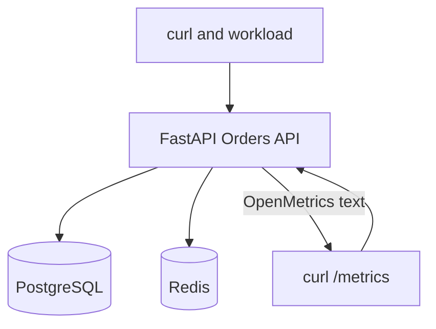
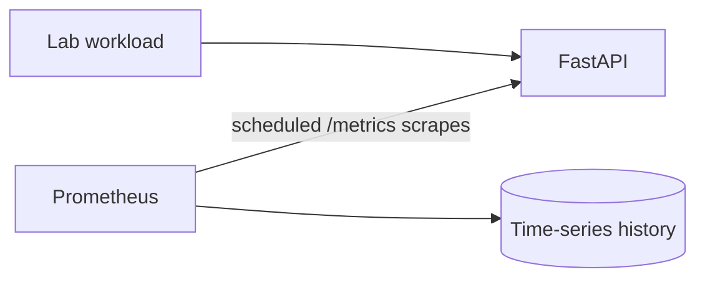

# Lab 02: Telemetry and Prometheus Metrics Before Prometheus

## Purpose and Scope

> **Primary Objective:** Learn to read and reason about raw application metrics before adding Prometheus, dashboards, or alerts.

In Lab 01, you proved how the Orders API, PostgreSQL, Redis, health checks, persistence, and failure modes behave. In this lab, the runtime stays intentionally small:

```text
FastAPI Orders API
PostgreSQL
Redis
```

The application already exposes Prometheus-compatible metrics at `/metrics`. You will inspect that endpoint directly. Prometheus is **not** required to create metrics, and it must remain stopped throughout this lab.

This ordering is important. A dashboard can hide metric names, labels, units, resets, missing series, and aggregation mistakes. A professional operator must be able to inspect the source signal and decide whether it is trustworthy.

## 1. Inherited State From Lab 01

This lab assumes that you completed Lab 01 and left these services healthy:

- `db`
- `redis`
- `app`

You may also have:

- one or more orders stored in PostgreSQL;
- cached order documents in Redis;
- named volumes containing durable state;
- a local `.env` file; and
- notes in `lab-notes/Lab-1.md`.

You do **not** need to delete any data. Existing business data is useful, while application-process metrics will deliberately be reset later.

The observability backends must remain stopped:

- Prometheus;
- Alertmanager;
- OpenTelemetry Collector;
- Loki;
- Tempo;
- Grafana; and
- Node Exporter.

## 2. Prerequisites

From the repository root, verify the required files:

```bash
pwd
test -f docker-compose.yml
test -f app/app/metrics.py
test -f labs/Lab-2.md
test -f .env
```

Load the lab settings into the current shell:

```bash
set -a
source .env
set +a

LAB_HTTP_HOST="${BIND_ADDRESS:-127.0.0.1}"
if [[ "${LAB_HTTP_HOST}" == "0.0.0.0" || "${LAB_HTTP_HOST}" == "::" ]]; then
  LAB_HTTP_HOST=127.0.0.1
fi

export APP_URL="http://${LAB_HTTP_HOST}:${APP_HOST_PORT:-8000}"
```

Run that block again after opening a new terminal. Do not print the complete environment: it includes the database password.

Required host tools:

```bash
docker version
docker compose version
curl --version
jq --version
awk --version | head -n 1
```

GNU or compatible versions are sufficient. The exercises use only basic `awk` features.

## 3. Learning Objectives

By the end of Lab 02, you must be able to explain and demonstrate:

- the difference between observation, telemetry, a signal, and a metric;
- the difference between instrumentation, exposition, collection, storage, querying, and visualization;
- why an application can expose metrics when Prometheus is absent;
- the structure of an OpenMetrics response;
- a metric family, time series, sample, label name, label value, and sample value;
- counters, gauges, histograms, and information metrics;
- how a histogram encodes a distribution with cumulative buckets;
- why `count` and `sum` are useful;
- why counter values require a time window or controlled delta;
- how process restarts affect in-memory metrics;
- why a missing series is different from a series whose value is zero;
- why route templates are safer labels than concrete URLs;
- how label dimensions multiply series count;
- why high cardinality creates reliability and cost risk;
- which application paths are instrumented and where coverage gaps exist;
- how health-check traffic affects observations;
- how the `/metrics` request itself affects the in-progress gauge;
- how the RED method maps to this application;
- the boundary between native Prometheus metrics and OpenTelemetry metrics; and
- what Prometheus will add in Lab 03.

## 4. Architecture for This Lab



There is no metrics collector in this diagram. The application is simultaneously:

- the system serving business traffic;
- the producer of telemetry;
- the owner of instrumentation code; and
- the HTTP server exposing the current metric state.

The `/metrics` endpoint is a read interface over metric state held in the application process. It is not a historical database.

## 5. Start Exactly the Lab 02 Baseline

Start only the three required services:

```bash
APP_OTEL_ENABLED=false docker compose up -d db redis app
docker compose ps
```

Wait for them to become healthy:

```bash
for attempt in {1..30}; do
  if curl -fsS "${APP_URL}/health/ready" | jq -e '.status == "ready"' >/dev/null; then
    echo "Application is ready"
    break
  fi

  if [[ "${attempt}" -eq 30 ]]; then
    echo "Application did not become ready" >&2
    docker compose ps
    docker compose logs --tail=100 app db redis
    exit 1
  fi

  sleep 2
done
```

Expected response shape:

```json
{
  "status": "ready",
  "dependencies": {
    "postgresql": {
      "status": "ok",
      "detail": "ok"
    },
    "redis": {
      "status": "ok",
      "detail": "ok"
    }
  }
}
```

If your response contains the same meaning with extra fields, continue.

## 6. Prove the Observability Backends Are Absent

Do not merely assume that Prometheus is stopped. Test the runtime state:

```bash
for service in prometheus alertmanager otel-collector loki tempo grafana node-exporter; do
  if docker compose ps --status running --services | grep -Fxq "${service}"; then
    echo "Unexpected running service: ${service}" >&2
    exit 1
  fi
done

echo "Only the application baseline is active"
```

If this check reports a service, stop only the listed observability services:

```bash
docker compose stop prometheus alertmanager otel-collector loki tempo grafana node-exporter
```

Verify the active set:

```bash
docker compose ps --status running --services | sort
```

Expected services:

```text
app
db
redis
```

This proves a central idea:

> Prometheus does not create application metrics. Instrumented application code creates and exposes them. Prometheus later collects, timestamps, stores, and queries samples.

## 7. Disable OpenTelemetry Export for This Lab

Lab 02 studies the native Prometheus client path. Recreate the application with OTLP export disabled:

```bash
APP_OTEL_ENABLED=false docker compose up -d --no-deps --force-recreate app
```

Wait for readiness again:

```bash
until curl -fsS "${APP_URL}/health/ready" >/dev/null; do
  sleep 1
done
```

Confirm the setting inside the container without printing unrelated secrets:

```bash
docker compose exec -T app sh -c 'printf "%s\n" "$APP_OTEL_ENABLED"'
```

Expected output:

```text
false
```

This setting disables the OpenTelemetry SDK/export pipeline. It does **not** disable the native `prometheus-client` instruments exposed at `/metrics`.

## 8. Establish a Fresh Metric Process Epoch

Application metrics live in the application process. Recreating the app in the preceding step started a new metric epoch.

Record its start time and container identity:

```bash
docker compose ps app
docker inspect \
  -f 'container={{.Name}} started={{.State.StartedAt}} restart_count={{.RestartCount}}' \
  "$(docker compose ps -q app)"
```

Do not expect every counter to be exactly zero. The Compose health check calls `/health/live` periodically, and your readiness commands generated traffic. Controlled deltas—not absolute values—will make later experiments reliable.

Create a notebook for evidence:

```bash
mkdir -p lab-notes
{
  printf '# Lab 02 Evidence\n\n'
  printf 'Started: %s\n\n' "$(date -u +%FT%TZ)"
  printf 'Application URL: %s\n\n' "${APP_URL}"
} > lab-notes/Lab-2.md
```

The notebook is your work product. Capture commands, observations, explanations, and unexpected results rather than only screenshots.

## 9. Observation, Telemetry, Signal, and Metric

These terms describe different things.

| **Term**        | **Meaning**                                       | **Example In This Lab**     |
|-----------------|---------------------------------------------------|-----------------------------|
| Observation     | Something learned about system behavior           | A request returned HTTP 200 |
| Telemetry       | Data emitted so remote behavior can be understood | Metrics or JSON logs        |
| Signal          | A telemetry category                              | Metrics, logs, or traces    |
| Metric          | Numeric measurement represented over time         | Total HTTP requests         |
| Instrumentation | Code that records telemetry                       | Middleware calling `.inc()` |
| Exposition      | Making current metric state readable              | HTTP `GET /metrics`         |
| Collection      | Periodically retrieving or receiving telemetry    | Prometheus scraping, later  |
| Storage         | Retaining samples over time                       | Prometheus TSDB, later      |
| Query           | Selecting and transforming stored data            | PromQL, later               |
| Visualization   | Presenting query results                          | Grafana, later              |

A `curl` request to `/metrics` performs exposition and manual collection. It does not create a durable history.

## 10. Inspect the Instrumentation Source

Read the metric declarations:

```bash
sed -n '1,240p' app/app/metrics.py
```

Find where the HTTP instruments are updated:

```bash
rg -n 'HTTP_REQUESTS|HTTP_DURATION|HTTP_IN_PROGRESS' app/app
```

Find database, cache, business, and simulation instrumentation:

```bash
rg -n 'DATABASE_OPERATIONS|DATABASE_DURATION|CACHE_OPERATIONS|ORDERS_CREATED|SIMULATIONS' app/app
```

For each instrument, record:

- instrument type;
- metric name;
- unit;
- label names;
- code path that updates it; and
- behavior it claims to represent.

This source-to-signal mapping is a professional habit. A metric name is a claim. The code tells you exactly what that claim includes and excludes.

## 11. Inspect the Raw HTTP Response

Save the response headers and body separately:

```bash
curl -fsS -D /tmp/lab2-metrics.headers   -o /tmp/lab2-metrics.openmetrics   "${APP_URL}/metrics"

sed -n '1,20p' /tmp/lab2-metrics.headers
sed -n '1,40p' /tmp/lab2-metrics.openmetrics
tail -n 5 /tmp/lab2-metrics.openmetrics
```

Look for a content type similar to:

```text
application/openmetrics-text; version=1.0.0; charset=utf-8
```

The body contains comments and samples. A valid OpenMetrics document ends with:

```text
# EOF
```

Verify both properties:

```bash
grep -i '^content-type:.*openmetrics-text' /tmp/lab2-metrics.headers
tail -n 1 /tmp/lab2-metrics.openmetrics | grep -Fx '# EOF'
```

If both commands succeed, the endpoint is exposing OpenMetrics text rather than JSON.

## 12. Do Not Parse OpenMetrics With jq

This command is expected to fail:

```bash
if jq . /tmp/lab2-metrics.openmetrics >/dev/null 2>&1; then
  echo "Unexpected: body parsed as JSON"
else
  echo "Expected: OpenMetrics text is not JSON"
fi
```

Use `grep`, `awk`, a Prometheus parser, or Prometheus itself. Use `jq` only for JSON responses such as the CRUD API and health endpoints.

A frequent troubleshooting mistake is applying a familiar tool to the wrong serialization format.

## 13. Read the OpenMetrics Grammar

A small metric family can look like this:

```text
# HELP obslab_http_requests Total HTTP requests processed by the application.
# TYPE obslab_http_requests counter
obslab_http_requests_total{method="GET",route="/health/live",status_code="200"} 7.0
obslab_http_requests_created{method="GET",route="/health/live",status_code="200"} 1.789e+09
```

The important elements are:

- `# HELP`: human description;
- `# TYPE`: metric type;
- `# UNIT`: unit metadata when emitted;
- metric name;
- labels inside braces;
- numeric sample value; and
- an optional timestamp, which this application does not add.

The Python client may declare the counter family with the base name while emitting samples ending in `_total` and `_created`. Do not treat that as two unrelated counters.

List metadata for lab-owned families:

```bash
grep -E '^# (HELP|TYPE|UNIT) obslab_' /tmp/lab2-metrics.openmetrics
```

List only their samples:

```bash
grep -E '^obslab_' /tmp/lab2-metrics.openmetrics
```

## 14. Family, Series, and Sample

These concepts are related but not interchangeable.

| **Concept**   | **Identity**                            | **Example**                |
|---------------|-----------------------------------------|----------------------------|
| Metric Family | Base metric and related samples         | `obslab_http_requests`     |
| Time Series   | Metric name plus one exact label set    | GET + `/` + 200            |
| Sample        | One observed numeric value for a series | value `3.0` in one scrape  |
| Scrape        | One collection event across a target    | Prometheus GETs `/metrics` |

Given:

```text
obslab_http_requests_total{method="GET",route="/",status_code="200"} 3.0
```

the series identity is the metric name plus all three label pairs. Changing only `status_code` from `200` to `500` creates a different series.

A future scrape provides another sample for that same series. The exposition endpoint currently shows only the process's latest value.

## 15. Labels Are Dimensions, Not Comments

For this sample:

```text
obslab_http_requests_total{method="GET",route="/api/v1/orders",status_code="200"} 4.0
```

the label names are:

- `method`;
- `route`; and
- `status_code`.

The label values are:

- `GET`;
- `/api/v1/orders`; and
- `200`.

Labels make aggregation possible:

- all request methods;
- one route across status codes;
- errors across all routes; or
- one method-route-status combination.

Every unique label combination also creates a new time series. That is the foundation of the cardinality tradeoff.

The serialized order of labels is not part of the series identity. Match by label name and value rather than assuming labels will always appear in one textual order.

## 16. Inspect Only the Application-Owned Metrics

Refresh the snapshot:

```bash
curl -fsS "${APP_URL}/metrics" -o /tmp/lab2-metrics.openmetrics
grep -E '^# (HELP|TYPE) obslab_' /tmp/lab2-metrics.openmetrics
```

Expected families include:

| **Family**                                    | **Type**  | **Main labels**                         | **Meaning**                    |
|-----------------------------------------------|-----------|-----------------------------------------|--------------------------------|
| `obslab_http_requests`                        | Counter   | method, route, status_code              | Completed HTTP requests        |
| `obslab_http_request_duration_seconds`        | Histogram | method, route                           | HTTP latency distribution      |
| `obslab_http_requests_in_progress`            | Gauge     | method                                  | Requests executing now         |
| `obslab_database_operations`                  | Counter   | operation, outcome                      | Instrumented DB attempts       |
| `obslab_database_operation_duration_seconds`  | Histogram | operation                               | Instrumented DB duration       |
| `obslab_cache_operations`                     | Counter   | operation, outcome                      | Redis cache activity           |
| `obslab_orders_created`                       | Counter   | status                                  | Successful order creation      |
| `obslab_simulations`                          | Counter   | kind, outcome                           | Controlled simulation calls    |
| `obslab_alert_webhooks`                       | Counter   | status                                  | Alert webhook handling         |
| `obslab_build`                                | Info      | version, environment, build_sha         | Build metadata                 |

A family may be declared in code but have no samples until its first labeled observation. This is normal for label-bearing instruments.

## 17. Numeric Values and Scientific Notation

OpenMetrics values are floating-point numbers. You may see:

```text
7.0
0.003218
1.78903211e+09
+Inf
```

Scientific notation is only another numeric representation. `1.78903211e+09` means approximately 1,789,032,110.

`+Inf` appears as the upper bound of the final histogram bucket. It means every finite observation is less than or equal to that boundary.

Do not infer precision or business meaning from the number format alone. Read the name, unit, type, labels, and instrumentation code together.

## 18. Names and Units Are Part of the Contract

Prometheus naming conventions encode meaning:

- `_total` usually identifies the emitted sample of a counter;
- `_seconds` expresses a duration in seconds;
- `_bytes` expresses a size in bytes;
- `_info` conventionally represents metadata with a constant value of one;
- histogram samples add `_bucket`, `_count`, and `_sum`.

Good unit suffixes prevent ambiguous queries and dashboards. A value of `250` is meaningless if one producer means milliseconds and another means seconds.

Inspect all unit metadata:

```bash
grep '^# UNIT ' /tmp/lab2-metrics.openmetrics || \
  echo 'No explicit # UNIT metadata is emitted by the current instruments'
```

## 19. Counter Semantics

A counter represents a cumulative number of events since the process started. It normally:

- begins at zero;
- increases when an event happens;
- never intentionally decreases; and
- resets when the owning process restarts.

A raw counter value does **not** directly answer “requests per second.” Rate requires at least two samples separated in time. Prometheus will supply that historical context later.

The application counter is:

```text
obslab_http_requests_total
```

It increments after an HTTP request completes, except for `/metrics`, which is deliberately excluded from the completed-request counter and duration histogram.

## 20. Build a Safe Counter Reader

Shell matching can accidentally combine multiple series. Define a helper that requires an exact metric name and exact label fragments:

```bash
read_http_counter() {
  local method="$1"
  local route="$2"
  local status="$3"

  curl -fsS "${APP_URL}/metrics" |
    awk -v wanted_method="${method}" \
        -v wanted_route="${route}" \
        -v wanted_status="${status}" '
      $1 ~ /^obslab_http_requests_total{/ &&
      index($0, "method=\"" wanted_method "\"") &&
      index($0, "route=\"" wanted_route "\"") &&
      index($0, "status_code=\"" wanted_status "\"") { print $2; found=1 }
      END { if (!found) print 0 }
    '
}
```

Test it:

```bash
read_http_counter GET / 200
```

A missing series is converted to zero only for this controlled calculation. The helper does not prove that a missing series and an observed zero mean the same thing.

## 21. Measure a Controlled Counter Delta

Capture a baseline, make exactly three requests, and capture the final value:

```bash
before="$(read_http_counter GET / 200)"

for request in 1 2 3; do
  curl -fsS "${APP_URL}/" >/dev/null
done

after="$(read_http_counter GET / 200)"
delta="$(awk -v before="${before}" -v after="${after}" 'BEGIN { print after - before }')"

printf 'before=%s after=%s delta=%s\n' "${before}" "${after}" "${delta}"
test "${delta}" = "3"
```

The absolute count may differ between learners. The delta should be exactly three because the health check does not call the root route.

Append the result:

```bash
printf 'Root GET 200 counter delta: %s\n' "${delta}" >> lab-notes/Lab-2.md
```

## 22. Prove That /metrics Does Not Count as a Completed Request

Capture the counter for the metrics route:

```bash
read_http_counter GET /metrics 200
```

Request the endpoint repeatedly:

```bash
for request in {1..5}; do
  curl -fsS "${APP_URL}/metrics" >/dev/null
done

read_http_counter GET /metrics 200
```

Expected value: zero from the helper, because no such completed-request series is emitted.

Inspect the middleware implementation and find the exclusion:

```bash
rg -n 'metrics|HTTP_REQUESTS|HTTP_DURATION' app/app/middleware.py app/app
```

Excluding scrapes avoids contaminating application request rate and latency with monitoring traffic. The in-progress gauge behaves differently, as you will prove shortly.

## 23. Create a Controlled HTTP Error Series

The HTTP error simulator returns a deliberate JSON error. Capture the status without asking `curl` to fail on HTTP 4xx/5xx:

```bash
http_status="$(curl -sS \
  -o /tmp/lab2-error.json \
  -w '%{http_code}' \
  "${APP_URL}/api/v1/simulate/error?status_code=503")"

printf 'status=%s\n' "${http_status}"
jq . /tmp/lab2-error.json
test "${http_status}" = "503"
```

Now inspect matching samples:

```bash
curl -fsS "${APP_URL}/metrics" |
  grep '^obslab_http_requests_total{' |
  grep 'route="/api/v1/simulate/error"' |
  grep 'status_code="503"'

curl -fsS "${APP_URL}/metrics" |
  grep 'obslab_simulations_total.*kind="http_error"'
```

The same request can update multiple instruments because it represents several useful facts:

- an HTTP request completed;
- its route and status were known;
- a deliberate simulation ran; and
- the simulation outcome was recorded.

Metrics overlap is acceptable when each metric has a clear question.

## 24. Route Templates Prevent Path Cardinality Explosion

Create two orders:

```bash
order_one="$(curl -fsS -X POST "${APP_URL}/api/v1/orders" \
  -H 'Content-Type: application/json' \
  -d '{"customer_name":"Lab Two A","product":"metric-reader","quantity":1,"unit_price":"12.50"}')"

order_two="$(curl -fsS -X POST "${APP_URL}/api/v1/orders" \
  -H 'Content-Type: application/json' \
  -d '{"customer_name":"Lab Two B","product":"label-auditor","quantity":2,"unit_price":"8.25"}')"

order_one_id="$(jq -r '.id' <<<"${order_one}")"
order_two_id="$(jq -r '.id' <<<"${order_two}")"

curl -fsS "${APP_URL}/api/v1/orders/${order_one_id}" >/dev/null
curl -fsS "${APP_URL}/api/v1/orders/${order_two_id}" >/dev/null
```

Inspect the route label:

```bash
curl -fsS "${APP_URL}/metrics" |
  grep 'obslab_http_requests_total.*route="/api/v1/orders/{order_id}"'
```

You should see the route template, not labels containing the concrete order IDs.

If every customer ID, UUID, search string, or raw path becomes a label value, the number of series grows with user activity. Template normalization bounds that growth.

## 25. Understand Series Multiplication

Suppose a metric has:

- 6 methods;
- 20 route templates; and
- 8 status-code values.

Its theoretical maximum is:

```text
6 × 20 × 8 = 960 series
```

Add a `customer_id` label with 100,000 active values:

```text
6 × 20 × 8 × 100,000 = 96,000,000 series
```

This is cardinality multiplication. The practical series count includes only combinations that actually appear, but unbounded dimensions remain dangerous.

High cardinality costs:

- process memory in the client library;
- scrape response size and duration;
- network bandwidth;
- ingestion CPU;
- time-series database memory and disk;
- query latency; and
- human comprehension.

Never use request IDs, trace IDs, email addresses, unrestricted URLs, timestamps, or arbitrary error text as metric labels.

The error simulator accepts every status code from 400 through 599. Although that range is bounded, it can still create up to 200 status-code values for one method-route pair. A production design may prefer a controlled allow-list or a coarse status class such as `4xx` and `5xx`.

## 26. Gauge Semantics

A gauge represents a value that can increase or decrease. The application gauge is:

```text
obslab_http_requests_in_progress
```

Middleware increments it when handling starts and decrements it in a `finally` block when handling ends.

Inspect its current samples:

```bash
curl -fsS "${APP_URL}/metrics" |
  grep '^obslab_http_requests_in_progress'
```

You may expect zero when the service is idle, yet a GET series commonly reports at least one. The reason is subtle: the current `/metrics` request is itself in progress while its response body is generated.

This is the observer effect: measurement activity can affect the measured system.

## 27. Prove the In-Progress Gauge With Concurrency

Start four latency requests in the background:

```bash
for request in {1..4}; do
  curl -fsS "${APP_URL}/api/v1/simulate/latency?seconds=5"     >"/tmp/lab2-latency-${request}.json" &
done

sleep 1

curl -fsS "${APP_URL}/metrics" |
  grep 'obslab_http_requests_in_progress{method="GET"}'

wait
```

During the scrape, the GET gauge should normally be at least five:

- four latency requests; plus
- the scrape request currently generating the gauge.

After the requests finish:

```bash
curl -fsS "${APP_URL}/metrics" |
  grep 'obslab_http_requests_in_progress{method="GET"}'
```

It should return to the scrape-only value, normally one.

Do not hard-code an alert saying the gauge must equal zero. Interpret it in light of instrumentation boundaries and the collection mechanism.

## 28. Gauge Label Tradeoff

The in-progress gauge uses only the `method` label, not `route`.

That choice means it can answer:

- how many GET requests are running;
- how many POST requests are running; and
- whether concurrency is rising by method.

It cannot answer:

- which route accounts for current concurrency.

Adding a route label would increase diagnostic detail and cardinality. Neither choice is universally correct. The professional question is whether the additional dimension supports an operational decision worth its cost.

## 29. Histogram Semantics

A histogram observes numeric values and exposes a distribution through:

- cumulative bucket counters;
- a total observation count; and
- a total sum of observed values.

The HTTP duration family is:

```text
obslab_http_request_duration_seconds
```

Inspect one route:

```bash
curl -fsS "${APP_URL}/metrics" |
  grep 'obslab_http_request_duration_seconds.*route="/api/v1/simulate/latency"'
```

You should see samples ending with:

- `_bucket{...,le="..."}`;
- `_count{...}`;
- `_sum{...}`; and
- possibly `_created{...}`.

The `le` label means “less than or equal to.”

## 30. Read Cumulative Buckets Correctly

For one label set, imagine:

| **Boundary** | **Bucket value** |
|-------------:|-----------------:|
| 0.1          | 12               |
| 0.5          | 18               |
| 1.0          | 20               |
| +Inf         | 20               |

Correct interpretation:

- 12 observations were at most 0.1 seconds;
- 18 observations were at most 0.5 seconds;
- 20 observations were at most 1 second;
- 20 observations were observed in total.

The exclusive band from 0.1 to 0.5 seconds contains `18 - 12 = 6` observations.

Do not add cumulative bucket values. The same observation appears in every bucket whose boundary is greater than or equal to that observation.

## 31. Calculate Histogram Series Cost

The HTTP duration histogram declares 12 finite bucket boundaries:

```text
0.005, 0.01, 0.025, 0.05, 0.1, 0.25,
0.5, 1, 2.5, 5, 10, 20
```

For each method-route label set, exposition includes:

- 12 finite bucket series;
- 1 `+Inf` bucket series;
- 1 count series;
- 1 sum series; and
- 1 created-time series from this client library.

That is 16 visible series per active label set. The core histogram distribution uses 15 of them; `_created` is metadata about initialization time.

Histograms offer powerful server-side aggregation, but bucket count multiplies their storage cost.

## 32. Define Histogram Readers

Create helpers for the latency simulator's GET series:

```bash
read_latency_bucket() {
  local boundary="$1"

  curl -fsS "${APP_URL}/metrics" |
    awk -v wanted_boundary="${boundary}" '
      $1 ~ /^obslab_http_request_duration_seconds_bucket{/ &&
      index($0, "method=\"GET\"") &&
      index($0, "route=\"/api/v1/simulate/latency\"") &&
      index($0, "le=\"" wanted_boundary "\"") { print $2; found=1 }
      END { if (!found) print 0 }
    '
}

read_latency_scalar() {
  local suffix="$1"

  curl -fsS "${APP_URL}/metrics" |
    awk -v metric="obslab_http_request_duration_seconds_${suffix}" '
      $1 ~ ("^" metric "{") &&
      index($0, "method=\"GET\"") &&
      index($0, "route=\"/api/v1/simulate/latency\"") {
        print $2
        found=1
      }
      END { if (!found) print 0 }
    '
}
```

Test the helpers:

```bash
read_latency_bucket 0.1
read_latency_bucket 0.5
read_latency_bucket 1.0
read_latency_bucket 2.5
read_latency_bucket +Inf
read_latency_scalar count
read_latency_scalar sum
```

The values reflect all latency simulations since the current application process started.

## 33. Run a Controlled Histogram Experiment

Capture baseline values:

```bash
b01="$(read_latency_bucket 0.1)"
b05="$(read_latency_bucket 0.5)"
b10="$(read_latency_bucket 1.0)"
b25="$(read_latency_bucket 2.5)"
binf="$(read_latency_bucket +Inf)"
bcount="$(read_latency_scalar count)"
bsum="$(read_latency_scalar sum)"
```

Generate four deliberately different durations:

```bash
for seconds in 0.02 0.20 0.70 1.40; do
  curl -fsS "${APP_URL}/api/v1/simulate/latency?seconds=${seconds}" >/dev/null
done
```

Capture final values and calculate deltas:

```bash
a01="$(read_latency_bucket 0.1)"
a05="$(read_latency_bucket 0.5)"
a10="$(read_latency_bucket 1.0)"
a25="$(read_latency_bucket 2.5)"
ainf="$(read_latency_bucket +Inf)"
acount="$(read_latency_scalar count)"
asum="$(read_latency_scalar sum)"

awk \
  -v b01="${b01}" -v a01="${a01}" \
  -v b05="${b05}" -v a05="${a05}" \
  -v b10="${b10}" -v a10="${a10}" \
  -v b25="${b25}" -v a25="${a25}" \
  -v binf="${binf}" -v ainf="${ainf}" \
  -v bc="${bcount}" -v ac="${acount}" \
  -v bs="${bsum}" -v as="${asum}" '
  BEGIN {
    printf "<=0.1 delta: %.0f\n", a01-b01
    printf "<=0.5 delta: %.0f\n", a05-b05
    printf "<=1.0 delta: %.0f\n", a10-b10
    printf "<=2.5 delta: %.0f\n", a25-b25
    printf "+Inf delta: %.0f\n", ainf-binf
    printf "count delta: %.0f\n", ac-bc
    printf "sum delta: %.3f seconds\n", as-bs
    printf "mean: %.3f seconds\n", (as-bs)/(ac-bc)
  }
'
```

Expected bucket deltas are approximately:

| **Cumulative Bucket** | **Expected Delta** | **Included Requests**     |
|-----------------------|--------------------|---------------------------|
| ≤ 0.1 s               | 1                  | 0.02                      |
| ≤ 0.5 s               | 2                  | 0.02, 0.20                |
| ≤ 1.0 s               | 3                  | 0.02, 0.20, 0.70          |
| ≤ 2.5 s               | 4                  | all four                  |
| +Inf                  | 4                  | all four                  |
| count                 | 4                  | all four                  |

The sum delta will be slightly greater than 2.32 seconds because middleware measures total request handling overhead as well as the deliberate sleep.

## 34. Count, Sum, Mean, and Quantiles

For a controlled interval:

```text
mean duration = increase in sum / increase in count
```

You calculated that mean in the preceding exercise.

A mean does not describe tail latency. Four requests can have the same mean while having very different distributions. Prometheus later uses the cumulative buckets to estimate quantiles with `histogram_quantile()`.

A histogram quantile is an estimate bounded by bucket layout. If the buckets are poorly chosen for the service-level objective, no query can recover precision that was never recorded.

Professional bucket design starts with meaningful latency boundaries, not arbitrary defaults.

## 35. Understand the _created Samples

The Python client emits created-time samples such as:

```text
obslab_http_requests_created{...} 1.78903211e+09
```

They represent Unix time when that labeled child metric was initialized. They are gauges associated with client behavior, not event counters and not request timestamps.

Convert one to UTC if present:

```bash
created="$(curl -fsS "${APP_URL}/metrics" |
  awk '$1 ~ /^obslab_http_requests_created{/ { print $2; exit }')"

if [[ -n "${created}" ]]; then
  created_integer="$(awk -v value="${created}" 'BEGIN { printf "%.0f", value }')"
  date -u -d "@${created_integer}" '+%Y-%m-%dT%H:%M:%SZ'
else
  echo "No created sample has been initialized yet"
fi
```

The GNU `date` syntax may differ on non-Linux hosts, but the lab VM target is Linux.

## 36. Never Put Observed Duration in a Label

Bad design:

```text
request_duration_seconds{duration="0.237194",route="/orders"} 1
```

Each novel duration can create a new label value and therefore a new series.

Correct design:

```text
request_duration_seconds_bucket{route="/orders",le="0.25"} 42
```

Bucket boundaries are bounded configuration. Individual measurements update existing series.

The same principle applies to payload size, timestamps, error text, and IDs: measured values belong in sample values or logs/traces, not in unbounded metric labels.

## 37. Notice the HTTP Histogram Label Choice

The request counter uses:

- method;
- route; and
- status code.

The duration histogram uses:

- method; and
- route.

Therefore the histogram cannot directly answer “what is p95 latency for only HTTP 500 responses?”

This is an intentional label-cost tradeoff. Adding status code to every bucket series would multiply histogram cardinality. In production, common alternatives include:

- coarse status class, such as `2xx` or `5xx`;
- separate error counters;
- trace analysis for individual failures; or
- careful status-code labeling when the bounded value set justifies it.

Record whether you agree with this tradeoff for the lab application and why.

## 38. Exercise Database Metrics Through CRUD

Create one order, read it, update it, list orders, and delete it:

```bash
db_order="$(curl -fsS -X POST "${APP_URL}/api/v1/orders" \
  -H 'Content-Type: application/json' \
  -d '{"customer_name":"DB Metric Lab","product":"query-counter","quantity":1,"unit_price":"19.95"}')"

db_order_id="$(jq -r '.id' <<<"${db_order}")"

curl -fsS "${APP_URL}/api/v1/orders/${db_order_id}" >/dev/null

curl -fsS -X PUT "${APP_URL}/api/v1/orders/${db_order_id}" \
  -H 'Content-Type: application/json' \
  -d '{"status":"paid"}' >/dev/null

curl -fsS "${APP_URL}/api/v1/orders?limit=10&offset=0" >/dev/null

delete_status="$(curl -sS -o /dev/null -w '%{http_code}'   -X DELETE "${APP_URL}/api/v1/orders/${db_order_id}")"
test "${delete_status}" = "204"
```

Inspect database operations:

```bash
curl -fsS "${APP_URL}/metrics" |
  grep '^obslab_database_operations_total'

curl -fsS "${APP_URL}/metrics" |
  grep '^obslab_database_operation_duration_seconds_'
```

Identify the operations and outcomes created by the CRUD paths.

The count and duration families have different labels. Outcome exists on the counter, while duration is grouped only by operation. Again, that is a deliberate cardinality choice.

## 39. Detect an Instrumentation Coverage Gap Safely

Invoke the bounded invalid-SQL simulator:

```bash
database_error_status="$(curl -sS \
  -o /tmp/lab2-database-error.json \
  -w '%{http_code}' \
  "${APP_URL}/api/v1/simulate/database-error")"

printf 'status=%s\n' "${database_error_status}"
jq . /tmp/lab2-database-error.json
test "${database_error_status}" = "503"
```

Inspect simulation and database operation samples:

```bash
curl -fsS "${APP_URL}/metrics" |
  grep 'obslab_simulations_total.*kind="database_error"'

curl -fsS "${APP_URL}/metrics" |
  grep 'obslab_database_operations_total.*outcome="error"' || true
```

The simulator directly executes invalid SQL and increments the simulation metric. It does not pass through the CRUD helper that records `DATABASE_OPERATIONS`.

This proves:

> “The application has database metrics” does not mean “every database operation is measured by those metrics.”

A coverage gap can be more dangerous than no metric because the metric name may imply broader coverage than the code provides. Document this gap; do not “fix” it during this reading lab.

## 40. Exercise Cache Metrics

The create path populates Redis, so this experiment deletes only that disposable cache key. The first read is then a controlled miss and the second should be a hit. Create an order:

```bash
cache_order="$(curl -fsS -X POST "${APP_URL}/api/v1/orders" \
  -H 'Content-Type: application/json' \
  -d '{"customer_name":"Cache Metric Lab","product":"hit-miss-counter","quantity":1,"unit_price":"9.99"}')"

cache_order_id="$(jq -r '.id' <<<"${cache_order}")"

docker compose exec -T redis redis-cli DEL "order:${cache_order_id}" >/dev/null

curl -fsS "${APP_URL}/api/v1/orders/${cache_order_id}" >/dev/null
curl -fsS "${APP_URL}/api/v1/orders/${cache_order_id}" >/dev/null
```

Inspect cache series:

```bash
curl -fsS "${APP_URL}/metrics" |
  grep '^obslab_cache_operations_total'
```

Look for combinations such as:

- `operation="get", outcome="miss"`;
- `operation="get", outcome="hit"`; and
- `operation="set", outcome="success"`.

Exact counts depend on Lab 01 state and health checks. Explain behavior using controlled deltas or a fresh order, not assumptions about absolute values.

Clean up the order when finished:

```bash
curl -fsS -o /dev/null -X DELETE   "${APP_URL}/api/v1/orders/${cache_order_id}"
```

## 41. Business and Simulation Metrics

Inspect the business counter:

```bash
curl -fsS "${APP_URL}/metrics" |
  grep '^obslab_orders_created_total'
```

It is different from the HTTP POST counter:

- HTTP counter: transport-level request result;
- orders-created counter: successful business event.

A request could return a non-error transport status without completing the intended business event, or one request could create multiple business events in a different system. Instrument business outcomes explicitly when they matter.

Inspect all simulations:

```bash
curl -fsS "${APP_URL}/metrics" |
  grep '^obslab_simulations_total'
```

Simulation metrics distinguish deliberate lab behavior from accidental failures. In a real production API, dangerous simulation endpoints would require strong access controls or would not be deployed.

## 42. Information Metrics

Inspect build information:

```bash
curl -fsS "${APP_URL}/metrics" |
  grep '^obslab_build_info'
```

A typical sample resembles:

```text
obslab_build_info{build_sha="development",environment="lab",version="1.0.0"} 1.0
```

The value is constant one; information lives in bounded labels. This enables questions such as:

- which version is running;
- which environment produced the telemetry; and
- whether a deployment changed when behavior changed.

Build metadata must remain bounded. Do not put a per-request value into an info metric.

## 43. Runtime and Process Metrics

The endpoint includes client-library/runtime families in addition to `obslab_*` metrics.

List their metadata:

```bash
curl -fsS "${APP_URL}/metrics" |
  grep -E '^# (HELP|TYPE) (process_|python_)'
```

Inspect samples:

```bash
curl -fsS "${APP_URL}/metrics" |
  grep -E '^(process_|python_)'
```

Common examples include:

- resident memory;
- process CPU seconds;
- open file descriptors;
- process start time; and
- Python garbage-collection activity.

These describe the application process, not the whole VM. Node Exporter will later describe the host. PostgreSQL and Redis require their own exporters or telemetry for deep internal visibility.

## 44. Classify What You Can Observe

Complete this table in your notebook:

| **Question**                                              | **Available now?**     | **Best current signal**        | **Limitation**                              |
|-----------------------------------------------------------|------------------------|--------------------------------|---------------------------------------------|
| How many app HTTP requests completed?                     | Yes                    | HTTP counter                   | Only current process epoch                  |
| What is app latency distribution?                         | Yes                    | HTTP histogram                 | No history without repeated collection      |
| Which individual request was slow?                        | No                     | Future trace/log correlation   | Metrics are aggregate                       |
| Is PostgreSQL internally checkpointing?                   | No                     | Future PostgreSQL exporter/logs| App metric sees only instrumented calls     |
| Is the VM under memory pressure?                          | Partially              | Process memory only            | Node Exporter not running                   |
| What was request rate 20 minutes ago?                     | No                     | Future Prometheus              | Endpoint has no durable history             |
| Which customer triggered an error?                        | Not safely in metrics  | Future structured log/trace    | Customer ID is a poor metric label          |
| How many orders were created in this process epoch?       | Yes                    | Business counter               | Resets with app                             |

“Unavailable” is a valid professional conclusion. Never invent confidence that the instrumentation cannot support.

## 45. Missing Series Is Not Zero

A label-bearing counter often creates a child series only after that label combination is observed.

These states differ:

1. series exists with value zero;
2. series does not exist;
3. endpoint cannot be reached;
4. target is reachable but metric name changed;
5. target exposes stale or incomplete instrumentation.

Your helper returned zero for missing data to make a controlled subtraction convenient. A monitoring system must treat missing data deliberately because it can indicate a deployment, scrape, or instrumentation failure.

Check for a never-used label combination:

```bash
if curl -fsS "${APP_URL}/metrics" |
  grep -q 'obslab_http_requests_total.*route="/definitely-never-observed"'; then
  echo "Unexpected series"
else
  echo "Series is absent, not an observed zero"
fi
```

## 46. Counter Reset Versus Business-State Persistence

Record one counter and the highest current order ID:

```bash
counter_before_restart="$(read_http_counter GET / 200)"
max_order_id_before="$(curl -fsS "${APP_URL}/api/v1/orders?limit=100&offset=0" |
  jq '[.[].id] | max // 0')"

printf 'counter_before=%s max_order_id_before=%s\n' \
  "${counter_before_restart}" "${max_order_id_before}"
```

Restart only the app:

```bash
docker compose restart app

until curl -fsS "${APP_URL}/health/ready" >/dev/null; do
  sleep 1
done
```

Read them again:

```bash
counter_after_restart="$(read_http_counter GET / 200)"
max_order_id_after="$(curl -fsS "${APP_URL}/api/v1/orders?limit=100&offset=0" |
  jq '[.[].id] | max // 0')"

printf 'counter_after=%s max_order_id_after=%s\n' \
  "${counter_after_restart}" "${max_order_id_after}"
```

Interpretation:

- PostgreSQL data remains because it is stored outside the app process;
- native application counters reset because their process memory was replaced;
- health/readiness traffic may increment some new series before inspection.

Prometheus rate functions are designed to account for ordinary counter resets. A raw subtraction across a restart can be negative and misleading.

## 47. Metrics Are Not an Accounting Database

If the business asks, “How many orders have ever been created?”, the current process counter is not authoritative because:

- it resets on restart;
- replicas would each hold separate values;
- instrumentation could be unavailable;
- retries and semantic definitions matter; and
- retention policies can delete telemetry.

Use the transactional database or an event/accounting system for authoritative records. Use metrics for operational behavior, trends, rates, saturation, and alerting.

Observability data supports diagnosis; it does not automatically become a financial or compliance ledger.

## 48. Current Snapshot Versus Historical Storage

Take two snapshots ten seconds apart:

```bash
curl -fsS "${APP_URL}/metrics" -o /tmp/lab2-snapshot-a.openmetrics
sleep 10
curl -fsS "${APP_URL}/metrics" -o /tmp/lab2-snapshot-b.openmetrics

diff -u /tmp/lab2-snapshot-a.openmetrics /tmp/lab2-snapshot-b.openmetrics || true
```

Changes can come from:

- Compose health-check traffic;
- the two manual scrape requests affecting the gauge;
- runtime garbage collection;
- process CPU use; or
- other requests.

The application did not retain both snapshots. Your files did. Prometheus will automate periodic snapshots, attach collection timestamps, store samples, and expose a query language.

## 49. Preview a Prometheus Scrape

A Prometheus scrape is conceptually an HTTP request similar to:

```bash
curl -fsS   -H 'Accept: application/openmetrics-text; version=1.0.0; charset=utf-8'   "${APP_URL}/metrics" |
  tail -n 5
```

Prometheus additionally:

- discovers or is configured with a target;
- repeats this request on a schedule;
- records scrape health and duration;
- applies relabeling;
- adds target labels such as job and instance;
- stores samples with timestamps; and
- marks vanished series stale.

Manual `curl` proves exposition. It does not validate the future Prometheus target configuration.

## 50. Pull and Push Boundaries

The native application metrics path is pull-based:

```text
Prometheus -> HTTP GET /metrics -> application
```

The OpenTelemetry application path is export-based:

```text
application -> OTLP -> OpenTelemetry Collector
```

The collector can then expose aggregated/exported metrics for Prometheus to pull.

Neither architecture is automatically superior. Important questions include:

- who initiates delivery;
- how backpressure is handled;
- where retry queues live;
- how target health is detected;
- how resource identity is attached; and
- what happens during network failure.

Lab 02 isolates the native pull endpoint so these paths are not confused.

## 51. Native Prometheus Versus OpenTelemetry Metrics

This repository deliberately contains two application metric paths:

| **Path**          | **Producer API**                   | **Transport**          | **Lab 02 state** |
|-------------------|------------------------------------|------------------------|------------------|
| Native            | Python Prometheus client           | `/metrics` exposition  | Active           |
| OpenTelemetry     | OTel SDK/instrumentations          | OTLP to Collector      | Disabled         |

Some concepts overlap, but names, labels/attributes, temporality, aggregation, and generated runtime metrics may differ.

Do not add values from both paths merely because their names sound similar. That can double-count the same underlying requests. First establish semantic equivalence and decide which source is authoritative for a query.

## 52. Why Exemplars Are Absent Here

An exemplar links an aggregate metric observation to trace context, commonly a trace ID. This lab disabled OpenTelemetry export and focuses on the native endpoint without an active trace pipeline.

Therefore you should not depend on exemplars in this lab.

Later, traces and exemplars can support a workflow such as:

```text
latency spike -> histogram exemplar -> representative trace -> correlated logs
```

An absent exemplar does not make the metric invalid. It means that cross-signal link is unavailable in the current configuration or observation.

## 53. Apply the RED Method

RED is a service-oriented starting point:

- **Rate:** requests per unit time;
- **Errors:** failed requests per unit time or ratio;
- **Duration:** request latency distribution.

Map RED to this application:

| **RED dimension** | **Native family**                       | **Required future operation**       |
|-------------------|-----------------------------------------|-------------------------------------|
| Rate              | `obslab_http_requests_total`            | Counter rate over a window          |
| Errors            | Same counter filtered by status         | Error rate or error ratio           |
| Duration          | `obslab_http_request_duration_seconds`  | Histogram rate and quantile         |

The raw endpoint supplies cumulative ingredients. It cannot compute a five-minute request rate from one snapshot. Prometheus history and PromQL will make that possible.

RED is a starting framework, not a complete service model. Dependencies, saturation, correctness, business outcomes, and user journeys may need additional signals.

## 54. Map Questions to Metric Operations

Write the likely operation before writing a future query:

| **Operational Question**                     | **Needed Operation**                                      |
|----------------------------------------------|-----------------------------------------------------------|
| Requests per second over five minutes        | Rate of request counter                                   |
| Fraction of requests returning 5xx           | 5xx rate divided by all-request rate                      |
| Mean latency over five minutes               | Rate of histogram sum divided by rate of count            |
| Approximate p95 latency                      | Histogram quantile over bucket rates                      |
| Current concurrent GET requests              | Gauge value                                               |
| Cache hit ratio                              | Hit rate divided by hit-plus-miss rates                   |
| DB error percentage                          | Error operation rate divided by all DB operation rates    |
| Running version                              | Info metric labels                                        |
| Orders created per minute                    | Rate/increase of business counter                         |

Correct monitoring begins with a question, then selects the metric semantics and operation. Starting with a visually attractive panel often produces meaningless dashboards.

## 55. Perform a Cardinality Audit

List every application metric declaration and its labels:

```bash
sed -n '1,220p' app/app/metrics.py
```

For each label, classify its value set:

| **Classification**      | **Examples**                     | **Risk**                    |
|-------------------------|----------------------------------|-----------------------------|
| Fixed small enum        | outcome, method                  | Low when controlled         |
| Bounded configuration   | route templates, environment     | Usually manageable          |
| Growing resource set    | tenant ID, pod UID               | Requires explicit budget    |
| Unbounded event data    | request ID, raw URL, error text  | Unsafe for labels           |

Now answer:

1. Can the application control the allowed values?
2. Can user input become a value?
3. Does the value set grow over time?
4. Does one new value multiply a histogram's buckets?
5. Is the dimension required for an operational decision?
6. Could logs or traces carry the detail instead?

Record one currently safe label and one label you would reject.

## 56. Sensitive Data and Metric Labels

Metric labels are widely copied:

- process memory;
- scrape payloads;
- Prometheus storage;
- recording rules;
- remote-write systems;
- Grafana queries;
- screenshots and exports; and
- alert notifications.

Do not put secrets, tokens, email addresses, full customer names, payment identifiers, or raw request bodies into labels.

Even when a value is low-cardinality, privacy may still make it unsuitable. Cardinality and confidentiality are separate design reviews.

The lab uses bounded operational labels and keeps customer details in the business API, not metrics.

## 57. Protect the Metrics Endpoint

The training endpoint is intentionally easy to reach. In production, metrics can reveal:

- route inventory;
- technology/runtime versions;
- traffic patterns;
- failure rates;
- deployment metadata; and
- internal dependency names.

Common protections include:

- binding to a private interface;
- network policies or firewall rules;
- a dedicated management listener;
- reverse-proxy authentication;
- TLS in transit; and
- restricting collection identities.

Do not expose this lab VM or its simulation routes to the public internet. Authentication and multi-tenant isolation are intentionally outside the single-VM lab design.

## 58. Build an Instrumentation Coverage Map

Complete this matrix from code and experiments:

| **Behavior**                    | **Instrumented?**                | **Family**             | **Coverage note**                  |
|---------------------------------|----------------------------------|------------------------|------------------------------------|
| Completed HTTP requests         | Yes, except metrics route        | HTTP counter           | Route normalized                   |
| HTTP duration                   | Yes, except metrics route        | HTTP histogram         | No status label                    |
| In-flight requests              | Yes, including metrics scrape    | In-progress gauge      | Method only                        |
| CRUD DB operations              | Yes                              | DB counter/histogram   | Helper boundaries                  |
| Invalid-SQL simulator           | Partially                        | Simulation counter     | Not DB operation family            |
| Redis cache access              | Yes                              | Cache counter          | Outcomes expose hit/miss/error     |
| Successful order creation       | Yes                              | Orders counter         | Process lifetime only              |
| Alert webhook handling          | Yes                              | Webhook counter        | Used in later alert labs           |
| Individual request causality    | Not in aggregate metrics         | Future traces          | OTel disabled here                 |
| Historical rates                | Not in endpoint                  | Future Prometheus      | Requires stored samples            |

An instrumentation inventory prevents false assumptions when dashboards are built later.

## 59. Common Misconceptions

### “The endpoint value is requests per second”

False. It is a cumulative counter. Rate needs samples over time.

### “A counter must never decrease”

It should not decrease within one uninterrupted process epoch. A restart resets it.

### “Every label is just useful context”

False. Every unique label set is a new series with memory, storage, and query cost.

### “The +Inf bucket is an error”

False. It is the required catch-all histogram bucket.

### “Histogram buckets are independent bands”

False. They are cumulative.

### “A missing series means zero events”

Not necessarily. It can mean no initialization, failed scraping, renamed instrumentation, or a missing target.

### “Prometheus creates the application metrics”

False. Instrumented code records them; Prometheus collects them.

### “The database counter counts all SQL”

False in this repository. It counts only code paths that call the instrumented CRUD helper.

### “Metrics are enough to find one bad request”

Usually false. Metrics reveal aggregate behavior; traces and logs carry event-level context.

### “More labels always improve observability”

False. Dimensions must earn their operational and cost budget.

## 60. Troubleshooting Guide

### A. The app is unreachable

```bash
docker compose ps app
docker compose logs --tail=100 app
curl -v "${APP_URL}/health/live"
```

Confirm `APP_HOST_PORT` and `BIND_ADDRESS` came from the active `.env` file.

### B. Readiness fails

```bash
curl -sS "${APP_URL}/health/ready" | jq .
docker compose ps db redis
docker compose logs --tail=100 db redis app
```

Do not continue metric experiments until the dependency baseline is understood.

### C. /metrics returns 404

Verify the route and running image:

```bash
curl -i "${APP_URL}/metrics"
rg -n 'metrics' app/app/main.py app/app
docker compose images app
```

Rebuild if source and container image differ:

```bash
docker compose up -d --build --no-deps app
```

### D. jq reports a parse error

The metrics endpoint is OpenMetrics text. Save it and use text-aware tools:

```bash
curl -fsS "${APP_URL}/metrics" -o /tmp/metrics.openmetrics
grep '^obslab_' /tmp/metrics.openmetrics
```

### E. A grep finds multiple series

Add exact metric and label matching. Avoid taking the first line without checking its labels.

```bash
curl -fsS "${APP_URL}/metrics" |
  grep '^obslab_http_requests_total{' |
  sort
```

### F. A counter delta is unexpected

Check:

- whether health checks use that route;
- whether you generated traffic in another terminal;
- whether the app restarted;
- whether your matcher combined multiple series;
- whether a failed request was still counted; and
- whether the route is deliberately excluded.

```bash
docker inspect -f '{{.State.StartedAt}} {{.RestartCount}}'   "$(docker compose ps -q app)"
```

### G. The in-progress gauge is one while idle

Expected for GET during the scrape. The current `/metrics` request is in progress when the response is rendered.

### H. Histogram deltas are slightly larger than sleep values

Expected. Middleware measures the complete request path, including routing, serialization, and scheduling overhead.

### I. No series exists for a declared metric

Trigger the relevant labeled behavior. Label-bearing child series are often created lazily.

### J. Prometheus appears to be collecting data

That is outside the Lab 02 state. Stop the observability services and repeat Section 2.6.

## 61. A Disciplined Diagnostic Sequence

When a metric surprises you, follow this order:

1. State the operational question.
2. Name the expected metric family and type.
3. Inspect the raw response.
4. Verify exact labels and units.
5. Locate the code that records the metric.
6. Identify exclusions and lazy initialization.
7. Check process start time and restarts.
8. Account for health checks and scrape traffic.
9. Reproduce with a controlled before/after experiment.
10. Only then suspect the collection backend or dashboard.

This sequence separates source semantics from downstream presentation.

## 62. Command Reference

Refresh and save raw metrics:

```bash
curl -fsS "${APP_URL}/metrics" -o /tmp/metrics.openmetrics
```

Show family metadata:

```bash
grep -E '^# (HELP|TYPE|UNIT) ' /tmp/metrics.openmetrics
```

Show lab-owned samples:

```bash
grep '^obslab_' /tmp/metrics.openmetrics
```

Count visible lab-owned sample lines:

```bash
grep -c '^obslab_' /tmp/metrics.openmetrics
```

List unique lab-owned sample names without labels:

```bash
awk '/^obslab_/ {
  name=$1
  sub(/{.*/, "", name)
  print name
}' /tmp/metrics.openmetrics | sort -u
```

Show all series for one counter:

```bash
grep '^obslab_http_requests_total{' /tmp/metrics.openmetrics | sort
```

Show app start time:

```bash
curl -fsS "${APP_URL}/metrics" |
  grep '^process_start_time_seconds '
```

## 63. Knowledge Check

Answer these in `lab-notes/Lab-2.md` before reading the answer key.

1. What component creates `obslab_http_requests_total`?
2. What component will store its historical samples in Lab 03?
3. Why can `/metrics` work while Prometheus is stopped?
4. What does the `TYPE` line communicate?
5. What uniquely identifies a time series?
6. Does a new label value update the same series or create another series?
7. Why is an order ID unsafe as an HTTP metric label?
8. What does a counter value of 500 tell you without a time window?
9. Why can a counter decrease after a restart?
10. Why should `rate()`-style logic handle resets?
11. What does a gauge express that a counter cannot?
12. Why is the GET in-progress gauge commonly one during a scrape?
13. What does histogram label `le="0.5"` mean?
14. Are histogram buckets cumulative?
15. How do you calculate the number of observations between two bucket boundaries?
16. What does the `+Inf` bucket contain?
17. How do you calculate mean duration from histogram components over an interval?
18. Can a histogram recover exact individual durations?
19. Why do more histogram buckets cost more?
20. What does a missing series mean?
21. Why is the database error simulator a coverage-gap example?
22. What is the difference between an HTTP success metric and a business success metric?
23. What happens to native app metrics when only the app container restarts?
24. What happens to PostgreSQL orders when only the app container restarts?
25. Which RED dimension needs a histogram?
26. Why should customer data remain out of metric labels?
27. What does an info metric communicate?
28. Why are runtime process metrics not equivalent to VM metrics?
29. Why could adding native and OTel request counts double-count traffic?
30. What major capability will Prometheus add in Lab 03?

### Answer Key

1. The instrumented FastAPI process using the Python Prometheus client.
2. Prometheus.
3. The application exposes current in-process metric state directly over HTTP.
4. The metric family semantics, such as counter, gauge, or histogram.
5. Metric name plus the complete label set.
6. It creates another series.
7. It is high-cardinality and grows with business activity.
8. Only that 500 events accumulated in the current process epoch for that label set.
9. Process-local state resets.
10. Raw subtraction across resets can look negative or undercount.
11. A current value that may legitimately rise and fall.
12. The scrape request is itself a running GET while exposition is generated.
13. The cumulative number of observations less than or equal to 0.5 seconds.
14. Yes.
15. Subtract the lower cumulative bucket count from the higher one.
16. Every observation for that histogram label set.
17. Increase in sum divided by increase in count.
18. No; it stores bounded aggregate distribution information.
19. Each boundary creates another time series per label set.
20. It is ambiguous: never initialized, absent target, failed scrape, rename, or other missing-data state.
21. It runs SQL outside the CRUD instrumentation helper, so the simulation records an error but the DB-operation metric may not.
22. HTTP success describes transport handling; business success describes domain outcome.
23. They reset to a new process epoch.
24. They remain in the PostgreSQL volume.
25. Duration.
26. Privacy and cardinality risk.
27. Bounded build/runtime metadata through labels on a constant-one sample.
28. They describe only one process, not host-wide resources.
29. Both paths can represent the same requests with different schemas.
30. Scheduled collection, target health, timestamped historical storage, and PromQL.

A correct answer should include reasoning, not only the short phrase in the key.

## 64. Metric Classification Exercise

Classify each proposal as **good metric**, **use a log/trace instead**, or **redesign**:

| **Proposal**                                      | **Classification**                  | **Reason**                                  |
|---------------------------------------------------|-------------------------------------|---------------------------------------------|
| `requests_total{method,route,status_class}`       | Good metric                         | Bounded operational dimensions              |
| `requests_total{request_id}`                      | Log/trace                           | One value per request                       |
| `payment_failures_total{reason_code}`             | Good if reason codes are bounded    | Supports aggregate action                   |
| `payment_failures_total{error_message}`           | Redesign                            | Unbounded and potentially sensitive         |
| `request_duration_seconds{duration}`              | Redesign                            | Measurement incorrectly used as label       |
| Histogram with SLO-aligned duration buckets       | Good metric                         | Aggregatable bounded distribution           |
| `user_login_total{email}`                         | Log/audit event                     | Personal data and high cardinality          |
| `build_info{version,environment} 1`               | Good metric                         | Bounded deployment metadata                 |

Add two examples from an application you know.

## 65. Professional Scenario

An incident channel contains this message:

> “The dashboard says the request counter fell from 18,000 to 300, so the application must have lost 17,700 requests.”

Prepare a concise response containing:

1. why cumulative counters can reset;
2. how to check the application/container start time;
3. why business records and telemetry have different durability;
4. how a rate query should account for resets;
5. what additional evidence you would inspect;
6. why the raw endpoint alone cannot reconstruct history; and
7. whether the statement proves customer data loss.

A professional response should reject the conclusion without dismissing the concern. State what the evidence does and does not prove.

## 66. Required Lab Notebook

Your `lab-notes/Lab-2.md` must contain:

- date, VM identifier, and repository commit;
- application container start time;
- proof that only app, DB, and Redis ran;
- raw response content type and EOF result;
- one annotated counter sample;
- the controlled three-request delta;
- the `/metrics` exclusion observation;
- the concurrent gauge observation;
- controlled histogram bucket/count/sum deltas;
- one database metric observation;
- the invalid-SQL instrumentation-gap explanation;
- one cache hit/miss observation;
- counter reset versus persisted order evidence;
- a completed cardinality audit;
- the instrumentation coverage matrix;
- answers to all 30 knowledge questions;
- the professional incident response; and
- three remaining questions.

Record the current commit:

```bash
git rev-parse --short HEAD 2>/dev/null || echo "No Git commit available"
```

Append final runtime state:

```bash
{
  printf '\n## Final Runtime State\n\n'
  printf 'Recorded: %s\n\n' "$(date -u +%FT%TZ)"
  docker compose ps
} >> lab-notes/Lab-2.md
```

## 67. Completion Checklist

Do not mark Lab 02 complete until every item is true.

- [ ] Only `db`, `redis`, and `app` are running.
- [ ] OpenTelemetry export is disabled for the app.
- [ ] The app is live and ready.
- [ ] You inspected the raw response headers and body.
- [ ] You verified the OpenMetrics content type and `# EOF` marker.
- [ ] You distinguished family, series, sample, and scrape.
- [ ] You explained all labels on an HTTP counter sample.
- [ ] You measured a controlled counter delta of three.
- [ ] You proved `/metrics` is excluded from completed request metrics.
- [ ] You explained why it still appears in the in-progress gauge.
- [ ] You observed concurrency with four latency requests.
- [ ] You interpreted cumulative histogram buckets correctly.
- [ ] You calculated histogram count, sum, and mean deltas.
- [ ] You identified histogram series cost.
- [ ] You exercised database, cache, business, and simulation metrics.
- [ ] You documented the database-simulator coverage gap.
- [ ] You proved app metrics reset while PostgreSQL data persists.
- [ ] You distinguished missing from zero.
- [ ] You completed a label-cardinality and sensitive-data review.
- [ ] You mapped native metrics to RED.
- [ ] You completed the knowledge check and scenario.
- [ ] Your notebook contains reproducible evidence.

## 68. Production Implications

Carry these principles beyond the lab:

1. **Instrument semantics, not implementation accidents.** Names and labels should describe stable operational concepts.
2. **Define ownership.** Every important metric needs a team responsible for correctness and change review.
3. **Budget cardinality.** Estimate series multiplication before deployment, especially for histograms.
4. **Use bounded labels.** Put event-level identity in logs and traces.
5. **Treat missing data explicitly.** Missing telemetry can be an incident, not a zero.
6. **Expect resets.** Applications restart, reschedule, scale, and roll forward.
7. **Test instrumentation.** Controlled deltas are executable specifications for metric behavior.
8. **Map coverage.** A partially instrumented dependency can create false confidence.
9. **Protect telemetry endpoints.** Operational metadata is sensitive.
10. **Separate operational metrics from accounting.** Telemetry is not the source of truth for business records.
11. **Align histogram buckets with objectives.** Bucket design constrains future quantile usefulness.
12. **Avoid duplicate sources.** Native and OTel paths need explicit semantic ownership.
13. **Observe the observer.** Health checks and scrapes generate load and can affect signals.
14. **Start from questions.** Queries and dashboards should follow an operational decision.
15. **Plan for workers and replicas.** Each process owns independent in-memory state; use a supported multiprocess strategy or scrape instances separately instead of assuming one endpoint aggregates every worker.

## 69. End State

Leave these services running:

```text
db
redis
app
```

Confirm:

```bash
docker compose ps --status running --services | sort
curl -fsS "${APP_URL}/health/ready" | jq .
```

Do not start Prometheus yet.

Optional checkpoint:

```bash
git status --short
git add lab-notes/Lab-2.md
git commit -m "Complete Lab 02 raw metrics exercises"
```

Commit only if this repository is your own working copy and you want a local checkpoint.

## 70. Transition to Lab 03

You now understand what the application exposes at one moment. Lab 03 will add Prometheus and answer the questions this endpoint cannot answer alone:

- Was the target reachable at every scrape?
- What was request rate over the last five minutes?
- Did the counter reset?
- What is the error ratio?
- What is approximate p95 latency?
- Which series disappeared?
- How does target labeling change series identity?
- How long should historical samples be retained?

The next architecture change is intentionally small:



That transition turns a current exposition snapshot into queryable history. Because you learned the source semantics first, you will be able to tell whether a future PromQL result is meaningful instead of merely plausible.