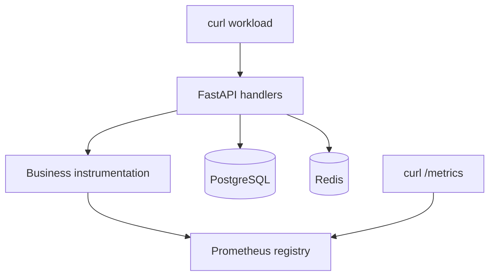
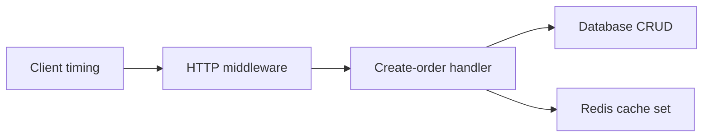
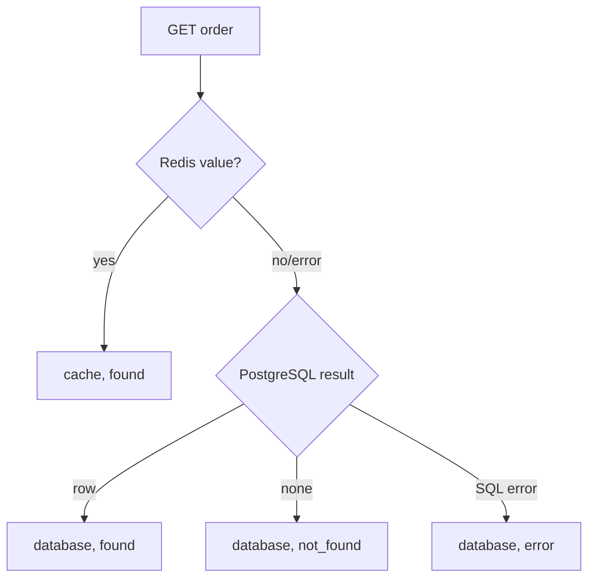
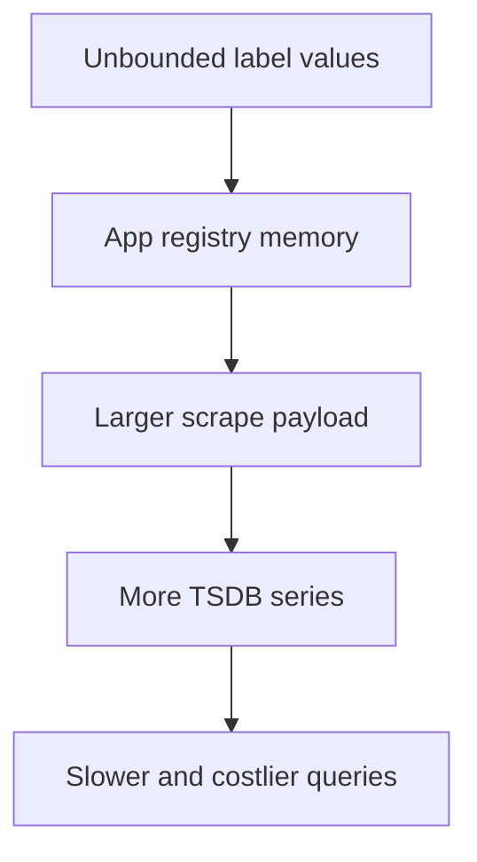
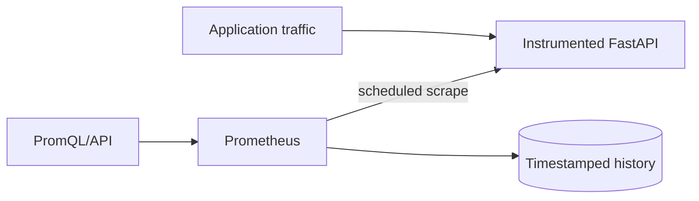

# Lab 03: Designing and Implementing Prometheus Instrumentation

## Purpose and Scope

> **Primary Objective:** Move from reading existing metrics to designing, implementing, testing, and reviewing application instrumentation that answers explicit operational questions.

Lab 01 established application and dependency behavior. Lab 02 taught you to read raw OpenMetrics and reason about counters, gauges, histograms, labels, resets, missing series, and cardinality.

Lab 03 changes your role:

```text
Earlier labs: inspect instrumentation written for you
Lab 03:       design and modify instrumentation yourself
```

You will add four useful measurements, align a histogram bucket with a proposed service objective, test the metric contract, exercise every path, deliberately create a high-cardinality mistake, measure its consequences, and remove it safely.

Prometheus remains stopped. This lab is about the quality of the source signal, not collection or PromQL.

## 1. Inherited State From Lab 02

This lab assumes:

- PostgreSQL, Redis, and the FastAPI application are available;
- OpenTelemetry export is disabled;
- Prometheus and the other observability backends are stopped;
- `/metrics` exposes the native Python Prometheus client registry;
- you understand family, series, sample, label, counter, gauge, and histogram;
- you understand why `/metrics` is a current process snapshot rather than historical storage; and
- your repository has the Git baseline created during initial setup.

Existing PostgreSQL orders may remain. Application metric values will reset whenever the app is rebuilt or restarted.

Do not delete named volumes. No destructive data reset is needed.

## 2. Explicit Scope and Exclusions

Only these services belong in Lab 03:

```text
db
redis
app
```

Keep these services stopped:

```text
prometheus
alertmanager
otel-collector
loki
tempo
grafana
node-exporter
```

This lab does not teach:

- Prometheus target configuration;
- PromQL;
- recording or alert rules;
- Grafana dashboards;
- remote write;
- OpenTelemetry metric export;
- production high availability; or
- database-server internals.

Those topics need good instrumentation first.

## 3. Prerequisites

From the repository root:

```bash
pwd
test -f docker-compose.yml
test -f app/app/metrics.py
test -f app/app/api.py
test -f app/app/main.py
test -f app/tests/test_api_baseline.py
test -f labs/Lab-3.md
test -f .env
```

Verify the required tools:

```bash
docker version
docker compose version
curl --version
jq --version
git --version
make --version
python3 --version
```

Use a code editor available on your VM. The examples name files explicitly, so `vi`, `vim`, `nano`, or a remote editor are all acceptable.

## 4. Learning Objectives

By the end of Lab 03, you must be able to:

- begin metric design with an operational question;
- distinguish transport, business, dependency, runtime, and infrastructure measurements;
- select a counter, gauge, or histogram from the measurement semantics;
- name metrics with a stable namespace, unit, and type suffix;
- define and document a bounded label contract;
- estimate series cardinality before deployment;
- choose histogram buckets around an operational objective;
- instrument success and failure paths without double-counting;
- distinguish HTTP duration, business-operation duration, database duration, and client-observed duration;
- represent the last observed dependency state with a gauge;
- explain why a state gauge can become stale;
- initialize state metrics deliberately;
- add focused unit tests for metric behavior;
- validate code before rebuilding a container;
- exercise lazy metric initialization;
- prove controlled counter and histogram changes;
- create and measure a deliberate high-cardinality anti-pattern;
- distinguish cardinality from churn;
- recover the approved instrumentation using Git;
- explain metric behavior across restarts, workers, and replicas;
- review instrumentation as a public operational interface; and
- state what Prometheus will add in Lab 04.

## 5. Architecture for This Lab



The application contains four measurement layers:

| **Layer**    | **Examples after this lab**                                       | **Primary question**                                          |
|--------------|-------------------------------------------------------------------|---------------------------------------------------------------|
| Transport    | HTTP request counter, duration, in-progress gauge                 | Is the API serving requests correctly and quickly?            |
| Business     | Orders created, item units, order-create duration, lookup results | Is the user-visible business operation succeeding?            |
| Dependency   | DB/cache operations and last observed readiness                   | Which dependency contributes to failure or latency?           |
| Runtime      | `process_*` and `python_*`                                        | Is the application process resource-constrained?              |

Node Exporter and Prometheus are absent, so host-wide infrastructure history remains unavailable.

## 6. Load the Lab Environment

Load the non-secret settings used by later commands:

```bash
set -a
source .env
set +a

LAB_HTTP_HOST="${BIND_ADDRESS:-127.0.0.1}"
if [[ "${LAB_HTTP_HOST}" == "0.0.0.0" || "${LAB_HTTP_HOST}" == "::" ]]; then
  LAB_HTTP_HOST=127.0.0.1
fi

export APP_URL="http://${LAB_HTTP_HOST}:${APP_HOST_PORT:-8000}"
```

Repeat this block in every new terminal. Do not print the full environment because it contains credentials.

## 7. Start the Exact Baseline

Start or reconcile only the application baseline:

```bash
APP_OTEL_ENABLED=false docker compose up -d db redis app
```

Wait for readiness:

```bash
for attempt in {1..30}; do
  response="$(curl -sS "${APP_URL}/health/ready" || true)"
  if jq -e '.status == "ready"' <<<"${response}" >/dev/null 2>&1; then
    echo "Application is ready"
    break
  fi

  if [[ "${attempt}" -eq 30 ]]; then
    echo "Application did not become ready" >&2
    docker compose ps
    docker compose logs --tail=100 app db redis
    exit 1
  fi

  sleep 2
done
```

Confirm the runtime state:

```bash
docker compose ps
curl -fsS "${APP_URL}/health/ready" | jq .
```

## 8. Prove Monitoring Services Are Stopped

Run:

```bash
for service in prometheus alertmanager otel-collector loki tempo grafana node-exporter; do
  if docker compose ps --status running --services | grep -Fxq "${service}"; then
    echo "Unexpected running service: ${service}" >&2
    exit 1
  fi
done

docker compose ps --status running --services | sort
```

Expected active services:

```text
app
db
redis
```

If a monitoring service is active, stop only that group:

```bash
docker compose stop prometheus alertmanager otel-collector loki tempo grafana node-exporter
```

Do not use `docker compose down -v` or `make reset`.

## 9. Create a Safe Git Checkpoint

Confirm that you are inside the Git repository created during setup:

```bash
git rev-parse --is-inside-work-tree
git status --short
```

A blank status is ideal. If tracked changes exist, inspect them:

```bash
git diff
```

Commit intentional work before continuing. Do not blindly discard unknown changes.

Create a lab branch:

```bash
git switch -c lab-03-instrumentation
```

If that branch already exists from an earlier attempt, inspect it before switching:

```bash
git branch --list
git status --short
```

Git is the recovery mechanism for the intentional bad-metric experiment. A copied backup can become stale or be accidentally included in the Docker build context; a reviewed commit records exactly what changed.

## 10. Record the Pre-Change Baseline

Save current metric metadata and response size:

```bash
curl -fsS "${APP_URL}/metrics" -o /tmp/lab3-before.openmetrics

grep -E '^# (HELP|TYPE) obslab_' /tmp/lab3-before.openmetrics \
  > /tmp/lab3-before-families.txt

wc -c /tmp/lab3-before.openmetrics
grep -Ev '^(#|$)' /tmp/lab3-before.openmetrics | wc -l
```

Confirm the new families do not already exist:

```bash
if grep -Eq '^obslab_(order_items|order_create_duration_seconds|order_lookups|dependency_ready)' \
  /tmp/lab3-before.openmetrics; then
  echo "Unexpected Lab 3 metric already exists" >&2
  exit 1
else
  echo "Pre-change registry confirmed"
fi
```

Record the current HTTP histogram boundaries:

```bash
grep '^obslab_http_request_duration_seconds_bucket{' /tmp/lab3-before.openmetrics |
  sed -n '1,20p'
```

The existing finite boundaries do not include `0.3` seconds.

## 11. The Professional Metric-Design Sequence

Use this order:

```text
Operational question
    -> measurement semantics
    -> instrument type
    -> name and unit
    -> label contract
    -> cardinality budget
    -> update locations
    -> failure behavior
    -> lifecycle behavior
    -> tests
    -> consumers
```

Do not start with “Which variables can I export?”

A variable may be easy to expose but useless operationally. Conversely, a critical user journey may require a new measurement boundary that does not already exist in code.

## 12. Separate Measurement Layers

Consider one successful order-creation request:



Each boundary can answer a different question:

| **Measurement**      | **Begins**                  | **Ends**                    | **Includes**                         |
|----------------------|-----------------------------|-----------------------------|--------------------------------------|
| Client duration      | Before client sends         | Response fully received     | Network and client overhead          |
| HTTP server duration | Middleware entry            | Application response        | Framework and handler path           |
| Business duration    | Handler entry               | Handler completion/failure  | DB, cache attempt, domain work       |
| DB create duration   | CRUD operation begins       | Commit/refresh or error     | Database-facing work only            |

Similar-looking durations are not automatically duplicates. They become useful when their boundaries are explicit.

## 13. RED Is Necessary but Not Sufficient

The existing HTTP metrics cover RED ingredients:

- **Rate:** `obslab_http_requests_total`;
- **Errors:** the same counter filtered by status code;
- **Duration:** `obslab_http_request_duration_seconds`.

RED describes service transport behavior. It does not fully answer:

- how many item units were accepted;
- whether a lookup was served from Redis or PostgreSQL;
- how long the create-order business operation took;
- which dependency was last observed ready; or
- whether a transport success produced the intended domain outcome.

Business and dependency metrics complement RED. They do not replace it.

## 14. Write the Operational Questions First

The four new questions are:

1. How many individual item units were included in successfully created orders?
2. What is the distribution of create-order business-operation duration by outcome?
3. How do order lookup results divide by serving source and outcome?
4. What readiness state was last observed for PostgreSQL and Redis?

Write these questions in `lab-notes/Lab-3.md` before adding code.

If a proposed label or metric cannot be tied to an operator decision, challenge it.

## 15. Select the Instrument Types

| **Question**                     | **Semantics**                            | **Type**  | **Why**                       |
|----------------------------------|------------------------------------------|-----------|-------------------------------|
| Item units successfully ordered  | Cumulative non-negative quantity         | Counter   | Increases by order quantity   |
| Create-operation duration        | Distribution of observations             | Histogram | Needs buckets, count, and sum |
| Lookup results                   | Cumulative classified events             | Counter   | One result per API lookup     |
| Last observed readiness          | State that can move 1 → 0 → 1            | Gauge     | May rise or fall              |

A counter does not have to increase by exactly one. A byte counter increases by bytes; an item counter can increase by quantity.

A gauge should not be used for an event total merely because it supports `.inc()`.

## 16. Define the Metric Names and Units

The new names are:

| **Python symbol**          | **Exposed primary sample**                 | **Unit/meaning**        |
|----------------------------|--------------------------------------------|-------------------------|
| `ORDER_ITEMS`              | `obslab_order_items_total`                 | Item units              |
| `ORDER_CREATE_DURATION`    | `obslab_order_create_duration_seconds_*`   | Seconds                 |
| `ORDER_LOOKUPS`            | `obslab_order_lookups_total`               | Lookup results          |
| `DEPENDENCY_READY`         | `obslab_dependency_ready`                  | Dimensionless 0 or 1    |

The `obslab_` namespace prevents collisions and makes ownership visible.

Do not encode dynamic values in a metric name. For example, creating `orders_pending_total`, `orders_paid_total`, and more names for every status makes aggregation and schema evolution harder than one bounded status label.

## 17. Define the Label Contracts

The accepted values are deliberately bounded:

| **Metric**       | **Label**   | **Contract**                                     |
|------------------|-------------|--------------------------------------------------|
| Item Counter     | status      | pending, paid, shipped, cancelled                |
| Create Duration  | outcome     | success, database_error, internal_error          |
| Lookup Counter   | source      | cache, database                                  |
| Lookup Counter   | outcome     | found, not_found, error                          |
| Dependency Gauge | dependency  | postgresql, redis                                |

The schema already bounds order status with a Python `Literal`. The application code owns the remaining value sets.

The Cartesian product is an upper bound, not a promise that every combination will occur. For lookup results, only these combinations are expected:

```text
cache + found
database + found
database + not_found
database + error
```

Do not create nonsensical children such as `cache + database_error` merely to preinitialize every mathematical combination.

## 18. Calculate the Cardinality Budget

Before coding:

- item counter: at most 4 primary counter series;
- create histogram: 3 outcomes × histogram series per outcome;
- lookup counter: at most 4 reachable primary counter series;
- dependency gauge: 2 series.

The proposed business histogram has 12 finite buckets. The client adds:

- one `+Inf` bucket;
- one count;
- one sum; and
- one created-time sample.

That is 16 visible series per initialized outcome, or at most 48 across three outcomes.

The added `0.3` boundary also adds one bucket series for every active HTTP method-route combination. A one-line bucket change can therefore create many stored series later.

Write the estimate before implementation. Cardinality review after production deployment is too late.

## 19. Review Metric Lifecycle

These metrics are process-local:

- they reset when the app process restarts;
- each worker or replica owns independent values;
- labeled children may appear only after first use;
- removed instrumentation disappears from a new app process;
- a stale gauge retains its last value until updated; and
- PostgreSQL business records outlive the counters.

The current container runs one Uvicorn process. A production multi-worker Python deployment needs an explicitly supported multiprocess design or separately scraped instances. Do not assume one worker's registry represents all workers.

## 20. Align a Histogram With a 300-ms Objective

Assume a future objective:

> At least 95% of API requests should finish within 300 milliseconds.

The existing HTTP histogram jumps from 250 ms to 500 ms. Without a 300-ms boundary, the exact count at the objective cannot be obtained from classic buckets.

Add `0.3` as a boundary:

```text
0.25 seconds
0.30 seconds  <- objective boundary
0.50 seconds
```

This improves precision at the decision boundary while adding one series per HTTP label set.

Do not add a bucket every millisecond. Resolution has a cardinality and ingestion cost.

## 21. Approve the Design Before Coding

Your proposed design should now be:

| **Metric**                              | **Type**         | **Labels**                  | **Update point**                     | **Reset behavior** |
|-----------------------------------------|------------------|-----------------------------|--------------------------------------|--------------------|
| `obslab_order_items_total`              | Counter          | status                      | After successful DB create           | App restart        |
| `obslab_order_create_duration_seconds`  | Histogram        | outcome                     | Handler `finally` block              | App restart        |
| `obslab_order_lookups_total`            | Counter          | source, outcome             | Exactly one terminal lookup path     | App restart        |
| `obslab_dependency_ready`               | Gauge            | dependency                  | Startup and readiness checks         | App restart        |
| HTTP duration 0.3 bucket                | Histogram bucket | method, route, le           | Existing middleware                  | App restart        |

Check:

- no user ID, order ID, product, request ID, error message, or raw path label;
- every value set is bounded;
- units are explicit in names;
- success and failure paths are covered;
- the timer is observed in `finally`; and
- no existing metric is silently redefined.

## 22. Inspect the Exact Source Boundaries

Before editing:

```bash
sed -n '1,180p' app/app/metrics.py
sed -n '1,190p' app/app/api.py
sed -n '1,100p' app/app/main.py
```

Locate the relevant symbols:

```bash
grep -nE 'HTTP_DURATION|ORDERS_CREATED|async def readiness|async def create_order|async def get_order|async def lifespan' \
  app/app/metrics.py app/app/api.py app/app/main.py
```

The repository is modular:

- `metrics.py` declares native Prometheus instruments;
- `api.py` updates request/business/dependency instruments;
- `crud.py` owns database operation instrumentation;
- `cache.py` owns Redis operation instrumentation;
- `middleware.py` owns HTTP RED instrumentation; and
- `main.py` owns process startup and shutdown.

Do not copy the supplied older monolithic-lab code into `main.py`.

## 23. Add the SLO-Aligned HTTP Bucket

Open `app/app/metrics.py`. Find:

```python
buckets=(0.005, 0.01, 0.025, 0.05, 0.1, 0.25, 0.5, 1, 2.5, 5, 10, 20),
```

Replace it with:

```python
buckets=(0.005, 0.01, 0.025, 0.05, 0.1, 0.25, 0.3, 0.5, 1, 2.5, 5, 10, 20),
```

Change only the bucket tuple belonging to `HTTP_DURATION`. The database histogram has a different operational range and should not be edited merely for symmetry.

## 24. Add the Four Instrument Declarations

In `app/app/metrics.py`, insert this block immediately after `ORDERS_CREATED` and before `SIMULATIONS`:

```python
ORDER_ITEMS = Counter(
    "obslab_order_items_total",
    "Total item units included in successfully created orders.",
    ["status"],
)
ORDER_CREATE_DURATION = Histogram(
    "obslab_order_create_duration_seconds",
    "Order creation business-operation duration in seconds.",
    ["outcome"],
    buckets=(0.005, 0.01, 0.025, 0.05, 0.1, 0.25, 0.3, 0.5, 1, 2.5, 5, 10),
)
ORDER_LOOKUPS = Counter(
    "obslab_order_lookups_total",
    "Order lookup results by serving source and bounded outcome.",
    ["source", "outcome"],
)
DEPENDENCY_READY = Gauge(
    "obslab_dependency_ready",
    "Last observed dependency readiness: 1 ready, 0 not ready.",
    ["dependency"],
)
```

Do not call `.labels()` at declaration time for every theoretical combination. State gauges will be initialized from real startup evidence; event metrics will initialize when events occur.

## 25. Why the Item Counter Uses status

Two orders can contain different quantities:

```text
Order A: quantity 2
Order B: quantity 7

orders created = 2
item units      = 9
```

The status dimension is bounded by the request schema. It allows operators to separate units accepted directly into different allowed lifecycle states.

The counter must update only after PostgreSQL commits successfully. Incrementing before the durable business action would count rejected or rolled-back work.

## 26. Why the Business Timer Uses outcome

A duration without outcome can show that order creation became slow. Adding a bounded outcome can answer whether failures are slower than successes.

The planned outcomes are:

- `success`;
- `database_error`; and
- `internal_error`.

The default is `internal_error`. The code changes it only after it knows a more specific terminal result. The `finally` block records a duration even when an exception escapes.

Do not use raw exception text as an outcome. That would create uncontrolled labels and could leak data.

## 27. Why Lookup Uses source and outcome

The current cache-aside lookup has four useful terminal paths:



One API lookup increments exactly one new lookup series.

The separate existing cache metric still records whether Redis itself returned hit, miss, or error. The lookup metric describes which source ultimately served or terminated the API lookup.

## 28. Why Dependency Readiness Is Last Observed State

`obslab_dependency_ready{dependency="postgresql"} 1` means:

> The most recent instrumented observation classified PostgreSQL as ready.

It does not mean PostgreSQL is guaranteed healthy at the exact instant someone reads the metric.

A state gauge needs:

- a measurement trigger;
- a timestamp/history supplied later by Prometheus;
- an update policy; and
- missing-target handling.

In this lab, startup and calls to `/health/ready` are the measurement triggers.

## 29. Initialize Dependency State During Startup

In `app/app/main.py`, replace:

```python
from app.metrics import initialize_build_info
```

with:

```python
from app.metrics import DEPENDENCY_READY, initialize_build_info
```

Then change the beginning of `lifespan` so it becomes:

```python
@asynccontextmanager
async def lifespan(_: FastAPI):
    await initialize_database()
    DEPENDENCY_READY.labels("postgresql").set(1)
    try:
        await get_cache_client().ping()
        DEPENDENCY_READY.labels("redis").set(1)
        logger.info("cache.connected")
    except Exception as exc:
        DEPENDENCY_READY.labels("redis").set(0)
        logger.warning("cache.unavailable_at_startup", extra={"error_type": type(exc).__name__})
    initialize_build_info(settings.version, settings.environment, settings.build_sha)
    logger.info(
        "application.started",
        extra={"version": settings.version, "environment": settings.environment},
    )
    yield
    logger.info("application.stopping")
    await close_cache()
    await close_database()
    shutdown_telemetry()
```

PostgreSQL is set to one only after initialization succeeds. If database initialization cannot succeed within its retry deadline, the application does not finish startup, so there is no healthy metric endpoint claiming otherwise.

## 30. Update the api.py Imports

In `app/app/api.py`, add this import after `from sqlalchemy import text`:

```python
from sqlalchemy.exc import SQLAlchemyError
```

Replace the single-line metric import with:

```python
from app.metrics import (
    ALERT_WEBHOOKS,
    DEPENDENCY_READY,
    ORDERS_CREATED,
    ORDER_CREATE_DURATION,
    ORDER_ITEMS,
    ORDER_LOOKUPS,
    SIMULATIONS,
)
```

Use `SQLAlchemyError` rather than catching every exception for the explicit database-error outcome. Unexpected programming errors should remain distinguishable as `internal_error`.

## 31. Instrument the Readiness Endpoint

In `readiness`, immediately after:

```python
ready = database_ok and cache_ok
```

add:

```python
DEPENDENCY_READY.labels("postgresql").set(1 if database_ok else 0)
DEPENDENCY_READY.labels("redis").set(1 if cache_ok else 0)
```

The rest of the endpoint remains unchanged.

The gauge now updates from the exact dependency checks that determine the readiness response. Do not create a separate untested readiness implementation only for metrics.

## 32. Replace create_order With the Instrumented Version

Replace the current `create_order` function in `app/app/api.py` with:

```python
async def create_order(payload: OrderCreate, session: SessionDependency) -> OrderRead:
    operation_started = time.perf_counter()
    outcome = "internal_error"
    try:
        with get_tracer().start_as_current_span("orders.create") as span:
            span.set_attribute("order.product", payload.product)
            span.set_attribute("order.quantity", payload.quantity)
            order = await crud.create_order(session, payload)
            result = OrderRead.model_validate(order)
            await set_cached_order(result)
            ORDERS_CREATED.labels(result.status).inc()
            ORDER_ITEMS.labels(result.status).inc(result.quantity)
            record_order_created(result.status, result.quantity, result.unit_price)
            span.set_attribute("order.id", result.id)
            logger.info(
                "order.created",
                extra={"order_id": result.id, "order_status": result.status},
            )
            outcome = "success"
            return result
    except SQLAlchemyError:
        outcome = "database_error"
        raise
    finally:
        ORDER_CREATE_DURATION.labels(outcome).observe(time.perf_counter() - operation_started)
```

Keep the existing route decorator directly above it.

## 33. Review the Create-Order Invariants

The code must satisfy all of these:

- the timer begins after FastAPI request validation and handler entry;
- `ORDER_ITEMS` increments only after successful database creation;
- its increment amount is `result.quantity`, not one;
- cache failure remains graceful because `set_cached_order` already handles Redis errors;
- database errors retain the global 503 response behavior;
- unexpected exceptions are timed as `internal_error`;
- exactly one duration observation occurs per handler invocation; and
- existing traces, logs, counters, and cache behavior remain intact.

Instrumentation must not change business correctness.

## 34. Add Lookup Outcome Instrumentation

In the existing `get_order` function, make these additions:

```python
async def get_order(order_id: int, session: SessionDependency) -> OrderRead:
    with get_tracer().start_as_current_span("orders.get") as span:
        span.set_attribute("order.id", order_id)
        cached = await get_cached_order(order_id)
        if cached is not None:
            span.set_attribute("cache.hit", True)
            ORDER_LOOKUPS.labels("cache", "found").inc()
            return cached

        span.set_attribute("cache.hit", False)
        try:
            order = await crud.get_order(session, order_id)
        except SQLAlchemyError:
            ORDER_LOOKUPS.labels("database", "error").inc()
            raise
        if order is None:
            ORDER_LOOKUPS.labels("database", "not_found").inc()
            raise HTTPException(status_code=404, detail="Order not found")
        result = OrderRead.model_validate(order)
        await set_cached_order(result)
        ORDER_LOOKUPS.labels("database", "found").inc()
        return result
```

Keep the existing route decorator above the function.

## 35. Prove There Is No Lookup Double-Counting

Trace each terminal path:

| **Path**                                               | **Increment**         |
|--------------------------------------------------------|-----------------------|
| Redis returns a cached order                           | cache, found          |
| Redis misses and DB returns a row                      | database, found       |
| Redis misses and DB returns none                       | database, not_found   |
| Redis misses/errors and DB raises SQLAlchemyError      | database, error       |

Each path returns or raises immediately after its increment. Therefore one API invocation cannot increment two lookup-result combinations.

This is worth reviewing explicitly. Counters placed both before and after a branch commonly double-count.

## 36. Preserve Existing Dependency Metrics

Do not remove or rename:

- `obslab_cache_operations_total`;
- `obslab_database_operations_total`; or
- `obslab_database_operation_duration_seconds`.

The new lookup counter has a different semantic boundary:

```text
cache operation metric     -> what Redis did
database operation metric  -> what CRUD did
lookup result metric       -> how the API lookup terminated
```

Overlapping code paths do not imply duplicate metrics when the operational questions differ.

## 37. Add Focused Metric Contract Tests

Create `app/tests/test_metric_design.py` with:

```python
from prometheus_client.metrics import MetricWrapperBase

from app.metrics import (
    DEPENDENCY_READY,
    HTTP_DURATION,
    ORDER_CREATE_DURATION,
    ORDER_ITEMS,
    ORDER_LOOKUPS,
)


def _sample_value(
    collector: MetricWrapperBase,
    sample_name: str,
    expected_labels: dict[str, str],
) -> float:
    for family in collector.collect():
        for sample in family.samples:
            if sample.name == sample_name and sample.labels == expected_labels:
                return float(sample.value)
    return 0.0


def test_http_histogram_contains_slo_bucket() -> None:
    labels = {"method": "GET", "route": "/lab-3-test"}
    before = _sample_value(
        HTTP_DURATION,
        "obslab_http_request_duration_seconds_bucket",
        {**labels, "le": "0.3"},
    )
    HTTP_DURATION.labels(**labels).observe(0.29)
    after = _sample_value(
        HTTP_DURATION,
        "obslab_http_request_duration_seconds_bucket",
        {**labels, "le": "0.3"},
    )
    assert after - before == 1


def test_order_item_counter_increments_by_quantity() -> None:
    labels = {"status": "pending"}
    before = _sample_value(ORDER_ITEMS, "obslab_order_items_total", labels)
    ORDER_ITEMS.labels(**labels).inc(7)
    after = _sample_value(ORDER_ITEMS, "obslab_order_items_total", labels)
    assert after - before == 7


def test_order_create_histogram_records_success() -> None:
    labels = {"outcome": "success"}
    before = _sample_value(
        ORDER_CREATE_DURATION,
        "obslab_order_create_duration_seconds_count",
        labels,
    )
    ORDER_CREATE_DURATION.labels(**labels).observe(0.2)
    after = _sample_value(
        ORDER_CREATE_DURATION,
        "obslab_order_create_duration_seconds_count",
        labels,
    )
    assert after - before == 1


def test_lookup_counter_uses_bounded_dimensions() -> None:
    labels = {"source": "database", "outcome": "not_found"}
    before = _sample_value(ORDER_LOOKUPS, "obslab_order_lookups_total", labels)
    ORDER_LOOKUPS.labels(**labels).inc()
    after = _sample_value(ORDER_LOOKUPS, "obslab_order_lookups_total", labels)
    assert after - before == 1


def test_dependency_readiness_is_a_gauge() -> None:
    labels = {"dependency": "postgresql"}
    DEPENDENCY_READY.labels(**labels).set(0)
    assert _sample_value(DEPENDENCY_READY, "obslab_dependency_ready", labels) == 0
    DEPENDENCY_READY.labels(**labels).set(1)
    assert _sample_value(DEPENDENCY_READY, "obslab_dependency_ready", labels) == 1
```

These tests use before/after deltas because collectors are module-level objects in one process.

## 38. Understand What the Tests Prove

The tests prove:

- the 300-ms HTTP bucket exists and receives a qualifying observation;
- item units can increase by quantity;
- the business histogram count increases after an observation;
- lookup labels produce the intended bounded series;
- dependency readiness can move down and up.

They do not prove:

- the production route wiring is correct;
- PostgreSQL and Redis are reachable;
- every failure path is exercised;
- scrape configuration works; or
- historical PromQL is correct.

Unit tests and runtime experiments provide different evidence. You need both.

## 39. Validate the Cheapest Layer First

Parse the edited Python without building an image:

```bash
python3 -m py_compile \
  app/app/metrics.py \
  app/app/api.py \
  app/app/main.py \
  app/tests/test_metric_design.py
```

Expected result: no output and exit code zero.

Make the new test file visible to ordinary Git diffs without staging its content:

```bash
git add --intent-to-add app/tests/test_metric_design.py
```

Then inspect for trailing whitespace or conflict markers:

```bash
git diff --check
grep -R --include='*.py' -nE '^(<<<<<<<|=======|>>>>>>>)' app/app app/tests || true
```

Do not respond to a Python syntax error by pruning Docker or deleting volumes. Fix the failing layer.

## 40. Review the Source Diff

Run:

```bash
git diff --stat
git diff -- app/app/metrics.py app/app/api.py app/app/main.py app/tests/test_metric_design.py
```

Review each changed line against the design table from Section 3.21.

Specifically check:

- `0.3` was added only to the HTTP and new business histograms;
- all metric names retain `obslab_`;
- label names match call sites;
- no raw product or order ID label exists;
- imports are used;
- the create timer is in `finally`; and
- lookup increments are terminal and mutually exclusive.

Do not rebuild until the diff is explainable.

## 41. Run the Containerized Test and Lint Gates

The repository test target builds a disposable test image:

```bash
make test
```

Then run linting:

```bash
make lint
```

Expected:

- all tests pass;
- Ruff reports no selected violations; and
- the runtime containers are not replaced by these disposable test commands.

If a test fails, read the first causal error rather than the final summary line.

## 42. Rebuild Only the Application

The Dockerfile copies source into the image; the running container does not use a source bind mount. Rebuild and recreate only `app`:

```bash
APP_OTEL_ENABLED=false docker compose up -d --build --no-deps app
```

Wait for the app:

```bash
for attempt in {1..30}; do
  if curl -fsS "${APP_URL}/health/live" >/dev/null 2>&1; then
    echo "Application is live"
    break
  fi

  if [[ "${attempt}" -eq 30 ]]; then
    docker compose logs --tail=150 app
    exit 1
  fi

  sleep 2
done
```

This rebuild starts a fresh metric epoch. Old in-process counter values are expected to disappear.

## 43. Prove Business Behavior Still Works

Check readiness:

```bash
curl -fsS "${APP_URL}/health/ready" | jq .
```

Create a smoke-test order:

```bash
smoke_order="$(curl -fsS -X POST "${APP_URL}/api/v1/orders" \
  -H 'Content-Type: application/json' \
  -d '{"customer_name":"Lab 03 Smoke","product":"instrumentation-check","quantity":1,"unit_price":"10.00"}')"

smoke_order_id="$(jq -r '.id' <<<"${smoke_order}")"
test "${smoke_order_id}" != "null"
curl -fsS "${APP_URL}/api/v1/orders/${smoke_order_id}" | jq .
```

Instrumentation is unacceptable if it breaks the underlying API.

## 44. Verify New Metric Metadata

Save a fresh exposition:

```bash
curl -fsS "${APP_URL}/metrics" -o /tmp/lab3-good.openmetrics

grep -E '^# (HELP|TYPE) obslab_(order_items|order_create_duration_seconds|order_lookups|dependency_ready)' \
  /tmp/lab3-good.openmetrics
```

Expected types:

| **Family**                              | **Type**  |
|-----------------------------------------|-----------|
| `obslab_order_items`                    | Counter   |
| `obslab_order_create_duration_seconds`  | Histogram |
| `obslab_order_lookups`                  | Counter   |
| `obslab_dependency_ready`               | Gauge     |

The OpenMetrics family base name and emitted counter sample suffix may differ, as learned in Lab 02.

## 45. Verify the 300-ms Buckets

Check the HTTP family:

```bash
curl -fsS "${APP_URL}/metrics" |
  grep '^obslab_http_request_duration_seconds_bucket{' |
  grep 'le="0.3"' |
  head
```

Check the business family:

```bash
curl -fsS "${APP_URL}/metrics" |
  grep '^obslab_order_create_duration_seconds_bucket{' |
  grep 'le="0.3"'
```

The business histogram should already have a success label set because the smoke order exercised it.

## 46. Observe Lazy Series Initialization

Inspect lookup samples:

```bash
curl -fsS "${APP_URL}/metrics" |
  grep '^obslab_order_lookups_' || true
```

You may see only `cache, found` from the smoke-order GET. Other label combinations do not exist until their paths execute.

A declaration defines the allowed instrument shape in code; it does not necessarily pre-create every labeled series.

## 47. Define a Reusable Raw-Sample Reader

Define a helper for exact metric names and up to three literal label fragments:

```bash
read_sample() {
  local metric="$1"
  local label_one="${2:-}"
  local label_two="${3:-}"
  local label_three="${4:-}"

  curl -fsS "${APP_URL}/metrics" |
    awk -v metric="${metric}" \
        -v one="${label_one}" \
        -v two="${label_two}" \
        -v three="${label_three}" '
      $1 ~ ("^" metric "{") &&
      (one == "" || index($0, one)) &&
      (two == "" || index($0, two)) &&
      (three == "" || index($0, three)) {
        print $2
        found=1
      }
      END { if (!found) print 0 }
    '
}
```

Test it:

```bash
read_sample obslab_dependency_ready 'dependency="postgresql"'
read_sample obslab_order_items_total 'status="pending"'
```

The helper returns zero for an absent series only to support controlled lab arithmetic. It does not erase the conceptual difference between absent and observed zero.

## 48. Prove the Item Counter Increments by Quantity

Capture both business counters:

```bash
orders_before="$(read_sample obslab_orders_created_total 'status="pending"')"
items_before="$(read_sample obslab_order_items_total 'status="pending"')"
```

Create one order containing seven units:

```bash
quantity_order="$(curl -fsS -X POST "${APP_URL}/api/v1/orders" \
  -H 'Content-Type: application/json' \
  -d '{"customer_name":"Lab 03 Quantity","product":"counter-units","quantity":7,"unit_price":"12.00"}')"

quantity_order_id="$(jq -r '.id' <<<"${quantity_order}")"
test "${quantity_order_id}" != "null"
```

Calculate deltas:

```bash
orders_after="$(read_sample obslab_orders_created_total 'status="pending"')"
items_after="$(read_sample obslab_order_items_total 'status="pending"')"

awk \
  -v orders_before="${orders_before}" \
  -v orders_after="${orders_after}" \
  -v items_before="${items_before}" \
  -v items_after="${items_after}" '
  BEGIN {
    printf "orders delta: %.0f\n", orders_after-orders_before
    printf "items delta:  %.0f\n", items_after-items_before
  }
'
```

Expected:

```text
orders delta: 1
items delta:  7
```

One request, one order, and seven units are three distinct semantics.

## 49. Deleting the Order Does Not Decrement Counters

Delete the quantity-test order:

```bash
delete_status="$(curl -sS -o /dev/null -w '%{http_code}' \
  -X DELETE "${APP_URL}/api/v1/orders/${quantity_order_id}")"

test "${delete_status}" = "204"

read_sample obslab_orders_created_total 'status="pending"'
read_sample obslab_order_items_total 'status="pending"'
```

The counters do not decrease. They describe successful historical events in the current process epoch, not current database inventory.

A gauge would be required for “orders currently present,” and maintaining that gauge correctly across external writers and restarts would require a clear synchronization design.

## 50. Exercise a Cache-Served Lookup

The create endpoint populates Redis. Request the smoke order again:

```bash
curl -fsS "${APP_URL}/api/v1/orders/${smoke_order_id}" >/dev/null

read_sample \
  obslab_order_lookups_total \
  'source="cache"' \
  'outcome="found"'
```

This series should increase.

Also inspect the existing cache operation series:

```bash
curl -fsS "${APP_URL}/metrics" |
  grep '^obslab_cache_operations_total{' |
  sort
```

The cache operation and API lookup result answer related but different questions.

## 51. Exercise a Database-Served Lookup

Delete only the disposable Redis cache key:

```bash
docker compose exec -T redis redis-cli DEL "order:${smoke_order_id}" >/dev/null
```

Then request the existing order:

```bash
curl -fsS "${APP_URL}/api/v1/orders/${smoke_order_id}" >/dev/null

read_sample \
  obslab_order_lookups_total \
  'source="database"' \
  'outcome="found"'
```

The database-served series should increase. The endpoint also repopulates Redis, so a subsequent read should return to `cache, found`.

## 52. Exercise a Not-Found Lookup

Choose an ID that is not expected to exist and remove any matching cache key:

```bash
export LAB3_MISSING_ORDER_ID=2000000000
docker compose exec -T redis redis-cli DEL "order:${LAB3_MISSING_ORDER_ID}" >/dev/null
```

Capture the expected 404:

```bash
missing_status="$(curl -sS -o /tmp/lab3-not-found.json -w '%{http_code}' \
  "${APP_URL}/api/v1/orders/${LAB3_MISSING_ORDER_ID}")"

printf 'status=%s\n' "${missing_status}"
jq . /tmp/lab3-not-found.json
test "${missing_status}" = "404"
```

Inspect:

```bash
read_sample \
  obslab_order_lookups_total \
  'source="database"' \
  'outcome="not_found"'
```

A not-found result is a valid completed database query, so the existing database operation metric can record `operation="get", outcome="success"` while the business lookup counter records `not_found`. The layers describe different semantics.

## 53. Inventory the Reachable Lookup Series

Run:

```bash
curl -fsS "${APP_URL}/metrics" |
  grep '^obslab_order_lookups_total{' |
  sort
```

Expected so far:

```text
source="cache", outcome="found"
source="database", outcome="found"
source="database", outcome="not_found"
```

Exact sample order and absolute values can differ. The value set should remain bounded.

Record why `order_id` is absent from these labels.

## 54. Inspect the Business Histogram

Run:

```bash
curl -fsS "${APP_URL}/metrics" |
  grep '^obslab_order_create_duration_seconds_' |
  grep 'outcome="success"'
```

Identify:

- cumulative buckets;
- `count`;
- `sum`;
- `created`; and
- the `le="0.3"` boundary.

The count should equal the number of successful create-handler invocations in the current process epoch.

## 55. Compare Four Duration Boundaries

Capture three server-side sums:

```bash
http_sum_before="$(read_sample \
  obslab_http_request_duration_seconds_sum \
  'method="POST"' \
  'route="/api/v1/orders"')"

business_sum_before="$(read_sample \
  obslab_order_create_duration_seconds_sum \
  'outcome="success"')"

database_sum_before="$(read_sample \
  obslab_database_operation_duration_seconds_sum \
  'operation="create"')"
```

Make exactly one controlled POST and capture client time:

```bash
client_seconds="$(curl -fsS -o /tmp/lab3-duration-order.json -w '%{time_total}' \
  -X POST "${APP_URL}/api/v1/orders" \
  -H 'Content-Type: application/json' \
  -d '{"customer_name":"Lab 03 Timing","product":"duration-boundaries","quantity":1,"unit_price":"15.00"}')"

jq -e '.id' /tmp/lab3-duration-order.json >/dev/null
```

Capture final sums and calculate the single-request deltas:

```bash
http_sum_after="$(read_sample \
  obslab_http_request_duration_seconds_sum \
  'method="POST"' \
  'route="/api/v1/orders"')"

business_sum_after="$(read_sample \
  obslab_order_create_duration_seconds_sum \
  'outcome="success"')"

database_sum_after="$(read_sample \
  obslab_database_operation_duration_seconds_sum \
  'operation="create"')"

awk \
  -v client="${client_seconds}" \
  -v hb="${http_sum_before}" -v ha="${http_sum_after}" \
  -v bb="${business_sum_before}" -v ba="${business_sum_after}" \
  -v db="${database_sum_before}" -v da="${database_sum_after}" '
  BEGIN {
    printf "client observed: %.6f s\n", client
    printf "HTTP delta:     %.6f s\n", ha-hb
    printf "business delta: %.6f s\n", ba-bb
    printf "database delta: %.6f s\n", da-db
  }
'
```

Do not expect exact equality. The boundaries include different work, and timing contains scheduler and measurement noise.

## 56. Interpret the Duration Comparison

A likely nesting is:

```text
client duration
  >= server HTTP duration
      >= business create duration
          >= database create duration
```

Small deviations can occur because:

- clocks are read at different locations;
- the response body may be transmitted after server instrumentation;
- asynchronous scheduling introduces noise;
- cache and logging work occur outside the DB timer; and
- one sample is not statistically representative.

The experiment proves boundary semantics, not performance capacity. Load and statistical analysis come later.

## 57. Inspect Healthy Dependency State

A successful startup and readiness request should have initialized both gauges:

```bash
curl -fsS "${APP_URL}/health/ready" >/dev/null

curl -fsS "${APP_URL}/metrics" |
  grep '^obslab_dependency_ready{' |
  sort
```

Expected:

```text
obslab_dependency_ready{dependency="postgresql"} 1.0
obslab_dependency_ready{dependency="redis"} 1.0
```

Predict what the PostgreSQL value will show immediately after PostgreSQL stops but before another readiness request.

Write the prediction before continuing.

## 58. Stop PostgreSQL Within a Bounded Failure Window

Stop only PostgreSQL:

```bash
docker compose stop db
docker compose ps
```

Confirm the app remains live:

```bash
curl -fsS "${APP_URL}/health/live" | jq .
```

Do not leave PostgreSQL stopped while stepping away from the lab.

## 59. Observe a Temporally Stale Gauge

Before calling readiness, inspect the gauge:

```bash
read_sample obslab_dependency_ready 'dependency="postgresql"'
```

It will commonly remain one.

Reality changed, but the instrument's update trigger has not run. This is not a race to hide; it is the exact behavior the gauge contract describes.

The process health check calls `/health/live`, not `/health/ready`, so it does not refresh dependency state.

## 60. Refresh the Gauge Through Readiness

Call readiness without `--fail` because HTTP 503 is expected:

```bash
ready_status="$(curl -sS -o /tmp/lab3-not-ready.json -w '%{http_code}' \
  "${APP_URL}/health/ready")"

printf 'status=%s\n' "${ready_status}"
jq . /tmp/lab3-not-ready.json
test "${ready_status}" = "503"
```

Now inspect:

```bash
read_sample obslab_dependency_ready 'dependency="postgresql"'
read_sample obslab_dependency_ready 'dependency="redis"'
```

Expected:

- PostgreSQL: zero;
- Redis: one.

One readiness observation updates both dependency children.

## 61. Exercise the Lookup Database-Error Outcome

Ensure the large missing ID has no cache entry:

```bash
docker compose exec -T redis redis-cli DEL "order:${LAB3_MISSING_ORDER_ID}" >/dev/null
```

Request it while PostgreSQL is stopped:

```bash
lookup_error_status="$(curl -sS -o /tmp/lab3-lookup-db-error.json -w '%{http_code}' \
  "${APP_URL}/api/v1/orders/${LAB3_MISSING_ORDER_ID}")"

printf 'status=%s\n' "${lookup_error_status}"
jq . /tmp/lab3-lookup-db-error.json
test "${lookup_error_status}" = "503"
```

Inspect:

```bash
read_sample \
  obslab_order_lookups_total \
  'source="database"' \
  'outcome="error"'
```

The existing DB operation counter should also have an error child for `operation="get"`.

Also prove that a failed create is timed but does not increment success counters:

```bash
failed_orders_before="$(read_sample obslab_orders_created_total 'status="pending"')"
failed_items_before="$(read_sample obslab_order_items_total 'status="pending"')"
failed_duration_before="$(read_sample \
  obslab_order_create_duration_seconds_count \
  'outcome="database_error"')"

create_error_status="$(curl -sS -o /tmp/lab3-create-db-error.json -w '%{http_code}' \
  -X POST "${APP_URL}/api/v1/orders" \
  -H 'Content-Type: application/json' \
  -d '{"customer_name":"Lab 03 Failure","product":"must-not-commit","quantity":5,"unit_price":"20.00"}')"

printf 'status=%s\n' "${create_error_status}"
jq . /tmp/lab3-create-db-error.json
test "${create_error_status}" = "503"

failed_orders_after="$(read_sample obslab_orders_created_total 'status="pending"')"
failed_items_after="$(read_sample obslab_order_items_total 'status="pending"')"
failed_duration_after="$(read_sample \
  obslab_order_create_duration_seconds_count \
  'outcome="database_error"')"

awk \
  -v ob="${failed_orders_before}" -v oa="${failed_orders_after}" \
  -v ib="${failed_items_before}" -v ia="${failed_items_after}" \
  -v db="${failed_duration_before}" -v da="${failed_duration_after}" '
  BEGIN {
    printf "orders-created delta: %.0f\n", oa-ob
    printf "ordered-items delta:  %.0f\n", ia-ib
    printf "failed-duration count delta: %.0f\n", da-db
  }
'
```

Expected deltas:

```text
orders-created delta: 0
ordered-items delta:  0
failed-duration count delta: 1
```

The database rejected the business operation, so success counters remain unchanged while the failure timer records the attempt.

## 62. Restore PostgreSQL

Start the database:

```bash
docker compose start db
```

Wait for its container health check:

```bash
for attempt in {1..30}; do
  db_container="$(docker compose ps -q db)"
  db_health="$(docker inspect -f '{{.State.Health.Status}}' "${db_container}" 2>/dev/null || true)"

  if [[ "${db_health}" == "healthy" ]]; then
    echo "PostgreSQL is healthy"
    break
  fi

  if [[ "${attempt}" -eq 30 ]]; then
    docker compose logs --tail=100 db
    exit 1
  fi

  sleep 2
done
```

Do not continue until PostgreSQL is healthy.

## 63. Observe Staleness During Recovery

Immediately read the gauge:

```bash
read_sample obslab_dependency_ready 'dependency="postgresql"'
```

It can remain zero even though the container is healthy, because the last application readiness observation occurred during failure.

Now refresh it:

```bash
curl -fsS "${APP_URL}/health/ready" | jq .
read_sample obslab_dependency_ready 'dependency="postgresql"'
```

Expected final value: one.

A future alert should combine state, freshness, and target reachability rather than treating an old gauge as timeless truth.

## 64. Prove Full Recovery

Verify all three services and core behavior:

```bash
docker compose ps
curl -fsS "${APP_URL}/health/live" | jq .
curl -fsS "${APP_URL}/health/ready" | jq .
curl -fsS "${APP_URL}/api/v1/orders/${smoke_order_id}" | jq .
```

Inspect recent application logs:

```bash
docker compose logs --tail=80 app
```

Recovery proof must include useful work, not merely a running container.

## 65. State the Measurement-versus-Reality Lesson

Your evidence should show:

```text
Dependency changes
    -> gauge does not change automatically
    -> an instrumented observation runs
    -> gauge records the new conclusion
```

This is why a metric contract must say “last observed readiness,” not simply “dependency is ready.”

Alternative production designs include:

- a periodic internal checker;
- Prometheus probing a health endpoint;
- a dedicated blackbox probe;
- an exporter querying the dependency; or
- multiple independent signals.

Each choice has a freshness interval, failure mode, and cost.

## 66. Commit the Approved Instrumentation

Review one final time:

```bash
git diff --check
git diff --stat
make test
make lint
```

Commit only the approved good state:

```bash
git add \
  app/app/metrics.py \
  app/app/api.py \
  app/app/main.py \
  app/tests/test_metric_design.py

git commit -m "Add Lab 03 application instrumentation"
```

Confirm a clean tracked state:

```bash
git status --short
```

Your notebook is ignored by design, so it may not appear.

This commit is the rollback boundary for the deliberate mistake.

## 67. Define the Deliberately Bad Requirement

A developer proposes:

> Count lookup attempts for every individual order ID by adding order_id as a counter label.

It sounds diagnostic, but order IDs grow with business activity. The label value set is unbounded.

You will implement it temporarily to measure:

- series count;
- auxiliary created-time series;
- exposition size;
- registry persistence until restart; and
- the difference from normalized route instrumentation.

The generated workload is bounded to 300 sequential requests.

## 68. Add the Bad Metric Declaration

In `app/app/metrics.py`, insert this temporary declaration immediately before `SIMULATIONS`:

```python
LAB_BAD_ORDER_LOOKUPS = Counter(
    "obslab_lab_bad_order_lookups_total",
    "INTENTIONALLY BAD: lookup attempts labeled by unbounded order ID.",
    ["order_id"],
)
```

The `LAB_BAD` prefix communicates that this family must never survive the lab.

## 69. Wire the Bad Label Into get_order

Add `LAB_BAD_ORDER_LOOKUPS` to the metric import list in `app/app/api.py`.

Then add this as the first line inside `get_order`:

```python
LAB_BAD_ORDER_LOOKUPS.labels(order_id=str(order_id)).inc()
```

The beginning should resemble:

```python
async def get_order(order_id: int, session: SessionDependency) -> OrderRead:
    LAB_BAD_ORDER_LOOKUPS.labels(order_id=str(order_id)).inc()
    with get_tracer().start_as_current_span("orders.get") as span:
        ...
```

This is intentionally wrong. Do not commit it.

## 70. Validate and Rebuild the Bad Variant

Run the cheapest checks:

```bash
python3 -m py_compile app/app/metrics.py app/app/api.py
git diff --check
```

Confirm only two files are uncommitted:

```bash
git status --short
```

Rebuild the app:

```bash
APP_OTEL_ENABLED=false docker compose up -d --build --no-deps app
until curl -fsS "${APP_URL}/health/ready" >/dev/null 2>&1; do
  sleep 1
done
```

The rebuild starts a fresh process, so capture a comparable baseline **after** the bad declaration exists but before it has any labeled children:

```bash
curl -fsS "${APP_URL}/metrics" -o /tmp/lab3-bad-before.openmetrics

bad_bytes_before="$(wc -c < /tmp/lab3-bad-before.openmetrics)"
bad_samples_before="$(grep -Ev '^(#|$)' /tmp/lab3-bad-before.openmetrics | wc -l)"

printf 'bytes_before=%s samples_before=%s\n' \
  "${bad_bytes_before}" "${bad_samples_before}"
```

A label-bearing counter can be declared while its labeled samples remain absent.

## 71. Generate 300 Unique Label Values

Run a sequential, read-only workload:

```bash
export LAB3_BAD_ID_START=2000000000
export LAB3_BAD_ID_END=2000000299

for order_id in $(seq "${LAB3_BAD_ID_START}" "${LAB3_BAD_ID_END}"); do
  curl -sS -o /dev/null \
    "${APP_URL}/api/v1/orders/${order_id}"
done
```

Most or all responses should be 404. The loop does not use `--fail` because that response is expected.

The database receives bounded read traffic; no orders are created or modified.

## 72. Count the Series Explosion

Capture the new exposition:

```bash
curl -fsS "${APP_URL}/metrics" -o /tmp/lab3-bad-after.openmetrics

bad_primary="$(grep -c '^obslab_lab_bad_order_lookups_total{' \
  /tmp/lab3-bad-after.openmetrics)"

bad_created="$(grep -c '^obslab_lab_bad_order_lookups_created{' \
  /tmp/lab3-bad-after.openmetrics)"

bad_bytes_after="$(wc -c < /tmp/lab3-bad-after.openmetrics)"
bad_samples_after="$(grep -Ev '^(#|$)' /tmp/lab3-bad-after.openmetrics | wc -l)"

printf 'primary_series=%s created_series=%s\n' \
  "${bad_primary}" "${bad_created}"

printf 'bytes_before=%s bytes_after=%s delta=%s\n' \
  "${bad_bytes_before}" \
  "${bad_bytes_after}" \
  "$((bad_bytes_after-bad_bytes_before))"

printf 'samples_before=%s samples_after=%s delta=%s\n' \
  "${bad_samples_before}" \
  "${bad_samples_after}" \
  "$((bad_samples_after-bad_samples_before))"
```

Expected:

- 300 primary counter series;
- 300 auxiliary created-time series;
- roughly 600 new sample lines from this one family; and
- a substantial response-size increase.

The exact overall delta includes other newly initialized bounded series from the requests.

## 73. Inspect the Bad Identities

View a small sample:

```bash
grep '^obslab_lab_bad_order_lookups_total{' \
  /tmp/lab3-bad-after.openmetrics |
  sed -n '1,10p'
```

Every order ID creates a distinct series identity:

```text
metric name + order_id="2000000000"
metric name + order_id="2000000001"
metric name + order_id="2000000002"
...
```

The value one is not the main cost. The growing identity set is.

## 74. Compare the Bounded Instrumentation

Count the corresponding HTTP counter series:

```bash
grep '^obslab_http_requests_total{' /tmp/lab3-bad-after.openmetrics |
  grep 'method="GET"' |
  grep 'route="/api/v1/orders/{order_id}"' |
  wc -l
```

Inspect lookup outcomes:

```bash
grep '^obslab_order_lookups_total{' /tmp/lab3-bad-after.openmetrics |
  sort
```

Three hundred concrete URLs collapse into:

- one normalized route template;
- one or a few bounded HTTP status series; and
- a bounded `database, not_found` lookup result.

Good metrics preserve operational dimensions without copying event identity.

## 75. Understand the Cost Path

High-cardinality instrumentation consumes resources at every layer:



Later it also affects:

- WAL and block creation;
- retention disk;
- remote-write bandwidth;
- compaction;
- dashboard query fan-out;
- recording rule evaluation; and
- alert evaluation.

A dashboard variable cannot repair the cost after ingestion. The source schema must be corrected.

## 76. Restore the Approved Good State

Do not manually hunt through the file and risk leaving one bad line. Restore the two uncommitted files from the good commit:

```bash
git restore app/app/metrics.py app/app/api.py
git status --short
```

Confirm the bad symbol is absent from source:

```bash
if grep -R --include='*.py' -n \
  'LAB_BAD_ORDER_LOOKUPS\|obslab_lab_bad_order_lookups' app/app; then
  echo "Bad instrumentation remains" >&2
  exit 1
else
  echo "Bad instrumentation removed from source"
fi
```

Rebuild:

```bash
APP_OTEL_ENABLED=false docker compose up -d --build --no-deps app
until curl -fsS "${APP_URL}/health/ready" >/dev/null 2>&1; do
  sleep 1
done
```

## 77. Prove the Bad Family Is Gone

Run:

```bash
if curl -fsS "${APP_URL}/metrics" |
  grep -q '^obslab_lab_bad_order_lookups'; then
  echo "Bad metric still exposed" >&2
  exit 1
else
  echo "Bad metric family is absent"
fi
```

The bad series disappeared from the endpoint because:

- the declaration and update were removed; and
- rebuilding replaced the process and its registry.

Prometheus is not running, so there is no historical TSDB retaining the earlier samples. In a monitored system, old series would become stale and remain in historical storage until retention removes them.

## 78. Distinguish Cardinality From Churn

**Cardinality** is the number of active or stored series identities at a time.

**Churn** is the rate at which new series appear and old series stop receiving samples.

An order-ID label causes both:

- cardinality grows as new IDs are queried;
- each generation of IDs creates new series;
- older IDs may stop appearing but remain stored historically; and
- indexes and compaction repeatedly process new identities.

A bounded label can also churn if its values encode changing deployment-generated identifiers. Review both the maximum set and how quickly it changes.

## 79. Choose Better Alternatives for Event Identity

If someone needs per-order lookup detail, use:

- a structured log with order ID and outcome;
- a trace/span attribute for a sampled request;
- an audit event when compliance requires it; or
- a database query for authoritative history.

Then use bounded metrics for aggregate decisions:

```text
lookup rate by outcome
cache-served fraction
database-error rate
latency distribution
```

Logs and traces are not free, but their storage/index model is designed for event-level context better than metric labels.

Never put secrets or unnecessary personal data into any telemetry signal.

## 80. Instrumentation Is Still Not Monitoring

At this point the application can expose better metrics, but you still cannot reliably ask:

- request rate over five minutes;
- error ratio over a window;
- p95 latency over time;
- whether a target was down ten minutes ago;
- which series became stale; or
- how behavior changed across a deployment.

Instrumentation creates observations. Prometheus will schedule collection, attach target identity, store samples, and evaluate PromQL.

A correct metric endpoint is necessary but not sufficient for monitoring.

## 81. Troubleshooting Guide

### A. Python compilation fails

Run one file at a time:

```bash
python3 -m py_compile app/app/metrics.py
python3 -m py_compile app/app/api.py
python3 -m py_compile app/app/main.py
python3 -m py_compile app/tests/test_metric_design.py
```

Fix the first syntax error at the named line.

### B. ImportError names a new metric

Check spelling in declaration and import:

```bash
grep -R --include='*.py' -nE \
  'ORDER_ITEMS|ORDER_CREATE_DURATION|ORDER_LOOKUPS|DEPENDENCY_READY' \
  app/app app/tests
```

Python symbol names and exposed metric names are different contracts.

### C. Duplicate timeseries error appears

A metric was likely declared twice in the default registry or a module was imported through two paths. Search all declarations:

```bash
grep -R --include='*.py' -n \
  'obslab_order_items_total\|obslab_order_create_duration_seconds' app
```

Keep one declaration in `metrics.py`.

### D. POST returns 422

Inspect the response body:

```bash
curl -sS -X POST "${APP_URL}/api/v1/orders" \
  -H 'Content-Type: application/json' \
  -d '{}' | jq .
```

The current schema requires `customer_name`, `product`, `quantity`, and `unit_price`. The field is `product`, not `item`.

### E. New metric metadata exists but no samples appear

Exercise the labeled code path. Child series initialize lazily.

### F. The 0.3 bucket does not appear

Confirm the running image was rebuilt:

```bash
grep -n '0.3' app/app/metrics.py
docker compose images app
docker compose logs --tail=100 app
```

Then generate a request for the label set being inspected.

### G. Lookup source is unexpectedly cache

Delete only that order's Redis key before the request:

```bash
docker compose exec -T redis redis-cli DEL "order:${smoke_order_id}"
```

### H. Database failure request returns a cached order

Use the large missing ID and delete its cache key. Cache-aside behavior can mask a database outage for known cached orders.

### I. Dependency gauge remains one after DB stops

That is expected before a new readiness observation. Re-read Sections 3.58–3.60.

### J. Dependency gauge remains zero after DB starts

Wait for database health, then call `/health/ready` to refresh the last observation.

### K. Bad metric remains after source removal

The old process registry is still running. Rebuild/recreate `app` and verify the container start time.

### L. Git restore would remove wanted work

Stop. Confirm the good state was committed in Section 3.66:

```bash
git log -1 --oneline
git diff -- app/app/metrics.py app/app/api.py
```

Do not restore until you understand the diff.

### M. OTLP exporter errors appear

The app was rebuilt without `APP_OTEL_ENABLED=false`. Reconcile it:

```bash
APP_OTEL_ENABLED=false docker compose up -d --no-deps --force-recreate app
```

### N. A monitoring backend is running

Repeat Section 3.8. Prometheus must remain absent so this lab does not confuse instrumentation with collection.

## 82. Metric Design Review Checklist

Use this checklist for every proposed metric.

### Operational question

- What decision will this metric support?
- Who owns the response?
- Is the question already answerable?

### Semantics and type

- Is it an event total, current state, or distribution?
- What exactly starts and ends the measurement?
- What unit is recorded?
- Can it reset or legitimately decrease?

### Labels

- Is every label needed for aggregation or routing?
- Is every value set bounded?
- Can user input or an ID become a value?
- Are label values mutually understandable?
- Could the same detail live in logs or traces?

### Cardinality

- What is the estimated Cartesian product?
- How many histogram series exist per label set?
- How many workers, replicas, environments, and regions multiply it?
- What is the expected churn rate?

### Update Behavior

- Which success, failure, cancellation, and retry paths update it?
- Can one event increment twice?
- Is a timer observed in `finally`?
- How is a state gauge initialized and refreshed?

### Lifecycle and Compatibility

- What happens on restart?
- What happens with multiple workers?
- Is the name/label schema a breaking change for queries?
- How will the metric be deprecated?
- How is behavior tested?

A metric declaration is an operational API. Review it like one.

## 83. Knowledge Check

Answer these in `lab-notes/Lab-3.md` before reading the key.

1. Why should metric design begin with a question?
2. What is the difference between transport and business instrumentation?
3. Why is ordered item quantity a counter?
4. Why does that counter increase by seven for a quantity-seven order?
5. Why does deleting an order not decrement the item counter?
6. Why is create-order duration a histogram?
7. Why was 0.3 seconds added as a bucket boundary?
8. What cost does one extra histogram bucket create?
9. Why does create duration use outcome rather than raw exception text?
10. What are the three allowed create outcomes?
11. Why does lookup use both source and outcome?
12. Which lookup source/outcome combinations are reachable?
13. Why can a DB query be successful while the business lookup is not_found?
14. Why should one lookup increment exactly one lookup-result series?
15. What does dependency-ready value one actually claim?
16. Why can the dependency gauge be temporally stale?
17. Which events refresh it in this lab?
18. Why is dependency readiness a gauge rather than a counter?
19. Why initialize PostgreSQL readiness only after startup DB initialization?
20. Why are unit tests insufficient without runtime exercises?
21. Why do some labeled metrics remain absent after startup?
22. What happens to all new metric values on an app restart?
23. Why does a multi-worker app need an explicit metric strategy?
24. Why is order ID an unsafe label?
25. How many primary bad-counter series did 300 unique IDs create?
26. Why did the client also expose created-time series?
27. What is the difference between cardinality and churn?
28. Why can a dashboard filter not repair high ingestion cardinality?
29. Where should per-order diagnostic identity usually live?
30. What new capability will Prometheus add in Lab 04?

### Answer Key

1. It connects data to an operational decision and prevents exporting arbitrary variables.
2. Transport measures HTTP behavior; business instrumentation measures domain outcomes and work.
3. Successfully accepted item units accumulate and do not decrease within a process epoch.
4. The counter's semantic unit is an item unit, not a handler invocation.
5. It records historical accepted units, not current inventory.
6. Duration is a distribution requiring buckets, count, and sum.
7. It matches the proposed 300-ms decision boundary.
8. One additional series per active histogram label set, later multiplied by targets and retention.
9. Outcome is bounded and stable; exception text is unbounded and may be sensitive.
10. success, database_error, internal_error.
11. Operators need both the serving layer and terminal result.
12. cache/found, database/found, database/not_found, database/error.
13. PostgreSQL correctly returned no row; the DB operation succeeded while the domain result was absence.
14. To prevent double-counting and make totals meaningful.
15. The last instrumented observation classified that dependency as ready.
16. Reality can change between measurement triggers.
17. Successful startup initialization and calls to the readiness endpoint.
18. The state can move both up and down.
19. A running endpoint should not claim startup DB readiness before that evidence exists.
20. Unit tests prove instrument mechanics, while runtime tests prove route wiring and dependency behavior.
21. Label children are created lazily when their code path is observed.
22. They begin a new process epoch and reset.
23. Each process owns independent in-memory metric state.
24. Its value set grows with business activity and creates a series per ID.
25. 300.
26. This client emits an auxiliary created timestamp for each labeled counter child.
27. Cardinality is the size of the identity set; churn is how quickly identities appear and disappear.
28. The series cost is already paid in the registry, scrape, and storage layers.
29. Structured logs, traces, audit events, or an authoritative data store.
30. Scheduled scraping, target health, timestamped history, staleness handling, and PromQL.

## 84. Professional Design Scenarios

### Scenario A: Payment Failures

Requirement:

> Alert when payment-provider failures rise and separate a controlled set of failure reasons.

A reasonable design:

```text
payment_attempts_total{
  provider="...",
  outcome="success|failure",
  reason_code="bounded_enum"
}
```

Reject:

```text
error_message
card_number
customer_email
request_id
```

Use a histogram for provider duration and logs/traces for individual failure detail.

### Scenario B: Queue Backlog

Requirement:

> Alert when work waiting in a queue is too high.

Use a gauge for current depth:

```text
work_queue_depth{queue="bounded_name"}
```

Use counters separately for enqueued and completed totals. Do not use a counter named `current_queue_size_total`.

### Scenario C: Tenant traffic

A tenant label may be operationally useful but can be high-cardinality. Before accepting it, require:

- a known tenant-count bound;
- a series budget across every metric and replica;
- a privacy review;
- retention and remote-write cost estimates;
- query use cases;
- aggregation alternatives; and
- an owner for growth.

“Useful” does not automatically mean “safe.”

Write your decision and reasoning for all three scenarios.

## 85. Required Lab Notebook

Create or continue:

```bash
mkdir -p lab-notes
test -f lab-notes/Lab-3.md || printf '# Lab 03 Evidence\n\n' > lab-notes/Lab-3.md
```

Your notebook must contain:

- date, VM identity, and Git commit/branch;
- proof that only app, DB, and Redis ran;
- the pre-change family inventory and exposition size;
- the four operational questions;
- the design table and cardinality estimate;
- reviewed diffs for all good code changes;
- test and lint results;
- the new family metadata;
- controlled orders-created and item-unit deltas;
- cache-found, database-found, not-found, and DB-error lookup evidence;
- the four-duration comparison;
- failed-create timing with unchanged success counters;
- healthy, stale-failure, observed-failure, stale-recovery, and observed-recovery gauge values;
- the good instrumentation commit ID;
- bad-metric series counts and exposition byte/sample deltas;
- proof that the bad source and metric family were removed;
- answers to all 30 questions;
- the three professional scenario decisions; and
- at least three uncertainties to revisit after Prometheus is introduced.

Record useful metadata:

```bash
{
  printf 'Recorded: %s\n' "$(date -u +%FT%TZ)"
  printf 'Branch: %s\n' "$(git branch --show-current)"
  printf 'Commit: %s\n' "$(git rev-parse --short HEAD)"
  printf 'App URL: %s\n\n' "${APP_URL}"
} >> lab-notes/Lab-3.md
```

## 86. Completion Checklist

Do not mark Lab 03 complete until every item is true.

- [ ] Only `db`, `redis`, and `app` are running.
- [ ] OpenTelemetry export remains disabled.
- [ ] Prometheus and the other observability services are stopped.
- [ ] Work is on a safe Git branch.
- [ ] Pre-change metrics were captured.
- [ ] Four operational questions were written before coding.
- [ ] The 300-ms bucket was added to the HTTP histogram.
- [ ] All four good instruments were declared with bounded labels.
- [ ] Dependency state initializes during startup.
- [ ] Readiness refreshes PostgreSQL and Redis gauges.
- [ ] Order creation records item quantity and duration outcome.
- [ ] Each lookup path records exactly one source/outcome.
- [ ] Metric contract tests were added.
- [ ] Python compilation, tests, lint, and diff checks pass.
- [ ] Only the application image/container was rebuilt.
- [ ] Core CRUD behavior still works.
- [ ] Controlled counter deltas equal one order and seven units.
- [ ] Cache-found, database-found, and not-found paths were proven.
- [ ] The DB-error lookup path was proven safely.
- [ ] A failed create produced one database-error duration and zero success-counter increments.
- [ ] Four timing boundaries were compared.
- [ ] Gauge staleness and refresh were demonstrated in both directions.
- [ ] PostgreSQL was restored and useful work succeeded.
- [ ] Good instrumentation was committed.
- [ ] The bad order-ID metric created 300 primary series.
- [ ] Exposition growth was measured.
- [ ] Bounded metrics were compared with the bad metric.
- [ ] The bad source was restored from Git.
- [ ] The bad metric family is absent from the rebuilt app.
- [ ] The final Git state contains only the approved instrumentation.
- [ ] The notebook and knowledge check are complete.

## 87. Production Implications

Carry these practices into real systems:

1. **Metrics are APIs.** Names, types, labels, and semantics affect dashboards, alerts, SLOs, and automation.
2. **Design from decisions.** Every metric should support an operator or product decision.
3. **Instrument terminal outcomes.** Ensure mutually exclusive paths and avoid double-counting.
4. **Bound labels at the source.** Scrape relabeling is not a substitute for safe application design.
5. **Budget histograms explicitly.** Buckets multiply across every label set, target, and replica.
6. **Place buckets at objectives.** A classic histogram cannot recover resolution it never recorded.
7. **Document timing boundaries.** HTTP, business, dependency, and client timers answer different questions.
8. **Define state freshness.** A gauge needs initialization, refresh triggers, and missing-target semantics.
9. **Plan for processes and replicas.** In-memory registries are not automatically global.
10. **Test behavior, not only presence.** Verify increments, outcomes, buckets, failure paths, and resets.
11. **Version breaking changes.** Removing a label, changing type, or redefining meaning can break consumers.
12. **Use event signals appropriately.** IDs and detailed errors normally belong in logs or traces.
13. **Review privacy separately from cardinality.** Low-cardinality data can still be sensitive.
14. **Avoid duplicate semantic sources.** Native and OpenTelemetry metrics need explicit ownership before aggregation.
15. **Measure instrumentation overhead.** Hot-path labels, locks, allocations, and exposition size affect the service.
16. **Define deprecation.** Keep migration windows for dashboards, rules, and external consumers.
17. **Treat missing telemetry as a state.** Zero, absent, stale, and unreachable have different meanings.
18. **Keep failure experiments bounded and recoverable.** State the blast radius and prove recovery.

## 88. Final State and Transition to Lab 04

Confirm the approved metric families remain:

```bash
curl -fsS "${APP_URL}/metrics" |
  grep -E '^# (HELP|TYPE) obslab_(order_items|order_create_duration_seconds|order_lookups|dependency_ready)'
```

Confirm the bad family is absent:

```bash
if curl -fsS "${APP_URL}/metrics" |
  grep -q '^obslab_lab_bad_order_lookups'; then
  exit 1
fi
```

Confirm runtime and Git state:

```bash
docker compose ps --status running --services | sort
git status --short
git log -1 --oneline
```

Leave these services running:

```text
app
db
redis
```

Lab 04 will start Prometheus and add the missing collection layer:



You will then distinguish application reachability from scrape success, inspect target labels, understand scrape intervals and staleness, and turn the metric contracts designed here into historical queries.

At the end of Lab 03:

```text
instrumentation != collection
counter != rate
histogram != quantile
state gauge != timeless truth
event identity != safe metric label
successful test != complete runtime proof
```

That foundation makes Prometheus behavior explainable rather than magical.