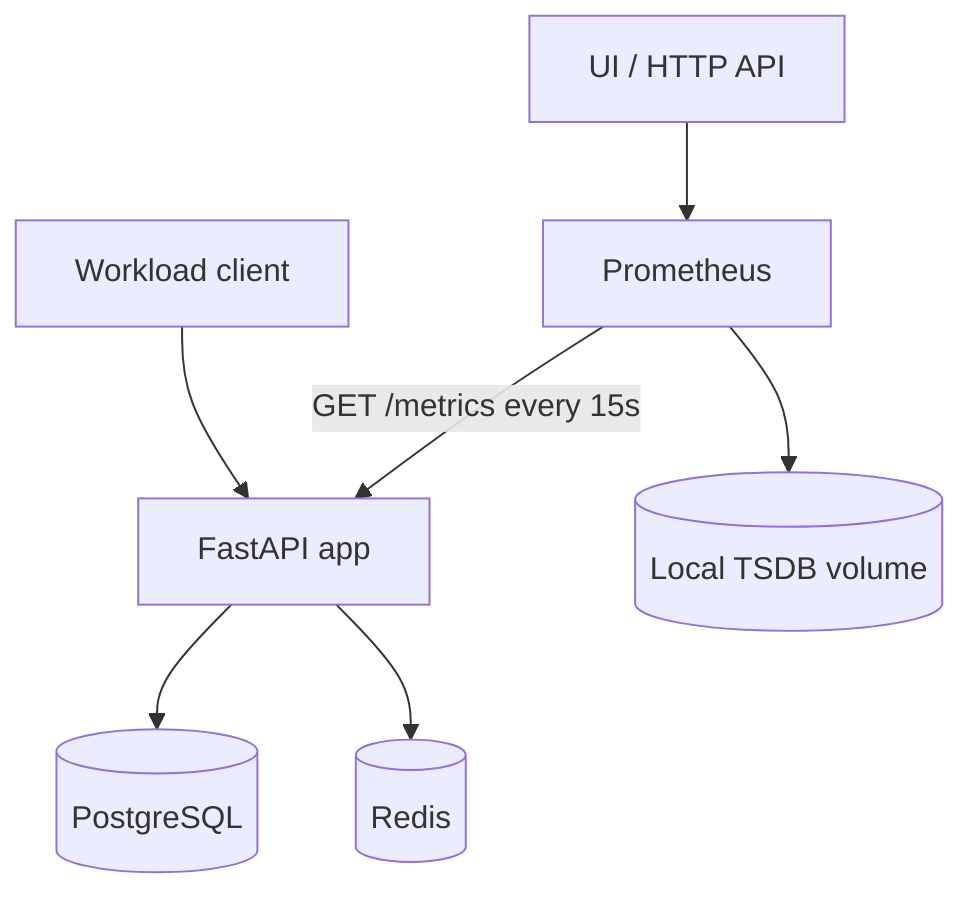
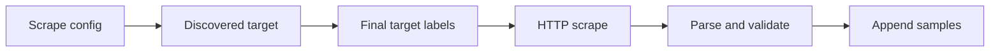
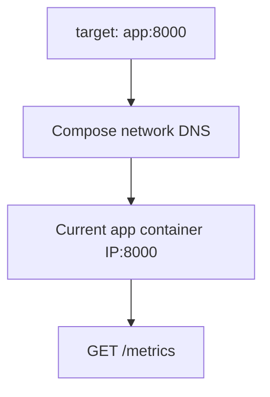
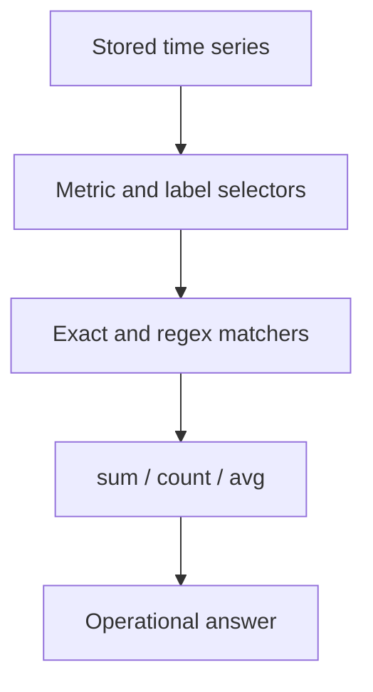

# Lab 04: Prometheus Discovery and the Scrape Lifecycle

## Purpose and Scope

> **Primary Objective:** Introduce Prometheus as the collection and storage layer, then prove how configuration becomes targets, how scheduled scrapes become timestamped samples, and how Prometheus represents healthy, failed, missing, stale, and recovered telemetry.

Labs 01–03 established the workload, decoded the raw OpenMetrics contract, and added reviewed application instrumentation. Until now, every metric inspection was a point-in-time read from the application process.

Lab 04 adds the missing collector:

```text
Application registry -> /metrics snapshot -> Prometheus scrape -> timestamped TSDB samples
```

You will start Prometheus without starting the rest of the observability stack, inspect its discovery and target APIs, prove the effective scrape interval, distinguish application health from scrape health, create two controlled target failures, observe staleness and recovery, safely reload configuration, and verify that historical data survives a Prometheus restart.

This lab deliberately uses only a small amount of PromQL. The expressions are diagnostic probes for the scrape lifecycle. Selectors, matchers, aggregation, counter mathematics, and histogram analysis are developed systematically in Labs 05–07.

## 1. Inherited State From Lab 03

This lab assumes:

- PostgreSQL, Redis, and the FastAPI application are running;
- OpenTelemetry export is disabled;
- the approved Lab 03 instrumentation is present in the application image;
- the deliberate `order_id` high-cardinality metric has been removed;
- Prometheus and the other observability services are stopped;
- application metrics can be read directly from `/metrics`;
- the Lab 03 source changes have been committed; and
- the working tree is clean apart from ignored files in `lab-notes/`.

Existing orders and cache entries may remain. Do not delete named volumes. Prometheus may also have an existing named volume from a previous platform smoke test; this lab records the current state instead of assuming it is empty.

If you intentionally skipped Lab 03, the scrape-lifecycle exercises still work with the repository's baseline HTTP metrics, but you will not be able to verify the four metric families added in Lab 03.

## 2. Explicit Scope and Exclusions

Services used in Lab 04:

```text
db
redis
app
prometheus
```

Keep these services stopped:

```text
alertmanager
otel-collector
loki
tempo
grafana
node-exporter
```

Prometheus is configured with targets for the stopped services. Their `DOWN` state is intentional evidence, not a request to start them.

This lab does not teach:

- general PromQL syntax and aggregation;
- counter rates or reset correction;
- histogram quantiles or exemplars;
- recording-rule design;
- alert-state behavior or notification routing;
- Grafana dashboards;
- Node Exporter host diagnosis;
- dynamic cloud or Kubernetes service discovery;
- target or metric relabeling;
- remote write, federation, or long-term storage;
- Prometheus high availability; or
- OpenTelemetry metric collection.

Those topics build on a correct scrape-lifecycle model.

## 3. Prerequisites

From the repository root:

```bash
pwd
test -f docker-compose.yml
test -f config/prometheus/prometheus.yml
test -f config/prometheus/rules/application.yml
test -f config/prometheus/rules/platform.yml
test -f labs/Lab-4.md
test -f .env
```

Verify the required tools:

```bash
docker version
docker compose version
curl --version
jq --version
git --version
python3 --version
```

Confirm the Compose model is valid before changing runtime state:

```bash
docker compose config --quiet
```

If you connect to the VM remotely, keep a second terminal available. One terminal can run observations while the other performs controlled stop, start, and reload operations.

## 4. Learning Objectives

By the end of Lab 04, you must be able to:

- explain the pull-based Prometheus scrape model;
- distinguish instrumentation, exposition, discovery, scraping, ingestion, storage, and querying;
- explain the relationship among a scrape configuration, job, target, scrape pool, and series;
- trace a static target through discovered labels to its final target labels;
- explain how Docker Compose DNS supports the configured target address;
- distinguish `job`, `instance`, application labels, external labels, and internal `__` labels;
- validate a Prometheus configuration before loading it;
- start Prometheus without unintentionally starting its Compose dependencies;
- distinguish Prometheus process health, Prometheus query readiness, application liveness, and target scrape health;
- inspect target state through both the UI and stable HTTP API;
- use `up` without treating it as a business-health signal;
- interpret `scrape_duration_seconds`, `scrape_samples_scraped`, `scrape_samples_post_metric_relabeling`, and `scrape_series_added`;
- calculate scrape headroom and approximate ingestion volume;
- prove the effective scrape cadence using sample timestamps;
- explain why range-query step is not the scrape interval;
- explain why locally queried series do not automatically contain `external_labels`;
- distinguish zero, absent, stale, target-down, and Prometheus-down states;
- observe stale application series while Prometheus continues writing `up=0`;
- prove that HTTP 200 alone does not make an endpoint a valid metrics target;
- perform and verify a configuration reload;
- prove that an invalid reload retains the last good in-memory configuration;
- restore the canonical configuration with Git;
- explain process resets without confusing them with target identity;
- explain why a Compose service name is more stable than a container IP;
- compare 5-second and 15-second scrape intervals and their cost;
- prove that the Prometheus named volume preserves historical samples across restart;
- troubleshoot target failures in a layered order; and
- state why Lab 05 introduces precise selectors and aggregation.

## 5. Architecture for This Lab



Only the native application metrics path is collected in this lab:

| **Producer**                     | **Endpoint**                 | **Collection Path**                 | **State in Lab 04**                         |
|----------------------------------|------------------------------|-------------------------------------|---------------------------------------------|
| FastAPI Prometheus client        | `app:8000/metrics`           | Direct Prometheus scrape            | Active                                      |
| OpenTelemetry SDK                | OTLP to Collector            | Collector then Prometheus           | Disabled                                    |
| Node Exporter                    | `node-exporter:9100/metrics` | Direct Prometheus scrape            | Target configured, exporter stopped         |
| Prometheus itself                | `prometheus:9090/metrics`    | Self-scrape                         | Active                                      |

The stopped targets create a mixed target inventory that is useful for learning. Do not interpret overall target redness as failure of the two targets deliberately under test.

## 6. The Scrape-Lifecycle Vocabulary

Use these terms precisely:

| **Term**              | **Meaning In This Repository**                                                                                          |
|-----------------------|-------------------------------------------------------------------------------------------------------------------------|
| Instrumentation       | Application code updates counters, gauges, histograms, and info metrics.                                                |
| Registry              | In-process collection of metric families owned by the Python client.                                                    |
| Exposition            | A current OpenMetrics response returned by `GET /metrics`.                                                              |
| Service discovery     | Prometheus obtains candidate target addresses and labels. Static configuration is still a discovery mechanism.          |
| Target                | One endpoint Prometheus attempts to scrape.                                                                             |
| Job                   | A named scrape configuration, normally grouping targets with a common purpose.                                          |
| Scrape pool           | Prometheus's runtime group for the targets produced by one scrape configuration.                                        |
| Scrape                | One scheduled HTTP collection attempt against one target.                                                               |
| Sample                | A timestamped value for one series.                                                                                     |
| Series                | A metric name plus its complete stored label set.                                                                       |
| Ingestion             | Validation and append of scraped samples to the TSDB head.                                                              |
| Stale                 | A previously present series is no longer eligible for ordinary instant-vector selection.                                |
| Lookback              | The window in which an instant selector searches backward for the newest eligible sample.                               |

The lifecycle is not a single operation:



A failure at any stage can produce missing data, but the evidence differs by stage.

## 7. Load the Lab Environment

Load settings without printing secrets:

```bash
set -a
source .env
set +a

LAB_HTTP_HOST="${BIND_ADDRESS:-127.0.0.1}"
if [[ "${LAB_HTTP_HOST}" == "0.0.0.0" || "${LAB_HTTP_HOST}" == "::" ]]; then
  LAB_HTTP_HOST=127.0.0.1
fi

export APP_URL="http://${LAB_HTTP_HOST}:${APP_HOST_PORT:-8000}"
export PROMETHEUS_URL="http://${LAB_HTTP_HOST}:${PROMETHEUS_HOST_PORT:-9090}"
export LAB4_NOTEBOOK="lab-notes/Lab-4.md"
```

Repeat this block in every new terminal.

Create the evidence notebook without overwriting earlier work:

```bash
mkdir -p lab-notes
test -f "${LAB4_NOTEBOOK}" || printf '# Lab 04 Evidence\n\n' > "${LAB4_NOTEBOOK}"
```

Record the starting timestamp:

```bash
printf 'Started: %s\n' "$(date -u +%FT%TZ)" | tee -a "${LAB4_NOTEBOOK}"
```

## 8. Reconcile the Application Baseline

Start only the workload services and keep OTLP export disabled:

```bash
APP_OTEL_ENABLED=false docker compose up -d db redis app
```

Wait for the application:

```bash
for attempt in {1..30}; do
  response="$(curl -sS "${APP_URL}/health/ready" || true)"
  if jq -e '.status == "ready"' <<<"${response}" >/dev/null 2>&1; then
    echo "Application is ready"
    break
  fi

  if [[ "${attempt}" -eq 30 ]]; then
    echo "Application did not become ready" >&2
    docker compose ps
    docker compose logs --tail=100 app db redis
    exit 1
  fi

  sleep 2
done
```

Prove the source exposition exists before introducing Prometheus:

```bash
curl -fsS "${APP_URL}/metrics" |
  grep -E '^# (HELP|TYPE) obslab_(http_requests|http_request_duration_seconds|build)'
```

This answers only:

> What does the application expose now?

It does not answer what was exposed five minutes ago.

## 9. Stop the Excluded Observability Services

Stop only the services outside this lab:

```bash
docker compose stop alertmanager otel-collector loki tempo grafana node-exporter
```

Prometheus should still be stopped at this point:

```bash
if docker compose ps --status running --services | grep -Fxq prometheus; then
  docker compose stop prometheus
fi
```

Confirm the exact baseline:

```bash
docker compose ps --status running --services | sort
```

Expected:

```text
app
db
redis
```

Do not run `docker compose down -v` or `make reset`.

## 10. Create a Safe Git Checkpoint

Confirm the repository and current branch:

```bash
git rev-parse --is-inside-work-tree
git branch --show-current
git status --short
```

Stop if tracked changes are present. Review and commit or deliberately preserve them before this lab modifies the Prometheus configuration temporarily.

```bash
if ! git diff --quiet || ! git diff --cached --quiet; then
  echo "Tracked changes exist; review them before Lab 04" >&2
  git status --short
  exit 1
fi
```

Create or reuse the lab branch:

```bash
if git show-ref --verify --quiet refs/heads/lab-04-prometheus-scrape; then
  git switch lab-04-prometheus-scrape
else
  git switch -c lab-04-prometheus-scrape
fi
```

Record the recovery point and configuration hash:

```bash
export LAB4_BASE_COMMIT="$(git rev-parse HEAD)"
sha256sum config/prometheus/prometheus.yml | tee -a "${LAB4_NOTEBOOK}"
printf 'Base commit: %s\n\n' "${LAB4_BASE_COMMIT}" >> "${LAB4_NOTEBOOK}"
```

The lab will restore the tracked configuration from this committed state after every temporary experiment.

## 11. Inspect the Prometheus Compose Boundary

Read only the Prometheus service definition:

```bash
docker compose config --format json |
  jq '.services.prometheus | {
    image,
    command,
    ports,
    volumes,
    depends_on,
    healthcheck,
    networks,
    mem_limit
  }'
```

Identify these contracts:

| **Compose Setting**          | **Operational Meaning**                                                                                          |
|------------------------------|------------------------------------------------------------------------------------------------------------------|
| Pinned image                 | Lab behavior is tied to a known Prometheus release.                                                              |
| `--config.file`              | Container path of the active configuration source.                                                               |
| `--storage.tsdb.path`        | Location backed by the named volume.                                                                             |
| Retention flags              | Time and size limits for local samples.                                                                          |
| `--web.enable-lifecycle`     | Allows authenticated-network callers to request reload or shutdown; this stack has no auth layer.                |
| Host port                    | Exposes the UI/API through the configured bind address.                                                          |
| Read-only config mounts      | Runtime cannot overwrite repository configuration.                                                               |
| Named data volume            | Samples persist across container replacement.                                                                    |
| Monitoring network           | Allows Prometheus to resolve and reach monitoring targets.                                                       |
| `depends_on`                 | Compose startup ordering, not a runtime Prometheus dependency model.                                             |

Prediction checkpoint:

> What would `docker compose up -d prometheus` start because of `depends_on`?

It would recursively start the Collector, Loki, Tempo, Node Exporter, and the application dependency chain. That would violate this lab's isolation boundary.

## 12. Configuration Layers

Prometheus behavior comes from more than one place:

| **Layer**                   | **File or Endpoint**                        | **Examples**                                       |
|-----------------------------|---------------------------------------------|----------------------------------------------------|
| Immutable startup flags     | `docker-compose.yml`                        | TSDB path, retention, lifecycle endpoint           |
| Reloadable server config    | `config/prometheus/prometheus.yml`          | scrape jobs, intervals, rules, Alertmanager target |
| Reloadable rule files       | `config/prometheus/rules/*.yml`             | recording and alerting expressions                 |
| Runtime-discovered state    | `/api/v1/targets`                           | target labels, health, last scrape, last error     |
| Stored data                 | `obs-lab-prometheus-data`                   | samples, WAL, blocks                               |

Inspect the files without editing them:

```bash
sed -n '1,240p' config/prometheus/prometheus.yml
sed -n '1,260p' config/prometheus/rules/application.yml
sed -n '1,240p' config/prometheus/rules/platform.yml
```

Rules are loaded because the configuration references them, but rule behavior is not analyzed until Labs 08 and 13.

## 13. Understand the Global Settings

The repository begins with:

```yaml
global:
  scrape_interval: 15s
  scrape_timeout: 10s
  evaluation_interval: 15s
  external_labels:
    environment: lab
    cluster: single-vm
```

Interpret each field separately:

| **Setting**            | **Meaning**                                               | **Common Mistake**                                  |
|------------------------|-----------------------------------------------------------|-----------------------------------------------------|
| `scrape_interval`      | Default period between scrape attempts for each target    | Treating it as query refresh rate                   |
| `scrape_timeout`       | Maximum duration allowed for one scrape                   | Setting it greater than the interval                |
| `evaluation_interval`  | Default rule evaluation cadence                           | Assuming it controls scraping                       |
| `external_labels`      | Labels attached when communicating with external systems  | Expecting them on every locally queried series      |

The effective setting can be overridden inside an individual scrape job. The target API, not memory, is the best proof of the current effective interval and timeout.

## 14. Understand the `orders-api` Scrape Job

The relevant configuration is:

```yaml
  - job_name: orders-api
    metrics_path: /metrics
    static_configs:
      - targets: ["app:8000"]
        labels:
          service: orders-api
          telemetry_source: prometheus-client
```

This creates one target candidate.

| **Field**                    | **Result**                                                                |
|------------------------------|---------------------------------------------------------------------------|
| `job_name`                   | Default stored `job="orders-api"` label and scrape-pool name              |
| `metrics_path`               | HTTP path `/metrics`                                                      |
| target address               | `app:8000`                                                                |
| scheme                       | `http`, because no HTTPS scheme is configured                             |
| configured target labels     | `service="orders-api"`, `telemetry_source="prometheus-client"`            |
| inherited interval           | 15 seconds                                                                |
| inherited timeout            | 10 seconds                                                                |

The target address contains a Compose service name, not the host-published port and not a container IP.

## 15. Job, Instance, Service, and Target Identity

Prometheus will add labels that are not present in the application's raw exposition.

Expected final target labels:

```text
job="orders-api"
instance="app:8000"
service="orders-api"
telemetry_source="prometheus-client"
```

Their roles differ:

| **Field**                    | **Result**                                                               |
|------------------------------|--------------------------------------------------------------------------|
| `job_name`                   | Default stored `job="orders-api"` label and scrape-pool name             |
| `metrics_path`               | HTTP path `/metrics`                                                     |
| target address               | `app:8000`                                                               |
| scheme                       | `http`, because no HTTPS scheme is configured                            |
| configured target labels     | `service="orders-api"`, `telemetry_source="prometheus-client"`           |
| inherited interval           | 15 seconds                                                               |
| inherited timeout            | 10 seconds                                                               |

Do not assume that `job` and `service` always mean the same thing. One service may have multiple scrape jobs, and one job may discover many instances.

The practical series identity after ingestion is:

```text
application metric labels
+ target labels
+ metric name
```

Changing a stored target label creates new series identities even when the endpoint and values are unchanged.

## 16. Discovery Is More Than Finding an IP

Static discovery begins with a candidate label set similar to:

```text
__address__="app:8000"
__scheme__="http"
__metrics_path__="/metrics"
__scrape_interval__="15s"
__scrape_timeout__="10s"
job="orders-api"
service="orders-api"
telemetry_source="prometheus-client"
```

Prometheus then applies target relabeling. This job defines no custom `relabel_configs`, so defaults determine the final address and `instance` label.

Internal labels beginning with `__` participate in discovery and scrape construction. They are removed before ordinary target labels are attached to ingested series.

Lab 19 will change labels with relabeling. In this lab, inspect the two stages without modifying them.

## 17. Docker DNS Completes the Static Target

`app:8000` is static from Prometheus's perspective, while Docker supplies name resolution at runtime.



Important consequences:

- Prometheus and the app must share `obs-lab-monitoring-net`;
- the host's `localhost:8000` is not the address Prometheus uses;
- the published app port is for host clients, not container-to-container traffic;
- a container IP is an implementation detail and may change; and
- the service name remains a stable configuration target across container replacement.

Inspect the networks:

```bash
docker inspect obs-lab-app |
  jq -r '.[0].NetworkSettings.Networks | keys[]'
docker network inspect obs-lab-monitoring-net |
  jq -r '.[0].Containers[] | [.Name, .IPv4Address] | @tsv'
```

Prometheus is not running yet, so it will not appear in the second result.

## 18. Predict the Initial Target Inventory

Before startup, inspect job names:

```bash
awk '/^[[:space:]]+- job_name:/ {print $3}' config/prometheus/prometheus.yml
```

Write predictions in the notebook:

1. How many active target definitions will Prometheus discover?
2. Which targets should become `UP`?
3. Which targets should become `DOWN` because their services are intentionally stopped?
4. Which target can be scraped without leaving the Prometheus container?
5. Will `environment="lab"` appear on locally queried `up` series?

Record them before observing:

```bash
cat >> "${LAB4_NOTEBOOK}" <<'EOF'
## Initial target predictions

- Expected target count:
- Expected UP jobs:
- Expected DOWN jobs:
- Expected self-scrape job:
- Expected local external-label behavior:

EOF
```

Prediction turns the target page into a test of your model rather than a colored status display.

## 19. Validate Configuration Before Startup

Use the `promtool` shipped in the pinned Prometheus image:

```bash
docker compose run --rm --no-deps \
  --entrypoint /bin/promtool \
  prometheus \
  check config /etc/prometheus/prometheus.yml
```

Expected categories of validation:

- YAML syntax;
- Prometheus configuration schema;
- referenced rule-file loading; and
- rule syntax.

Also validate rule files directly:

```bash
docker compose run --rm --no-deps \
  --entrypoint /bin/promtool \
  prometheus \
  check rules /etc/prometheus/rules/application.yml /etc/prometheus/rules/platform.yml
```

`docker compose config --quiet` validates the Compose model. `promtool check config` validates Prometheus semantics. Neither replaces the other.

Capture the result:

```bash
{
  echo '## Initial validation'
  docker compose run --rm --no-deps \
    --entrypoint /bin/promtool \
    prometheus \
    check config /etc/prometheus/prometheus.yml
  echo
} >> "${LAB4_NOTEBOOK}" 2>&1
```

## 20. Start Only Prometheus

Start the service without recursively starting its Compose dependencies:

```bash
docker compose up -d --no-deps prometheus
```

Why `--no-deps` is required here:

```text
Compose dependency graph != Prometheus runtime dependency
```

Prometheus can start while scrape targets and Alertmanager are unavailable. Their availability is data that Prometheus observes; it is not a precondition for the Prometheus process.

Wait until the query API is ready:

```bash
for attempt in {1..30}; do
  if curl -fsS "${PROMETHEUS_URL}/-/ready" >/dev/null; then
    echo "Prometheus is ready"
    break
  fi

  if [[ "${attempt}" -eq 30 ]]; then
    echo "Prometheus did not become ready" >&2
    docker compose ps prometheus
    docker compose logs --tail=150 prometheus
    exit 1
  fi

  sleep 2
done
```

Confirm the running set:

```bash
docker compose ps --status running --services | sort
```

Expected:

```text
app
db
prometheus
redis
```

Wait at least one global interval so every configured target has an observed state:

```bash
sleep 20
```

## 21. Separate Prometheus Health From Readiness

Run both management checks:

```bash
curl -fsS -o /dev/null -w 'healthy=%{http_code}\n' \
  "${PROMETHEUS_URL}/-/healthy"
curl -fsS -o /dev/null -w 'ready=%{http_code}\n' \
  "${PROMETHEUS_URL}/-/ready"
```

They answer different questions:

| **Endpoint**   | **Question**                                             |
|----------------|----------------------------------------------------------|
| `/-/healthy`   | Is the Prometheus process alive enough to answer HTTP?   |
| `/-/ready`     | Is Prometheus ready to serve queries?                    |

Neither endpoint claims that every scrape target is healthy.

Compare four distinct health domains:

| **Evidence**             | **Owner**              | **Meaning**                                              |
|--------------------------|------------------------|----------------------------------------------------------|
| App `/health/live`       | FastAPI                | Application process is serving HTTP                      |
| App `/health/ready`      | FastAPI                | Last request-time checks reached PostgreSQL and Redis    |
| Prometheus `/-/ready`    | Prometheus             | Query service is ready                                   |
| `up{job="orders-api"}`   | Prometheus scrape loop | Most recent scrape of the app target succeeded           |

A professional runbook names the domain instead of writing only “health failed.”

## 22. Verify the Running Version and Flags

Inspect build information through the API:

```bash
curl -fsS "${PROMETHEUS_URL}/api/v1/status/buildinfo" |
  jq '.data | {version, revision, branch, buildDate, goVersion}'
```

Compare it with the container image:

```bash
docker compose images prometheus
docker compose exec prometheus /bin/prometheus --version
```

Inspect selected effective flags:

```bash
curl -fsS "${PROMETHEUS_URL}/api/v1/status/flags" |
  jq '.data | with_entries(
    select(
      .key == "config.file" or
      .key == "query.lookback-delta" or
      .key == "storage.tsdb.path" or
      .key == "storage.tsdb.retention.time" or
      .key == "storage.tsdb.retention.size" or
      .key == "web.enable-lifecycle"
    )
  )'
```

Configuration files and command-line flags solve different problems. A reload cannot change immutable startup flags; changing those requires a container recreation.

## 23. Access the UI Safely

When working directly on the VM, open:

```text
http://127.0.0.1:9090
```

If the stack binds only to loopback on a remote VM, create an SSH tunnel from your workstation:

```bash
ssh -N -L 9090:127.0.0.1:9090 your-user@your-vm
```

Then open the same local URL in your workstation browser.

Useful Prometheus pages for this lab:

| **Page**              | **Path**             | **Purpose**                                           |
|-----------------------|----------------------|-------------------------------------------------------|
| Query UI              | `/query`             | Run diagnostic expressions                            |
| Targets               | `/targets`           | Inspect active target state                           |
| Service discovery     | `/service-discovery` | Compare discovered and final labels                   |
| Configuration         | `/config`            | Inspect the last successfully loaded config           |
| Runtime information   | `/status`            | Build, flags, TSDB, and command-line information      |

The repository does not place authentication or TLS in front of Prometheus. Keep the port private; the lifecycle endpoint is enabled and permits state-changing operations.

## 24. Inspect the Target API Before the UI

The UI is useful, but automation and evidence capture should use the HTTP API.

```bash
target_response="$(
  curl -fsSG "${PROMETHEUS_URL}/api/v1/targets" \
    --data-urlencode 'state=active'
)"

jq -e '.status == "success"' <<<"${target_response}" >/dev/null
jq -r '
  .data.activeTargets[] |
  [
    .scrapePool,
    .labels.instance,
    .health,
    .scrapeInterval,
    .scrapeTimeout,
    (.lastError | gsub("[\\t\\n]"; " "))
  ] | @tsv
' <<<"${target_response}" | column -t -s $'\t'
```

If `column` is unavailable, omit the final formatting stage:

```bash
jq -r '
  .data.activeTargets[] |
  [.scrapePool, .labels.instance, .health, .lastError] | @tsv
' <<<"${target_response}"
```

Compare the result with your predictions from Section 4.18.

## 25. Capture the Initial Target Snapshot

Append a concise snapshot to the notebook:

```bash
{
  echo '## Initial target snapshot'
  echo
  echo '```text'
  jq -r '
    .data.activeTargets[] |
    [
      .scrapePool,
      .labels.instance,
      .health,
      .scrapeInterval,
      (.lastError | gsub("[\\t\\n]"; " "))
    ] | @tsv
  ' <<<"${target_response}"
  echo '```'
  echo
} >> "${LAB4_NOTEBOOK}"
```

Count by observed state:

```bash
jq -r '.data.activeTargets[].health' <<<"${target_response}" |
  sort |
  uniq -c
```

Expected after at least one scrape:

- `prometheus` is up because it scrapes itself;
- `orders-api` is up because the app is running;
- targets for deliberately stopped services are down; and
- all configured targets remain *active* target definitions, even when their scrapes fail.

`active` in the target API means “currently in the discovery set,” not “healthy.”

## 26. Read Every Important Target Field

Inspect only the application target:

```bash
curl -fsSG "${PROMETHEUS_URL}/api/v1/targets" \
  --data-urlencode 'state=active' \
  --data-urlencode 'scrapePool=orders-api' |
  jq '.data.activeTargets[0]'
```

Interpret the fields:

| **Field**              | **Meaning**                                                               |
|------------------------|---------------------------------------------------------------------------|
| `discoveredLabels`     | Label set before target relabeling and internal-label removal             |
| `labels`               | Final labels attached to samples from this target                         |
| `scrapePool`           | Runtime pool created for the scrape job                                   |
| `scrapeUrl`            | Effective internal URL Prometheus requests                                |
| `globalUrl`            | URL rewritten for external/UI presentation when applicable                |
| `lastError`            | Error from the most recent failed scrape, empty after success             |
| `lastScrape`           | Wall-clock time of the most recent attempt                                |
| `lastScrapeDuration`   | Duration of the most recent attempt in seconds                            |
| `health`               | `up`, `down`, or initial/unknown state                                    |
| `scrapeInterval`       | Effective interval for this target                                        |
| `scrapeTimeout`        | Effective timeout for this target                                         |

Target API state is current runtime metadata. It is not a replacement for historical time-series queries.

## 27. Compare Discovered and Final Labels

Run:

```bash
curl -fsSG "${PROMETHEUS_URL}/api/v1/targets" \
  --data-urlencode 'scrapePool=orders-api' |
  jq '.data.activeTargets[0] | {
    discoveredLabels,
    finalLabels: .labels,
    scrapeUrl
  }'
```

You should observe:

- `__address__`, `__scheme__`, `__metrics_path__`, `__scrape_interval__`, and `__scrape_timeout__` in the discovery stage;
- no `__...` labels in the final label set;
- `instance="app:8000"` created from the final address;
- `job="orders-api"` retained; and
- configured `service` and `telemetry_source` labels retained.

Open `/service-discovery` in the UI and find the same target. The API result is the evidence source; the UI is the human navigation layer over it.

## 28. Treat the Intentionally Down Targets as Evidence

List only failed targets:

```bash
curl -fsSG "${PROMETHEUS_URL}/api/v1/targets" \
  --data-urlencode 'state=active' |
  jq -r '
    .data.activeTargets[] |
    select(.health == "down") |
    [.scrapePool, .scrapeUrl, (.lastError | gsub("[\\t\\n]"; " "))] |
    @tsv
  '
```

Classify each failure:

| **Failure Class**                  | **Examples In This Lab**                                                    |
|------------------------------------|-----------------------------------------------------------------------------|
| Name resolution                    | A stopped service may no longer have a resolvable container endpoint        |
| Connection                         | Address resolves but nothing accepts the connection                         |
| HTTP contract                      | Server returns a non-success status                                         |
| Content negotiation or parsing     | Server responds but not with supported metrics exposition                   |
| Timeout                            | Response does not complete within the scrape timeout                        |

The exact error text depends on Docker and Prometheus versions. Record the full error, then classify it; do not build automation around prose fragments when a stable signal such as `up` exists.

You may also see failed Alertmanager-delivery messages in Prometheus logs after alert rules become active. Alertmanager is intentionally stopped and alert delivery is not part of this lab.

## 29. Prove the Internal Network Path

From the Prometheus container, request the application using the configured target address:

```bash
docker compose exec prometheus \
  wget -qO- http://app:8000/health/live
```

Inspect the first exposition lines through the same network path:

```bash
docker compose exec prometheus \
  wget -qO- http://app:8000/metrics |
  sed -n '1,20p'
```

Compare with the host path:

```bash
curl -fsS "${APP_URL}/health/live" | jq .
```

Both reach the same application, but through different network contracts:

```text
Host client       -> published host port -> app container
Prometheus client -> monitoring network  -> app:8000
```

A host-side successful curl does not prove the Prometheus-side path.

## 30. Define Safe Query Helpers

Create shell functions for repeated API observations:

```bash
prom_query() {
  local expression="$1"
  local response

  response="$(
    curl -fsSG "${PROMETHEUS_URL}/api/v1/query" \
      --data-urlencode "query=${expression}"
  )"
  jq -e '.status == "success"' <<<"${response}" >/dev/null
  jq '.data.result' <<<"${response}"
}

prom_value() {
  local expression="$1"

  prom_query "${expression}" |
    jq -r '.[0].value[1] // empty'
}
```

Keep using the same terminal. If you open a new one, repeat Section 4.7 and redefine both helpers before continuing.

Test them:

```bash
prom_query 'up{job="orders-api"}'
prom_value 'up{job="orders-api"}'
```

Expected scalar sample value:

```text
1
```

The HTTP API returns numeric sample values as JSON strings. Convert them explicitly when doing arithmetic.

## 31. Understand `up`

Query every current target:

```bash
prom_query 'up'
```

Then focus on the application:

```bash
prom_query 'up{job="orders-api",instance="app:8000"}'
```

Prometheus generates one `up` series per target:

| **Value**   | **Meaning**                                                                                                  |
|-------------|--------------------------------------------------------------------------------------------------------------|
| `1`         | The most recent scrape completed successfully and its samples were accepted                                  |
| `0`         | The most recent scrape failed                                                                                |
| no series   | No eligible current `up` series matches the selector, or Prometheus itself cannot be queried                 |

`up` is not exported by FastAPI. Prove it:

```bash
if curl -fsS "${APP_URL}/metrics" | grep -q '^up[ {]'; then
  echo "Unexpected app-owned up metric" >&2
  exit 1
fi
```

Target-generated metrics and exporter-generated metrics have different owners.

## 32. `up` Is Not Application Readiness

Compare the scrape signal and dependency-aware readiness:

```bash
printf 'Prometheus up: %s\n' "$(prom_value 'up{job="orders-api"}')"
curl -fsS "${APP_URL}/health/ready" | jq .
```

Possible combinations include:

| **`up`** | **App readiness**   | **Interpretation**                                                                         |
|----------|---------------------|--------------------------------------------------------------------------------------------|
| 1        | ready               | Scrape succeeds and dependencies are currently reachable                                   |
| 1        | not ready           | `/metrics` works while PostgreSQL or Redis readiness fails                                 |
| 0        | ready by host check | App may be healthy through one path while Prometheus's scrape path or contract fails       |
| absent   | unknown             | Query, discovery, or Prometheus availability must be investigated                          |

Never replace a user-facing SLI with `up`. A scrape can succeed while every business request fails.

## 33. Inspect Prometheus-Generated Scrape Metrics

Query the application's scrape instrumentation:

```bash
for metric in \
  up \
  scrape_duration_seconds \
  scrape_samples_scraped \
  scrape_samples_post_metric_relabeling \
  scrape_series_added; do
  echo "${metric}"
  prom_query "${metric}{job=\"orders-api\"}"
done
```

These metrics describe the collection operation:

| **Metric**                                      | **Meaning**                                                     |
|-------------------------------------------------|-----------------------------------------------------------------|
| `up`                                            | Binary outcome of the most recent scrape                        |
| `scrape_duration_seconds`                       | Time spent on the most recent scrape attempt                    |
| `scrape_samples_scraped`                        | Samples decoded before metric relabeling                        |
| `scrape_samples_post_metric_relabeling`         | Samples remaining after metric relabeling                       |
| `scrape_series_added`                           | Newly created series during the most recent successful scrape   |

This configuration has no `metric_relabel_configs`, so the two sample-count metrics should normally match. The equality would no longer be expected after ingestion-time metric dropping.

`scrape_series_added` often becomes zero after the initial scrape because existing identities receive new samples without creating new series.

## 34. Compare Source Samples With Scraped Samples

Count sample lines in the current app exposition:

```bash
source_sample_lines="$(
  curl -fsS "${APP_URL}/metrics" |
    awk '!/^#/ && NF > 0 {count++} END {print count+0}'
)"

scraped_samples="$(
  prom_value 'scrape_samples_scraped{job="orders-api"}'
)"

printf 'Source sample lines: %s\n' "${source_sample_lines}"
printf 'Last scrape samples: %s\n' "${scraped_samples}"
```

The values should be close when the registry is stable, but do not demand exact equality across separate observations. Health checks, request metrics, lazy label initialization, garbage collection, and timing can change the registry between your curl and Prometheus's scrape.

The professional comparison is semantic:

```text
source exposition at time A != scrape result at time B
```

Capture both values with timestamps if investigating a real discrepancy.

## 35. Calculate Scrape Headroom

Read the target's most recent duration and effective timeout:

```bash
app_target="$(
  curl -fsSG "${PROMETHEUS_URL}/api/v1/targets" \
    --data-urlencode 'scrapePool=orders-api'
)"

jq '.data.activeTargets[0] | {
  lastScrape,
  lastScrapeDuration,
  scrapeInterval,
  scrapeTimeout,
  health
}' <<<"${app_target}"
```

Calculate headroom against the configured 10-second timeout:

```bash
last_duration="$(
  jq -r '.data.activeTargets[0].lastScrapeDuration' <<<"${app_target}"
)"

python3 - "${last_duration}" <<'PY'
import sys

duration = float(sys.argv[1])
timeout = 10.0
utilization = duration / timeout
print(f"last_duration_seconds={duration:.6f}")
print(f"timeout_seconds={timeout:.1f}")
print(f"timeout_utilization={utilization:.4%}")
print(f"headroom_seconds={timeout - duration:.6f}")
PY
```

One fast scrape is not a capacity conclusion. Production analysis uses a time window and high quantile or maximum, then checks response size, sample count, exporter resource usage, and timeout failures.

## 36. Inspect Sample Timestamp Age

Prometheus assigns a timestamp to the scrape result when the target does not supply explicit sample timestamps.

```bash
prom_query 'timestamp(up{job="orders-api"})'
prom_query 'time() - timestamp(up{job="orders-api"})'
```

The second expression is the age, in seconds, of the newest selected `up` sample at query evaluation time. With a 15-second interval it normally moves upward and then drops after the next scrape.

Do not interpret sample age as request latency. It is collection freshness.

Compare target API time with the series timestamp:

```bash
curl -fsSG "${PROMETHEUS_URL}/api/v1/targets" \
  --data-urlencode 'scrapePool=orders-api' |
  jq -r '.data.activeTargets[0].lastScrape'
prom_value 'timestamp(up{job="orders-api"})'
```

They describe the same scrape loop through different interfaces and timestamp representations.

## 37. Prove the Effective 15-Second Cadence

Ensure enough history exists:

```bash
sleep 35
```

Request a 90-second range of the *timestamp of the selected sample*:

```bash
range_end="$(date +%s)"
range_start="$((range_end - 90))"

timestamp_response="$(
  curl -fsSG "${PROMETHEUS_URL}/api/v1/query_range" \
    --data-urlencode 'query=timestamp(up{job="orders-api"})' \
    --data-urlencode "start=${range_start}" \
    --data-urlencode "end=${range_end}" \
    --data-urlencode 'step=1'
)"

jq -e '.status == "success"' <<<"${timestamp_response}" >/dev/null
jq -r '.data.result[0].values[][1]' <<<"${timestamp_response}" |
  awk '!seen[$0]++'
```

Calculate deltas between distinct scrape timestamps:

```bash
jq -r '.data.result[0].values[][1]' <<<"${timestamp_response}" |
  awk '!seen[$0]++' |
  awk '
    NR == 1 {previous=$1; next}
    {printf "delta_seconds=%.3f\n", $1-previous; previous=$1}
  '
```

The deltas should be approximately 15 seconds.

Critical distinction:

```text
query_range step=1s != scrape_interval=1s
```

The one-second query steps repeatedly select the newest eligible scrape sample. Applying `timestamp()` reveals when that underlying sample actually changes.

## 38. Prove Pull-Based Collection Without a Value Change

Build metadata normally remains constant for the life of the process, yet Prometheus collects a new sample on schedule.

```bash
first_build_timestamp="$(
  prom_value 'timestamp(obslab_build_info{job="orders-api"})'
)"

sleep 20

second_build_timestamp="$(
  prom_value 'timestamp(obslab_build_info{job="orders-api"})'
)"

printf 'first=%s\nsecond=%s\n' \
  "${first_build_timestamp}" \
  "${second_build_timestamp}"

python3 - "${first_build_timestamp}" "${second_build_timestamp}" <<'PY'
import sys

first = float(sys.argv[1])
second = float(sys.argv[2])
if second <= first:
    raise SystemExit("Expected a newer scheduled scrape sample")
print(f"new_sample_after_seconds={second - first:.3f}")
PY
```

The metric value can remain `1` while its timestamp advances. Prometheus pulls snapshots on its schedule; the application does not push only when a value changes.

## 39. Prove `/metrics` Is Excluded From the App HTTP Counter

The repository middleware deliberately excludes `/metrics` from application HTTP request metrics. Scheduled scraping should therefore not create a self-amplifying `route="/metrics"` counter series.

```bash
before_count="$(
  prom_query 'obslab_http_requests_total{job="orders-api",route="/metrics"}' |
    jq 'length'
)"

sleep 35

after_count="$(
  prom_query 'obslab_http_requests_total{job="orders-api",route="/metrics"}' |
    jq 'length'
)"

printf 'before_series=%s after_series=%s\n' \
  "${before_count}" "${after_count}"
test "${before_count}" -eq 0
test "${after_count}" -eq 0
```

Excluding the scrape endpoint is a design choice, not a universal Prometheus rule. If it is included, account for monitoring traffic in dashboards, alerts, and capacity estimates.

## 40. Separate Metric Metadata From Sample Data

Request metadata for one application family:

```bash
curl -fsSG "${PROMETHEUS_URL}/api/v1/metadata" \
  --data-urlencode 'metric=obslab_http_request_duration_seconds' |
  jq '.data'
```

Then request target-scoped metadata:

```bash
curl -fsSG "${PROMETHEUS_URL}/api/v1/targets/metadata" \
  --data-urlencode 'match_target={job="orders-api"}' \
  --data-urlencode 'metric=obslab_http_request_duration_seconds' \
  --data-urlencode 'limit=10' |
  jq '.data'
```

Metadata contains type, help text, and optional unit information. It does not replace time-series samples, and metadata can outlive or differ across target versions.

The client exposes a classic histogram as related sample series such as `_bucket`, `_sum`, and `_count`, while metadata describes the logical family.

## 41. Prove the External-Label Boundary

Confirm the external labels are loaded:

```bash
curl -fsS "${PROMETHEUS_URL}/api/v1/status/config" |
  jq -r '.data.yaml' |
  sed -n '/external_labels:/,/rule_files:/p'
```

Inspect the locally queried `up` label set:

```bash
prom_query 'up{job="orders-api"}' |
  jq '.[0].metric'
```

Assert that the two external labels are not stored as ordinary local target labels:

```bash
prom_query 'up{job="orders-api"}' |
  jq -e '
    .[0].metric |
    (has("environment") | not) and
    (has("cluster") | not)
  ' >/dev/null
```

`external_labels` are added when Prometheus communicates with external systems such as remote storage, federation consumers, or Alertmanager. They do not automatically increase the label set of every locally stored series.

If the environment must be locally selectable, add it deliberately as a target label or through relabeling, after reviewing identity and cardinality consequences.

## 42. Inspect the Persistent Storage Contract

Inspect the named volume:

```bash
docker volume inspect obs-lab-prometheus-data |
  jq '.[0] | {Name, Driver, Mountpoint, Labels}'
```

Confirm the container mount:

```bash
docker inspect obs-lab-prometheus |
  jq '.[0].Mounts[] | select(.Destination == "/prometheus")'
```

Inspect the data directory without modifying it:

```bash
docker compose exec prometheus sh -c '
  du -sh /prometheus
  find /prometheus -maxdepth 1 -mindepth 1 -print
'
```

Typical entries include the write-ahead log, head/chunk data, lock files, and eventually persisted TSDB block directories. Their exact names and timing are implementation details.

Do not edit the mounted TSDB directory while Prometheus is running.

## 43. Inspect TSDB Runtime Status

Query head statistics:

```bash
curl -fsS "${PROMETHEUS_URL}/api/v1/status/tsdb" |
  jq '.data.headStats'
```

Inspect high-cardinality lists cautiously:

```bash
curl -fsS "${PROMETHEUS_URL}/api/v1/status/tsdb?limit=10" |
  jq '.data | {
    seriesCountByMetricName,
    labelValueCountByLabelName,
    memoryInBytesByLabelName,
    seriesCountByLabelValuePair
  }'
```

The TSDB contains metrics from every successful active target plus Prometheus-generated target metrics, recording-rule outputs, alert state, and Prometheus self-metrics. It is not equivalent to the application registry.

Detailed cardinality economics belong to Lab 18. Here, record the baseline so later experiments have a comparison point.

## 44. Capture the Healthy Baseline

Append the key evidence:

```bash
{
  echo '## Healthy scrape baseline'
  echo
  printf 'Recorded: %s\n\n' "$(date -u +%FT%TZ)"
  echo '### Application target'
  echo '```json'
  curl -fsSG "${PROMETHEUS_URL}/api/v1/targets" \
    --data-urlencode 'scrapePool=orders-api' |
    jq '.data.activeTargets[0] | {
      discoveredLabels,
      labels,
      scrapeUrl,
      health,
      lastError,
      lastScrape,
      lastScrapeDuration,
      scrapeInterval,
      scrapeTimeout
    }'
  echo '```'
  echo
  echo '### Generated scrape metrics'
  echo '```json'
  prom_query '{__name__=~"up|scrape_duration_seconds|scrape_samples_scraped|scrape_samples_post_metric_relabeling|scrape_series_added",job="orders-api"}'
  echo '```'
  echo
} >> "${LAB4_NOTEBOOK}"
```

Checkpoint questions:

1. Which evidence proves the source endpoint is valid?
2. Which evidence proves the Prometheus network path works?
3. Which evidence proves samples entered the TSDB?
4. Which evidence identifies the effective interval?
5. Which labels came from the app and which came from the target?

Do not begin failure experiments until you can answer all five.

## 45. Experiment A: Predict a Scrape-Contract Failure

You will temporarily point the `orders-api` scrape job at `/health/live` instead of `/metrics`.

The application endpoint will:

- resolve through Docker DNS;
- accept the TCP connection;
- return HTTP 200; and
- return valid JSON.

It will not return a supported metrics exposition.

Write predictions before changing the configuration:

```bash
cat >> "${LAB4_NOTEBOOK}" <<'EOF'
## Experiment A predictions: healthy HTTP, invalid exposition

- App liveness response:
- Prometheus target health:
- Expected `up` value:
- Expected `lastError` class:
- Expected state of previously scraped app series:

EOF
```

This experiment separates endpoint reachability from scrape-contract correctness.

Blast radius:

```text
Only native metrics collection for orders-api
Application business traffic remains available
PostgreSQL and Redis are unchanged
Other Prometheus targets are unchanged
```

## 46. Establish the Configuration Recovery Contract

Confirm that the tracked configuration is unchanged:

```bash
git diff --exit-code -- config/prometheus/prometheus.yml
```

Record the last successfully loaded path and interval:

```bash
curl -fsSG "${PROMETHEUS_URL}/api/v1/targets" \
  --data-urlencode 'scrapePool=orders-api' |
  jq '.data.activeTargets[0] | {
    scrapeUrl,
    scrapeInterval,
    scrapeTimeout,
    health
  }' | tee -a "${LAB4_NOTEBOOK}"
```

If any configuration experiment is interrupted, recover with:

```bash
git restore --source="${LAB4_BASE_COMMIT}" -- \
  config/prometheus/prometheus.yml

docker compose run --rm --no-deps \
  --entrypoint /bin/promtool \
  prometheus \
  check config /etc/prometheus/prometheus.yml

curl -fsS -X POST "${PROMETHEUS_URL}/-/reload"
```

Why this is safe in this lab:

- Section 4.10 required a clean tracked file;
- `LAB4_BASE_COMMIT` identifies the intended source state;
- only one named configuration file is restored; and
- validation occurs before reload.

Do not use a broad reset or delete the Prometheus volume.

## 47. Point the App Job at a Non-Metrics Endpoint

Modify only the exact `orders-api` block:

```bash
python3 - <<'PY'
from pathlib import Path

path = Path("config/prometheus/prometheus.yml")
text = path.read_text(encoding="utf-8")
old = """  - job_name: orders-api
    metrics_path: /metrics
"""
new = """  - job_name: orders-api
    metrics_path: /health/live
"""

if text.count(old) != 1:
    raise SystemExit("Expected exactly one unchanged orders-api block")

path.write_text(text.replace(old, new, 1), encoding="utf-8")
PY
```

Review the exact diff:

```bash
git diff --check
git diff -- config/prometheus/prometheus.yml
```

Expected semantic change:

```diff
-    metrics_path: /metrics
+    metrics_path: /health/live
```

Do not reload until you have verified that no other job changed.

## 48. Validate and Reload the Changed Configuration

The configuration is syntactically and semantically valid even though the selected endpoint is not a metrics endpoint.

```bash
docker compose run --rm --no-deps \
  --entrypoint /bin/promtool \
  prometheus \
  check config /etc/prometheus/prometheus.yml
```

Request a runtime reload:

```bash
curl -fsS -X POST "${PROMETHEUS_URL}/-/reload"
```

The lifecycle endpoint is available because Compose starts Prometheus with `--web.enable-lifecycle`.

Prove the last loaded configuration changed:

```bash
curl -fsS "${PROMETHEUS_URL}/api/v1/status/config" |
  jq -r '.data.yaml' |
  sed -n '/job_name: orders-api/,/job_name: otel-collector/p'
```

Validation proves the configuration schema is acceptable. It cannot prove the remote endpoint returns compatible metrics.

## 49. Prove the App Is Healthy While the Target Is Down

First prove the configured endpoint returns HTTP 200 from the host:

```bash
curl -fsS -o /dev/null \
  -w 'host_http_status=%{http_code}\n' \
  "${APP_URL}/health/live"
curl -fsS "${APP_URL}/health/live" | jq .
```

Prove the same internal path works from the Prometheus container:

```bash
docker compose exec prometheus \
  wget -qO- http://app:8000/health/live
```

Wait for the next failed scrape:

```bash
observed_down=false
for attempt in {1..30}; do
  target_health="$(
    curl -fsSG "${PROMETHEUS_URL}/api/v1/targets" \
      --data-urlencode 'scrapePool=orders-api' |
      jq -r '.data.activeTargets[0].health'
  )"

  if [[ "${target_health}" == "down" ]]; then
    observed_down=true
    break
  fi

  sleep 1
done

if [[ "${observed_down}" != "true" ]]; then
  echo "The target did not transition to down" >&2
  exit 1
fi
```

Query the generated series:

```bash
prom_query 'up{job="orders-api"}'
test "$(prom_value 'up{job="orders-api"}')" = "0"
```

The endpoint is healthy as JSON HTTP, but unhealthy as a Prometheus scrape target.

## 50. Inspect the Failed-Scrape Evidence

Capture current target fields:

```bash
failed_target="$(
  curl -fsSG "${PROMETHEUS_URL}/api/v1/targets" \
    --data-urlencode 'scrapePool=orders-api'
)"

jq '.data.activeTargets[0] | {
  scrapeUrl,
  health,
  lastError,
  lastScrape,
  lastScrapeDuration,
  scrapeInterval,
  scrapeTimeout
}' <<<"${failed_target}"
```

Assert that an error is present without depending on version-specific prose:

```bash
jq -e '
  .data.activeTargets[0] |
  .health == "down" and (.lastError | length > 0)
' <<<"${failed_target}" >/dev/null
```

Inspect the generated scrape metrics:

```bash
prom_query '{__name__=~"up|scrape_duration_seconds|scrape_samples_scraped|scrape_samples_post_metric_relabeling",job="orders-api"}'
```

Inspect recent Prometheus logs:

```bash
docker compose logs --since=2m --tail=200 prometheus |
  grep -E 'orders-api|app:8000|scrape|content|parse' || true
```

Depending on the negotiated protocol and Prometheus version, the error may refer to content type, protocol fallback, or text parsing. The stable conclusion is that a 200 JSON response did not satisfy the scrape contract.

Append the evidence:

```bash
{
  echo '## Experiment A observed failure'
  echo '```json'
  jq '.data.activeTargets[0] | {
    scrapeUrl,
    health,
    lastError,
    lastScrape,
    lastScrapeDuration
  }' <<<"${failed_target}"
  echo '```'
  echo
} >> "${LAB4_NOTEBOOK}"
```

## 51. Observe Staleness After the Failed Scrape

Before the configuration change, Prometheus had successfully collected `obslab_build_info`. A failed scrape cannot append a new application sample.

Wait until the current instant selector is empty:

```bash
application_series_stale=false
for attempt in {1..30}; do
  current_count="$(
    prom_query 'obslab_build_info{job="orders-api"}' |
      jq 'length'
  )"

  if [[ "${current_count}" -eq 0 ]]; then
    application_series_stale=true
    break
  fi

  sleep 1
done

if [[ "${application_series_stale}" != "true" ]]; then
  echo "Application series did not become stale as expected" >&2
  exit 1
fi
```

At the same time, Prometheus continues to generate a current target result:

```bash
test "$(prom_value 'up{job="orders-api"}')" = "0"
```

Historical successful samples still exist. Inspect the last five minutes:

```bash
range_end="$(date +%s)"
range_start="$((range_end - 300))"

curl -fsSG "${PROMETHEUS_URL}/api/v1/query_range" \
  --data-urlencode 'query=obslab_build_info{job="orders-api"}' \
  --data-urlencode "start=${range_start}" \
  --data-urlencode "end=${range_end}" \
  --data-urlencode 'step=5' |
  jq '.data.result[]? | {
    metric,
    first: .values[0],
    last: .values[-1],
    returnedPoints: (.values | length)
  }'
```

The current selector is empty after staleness, while a range covering the earlier healthy period still contains earlier points. “Not current” does not mean “erased from storage.”

## 52. Restore the Metrics Path and Reload

Restore only the tracked Prometheus configuration:

```bash
git restore --source="${LAB4_BASE_COMMIT}" -- \
  config/prometheus/prometheus.yml
```

Prove the diff is gone and validate again:

```bash
git diff --exit-code -- config/prometheus/prometheus.yml

docker compose run --rm --no-deps \
  --entrypoint /bin/promtool \
  prometheus \
  check config /etc/prometheus/prometheus.yml
```

Reload:

```bash
curl -fsS -X POST "${PROMETHEUS_URL}/-/reload"
```

Wait for recovery:

```bash
recovered=false
for attempt in {1..30}; do
  current_up="$(prom_value 'up{job="orders-api"}')"
  if [[ "${current_up}" == "1" ]]; then
    recovered=true
    break
  fi
  sleep 1
done

if [[ "${recovered}" != "true" ]]; then
  echo "Application target did not recover" >&2
  exit 1
fi
```

## 53. Prove Recovery at Three Layers

Application layer:

```bash
curl -fsS "${APP_URL}/health/ready" | jq -e '.status == "ready"'
```

Target layer:

```bash
curl -fsSG "${PROMETHEUS_URL}/api/v1/targets" \
  --data-urlencode 'scrapePool=orders-api' |
  jq -e '
    .data.activeTargets[0] |
    .health == "up" and
    .lastError == "" and
    (.scrapeUrl | endswith("/metrics"))
  '
```

Series layer:

```bash
prom_query 'obslab_build_info{job="orders-api"}' |
  jq -e 'length == 1' >/dev/null
```

Append recovery evidence:

```bash
{
  echo '### Experiment A recovery'
  printf 'Recovered: %s\n\n' "$(date -u +%FT%TZ)"
  echo '```json'
  curl -fsSG "${PROMETHEUS_URL}/api/v1/targets" \
    --data-urlencode 'scrapePool=orders-api' |
    jq '.data.activeTargets[0] | {
      scrapeUrl,
      health,
      lastError,
      lastScrape
    }'
  echo '```'
  echo
} >> "${LAB4_NOTEBOOK}"
```

Recovery is not complete when only the application responds; Prometheus must successfully scrape and ingest current samples again.

## 54. Build the Correct Staleness Model

Prometheus must prevent an old value from pretending to be current forever.

| **Event**                              | **Discovery State** | **Current `up`**    | **Previously Scraped Application Series**                      |
|----------------------------------------|---------------------|---------------------|----------------------------------------------------------------|
| Successful scrape                      | target active       | 1                   | current samples appended                                       |
| Failed scrape                          | target active       | 0                   | previous target series become stale                            |
| Metric omitted by a successful scrape  | target active       | 1                   | omitted series becomes stale                                   |
| Target removed from discovery          | target absent       | eventually absent   | previous series marked stale soon after removal                |
| Prometheus process stopped             | no scrape loop      | cannot query it     | no process exists to write a self-observation of its outage    |
| New valid samples arrive               | target active       | 1                   | matching identities become current again                       |

The default query lookback is five minutes, but explicit stale markers prevent ordinary instant selectors from carrying a known-ended series across that whole period.

Exporters that attach their own timestamps have additional staleness behavior. The application metrics in this repository do not attach explicit timestamps.

## 55. Zero, Absent, Stale, and Unknown Are Different

Use these definitions:

| **State**          | **Example**                                               | **Safe Conclusion**                                                                                          |
|--------------------|-----------------------------------------------------------|--------------------------------------------------------------------------------------------------------------|
| Zero               | `up == 0`                                                 | A current scrape attempt failed                                                                              |
| Nonzero            | `scrape_samples_scraped > 0`                              | Samples were decoded on the latest represented scrape                                                        |
| Absent result      | No series matches an instant selector                     | Identity may never have existed, may be stale, may be relabeled away, or selector may be wrong               |
| Stale              | Series existed but Prometheus marked it no longer current | Do not reuse its old value in ordinary instant selection                                                     |
| Query unavailable  | Prometheus cannot be reached                              | Monitoring state is unknown from that Prometheus instance                                                    |

Never convert all four to zero without understanding the alerting and dashboard consequences.

Useful diagnostic expression:

```bash
prom_query 'absent(up{job="orders-api"})'
```

When the `up` series exists, even with value zero, `absent(...)` returns no result. When no matching current series exists, it returns a synthetic value of one with derivable labels.

Detailed use of `absent`, binary operators, and matching belongs to Lab 05.

## 56. Experiment B: Predict a Real Target Outage

Now stop the application container while Prometheus remains running.

Predict:

1. Will the `orders-api` target remain active in discovery?
2. What will happen to `up` after the next attempt?
3. Will `lastScrape` continue advancing?
4. Will application-owned series remain current?
5. Will PostgreSQL and Redis stop?
6. What must be proven after application recovery?

Record answers:

```bash
cat >> "${LAB4_NOTEBOOK}" <<'EOF'
## Experiment B predictions: application target outage

- Discovery state:
- Expected `up`:
- Expected `lastScrape` behavior:
- Expected app-series behavior:
- Expected database/cache state:
- Recovery evidence required:

EOF
```

Blast radius:

```text
FastAPI is unavailable during the experiment
PostgreSQL and Redis remain running
Prometheus remains queryable
No named volume is deleted
```

## 57. Create a Process-Epoch Marker Before the Outage

Create a bounded 503 event:

```bash
marker_status="$(
  curl -sS -o /dev/null \
    -w '%{http_code}' \
    "${APP_URL}/api/v1/simulate/error?status_code=503"
)"
printf 'simulated_status=%s\n' "${marker_status}"
test "${marker_status}" = "503"
```

Wait until its counter series is collected:

```bash
marker_expression='obslab_http_requests_total{job="orders-api",method="GET",route="/api/v1/simulate/error",status_code="503"}'

marker_seen=false
for attempt in {1..30}; do
  marker_value="$(prom_value "${marker_expression}")"
  if [[ -n "${marker_value}" ]]; then
    marker_seen=true
    break
  fi
  sleep 1
done

if [[ "${marker_seen}" != "true" ]]; then
  echo "Process-epoch marker was not scraped" >&2
  exit 1
fi

printf 'pre_restart_marker=%s\n' "${marker_value}" |
  tee -a "${LAB4_NOTEBOOK}"
```

This child series is created lazily by one route invocation. It will help distinguish historical identity from current in-process state after restart.

## 58. Stop Only the Application

Record the action and stop the target:

```bash
printf 'App stopped: %s\n' "$(date -u +%FT%TZ)" |
  tee -a "${LAB4_NOTEBOOK}"

docker compose stop app
```

Verify the intended blast radius:

```bash
docker compose ps
docker compose ps --status running --services | sort
```

Expected running services:

```text
db
prometheus
redis
```

Do not stop Prometheus; it must remain available to observe the outage.

## 59. Observe the Target Transition

Wait for `up=0`:

```bash
observed_zero=false
for attempt in {1..30}; do
  current_up="$(prom_value 'up{job="orders-api"}')"
  if [[ "${current_up}" == "0" ]]; then
    observed_zero=true
    break
  fi
  sleep 1
done

if [[ "${observed_zero}" != "true" ]]; then
  echo "Prometheus did not record the outage" >&2
  exit 1
fi
```

Inspect target state twice, separated by an interval:

```bash
first_failed_scrape="$(
  curl -fsSG "${PROMETHEUS_URL}/api/v1/targets" \
    --data-urlencode 'scrapePool=orders-api' |
    jq -r '.data.activeTargets[0].lastScrape'
)"

sleep 20

second_failed_scrape="$(
  curl -fsSG "${PROMETHEUS_URL}/api/v1/targets" \
    --data-urlencode 'scrapePool=orders-api' |
    jq -r '.data.activeTargets[0].lastScrape'
)"

printf 'first_failed_attempt=%s\nsecond_failed_attempt=%s\n' \
  "${first_failed_scrape}" "${second_failed_scrape}"
test "${first_failed_scrape}" != "${second_failed_scrape}"
```

The target remains in discovery and Prometheus keeps attempting it on schedule. `DOWN` does not mean “forgotten.”

## 60. Observe Generated and Application-Owned Series

Generated target evidence remains current:

```bash
prom_query '{__name__=~"up|scrape_duration_seconds|scrape_samples_scraped",job="orders-api"}'
```

Application-owned current evidence disappears:

```bash
current_build_count="$(
  prom_query 'obslab_build_info{job="orders-api"}' |
    jq 'length'
)"
current_marker_count="$(
  prom_query "${marker_expression}" |
    jq 'length'
)"

printf 'current_build_series=%s\ncurrent_marker_series=%s\n' \
  "${current_build_count}" "${current_marker_count}"
test "${current_build_count}" -eq 0
test "${current_marker_count}" -eq 0
```

Append current target failure:

```bash
{
  echo '### Experiment B observed outage'
  echo '```json'
  curl -fsSG "${PROMETHEUS_URL}/api/v1/targets" \
    --data-urlencode 'scrapePool=orders-api' |
    jq '.data.activeTargets[0] | {
      labels,
      health,
      lastError,
      lastScrape,
      lastScrapeDuration
    }'
  echo '```'
  echo
} >> "${LAB4_NOTEBOOK}"
```

Prometheus still retains earlier successful samples; they are simply no longer current.

## 61. Restore the Application

Start the same stopped container:

```bash
docker compose start app
```

Wait for application readiness:

```bash
for attempt in {1..30}; do
  response="$(curl -sS "${APP_URL}/health/ready" || true)"
  if jq -e '.status == "ready"' <<<"${response}" >/dev/null 2>&1; then
    break
  fi
  if [[ "${attempt}" -eq 30 ]]; then
    docker compose logs --tail=150 app db redis
    exit 1
  fi
  sleep 2
done
```

Wait independently for scrape recovery:

```bash
for attempt in {1..30}; do
  if [[ "$(prom_value 'up{job="orders-api"}')" == "1" ]]; then
    break
  fi
  if [[ "${attempt}" -eq 30 ]]; then
    echo "Target did not return to up" >&2
    exit 1
  fi
  sleep 1
done
```

Prove all four services are running:

```bash
docker compose ps --status running --services | sort
```

## 62. Distinguish a Process Reset From Target Identity

The app process restarted, so its in-memory counters began a new process epoch. The lazily created 503 child does not exist until that route executes again.

```bash
post_restart_marker_count="$(
  prom_query "${marker_expression}" |
    jq 'length'
)"
printf 'post_restart_marker_series=%s\n' "${post_restart_marker_count}"
test "${post_restart_marker_count}" -eq 0
```

The target identity is still present:

```bash
prom_query 'up{job="orders-api",instance="app:8000"}' |
  jq -e 'length == 1 and .[0].value[1] == "1"' >/dev/null
```

Exercise the marker path again:

```bash
marker_status="$(
  curl -sS -o /dev/null \
    -w '%{http_code}' \
    "${APP_URL}/api/v1/simulate/error?status_code=503"
)"
printf 'simulated_status=%s\n' "${marker_status}"
test "${marker_status}" = "503"

new_marker_seen=false
for attempt in {1..30}; do
  new_marker_value="$(prom_value "${marker_expression}")"
  if [[ -n "${new_marker_value}" ]]; then
    new_marker_seen=true
    break
  fi
  sleep 1
done

if [[ "${new_marker_seen}" != "true" ]]; then
  echo "New process marker was not scraped" >&2
  exit 1
fi

printf 'new_process_marker=%s\n' "${new_marker_value}"
```

Prometheus reuses the same label identity and appends a lower counter value after the process reset. Counter-aware functions handle resets in Lab 06; subtracting raw endpoints is unsafe.

## 63. Recreate the Container and Recheck DNS Identity

Record the current target identity and monitoring-network IP:

```bash
before_instance="$(
  prom_query 'up{job="orders-api"}' |
    jq -r '.[0].metric.instance'
)"
before_ip="$(
  docker inspect obs-lab-app |
    jq -r '.[0].NetworkSettings.Networks["obs-lab-monitoring-net"].IPAddress'
)"

printf 'before_instance=%s before_ip=%s\n' \
  "${before_instance}" "${before_ip}"
```

Recreate only the application container:

```bash
APP_OTEL_ENABLED=false docker compose up -d \
  --no-deps \
  --force-recreate \
  app
```

Wait for app readiness and `up=1` as in Section 4.61, then inspect again:

```bash
app_recreated_ready=false
for attempt in {1..30}; do
  if curl -fsS "${APP_URL}/health/ready" |
    jq -e '.status == "ready"' >/dev/null 2>&1; then
    app_recreated_ready=true
    break
  fi
  sleep 2
done

if [[ "${app_recreated_ready}" != "true" ]]; then
  echo "Recreated app did not become ready" >&2
  exit 1
fi

target_recreated_up=false
for attempt in {1..30}; do
  if [[ "$(prom_value 'up{job="orders-api"}')" == "1" ]]; then
    target_recreated_up=true
    break
  fi
  sleep 1
done

if [[ "${target_recreated_up}" != "true" ]]; then
  echo "Recreated target did not return to up" >&2
  exit 1
fi

after_instance="$(
  prom_query 'up{job="orders-api"}' |
    jq -r '.[0].metric.instance'
)"
after_ip="$(
  docker inspect obs-lab-app |
    jq -r '.[0].NetworkSettings.Networks["obs-lab-monitoring-net"].IPAddress'
)"

printf 'after_instance=%s after_ip=%s\n' \
  "${after_instance}" "${after_ip}"
test "${before_instance}" = "${after_instance}"
```

Docker may reuse the same IP or allocate a different one. Either result is valid. The supported conclusion is that the configured target and stored `instance` use the stable service address `app:8000`, not the current container IP.

## 64. Experiment C: Predict an Interval Change

You will temporarily override only the `orders-api` job:

```yaml
scrape_interval: 5s
scrape_timeout: 4s
```

Predict:

1. Will other jobs remain at 15 seconds?
2. Will the application target's final labels change?
3. Will sample timestamps arrive roughly three times as often?
4. How will estimated sample ingestion change?
5. Does query-range step change automatically?

Record answers:

```bash
cat >> "${LAB4_NOTEBOOK}" <<'EOF'
## Experiment C predictions: per-job scrape interval

- Other job interval:
- Target-label change:
- Timestamp cadence:
- Ingestion multiplier:
- Query-step behavior:

EOF
```

## 65. Add a Five-Second Per-Job Override

Ensure the baseline config is clean:

```bash
git diff --exit-code -- config/prometheus/prometheus.yml
```

Modify the exact block:

```bash
python3 - <<'PY'
from pathlib import Path

path = Path("config/prometheus/prometheus.yml")
text = path.read_text(encoding="utf-8")
old = """  - job_name: orders-api
    metrics_path: /metrics
"""
new = """  - job_name: orders-api
    scrape_interval: 5s
    scrape_timeout: 4s
    metrics_path: /metrics
"""

if text.count(old) != 1:
    raise SystemExit("Expected exactly one baseline orders-api block")

path.write_text(text.replace(old, new, 1), encoding="utf-8")
PY
```

Review:

```bash
git diff --check
git diff -- config/prometheus/prometheus.yml
```

The timeout remains below the interval, leaving one second of scheduling separation between the configured limits.

## 66. Validate, Reload, and Prove the Effective Override

Validate:

```bash
docker compose run --rm --no-deps \
  --entrypoint /bin/promtool \
  prometheus \
  check config /etc/prometheus/prometheus.yml
```

Reload:

```bash
curl -fsS -X POST "${PROMETHEUS_URL}/-/reload"
```

Poll the runtime target state:

```bash
interval_loaded=false
for attempt in {1..20}; do
  effective_interval="$(
    curl -fsSG "${PROMETHEUS_URL}/api/v1/targets" \
      --data-urlencode 'scrapePool=orders-api' |
      jq -r '.data.activeTargets[0].scrapeInterval'
  )"
  if [[ "${effective_interval}" == "5s" ]]; then
    interval_loaded=true
    break
  fi
  sleep 1
done

if [[ "${interval_loaded}" != "true" ]]; then
  echo "Five-second interval did not load" >&2
  exit 1
fi
```

Prove another job inherited the global interval:

```bash
curl -fsSG "${PROMETHEUS_URL}/api/v1/targets" \
  --data-urlencode 'scrapePool=prometheus' |
  jq -e '.data.activeTargets[0].scrapeInterval == "15s"'
```

A job override does not mutate the global default.

## 67. Measure the Five-Second Cadence

Collect enough new history:

```bash
sleep 25
```

Query a 40-second window:

```bash
range_end="$(date +%s)"
range_start="$((range_end - 40))"

five_second_response="$(
  curl -fsSG "${PROMETHEUS_URL}/api/v1/query_range" \
    --data-urlencode 'query=timestamp(up{job="orders-api"})' \
    --data-urlencode "start=${range_start}" \
    --data-urlencode "end=${range_end}" \
    --data-urlencode 'step=1'
)"

jq -r '.data.result[0].values[][1]' <<<"${five_second_response}" |
  awk '!seen[$0]++' |
  awk '
    NR == 1 {printf "scrape_timestamp=%s\n", $1; previous=$1; next}
    {
      printf "scrape_timestamp=%s delta_seconds=%.3f\n", $1, $1-previous
      previous=$1
    }
  '
```

Most deltas should be approximately five seconds. Scheduler timing, reload boundaries, resource pressure, and failed scrapes can affect individual observations.

Confirm the final stored target labels did not gain interval labels:

```bash
prom_query 'up{job="orders-api"}' |
  jq '.[0].metric'
```

The effective interval is target runtime metadata, not an ordinary stored label by default.

## 68. Prove Invalid Reloads Are Atomic

Create a semantic error by making the timeout greater than the interval:

```bash
python3 - <<'PY'
from pathlib import Path

path = Path("config/prometheus/prometheus.yml")
text = path.read_text(encoding="utf-8")
old = "    scrape_timeout: 4s\n"
new = "    scrape_timeout: 6s\n"

if text.count(old) != 1:
    raise SystemExit("Expected exactly one four-second timeout")

path.write_text(text.replace(old, new, 1), encoding="utf-8")
PY
```

Require `promtool` to reject it:

```bash
set +e
validation_output="$(
  docker compose run --rm --no-deps \
    --entrypoint /bin/promtool \
    prometheus \
    check config /etc/prometheus/prometheus.yml 2>&1
)"
validation_rc=$?
set -e

printf '%s\n' "${validation_output}"
if [[ "${validation_rc}" -eq 0 ]]; then
  echo "Expected invalid timeout relationship to fail validation" >&2
  exit 1
fi
```

Now deliberately request a reload to prove Prometheus retains its last good in-memory configuration:

```bash
reload_result="$(
  curl -sS -X POST \
    -w $'\n%{http_code}' \
    "${PROMETHEUS_URL}/-/reload"
)"

reload_code="$(tail -n 1 <<<"${reload_result}")"
reload_body="$(sed '$d' <<<"${reload_result}")"

printf 'reload_http_code=%s\n' "${reload_code}"
printf '%s\n' "${reload_body}"

case "${reload_code}" in
  2*)
    echo "Invalid configuration was unexpectedly accepted" >&2
    exit 1
    ;;
esac
```

The running target must still report the previously loaded five-second interval and four-second timeout:

```bash
curl -fsSG "${PROMETHEUS_URL}/api/v1/targets" \
  --data-urlencode 'scrapePool=orders-api' |
  jq -e '
    .data.activeTargets[0] |
    .scrapeInterval == "5s" and
    .scrapeTimeout == "4s"
  '
```

This is atomic reload behavior:

```text
invalid file on disk != invalid config activated in memory
```

The disk must still be repaired immediately; a later restart would read the invalid file and fail.

## 69. Restore the Canonical 15-Second Configuration

Restore from the recorded base commit:

```bash
git restore --source="${LAB4_BASE_COMMIT}" -- \
  config/prometheus/prometheus.yml
```

Validate and reload:

```bash
docker compose run --rm --no-deps \
  --entrypoint /bin/promtool \
  prometheus \
  check config /etc/prometheus/prometheus.yml

curl -fsS -X POST "${PROMETHEUS_URL}/-/reload"
```

Prove the effective settings:

```bash
baseline_timing_loaded=false
for attempt in {1..20}; do
  target_timing="$(
    curl -fsSG "${PROMETHEUS_URL}/api/v1/targets" \
      --data-urlencode 'scrapePool=orders-api'
  )"
  if jq -e '
    .data.activeTargets[0] |
    .scrapeInterval == "15s" and
    .scrapeTimeout == "10s"
  ' <<<"${target_timing}" >/dev/null; then
    baseline_timing_loaded=true
    break
  fi
  sleep 1
done

if [[ "${baseline_timing_loaded}" != "true" ]]; then
  echo "Canonical target timing did not reload" >&2
  exit 1
fi

jq '.data.activeTargets[0] | {
  scrapeInterval,
  scrapeTimeout,
  scrapeUrl,
  health
}' <<<"${target_timing}"
```

Prove the repository is clean:

```bash
git diff --exit-code -- config/prometheus/prometheus.yml
git status --short
```

Only ignored lab-note files should contain experiment evidence.

## 70. Calculate the Interval Cost

Read the current application sample count:

```bash
samples_per_scrape="$(
  prom_value 'scrape_samples_post_metric_relabeling{job="orders-api"}'
)"

python3 - "${samples_per_scrape}" <<'PY'
import sys

samples = float(sys.argv[1])

for interval in (15, 5):
    scrapes_per_day = 86_400 / interval
    samples_per_second = samples / interval
    samples_per_day = samples * scrapes_per_day
    print(
        f"interval={interval}s "
        f"samples_per_second={samples_per_second:.2f} "
        f"samples_per_day={samples_per_day:.0f}"
    )

print("relative_ingestion_multiplier=3.00")
PY
```

The estimate assumes stable series count and successful scrapes. Real capacity also depends on:

- target count;
- series churn;
- histogram bucket count;
- sample encoding and compression;
- WAL and block overhead;
- retention;
- recording rules;
- remote-write queues;
- query concurrency; and
- failure behavior.

A shorter interval improves temporal resolution and detection latency but increases requests, samples, network work, parsing, storage, and query density. Choose it from operational requirements, not habit.

## 71. Prove TSDB Persistence Across a Prometheus Restart

Confirm the baseline config is restored:

```bash
git diff --exit-code -- config/prometheus/prometheus.yml
```

Capture a current application sample timestamp:

```bash
pre_restart_sample_timestamp="$(
  prom_value 'timestamp(obslab_build_info{job="orders-api"})'
)"
printf 'pre_restart_sample_timestamp=%s\n' \
  "${pre_restart_sample_timestamp}" |
  tee -a "${LAB4_NOTEBOOK}"
```

Stop only Prometheus:

```bash
docker compose stop prometheus
```

Prove the application is unaffected:

```bash
curl -fsS "${APP_URL}/health/ready" | jq -e '.status == "ready"'
```

Prove the Prometheus query endpoint is unavailable:

```bash
if curl -fsS --max-time 2 "${PROMETHEUS_URL}/-/ready" >/dev/null; then
  echo "Prometheus unexpectedly remained available" >&2
  exit 1
else
  echo "Prometheus is unavailable as expected"
fi
```

Keep it stopped briefly:

```bash
sleep 10
```

Restart the same service and wait for query readiness:

```bash
docker compose start prometheus

for attempt in {1..30}; do
  if curl -fsS "${PROMETHEUS_URL}/-/ready" >/dev/null; then
    break
  fi
  if [[ "${attempt}" -eq 30 ]]; then
    docker compose logs --tail=150 prometheus
    exit 1
  fi
  sleep 2
done
```

Query at the pre-restart sample timestamp:

```bash
historical_response="$(
  curl -fsSG "${PROMETHEUS_URL}/api/v1/query" \
    --data-urlencode 'query=obslab_build_info{job="orders-api"}' \
    --data-urlencode "time=${pre_restart_sample_timestamp}"
)"

jq -e '
  .status == "success" and
  (.data.result | length) == 1
' <<<"${historical_response}" >/dev/null
jq '.data.result' <<<"${historical_response}"
```

Wait for a new current scrape and compare timestamps:

```bash
new_sample_observed=false
for attempt in {1..30}; do
  post_restart_sample_timestamp="$(
    prom_value 'timestamp(obslab_build_info{job="orders-api"})'
  )"
  if python3 - \
    "${pre_restart_sample_timestamp}" \
    "${post_restart_sample_timestamp}" <<'PY'
import sys

before = float(sys.argv[1])
after = float(sys.argv[2])
raise SystemExit(0 if after > before else 1)
PY
  then
    new_sample_observed=true
    break
  fi
  sleep 1
done

if [[ "${new_sample_observed}" != "true" ]]; then
  echo "No newer application sample appeared after Prometheus restart" >&2
  exit 1
fi

printf 'post_restart_sample_timestamp=%s\n' \
  "${post_restart_sample_timestamp}" |
  tee -a "${LAB4_NOTEBOOK}"
```

This proves two separate properties:

1. the named volume retained earlier samples; and
2. the restarted Prometheus resumed scheduled scraping.

Prometheus cannot reliably record `up=0` for its own process while that process is stopped. External health monitoring or a redundant Prometheus is required to observe that failure from outside.

## 72. Scrape Failure Decision Matrix

Use this matrix during operations:

| **Observation**                         | **Target API**                       | **`up`**               | **Exporter series**                 | **First investigation**                     |
|-----------------------------------------|--------------------------------------|------------------------|-------------------------------------|---------------------------------------------|
| Healthy scrape                          | health up, empty error               | 1                      | current                             | none                                        |
| Bad metrics path                        | health down, HTTP/content error      | 0                      | stale                               | effective `scrapeUrl` and response contract |
| Target process stopped                  | health down, transport error         | 0                      | stale                               | service/container and network path          |
| Target removed from discovery           | no active target                     | absent after lifecycle | stale soon after removal            | discovery configuration and relabeling      |
| Metric child not initialized            | target up                            | 1                      | selected child absent               | application path and lazy registration      |
| Metric removed from exporter            | target up                            | 1                      | removed series stale                | release/config change and metadata          |
| Prometheus stopped                      | API unavailable                      | cannot query           | no new samples                      | Prometheus process, storage, and host       |
| Prometheus restarted with volume        | target recovers                      | 1 after scrape         | history retained, new samples resume| restart logs and WAL replay                 |

Do not use one generic “no data” runbook for all rows.

## 73. Troubleshoot a Down Target in Layers

Use this order to minimize random changes.

### Layer 1: Is Prometheus queryable?

```bash
curl -fsS "${PROMETHEUS_URL}/-/ready"
```

### Layer 2: Is the target discovered?

```bash
curl -fsSG "${PROMETHEUS_URL}/api/v1/targets" \
  --data-urlencode 'scrapePool=orders-api' |
  jq '.data.activeTargets | length'
```

### Layer 3: What effective URL and labels are used?

```bash
curl -fsSG "${PROMETHEUS_URL}/api/v1/targets" \
  --data-urlencode 'scrapePool=orders-api' |
  jq '.data.activeTargets[0] | {
    discoveredLabels,
    labels,
    scrapeUrl,
    scrapeInterval,
    scrapeTimeout
  }'
```

### Layer 4: What did the last attempt report?

```bash
curl -fsSG "${PROMETHEUS_URL}/api/v1/targets" \
  --data-urlencode 'scrapePool=orders-api' |
  jq '.data.activeTargets[0] | {
    health,
    lastError,
    lastScrape,
    lastScrapeDuration
  }'
```

### Layer 5: Can the Prometheus network namespace reach it?

```bash
docker compose exec prometheus \
  wget -S -O- http://app:8000/metrics 2>&1 |
  sed -n '1,40p'
```

### Layer 6: Does the body satisfy the metrics contract?

```bash
docker compose exec prometheus \
  wget -qO- http://app:8000/metrics |
  sed -n '1,30p'
```

### Layer 7: What do Prometheus logs add?

```bash
docker compose logs --since=5m --tail=300 prometheus |
  grep -E 'orders-api|app:8000|scrape' || true
```

Change configuration only after locating the failed layer.

## 74. Troubleshoot Missing Data When `up == 1`

An up target can still lack the series you expected.

Check in this order:

1. **Selector correctness**: metric name and label values may be wrong.
2. **Lazy initialization**: the application path may never have created that labeled child.
3. **Exporter presence**: inspect the raw `/metrics` body.
4. **Scrape counts**: confirm samples were decoded and retained.
5. **Target labels**: Prometheus may attach labels you omitted or renamed.
6. **Metric relabeling**: later configurations may drop samples before ingestion.
7. **Staleness**: the metric may have disappeared in the latest successful scrape.
8. **Time selection**: the query evaluation time may be outside the sample's current range.

Example workflow:

```bash
metric_name='obslab_order_lookups_total'

curl -fsS "${APP_URL}/metrics" |
  grep -E "^# (HELP|TYPE) ${metric_name}|^${metric_name}" || true

prom_query "{__name__=\"${metric_name}\",job=\"orders-api\"}"

prom_query 'scrape_samples_scraped{job="orders-api"}'
prom_query 'scrape_samples_post_metric_relabeling{job="orders-api"}'
```

If you completed Lab 03 but the lookup family has no child series after an app restart, perform a lookup first. Family declarations and labeled children are not the same thing.

## 75. Troubleshoot Configuration Reloads

When an edit does not appear:

1. inspect the host file;
2. validate it with `promtool`;
3. verify the file is mounted at the configured path;
4. request reload and inspect its HTTP status;
5. inspect `/api/v1/status/config` for the last accepted configuration;
6. inspect Prometheus logs; and
7. inspect the target API for effective runtime state.

Commands:

```bash
sha256sum config/prometheus/prometheus.yml

docker inspect obs-lab-prometheus |
  jq '.[0].Mounts[] | select(.Destination == "/etc/prometheus/prometheus.yml")'

docker compose run --rm --no-deps \
  --entrypoint /bin/promtool \
  prometheus \
  check config /etc/prometheus/prometheus.yml

curl -sS -o /dev/null -w 'reload_status=%{http_code}\n' \
  -X POST "${PROMETHEUS_URL}/-/reload"

curl -fsS "${PROMETHEUS_URL}/api/v1/status/config" |
  jq -r '.data.yaml' |
  sha256sum
```

The host file hash and normalized runtime YAML hash need not match byte-for-byte. Compare semantic content, because Prometheus may normalize formatting.

## 76. Troubleshoot Compose Networking

Check membership before changing ports:

```bash
docker network inspect obs-lab-monitoring-net |
  jq -r '.[0].Containers[] | [.Name, .IPv4Address] | @tsv'
```

Check the configured target and actual internal port:

```bash
docker compose config --format json |
  jq '.services.app | {ports, expose, networks}'
curl -fsSG "${PROMETHEUS_URL}/api/v1/targets" \
  --data-urlencode 'scrapePool=orders-api' |
  jq -r '.data.activeTargets[0].scrapeUrl'
```

Common mistakes:

| **Mistake**                         | **Why It Fails**                                                               |
|-------------------------------------|--------------------------------------------------------------------------------|
| Target `localhost:8000`             | Inside Prometheus, localhost means the Prometheus container                    |
| Target uses host-remapped app port  | Containers normally use the service's internal port                            |
| App absent from monitoring network  | Compose DNS name may not be reachable on a shared network                      |
| Hard-coded container IP             | IP is not a stable service contract                                            |
| Host curl used as only proof        | It exercises a different network path                                          |
| Publicly opening port 9090          | It exposes an unauthenticated administrative and query surface                 |

Fix the narrowest failed contract and retest from the Prometheus container.

## 77. Evidence Matrix

Build evidence from more than one layer:

| **Claim**                         | **Primary Evidence**                         | **Supporting Evidence**                  | **Insufficient Alone**         |
|-----------------------------------|----------------------------------------------|------------------------------------------|--------------------------------|
| App process is reachable          | app liveness response                        | container health/logs                    | Prometheus process readiness   |
| App dependencies are ready        | app readiness JSON                           | DB/Redis checks                          | `up=1`                         |
| Target is discovered              | target API active target                     | service-discovery UI                     | raw app `/metrics`             |
| Scrape succeeded                  | `up=1` and empty `lastError`                  | sample/duration metrics                 | HTTP 200 from host             |
| Samples are current               | instant query plus timestamp                 | recent successful scrape                 | metadata only                  |
| Earlier data persists             | historical query after restart               | named-volume mount                       | current `up=1`                 |
| Reload succeeded                  | runtime config and effective target state    | reload HTTP 2xx/log                      | edited file alone              |
| Recovery is complete              | app ready, target up, current series present | logs and timestamps                      | container running              |

Append your observed evidence source for each claim to the notebook.

## 78. Review the Lab's Operational Invariants

The experiments should preserve these invariants:

```text
PostgreSQL data is never deleted
Redis data is never deleted
Prometheus volume is never deleted
OpenTelemetry export remains disabled
Only one Prometheus configuration file is edited
Every edit is validated before normal reload
The canonical config is restored from a known commit
The application target finishes UP
The Prometheus self-target finishes UP
Excluded services remain stopped
```

Verify them:

```bash
git diff --exit-code -- config/prometheus/prometheus.yml
curl -fsS "${APP_URL}/health/ready" | jq -e '.status == "ready"'
test "$(prom_value 'up{job="orders-api"}')" = "1"
test "$(prom_value 'up{job="prometheus"}')" = "1"

docker inspect obs-lab-app |
  jq -r '.[0].Config.Env[] | select(startswith("APP_OTEL_ENABLED="))'
```

Require the expected disabled value:

```bash
test "$(
  docker inspect obs-lab-app |
    jq -r '.[0].Config.Env[] | select(startswith("APP_OTEL_ENABLED="))'
)" = 'APP_OTEL_ENABLED=false'
```

## 79. Knowledge Check

Answer these in `lab-notes/Lab-4.md` before reading the key.

1. What new capability does Prometheus add to the application registry?
2. What is the difference between exposition and ingestion?
3. Why is `static_configs` still considered service discovery?
4. What is a target?
5. What is a scrape pool?
6. What does the `job` label identify in this repository?
7. How is the default `instance` label produced?
8. Why does Prometheus use `app:8000` instead of the host app port?
9. Why is a container IP unsafe in static configuration?
10. What happens to internal labels beginning with `__` after target relabeling?
11. What does `up=1` prove?
12. What does `up=1` not prove?
13. Who creates the `up` metric?
14. Why can the app be live while its Prometheus target is down?
15. Why did `/health/live` produce a failed scrape despite HTTP 200?
16. What is `lastError` useful for, and why should alert logic avoid matching its prose?
17. What does `scrape_samples_scraped` measure?
18. Why can the raw source sample count differ from the latest scrape sample count?
19. Why is `scrape_series_added` often zero after startup?
20. What does `time() - timestamp(up)` represent?
21. Why does a one-second range-query step not imply one-second scraping?
22. How did `timestamp(up)` expose the real scrape cadence?
23. What is the difference between a zero series and an absent series?
24. What happens to application series after a failed scrape?
25. Why can historical samples remain queryable after the series becomes stale?
26. Why are `external_labels` absent from ordinary local `up` results?
27. Why must configuration be repaired even after an invalid reload is rejected?
28. What is the ingestion multiplier when changing from 15-second to 5-second scraping?
29. What did the Prometheus restart prove about the named volume?
30. Why can Prometheus not reliably observe its own complete outage?
31. Why did the HTTP counter reset after the app process restarted?
32. Why did its Prometheus target identity remain stable?
33. What evidence is required to declare scrape recovery complete?
34. Why is `--no-deps` important when starting Prometheus in this lab?
35. What capability will Lab 05 add?

### Answer Key

1. Scheduled collection, timestamped history, target health, stale-series handling, and a query API.
2. Exposition is the target's current response; ingestion is Prometheus parsing, validating, labeling, and appending samples to its TSDB.
3. It supplies a fixed discovered target group and labels rather than obtaining them from a dynamic API.
4. One effective endpoint Prometheus attempts to scrape.
5. The runtime set of targets created from one scrape configuration/job.
6. The collection group named `orders-api`, not automatically the business service identity.
7. It defaults to the final `__address__` after target relabeling, here `app:8000`.
8. Prometheus reaches the app across the shared Compose network using the service's internal port.
9. Container IPs may change during replacement and are implementation details rather than stable service names.
10. They are removed from the final stored target label set.
11. The most recent Prometheus scrape completed and its result was accepted.
12. It does not prove business correctness, dependency readiness, user success, acceptable latency, or complete instrumentation.
13. Prometheus creates it for each target; FastAPI does not export it.
14. DNS, network, path, response status, content negotiation, parsing, sample limits, or timeout can fail independently of app liveness.
15. JSON from a health endpoint is not a supported Prometheus/OpenMetrics exposition contract.
16. It explains the current failure for humans; its exact wording is version- and environment-dependent, so stable signals should drive automation.
17. The number of samples decoded from the most recent represented scrape before metric relabeling.
18. They are separate observations, and the registry may change through requests, lazy children, runtime metrics, or process activity between them.
19. Existing series receive new samples without creating new identities.
20. The current age in seconds of the newest selected `up` sample.
21. Query evaluation steps repeatedly select stored data; they do not schedule scrapes.
22. Repeated query steps showed the same underlying sample timestamp until a new scrape changed it.
23. Zero is a present current sample with value zero; absent means no eligible matching current series was selected.
24. Prometheus marks previously returned target series stale while continuing to create scrape-attempt metrics such as `up=0`.
25. Staleness ends current selection; it does not erase already stored historical samples.
26. They are added when communicating with external systems rather than stored as ordinary local labels on every series.
27. A later Prometheus restart reads the file from disk and could fail even though the running process retained its last valid config.
28. Approximately three times as many scrapes and samples, assuming stable targets and series.
29. Earlier samples remained queryable and new samples resumed after restart.
30. No running process exists to perform its self-scrape or serve its query API while it is completely down.
31. The Python Prometheus registry is in process memory and starts a new epoch on process restart.
32. The scrape configuration still used the stable `job="orders-api",instance="app:8000"` target identity.
33. The application is ready, the target is up with no current scrape error, and expected application series are current again.
34. Ordinary Compose startup would recursively start monitoring dependencies excluded from the lab.
35. Precise instant/range selectors, label matchers, aggregation, grouping, and dimensionality control in PromQL.

## 80. Professional Scenarios

### Scenario A: HTTP 200 but `up=0`

An exporter endpoint returns HTTP 200, but Prometheus reports a content-type or parse error.

Professional response:

1. confirm the effective target URL;
2. request it from the Prometheus network namespace;
3. inspect headers and a bounded portion of the body;
4. validate the Prometheus/OpenMetrics exposition;
5. compare protocol settings and exporter compatibility;
6. avoid changing application health checks to hide the scrape failure; and
7. verify recovery through target state and current samples.

Do not conclude “Prometheus networking is broken” from `up=0` alone.

### Scenario B: Rolling Deployment and Counter Reset

An app container is replaced. Its IP and counters may change, while the logical target address remains `app:8000`.

Professional design:

- discover stable service endpoints rather than pinning ephemeral IPs;
- keep target labels stable across ordinary replacements;
- retain replica identity when per-replica diagnosis is necessary;
- expect process-local counters to reset;
- use reset-aware counter functions;
- add deployment/build information; and
- ensure stale old replicas do not remain current after discovery removes them.

Stable target identity and continuous process state are separate concepts.

### Scenario C: Request for One-Second Scraping

A team asks to change 500 targets from 15 seconds to one second “for faster dashboards.” Each target exports 8,000 samples.

Before approval, calculate:

```text
15-second rate = 500 * 8,000 / 15 = about 266,667 samples/second
1-second rate  = 500 * 8,000 / 1  = 4,000,000 samples/second
multiplier                              = 15x
```

Then review:

- required detection latency;
- whether the dashboard refresh is being confused with scrape cadence;
- exporter and network load;
- Prometheus ingestion, WAL, disk, and memory capacity;
- query resolution requirements;
- per-job rather than global overrides;
- event-driven alternatives for individual occurrences; and
- whether a 5- or 10-second interval satisfies the actual objective.

“More resolution” has an explicit system-wide cost.

Write your decision and evidence requirements for all three scenarios.

## 81. Required Lab Notebook

Your `lab-notes/Lab-4.md` must contain:

- date, VM identity, branch, and base commit;
- starting configuration hash;
- initial target-count and health predictions;
- exact initial target snapshot;
- discovered versus final labels for `orders-api`;
- proof of the internal `app:8000` network path;
- healthy `up` and scrape-generated metrics;
- source and scraped sample counts;
- scrape-duration headroom calculation;
- observed 15-second timestamp deltas;
- proof that build-info timestamps advance while values remain constant;
- proof that `/metrics` does not create an app HTTP counter child;
- external-label observation;
- TSDB head baseline and named-volume mapping;
- Experiment A predictions;
- healthy-HTTP/failed-scrape target evidence;
- current versus historical app-series evidence during staleness;
- three-layer recovery evidence;
- Experiment B predictions;
- pre-restart lazy counter value;
- failed application target evidence;
- post-restart lazy child absence and reappearance;
- container instance label and IP observations;
- Experiment C predictions;
- five-second target runtime configuration;
- observed five-second timestamp deltas;
- invalid validation and reload results;
- proof that the last good runtime config remained active;
- restored 15-second runtime configuration;
- interval ingestion estimate;
- pre- and post-Prometheus-restart timestamps;
- historical query proof after restart;
- answers to all 35 questions;
- decisions for the three professional scenarios; and
- at least three uncertainties to revisit in PromQL labs.

Append final metadata:

```bash
{
  echo '## Final metadata'
  printf 'Completed: %s\n' "$(date -u +%FT%TZ)"
  printf 'Branch: %s\n' "$(git branch --show-current)"
  printf 'Commit: %s\n' "$(git rev-parse --short HEAD)"
  printf 'App URL: %s\n' "${APP_URL}"
  printf 'Prometheus URL: %s\n' "${PROMETHEUS_URL}"
  printf 'App up: %s\n' "$(prom_value 'up{job="orders-api"}')"
  printf 'Prometheus up: %s\n' "$(prom_value 'up{job="prometheus"}')"
  echo
} >> "${LAB4_NOTEBOOK}"
```

## 82. Completion Checklist

Do not mark Lab 04 complete until every item is true.

- [ ] PostgreSQL, Redis, FastAPI, and Prometheus are running.
- [ ] Alertmanager, Collector, Loki, Tempo, Grafana, and Node Exporter remain stopped.
- [ ] OpenTelemetry export remains disabled in the app container.
- [ ] The repository is on the Lab 04 branch.
- [ ] The tracked Prometheus configuration is restored and clean.
- [ ] `promtool check config` passes.
- [ ] Prometheus health and readiness endpoints return success.
- [ ] The running Prometheus version and important flags were captured.
- [ ] The initial target inventory was predicted before observation.
- [ ] All active target definitions were inspected through the API.
- [ ] Intentionally stopped targets were classified rather than started.
- [ ] Discovered and final labels were compared.
- [ ] The `app:8000` internal network path was proven from Prometheus.
- [ ] `up` ownership and semantics were explained.
- [ ] `up` was distinguished from app readiness.
- [ ] All core scrape-generated metrics were inspected.
- [ ] Source and scrape sample counts were compared carefully.
- [ ] Scrape timeout headroom was calculated.
- [ ] The effective 15-second cadence was measured from sample timestamps.
- [ ] Query-range step was distinguished from scrape interval.
- [ ] Pull behavior was proven with unchanged build-info values and new timestamps.
- [ ] `/metrics` remained excluded from the app HTTP counter.
- [ ] Metric metadata and time-series samples were distinguished.
- [ ] External labels were proven absent from ordinary local target series.
- [ ] The Prometheus data volume and TSDB head were inspected read-only.
- [ ] Experiment A produced HTTP 200 from the app but `up=0` in Prometheus.
- [ ] Experiment A's failure class and `lastError` were recorded.
- [ ] Application series became stale while target-generated failure evidence remained.
- [ ] The metrics path was restored and recovery was proven at three layers.
- [ ] Experiment B stopped only the app and preserved DB, Redis, and Prometheus.
- [ ] Prometheus continued scheduled failed attempts while the app was stopped.
- [ ] A process-local lazy counter child disappeared after restart and reappeared after use.
- [ ] Process reset was distinguished from stable target identity.
- [ ] Container recreation retained `instance="app:8000"` regardless of IP allocation.
- [ ] Experiment C loaded and measured a five-second job override.
- [ ] Other jobs retained the global interval.
- [ ] Interval cost was calculated.
- [ ] Invalid timeout configuration failed validation.
- [ ] Invalid runtime reload was rejected without replacing the last good configuration.
- [ ] The on-disk configuration was repaired before restart.
- [ ] The canonical 15-second interval and 10-second timeout were restored.
- [ ] Historical samples survived a Prometheus restart.
- [ ] New scrapes resumed after restart.
- [ ] All 35 knowledge questions were answered.
- [ ] All three professional scenarios were reviewed.
- [ ] The evidence notebook is complete.

## 83. Production Implications

Carry these practices into real environments:

1. **Separate health domains.** Prometheus readiness, target scrape health, application liveness, dependency readiness, and user success are different signals.
2. **Observe from the collector path.** A host-side curl does not prove container, cluster, proxy, DNS, TLS, or authentication behavior from Prometheus.
3. **Treat discovery labels as identity design.** Stable labels preserve continuity; unnecessary changes create churn and broken aggregation.
4. **Use service discovery for ephemeral infrastructure.** Avoid hard-coded pod, task, instance, or container IPs.
5. **Validate before reload.** Schema-valid YAML can still violate Prometheus semantics, and reachable endpoints can still violate exposition semantics.
6. **Verify the runtime result.** An edited file is not proof of a loaded configuration.
7. **Keep a rollback source.** Restore one reviewed file or deployment revision, not an entire environment blindly.
8. **Alert on stable signals.** Use `up`, timestamps, and structured labels; treat `lastError` prose as diagnostic detail.
9. **Model staleness explicitly.** Zero, absent, stale, and monitoring-unavailable conditions require different expressions and operator actions.
10. **Monitor monitoring externally.** A standalone Prometheus cannot establish its own total outage from inside itself.
11. **Budget scrape intervals.** Resolution, detection time, request load, ingestion, WAL, storage, and query cost move together.
12. **Maintain timeout margin.** Scrapes consistently near timeout are already operationally unsafe even before failures appear.
13. **Track sample and series growth.** Exporter releases and label changes can increase cost without increasing traffic.
14. **Expect process resets.** Counters are cumulative within a process lifetime, not universally permanent.
15. **Persist and protect the TSDB.** Named volumes help with container replacement but are not a backup, replication, or disaster-recovery strategy.
16. **Secure administrative endpoints.** Lifecycle, query, status, and federation surfaces should not be publicly reachable without an appropriate security boundary.
17. **Use HA where the requirement demands it.** One VM and one Prometheus process are one failure domain.
18. **Test recovery, not only failure.** A service is not restored until collection and current data recover.

## 84. Upstream Reference Map

Use these primary references when behavior or configuration changes in a later Prometheus release:

- [Prometheus configuration](https://prometheus.io/docs/prometheus/latest/configuration/configuration/): global settings, scrape jobs, static configurations, internal labels, and relabeling stages.
- [Prometheus HTTP API](https://prometheus.io/docs/prometheus/latest/querying/api/): instant/range queries, targets, metadata, runtime configuration, flags, and TSDB status.
- [Prometheus querying basics](https://prometheus.io/docs/prometheus/latest/querying/basics/): instant selection, lookback, and staleness behavior.
- [Prometheus management API](https://prometheus.io/docs/prometheus/latest/management_api/): health, readiness, reload, and lifecycle endpoints.
- [Prometheus storage](https://prometheus.io/docs/prometheus/latest/storage/): local TSDB, retention, capacity estimates, and storage limitations.
- [Prometheus command-line reference](https://prometheus.io/docs/prometheus/latest/command-line/prometheus/): immutable startup behavior and feature flags.

The repository pins a version for repeatable labs. When applying the material elsewhere, verify the documentation for the version actually deployed.

## 85. Final State and Transition to Lab 05

Confirm the canonical configuration:

```bash
git diff --exit-code -- config/prometheus/prometheus.yml

docker compose run --rm --no-deps \
  --entrypoint /bin/promtool \
  prometheus \
  check config /etc/prometheus/prometheus.yml
```

Confirm workload and collection:

```bash
curl -fsS "${APP_URL}/health/ready" | jq -e '.status == "ready"'
test "$(prom_value 'up{job="orders-api"}')" = "1"
test "$(prom_value 'up{job="prometheus"}')" = "1"
```

Confirm only the intended services are running:

```bash
running_services="$(
  docker compose ps --status running --services |
    sort
)"

expected_services="$(printf '%s\n' app db prometheus redis | sort)"

if [[ "${running_services}" != "${expected_services}" ]]; then
  echo "Unexpected final service set" >&2
  printf 'Expected:\n%s\n' "${expected_services}"
  printf 'Observed:\n%s\n' "${running_services}"
  exit 1
fi
```

Leave these running for Lab 05:

```text
app
db
prometheus
redis
```

Lab 04 established how samples arrive and stop arriving. Lab 05 will make their dimensions queryable without accidental ambiguity or cardinality explosions:



At the end of Lab 04:

```text
HTTP reachable != scrape valid
target active != target up
up == 1 != application healthy
query step != scrape interval
zero != absent
absent != erased history
stale != deleted
config edited != config loaded
container IP != stable target identity
named volume != backup
```

That model is the foundation for trustworthy PromQL.