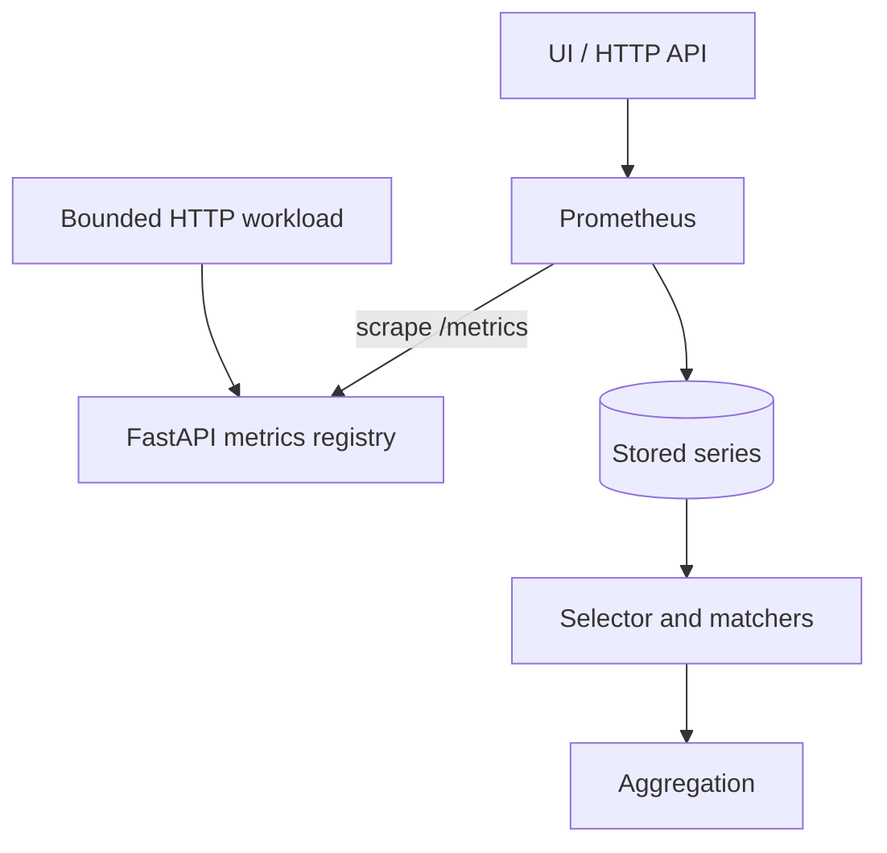
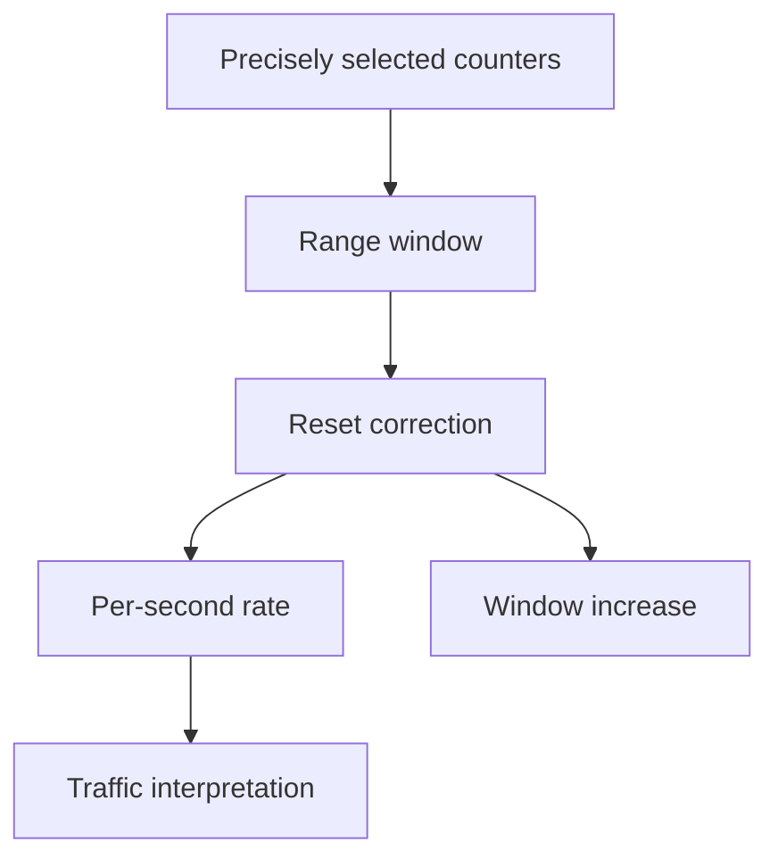

# Lab 05: PromQL Selectors, Matchers, and Aggregation

## Purpose and Scope

> **Primary Objective:** Turn stored Prometheus series into precise operational answers without silently selecting, excluding, or merging the wrong dimensions.

Lab 04 proved how configured targets become timestamped samples. Lab 05 begins systematic PromQL. You will inventory real labels, use exact and regular-expression matchers, distinguish missing labels from empty values, count result cardinality before graphing, and aggregate only after stating which dimensions must remain.

The operating rule for this lab is:

```text
question -> expected labels -> selector -> result count -> aggregation -> interpretation
```

You will use both the Prometheus expression browser and the stable HTTP API. Every result must be explainable as a set of label/value pairs, not merely as a line that “looks right.”

## 1. Inherited State From Lab 04

This lab assumes:

- PostgreSQL, Redis, the FastAPI application, and Prometheus are running;
- OpenTelemetry export is disabled;
- Prometheus uses the canonical 15-second scrape interval and 10-second timeout;
- the application target is `UP` at `app:8000`;
- the Prometheus target is `UP`;
- stopped later-stack targets are intentionally `DOWN`;
- tracked configuration has been restored after Lab 04; and
- the Prometheus named volume contains the samples collected in Lab 04.

Existing orders and historical metrics are valid lab data. Do not reset named volumes.

## 2. Explicit Scope and Exclusions

Services used:

```text
db
redis
app
prometheus
```

Keep these stopped:

```text
alertmanager
otel-collector
loki
tempo
grafana
node-exporter
```

This lab does not yet teach:

- `rate()`, `irate()`, or `increase()`;
- counter-reset correction;
- histogram quantiles or exemplars;
- vector-to-vector joins;
- recording or alerting rule design;
- dashboard construction;
- query authorization or multi-tenancy; or
- large-scale query capacity planning.

Raw counter aggregation is used only to learn label behavior. Traffic over time begins in Lab 06.

## 3. Prerequisites

From the repository root:

```bash
pwd
test -f docker-compose.yml
test -f .env
test -f labs/Lab-4.md
test -f labs/Lab-5.md
test -f config/prometheus/prometheus.yml

docker version
docker compose version
curl --version
jq --version
git --version
docker compose config --quiet
```

Use a Bash-compatible shell. The commands assume GNU `date`, as provided by the recommended Linux VM.

## 4. Learning Objectives

By the end of Lab 05, you must be able to:

- distinguish instant vectors, range vectors, scalars, and strings;
- explain why an instant query and a range query can use the same PromQL expression;
- select a metric by name and by the internal `__name__` label;
- use `=`, `!=`, `=~`, and `!~` correctly;
- explain that PromQL regular expressions are fully anchored;
- explain how matchers that accept an empty string interact with missing labels;
- identify an illegal selector with no metric name and no non-empty matcher;
- combine multiple matchers as a logical AND;
- inventory label names and values through the HTTP API;
- bound series-metadata queries by matcher and time;
- count selected series before graphing them;
- distinguish series cardinality from sample values;
- use `sum`, `count`, `avg`, `min`, `max`, `topk`, and `bottomk` appropriately;
- explain the difference between `by` and `without`;
- predict the output labels of an aggregation;
- preserve route and status dimensions when the question requires them;
- avoid treating missing series as zero;
- recognize when a query is technically valid but semantically unsafe; and
- document a reusable PromQL query contract.

## 5. Architecture for This Lab



The query path is read-only. Workload requests change application counters, but PromQL itself does not modify stored data.

## 6. Load the Lab Environment

Load settings without displaying secrets:

```bash
set -a
source .env
set +a

LAB_HTTP_HOST="${BIND_ADDRESS:-127.0.0.1}"
if [[ "$LAB_HTTP_HOST" == "0.0.0.0" || "$LAB_HTTP_HOST" == "::" ]]; then
  LAB_HTTP_HOST=127.0.0.1
fi

export APP_URL="http://$LAB_HTTP_HOST:${APP_HOST_PORT:-8000}"
export PROMETHEUS_URL="http://$LAB_HTTP_HOST:${PROMETHEUS_HOST_PORT:-9090}"
export LAB5_NOTEBOOK="lab-notes/Lab-5.md"
```

Repeat this block in every new terminal.

Create the evidence notebook without replacing existing notes:

```bash
mkdir -p lab-notes
test -f "$LAB5_NOTEBOOK" || printf '# Lab 05 Evidence\n\n' > "$LAB5_NOTEBOOK"
printf 'Started: %s\n' "$(date -u +%FT%TZ)" | tee -a "$LAB5_NOTEBOOK"
```

## 7. Reconcile the Starting State

Start only the intended workload services and keep OTLP disabled:

```bash
APP_OTEL_ENABLED=false docker compose up -d db redis app
docker compose up -d --no-deps prometheus
docker compose stop alertmanager otel-collector loki tempo grafana node-exporter
```

Wait for both query endpoints:

```bash
for attempt in {1..30}; do
  app_ready="$(curl -sS "$APP_URL/health/ready" || true)"
  prom_ready="$(curl -sS "$PROMETHEUS_URL/-/ready" || true)"

  if jq -e '.status == "ready"' <<<"$app_ready" >/dev/null 2>&1 &&
     grep -q 'Ready' <<<"$prom_ready"; then
    echo "Application and Prometheus are ready"
    break
  fi

  if [[ "$attempt" -eq 30 ]]; then
    docker compose ps
    docker compose logs --tail=100 app prometheus
    exit 1
  fi
  sleep 2
done
```

Confirm the exact service set:

```bash
running_services="$(docker compose ps --status running --services | sort)"
expected_services="$(printf '%s\n' app db prometheus redis | sort)"
test "$running_services" = "$expected_services"
printf '%s\n' "$running_services"
```

## 8. Define Safe Query Helpers

Use POST-form encoding so shell quoting and URL length do not alter expressions:

```bash
prom_query() {
  local expression="$1"
  local response

  response="$(
    curl -fsS "$PROMETHEUS_URL/api/v1/query" \
      --data-urlencode "query=$expression"
  )"
  jq -e '.status == "success"' <<<"$response" >/dev/null
  jq '.data.result' <<<"$response"
}

prom_value() {
  local expression="$1"
  prom_query "$expression" | jq -r '.[0].value[1] // empty'
}

prom_count() {
  local expression="$1"
  prom_query "count($expression)" | jq -r '.[0].value[1] // "0"'
}
```

Test them:

```bash
prom_query 'up{job="orders-api"}'
test "$(prom_value 'up{job="orders-api"}')" = "1"
```

The API encodes sample values as JSON strings. Labels remain JSON objects.

## 9. Create a Bounded Query Dataset

Generate several routes and status classes:

```bash
for request in {1..12}; do
  curl -fsS "$APP_URL/api/v1/orders?limit=5" >/dev/null
done

for code in 400 404 500 503; do
  curl -sS -o /dev/null \
    "$APP_URL/api/v1/simulate/error?status_code=$code"
done

curl -sS -o /dev/null "$APP_URL/this-route-does-not-exist"
curl -fsS "$APP_URL/health/ready" >/dev/null
sleep 20
```

The 20-second wait allows at least one canonical scrape after the workload.

Record the current HTTP series count:

```bash
printf 'HTTP series after workload: %s\n' \
  "$(prom_count 'obslab_http_requests_total{job="orders-api"}')" |
  tee -a "$LAB5_NOTEBOOK"
```

## 10. PromQL Has Four Expression Types

| **Type**       | **Meaning**                                                                | **Example** | **Valid Root For A Range Query?** |
|----------------|----------------------------------------------------------------------------|-------------|-----------------------------------|
| Instant vector | Zero or more series, one sample per series at one evaluation time          | `up`        | Yes                               |
| Range vector   | Zero or more series, multiple samples per series over a lookback range     | `up[5m]`    | No                                |
| Scalar         | One floating-point number                                                  | `60 * 5`    | Yes                               |
| String         | One string; rarely used and currently limited                              | `"lab"`     | No                                |

An HTTP `/api/v1/query_range` request repeatedly evaluates an instant-vector or scalar expression at equally spaced timestamps. It does not change the type of a selector inside the expression.

Run:

```bash
curl -fsS "$PROMETHEUS_URL/api/v1/query" \
  --data-urlencode 'query=up{job="orders-api"}' |
  jq '{resultType: .data.resultType, result: .data.result}'

curl -fsS "$PROMETHEUS_URL/api/v1/query" \
  --data-urlencode 'query=60 * 5' |
  jq '{resultType: .data.resultType, result: .data.result}'
```

Expected types are `vector` and `scalar`.

## 11. Prediction Checkpoint: The First Selector

Before running this query, predict:

1. how many series it returns;
2. which labels each result contains; and
3. whether the value represents application health or scrape success.

```promql
up{job="orders-api"}
```

Now run it:

```bash
prom_query 'up{job="orders-api"}' | tee -a "$LAB5_NOTEBOOK"
```

The result should contain one target series with at least `job="orders-api"` and `instance="app:8000"`. Its value answers only whether the most recent scrape succeeded.

## 12. Metric Name Is an Identity Label

These selectors are equivalent:

```promql
obslab_http_requests_total
{__name__="obslab_http_requests_total"}
```

Prove it by comparing sorted label objects:

```bash
prom_query 'obslab_http_requests_total{job="orders-api"}' |
  jq -S '[.[].metric] | sort' > /tmp/lab5-name-a.json

prom_query '{__name__="obslab_http_requests_total",job="orders-api"}' |
  jq -S '[.[].metric] | sort' > /tmp/lab5-name-b.json

diff -u /tmp/lab5-name-a.json /tmp/lab5-name-b.json
```

No output from `diff` proves equality. Prometheus normally hides the implementation detail by letting you write the metric name before the braces.

Use `__name__` matching for bounded metric-family discovery:

```bash
prom_query '{__name__=~"obslab_http_request.*",job="orders-api"}' |
  jq -r '.[].metric.__name__' |
  sort -u
```

## 13. Exact Equality Matcher

The `=` operator requires exact label equality:

```bash
prom_query 'obslab_http_requests_total{job="orders-api",method="GET"}' |
  jq -r '.[] | [.metric.method, .metric.route, .metric.status_code, .value[1]] | @tsv'
```

Multiple matchers in the same selector are ANDed. Every returned series must satisfy both `job` and `method`.

Test a value with the wrong case:

```bash
test "$(prom_count 'obslab_http_requests_total{method="get"}')" = "0"
```

Label values are case-sensitive.

## 14. Negative Equality Matcher

The `!=` matcher excludes an exact value:

```bash
prom_query 'obslab_http_requests_total{job="orders-api",status_code!="200"}' |
  jq -r '.[] | [.metric.route, .metric.status_code, .value[1]] | @tsv'
```

Do not translate this automatically as “all errors.” It includes every status other than `200`, including other successes and redirects if they exist.

A semantic error filter is usually clearer:

```promql
status_code=~"4..|5.."
```

## 15. Regular-Expression Matcher

The `=~` operator uses RE2 regular expressions:

```bash
prom_query \
  'obslab_http_requests_total{job="orders-api",status_code=~"4..|5.."}' |
  jq -r '.[] | [.metric.route, .metric.status_code, .value[1]] | @tsv'
```

PromQL regex matchers are fully anchored. Therefore:

```promql
route=~"/api/v1/orders"
```

matches exactly the collection route, not every route beginning with that text.

Compare:

```bash
printf 'Exact-shaped regex: %s\n' \
  "$(prom_count 'obslab_http_requests_total{route=~"/api/v1/orders"}')"

printf 'Explicit prefix regex: %s\n' \
  "$(prom_count 'obslab_http_requests_total{route=~"/api/v1/orders.*"}')"
```

The second can include `/api/v1/orders/{order_id}` if that series has been initialized by workload.

## 16. Negative Regular-Expression Matcher

The `!~` matcher rejects values matching the expression:

```bash
prom_query \
  'obslab_http_requests_total{job="orders-api",route!~"/health/.*|/metrics"}' |
  jq -r '.[].metric.route' |
  sort -u
```

`/metrics` is excluded by application middleware and should not exist in this metric family anyway. A negative matcher is not a substitute for understanding what the producer emits.

## 17. Missing Labels and Empty-String Matching

PromQL treats an absent label as having an empty value for matcher purposes. A matcher that accepts the empty string also selects series on which that label is absent.

The app target has a static `service` label; most other `up` series do not:

```bash
prom_query 'up{service=""}' |
  jq -r '.[] | [.metric.job, (.metric.service // "<absent>"), .value[1]] | @tsv'
```

Likewise:

```bash
prom_query 'up{service!="orders-api"}' |
  jq -r '.[] | [.metric.job, (.metric.service // "<absent>")] | @tsv'
```

This is a common source of accidental selection. Write down whether “missing” should be included before using negative matchers.

To require a present, non-empty label:

```promql
up{service=~".+"}
```

## 18. A Selector Must Be Bounded Syntactically

A selector must contain either:

- a metric name; or
- at least one matcher that cannot match the empty string.

This is invalid:

```promql
{job=~".*"}
```

Prove Prometheus rejects it without making the shell fail early:

```bash
invalid_code="$(
  curl -sS -o /tmp/lab5-invalid-selector.json -w '%{http_code}' \
    "$PROMETHEUS_URL/api/v1/query" \
    --data-urlencode 'query={job=~".*"}'
)"

printf 'HTTP status: %s\n' "$invalid_code"
jq '{status, errorType, error}' /tmp/lab5-invalid-selector.json
test "$invalid_code" = "422"
```

This is valid because `.+` cannot match an empty value:

```bash
prom_query '{job=~".+"}' | jq -r '.[].metric.job' | sort -u
```

Syntactically valid does not mean operationally bounded. A selector spanning every metric from every job can still be expensive and confusing.

## 19. Inventory Label Names

Use the label-names endpoint:

```bash
curl -fsS "$PROMETHEUS_URL/api/v1/labels" |
  jq -r '.data[]' |
  sort |
  tee /tmp/lab5-label-names.txt
```

This inventory spans retained data, not only the app metric you care about. Filtered discovery is safer when the API supports a matcher:

```bash
curl -fsS "$PROMETHEUS_URL/api/v1/labels" \
  --data-urlencode 'match[]=obslab_http_requests_total{job="orders-api"}' |
  jq -r '.data[]' |
  sort
```

Expected application HTTP labels include:

```text
__name__
instance
job
method
route
service
status_code
telemetry_source
```

## 20. Inventory Label Values

Discover only route values attached to the HTTP counter:

```bash
curl -fsS "$PROMETHEUS_URL/api/v1/label/route/values" \
  --data-urlencode 'match[]=obslab_http_requests_total{job="orders-api"}' |
  jq -r '.data[]' |
  sort |
  tee -a "$LAB5_NOTEBOOK"
```

Repeat for methods and statuses:

```bash
for label in method status_code; do
  printf '\n%s:\n' "$label"
  curl -fsS "$PROMETHEUS_URL/api/v1/label/$label/values" \
    --data-urlencode 'match[]=obslab_http_requests_total{job="orders-api"}' |
    jq -r '.data[]' |
    sort
done
```

Label-value discovery helps build a query; it is not itself a service-level calculation.

## 21. Bound Series-Metadata Queries

`/api/v1/series` returns label sets, not samples. Bound it with both a matcher and time:

```bash
start_epoch="$(date -u -d '15 minutes ago' +%s)"
end_epoch="$(date -u +%s)"

curl -fsS "$PROMETHEUS_URL/api/v1/series" \
  --data-urlencode 'match[]=obslab_http_requests_total{job="orders-api"}' \
  --data-urlencode "start=$start_epoch" \
  --data-urlencode "end=$end_epoch" |
  jq '.data | {series_count: length, series: sort_by(.route, .status_code)}' |
  tee -a "$LAB5_NOTEBOOK"
```

Metadata APIs can be expensive on high-cardinality systems. Do not issue unbounded “all series for all retention” requests in production.

## 22. Series Count Is Not Traffic Count

Compare:

```bash
prom_query 'count(obslab_http_requests_total{job="orders-api"})'
prom_query 'sum(obslab_http_requests_total{job="orders-api"})'
```

The first value is the number of current series. The second is the sum of their current counter values. Neither is “requests per second.”

Write in the notebook:

```text
count(series) answers:
sum(counter samples) answers:
neither answers:
```

## 23. Use Table Before Graph

In the Prometheus UI:

1. open `$PROMETHEUS_URL/query`;
2. enter `obslab_http_requests_total{job="orders-api"}`;
3. select **Table**;
4. inspect every label set;
5. only then select **Graph**.

A graph can hide overlapping series, truncate legends, and make a cumulative counter appear meaningful merely because it slopes upward. The table shows the actual query result at the evaluation time.

Capture the same evidence through the API:

```bash
prom_query 'obslab_http_requests_total{job="orders-api"}' |
  jq -r '.[] |
    [
      .metric.method,
      .metric.route,
      .metric.status_code,
      .metric.instance,
      .value[1]
    ] | @tsv' |
  sort |
  tee -a "$LAB5_NOTEBOOK"
```

## 24. Aggregation Changes Label Identity

Run the ungrouped sum:

```bash
prom_query 'sum(obslab_http_requests_total{job="orders-api"})'
```

The output normally has an empty label object. All selected series became one result. That may be correct for a global current total, but the route, method, status, target, and telemetry-source dimensions are no longer recoverable from that result.

Prediction checkpoint:

> Which labels should remain if the operational question is “current request totals by route and status”?

## 25. Aggregate With `by`

Preserve exactly the dimensions named in `by`:

```bash
prom_query '
  sum by (route, status_code) (
    obslab_http_requests_total{job="orders-api"}
  )
' |
  jq -r '.[] | [.metric.route, .metric.status_code, .value[1]] | @tsv' |
  sort
```

The output drops `method`, `instance`, `job`, `service`, and `telemetry_source` because they were not named.

State the contract:

```text
Input dimensions:
Dimensions intentionally retained:
Dimensions intentionally merged:
Operational question:
```

## 26. Aggregate With `without`

`without` removes named dimensions and preserves every other input label:

```bash
prom_query '
  sum without (instance, job, service, telemetry_source) (
    obslab_http_requests_total{job="orders-api"}
  )
' |
  jq -r '.[] | .metric' |
  head
```

For the current metric, this retains `method`, `route`, and `status_code`.

Compare `by` and `without`:

| **Form**                                                  | **Best When**                                            | **Evolution Risk**                                      |
|-----------------------------------------------------------|----------------------------------------------------------|---------------------------------------------------------|
| `sum by (route, status_code)`                             | The output contract has an explicit allow-list           | New producer labels are dropped automatically           |
| `sum without (instance, job, service, telemetry_source)`  | You know which infrastructure dimensions to remove       | A new label may unexpectedly survive and split output   |

Neither is universally safer. Choose based on the intended output schema.

## 27. Count by Dimension

Find how many HTTP series exist for each route:

```bash
prom_query '
  count by (route) (
    obslab_http_requests_total{job="orders-api"}
  )
' |
  jq -r '.[] | [.metric.route, .value[1]] | @tsv' |
  sort
```

This count reflects combinations of the remaining labels, such as method and status. It is a dimensionality diagnostic, not traffic volume.

Now count by full application-owned dimensions:

```bash
prom_query '
  count by (method, route, status_code) (
    obslab_http_requests_total{job="orders-api"}
  )
'
```

Every output value should be `1` for this single app target unless duplicate scrape paths ingest the same application dimensions under different remaining labels that were merged.

## 28. Average, Minimum, and Maximum Need Meaning

These aggregators are valid syntax:

```promql
avg(obslab_http_requests_total{job="orders-api"})
min(obslab_http_requests_total{job="orders-api"})
max(obslab_http_requests_total{job="orders-api"})
```

But an average across unrelated route/status counters rarely answers a useful question. The mathematical operation must match comparable populations.

A meaningful gauge example is scrape duration across selected targets:

```bash
prom_query 'max by (job) (scrape_duration_seconds{job=~"orders-api|prometheus"})'
prom_query 'avg by (job) (scrape_duration_seconds{job=~"orders-api|prometheus"})'
```

There is one target per job here, so max and average should match. With replicas, they answer different fleet questions.

## 29. `topk` and `bottomk` Preserve Selected Series

Find the three largest current HTTP counter children:

```bash
prom_query '
  topk(
    3,
    obslab_http_requests_total{job="orders-api"}
  )
' |
  jq -r '.[] | [.metric.route, .metric.status_code, .value[1]] | @tsv'
```

`topk` ranks current sample values. For counters, that favors series with long process history, not necessarily current traffic. Lab 06 will rank rates instead.

Use `bottomk` only when “smallest” has clear semantics; zero-initialized or recently created counter children can dominate.

## 30. Controlled Experiment: Selector Broadening

You will quantify how one matcher changes result cardinality.

Predict the relative counts:

```promql
obslab_http_requests_total{route="/api/v1/orders"}
obslab_http_requests_total{route=~"/api/v1/orders.*"}
obslab_http_requests_total{route=~".+"}
```

Measure:

```bash
for expression in \
  'obslab_http_requests_total{route="/api/v1/orders"}' \
  'obslab_http_requests_total{route=~"/api/v1/orders.*"}' \
  'obslab_http_requests_total{route=~".+"}'
do
  printf '%-80s %s series\n' "$expression" "$(prom_count "$expression")"
done | tee -a "$LAB5_NOTEBOOK"
```

The values depend on initialized routes and statuses, but the counts must be non-decreasing as selection broadens.

## 31. Controlled Experiment: Aggregate Deliberately

Answer three different questions:

1. How many distinct current series exist?
2. What is the current cumulative counter total by status?
3. What is the current cumulative counter total by route and status?

```bash
prom_query '
  count(
    obslab_http_requests_total{job="orders-api"}
  )
'

prom_query '
  sum by (status_code) (
    obslab_http_requests_total{job="orders-api"}
  )
'

prom_query '
  sum by (route, status_code) (
    obslab_http_requests_total{job="orders-api"}
  )
'
```

Capture each query, output labels, and one-sentence interpretation. If two interpretations are identical, revisit the labels: the queries answer different questions.

## 32. Do Not Use Raw Counters for Current Traffic

This query is legal:

```promql
sum by (route) (obslab_http_requests_total{job="orders-api"})
```

It gives cumulative values from the current process epoch. It does not normalize time, correct resets, or make instances comparable when they started at different times.

Label this result accurately:

```text
Current cumulative request counter by route
```

Do not label it:

```text
Request rate
Requests in the last five minutes
Current throughput
```

## 33. Missing, Zero, and Empty Result

Query a nonexistent status:

```bash
prom_query 'obslab_http_requests_total{status_code="599"}'
```

An empty JSON array means no current series matched. It is not a zero-valued sample.

Compare with:

```bash
prom_query 'vector(0)'
prom_query 'absent(obslab_http_requests_total{status_code="599"})'
```

- `vector(0)` creates one unlabeled zero sample.
- `absent(...)` returns one value when the input has no elements.
- A real zero-valued series carries the identity and timestamp of that series.

Do not fill absence with zero until the operational contract explicitly says absence means zero.

## 34. Query-Time Labels Versus Source Labels

Application-owned labels:

```text
method
route
status_code
```

Target labels attached by Prometheus:

```text
instance
job
service
telemetry_source
```

The stored series contains both. Aggregation does not care who created a label, but operators should: application dimensions usually describe work; target dimensions describe collection identity.

Inspect one result:

```bash
prom_query 'obslab_http_requests_total{job="orders-api"}' |
  jq '.[0].metric' |
  tee -a "$LAB5_NOTEBOOK"
```

## 35. Avoid Duplicate Telemetry Paths

The repository will later expose similar HTTP measurements through the OpenTelemetry pipeline. Today that target is stopped.

This selector is deliberately scoped:

```promql
obslab_http_requests_total{
  job="orders-api",
  telemetry_source="prometheus-client"
}
```

When multiple pipelines exist, aggregating only by a human-readable service name can double-count conceptually similar data. Metric names and semantic definitions still need review.

## 36. A Professional Query Contract

For every reusable query, record:

| **Field**           | **Required Statement**                                                        |
|---------------------|-------------------------------------------------------------------------------|
| Question            | The operational question in plain language                                    |
| Source              | Metric family and telemetry path                                              |
| Required Matchers   | Tenant, environment, service, job, or other scope                             |
| Input Type          | Counter, gauge, classic histogram component, or derived rule                  |
| Output Labels       | Exact dimensions the consumer receives                                        |
| Unit                | Requests, seconds, bytes, ratio, percent, and so on                           |
| Empty Behavior      | Empty, zero-filled, error, or explicit absent signal                          |
| Time Behavior       | Instant, range, window, evaluation cadence                                    |
| Known Limits        | Resets, missing targets, cardinality, sampling, bucket error                  |

Create one contract for:

```promql
sum by (route, status_code) (
  obslab_http_requests_total{
    job="orders-api",
    telemetry_source="prometheus-client"
  }
)
```

State clearly that it remains a raw cumulative counter query.

## 37. Evidence Matrix

Your notebook must include:

| **Evidence**              | **Command/API**                         | **What It Proves**           |
|---------------------------|-----------------------------------------|------------------------------|
| Exact running service set | `docker compose ps`                     | Lab isolation                |
| Target success            | `up{job="orders-api"}`                  | Current scrape success       |
| HTTP label names          | `/api/v1/labels` with matcher           | Available dimensions         |
| Route/status values       | Label-values APIs                       | Real vocabulary              |
| Bounded label sets        | `/api/v1/series` with time              | Current/recent cardinality   |
| Four matcher outputs      | Instant-query API                       | Selection semantics          |
| Empty-label example       | `up{service=""}`                        | Missing-label behavior       |
| Invalid selector response | HTTP 422 body                           | Parser safety rule           |
| Broadening counts         | Three `count()` queries                 | Cardinality change           |
| `by` output               | Aggregated result labels                | Allow-list grouping          |
| `without` output          | Aggregated result labels                | Deny-list grouping           |
| Query contract            | Notebook prose                          | Operational meaning          |

## 38. Troubleshooting: Empty Results

Check in this order:

1. Is Prometheus ready?
2. Is `up{job="orders-api"}` equal to one?
3. Does the metric name exist in `/api/v1/label/__name__/values`?
4. Does the unfiltered metric selector return series?
5. Is the label name spelled and cased correctly?
6. Does the requested label value exist?
7. Did a negative or regex matcher unintentionally include/exclude missing labels?
8. Is the evaluation time inside retained data?
9. Did the producer initialize that label combination?

Useful commands:

```bash
prom_query 'up{job="orders-api"}'

curl -fsS "$PROMETHEUS_URL/api/v1/label/__name__/values" |
  jq -r '.data[]' |
  grep '^obslab_'

curl -fsS "$APP_URL/metrics" |
  grep '^obslab_http_requests_total'
```

## 39. Troubleshooting: Unexpectedly Many Series

Inspect exact labels before changing the query:

```bash
prom_query 'obslab_http_requests_total{job="orders-api"}' |
  jq -r '.[].metric | to_entries | sort_by(.key) | from_entries' |
  sort
```

Common causes:

- a regex was broader than intended;
- a negative matcher included missing labels;
- historical/recent series were inspected through a metadata API;
- an aggregation preserved an unexpected new label;
- both native and OTLP telemetry paths were selected;
- a route/status combination was initialized during an earlier exercise; or
- multiple replicas legitimately exist.

Do not fix cardinality surprises by hiding labels in the legend.

## 40. Troubleshooting: Aggregation Lost Context

If a result lacks a label you need, inspect:

```bash
prom_query 'obslab_http_requests_total{job="orders-api"}' |
  jq '.[0].metric'
```

Then explicitly add the dimension to `by (...)` or remove it from `without (...)`. Remember that changing grouping changes the operational question and output cardinality.

If output unexpectedly splits, list all labels that survived:

```bash
prom_query '
  sum without (instance) (
    obslab_http_requests_total{job="orders-api"}
  )
' |
  jq -r '.[].metric | keys[]' |
  sort -u
```

## 41. Production Implications

1. Scope reusable queries by stable ownership labels such as environment and service.
2. Treat negative matchers as including absent labels unless another matcher requires presence.
3. Count series before deploying a broad regex to a dashboard or alert.
4. Bound metadata APIs by matcher and time.
5. Prefer explicit output-label contracts for recording rules and dashboards.
6. Review `without` aggregations when producers add labels.
7. Do not infer traffic from raw counter levels.
8. Do not treat empty results as zero without a defined semantic reason.
9. Keep tenant authorization outside user-controlled PromQL alone.
10. Test queries against multiple replicas and mixed versions before production reuse.

## 42. Knowledge Check

Answer before reading the key:

1. What is an instant vector?
2. Why can `up[5m]` not be the root result of a range-query API request?
3. How is a metric name represented internally?
4. Are PromQL regex matchers substring matches by default?
5. What does `=~` mean?
6. What does `!~` mean?
7. How are multiple matchers inside one selector combined?
8. Why can `label!="value"` include series without `label`?
9. Why is `{job=~".*"}` invalid?
10. Why is `{job=~".+"}` valid?
11. What does an empty instant-vector result mean?
12. Does `count(metric)` count requests?
13. What does `sum by (route)` preserve?
14. What does `sum without (instance)` preserve?
15. Which grouping form automatically drops future labels?
16. Why should you inspect a table before a graph?
17. Does `topk(3, counter)` identify the highest current rate?
18. What does `/api/v1/series` return?
19. Why should metadata requests include a matcher and time bounds?
20. What is the difference between `vector(0)` and an empty vector?
21. Which labels are created by application instrumentation in the HTTP counter?
22. Which labels describe the Prometheus target path?
23. Why can two telemetry pipelines cause double counting?
24. What must a query contract say about output labels?
25. Which lab introduces time-normalized counter math?

## 43. Knowledge Check Answers

1. A set of series with one sample per series at one evaluation time.
2. Range-query endpoints repeatedly evaluate instant-vector or scalar expressions; a raw range vector is an intermediate type.
3. As the internal `__name__` label.
4. No. They are fully anchored.
5. The label value must match the RE2 expression.
6. The label value must not match the RE2 expression.
7. Logical AND; every matcher must pass.
8. An absent label behaves like an empty value, and empty is not equal to `value`.
9. It has no metric name and its only matcher accepts the empty string.
10. `.+` requires at least one character.
11. No current series matched at that evaluation time.
12. No. It counts selected series.
13. Only `route` from input labels.
14. Every input label except `instance`.
15. `by (...)`, because it is an allow-list.
16. To inspect exact series and label identity before visual overlap or legend formatting hides it.
17. No. It ranks current cumulative values.
18. Series label sets, not sample values.
19. To constrain index work and avoid expensive full-retention discovery.
20. `vector(0)` is one real query result sample; an empty vector has no elements.
21. `method`, `route`, and `status_code`.
22. `job`, `instance`, `service`, and `telemetry_source` in this job.
23. Semantically overlapping observations may be selected and summed twice.
24. Exactly which dimensions survive and which are intentionally merged.
25. Lab 06.

## 44. Professional Scenarios

### Scenario A: A regex dashboard doubles its lines

A dashboard changes `route="/api/v1/orders"` to `route=~"/api/v1/orders.*"`. The extra line is not a Grafana defect: the selector now includes templated item routes. Inventory route values and decide whether collection and item operations belong together.

### Scenario B: “Not production” includes unlabeled series

`environment!="production"` also selects series missing `environment`. Require presence and the allowed environments, or enforce the environment label at ingestion.

### Scenario C: A new library label fragments an aggregation

A query using `sum without(instance)` begins returning extra series after a library upgrade adds `client_version`. Its deny-list preserved the new label. Review the contract and consider `sum by(...)`.

## 45. Required Lab Notebook

Your `lab-notes/Lab-5.md` must contain:

- UTC start and finish times;
- exact running service set;
- HTTP metric label-name and label-value inventories;
- a bounded recent series inventory;
- predicted and actual counts for the selector-broadening experiment;
- one example for each matcher operator;
- proof of empty/missing-label behavior;
- the invalid-selector response;
- output labels for both `by` and `without`;
- one useful and one semantically useless aggregation, with reasons;
- a completed query contract;
- all 25 knowledge-check answers; and
- one unresolved question for Lab 06.

Append a compact command transcript:

```bash
{
  printf '\n## Final evidence\n'
  printf 'Finished: %s\n' "$(date -u +%FT%TZ)"
  printf 'HTTP series: %s\n' \
    "$(prom_count 'obslab_http_requests_total{job="orders-api"}')"
  printf 'App target up: %s\n' \
    "$(prom_value 'up{job="orders-api"}')"
} >> "$LAB5_NOTEBOOK"
```

## 46. Completion Checklist

- [ ] Only app, DB, Redis, and Prometheus are running.
- [ ] The app and Prometheus readiness checks pass.
- [ ] A bounded multi-route/status dataset was generated.
- [ ] All four PromQL expression types were identified.
- [ ] Metric-name and `__name__` selection were proven equivalent.
- [ ] Exact, negative, regex, and negative-regex matchers were exercised.
- [ ] Fully anchored regex behavior was demonstrated.
- [ ] Missing-label/empty-string behavior was demonstrated.
- [ ] Prometheus rejected the illegal unbounded selector.
- [ ] Label names and values were inventoried.
- [ ] The series API request was matcher- and time-bounded.
- [ ] Series count was distinguished from traffic count.
- [ ] Table output was inspected before graph output.
- [ ] `by` and `without` result labels were predicted and verified.
- [ ] Aggregations were tied to explicit questions.
- [ ] Empty result, zero sample, and `absent()` were distinguished.
- [ ] A professional query contract was written.
- [ ] All 25 knowledge questions were answered.
- [ ] The evidence notebook is complete.

## 47. Upstream Reference Map

- [Prometheus querying basics](https://prometheus.io/docs/prometheus/latest/querying/basics/): expression types, selectors, matchers, empty labels, regex anchoring, and range selectors.
- [Prometheus operators](https://prometheus.io/docs/prometheus/latest/querying/operators/): aggregation operators, `by`, `without`, and vector behavior.
- [Prometheus HTTP API](https://prometheus.io/docs/prometheus/latest/querying/api/): instant/range queries and metadata endpoints.
- [Prometheus data model](https://prometheus.io/docs/concepts/data_model/): series identity and labels.

Use documentation for the deployed version when applying these exercises outside the pinned lab.

## 48. Final State and Transition to Lab 06

Confirm target and configuration health:

```bash
test "$(prom_value 'up{job="orders-api"}')" = "1"
test "$(prom_value 'up{job="prometheus"}')" = "1"
git diff --exit-code -- config/prometheus
```

Confirm the intended service set:

```bash
running_services="$(docker compose ps --status running --services | sort)"
expected_services="$(printf '%s\n' app db prometheus redis | sort)"
test "$running_services" = "$expected_services"
```

Leave these services running:

```text
app
db
prometheus
redis
```

Lab 05 established **which series** a query contains. Lab 06 establishes **how a counter changes through time**, including process resets:



Carry these invariants forward:

```text
valid selector != safe scope
empty result != zero
series count != event count
counter level != traffic rate
aggregation syntax != operational meaning
graph shape != label correctness
```