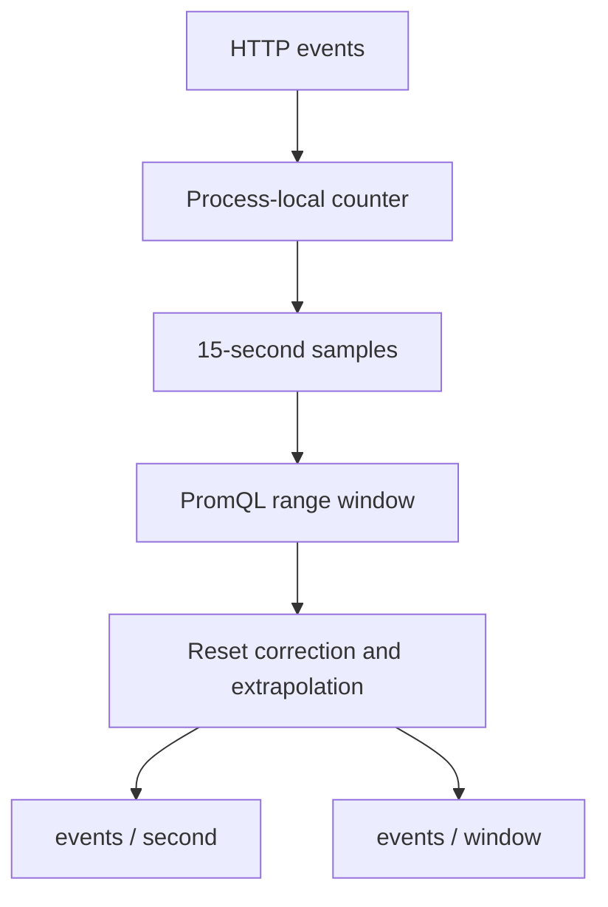
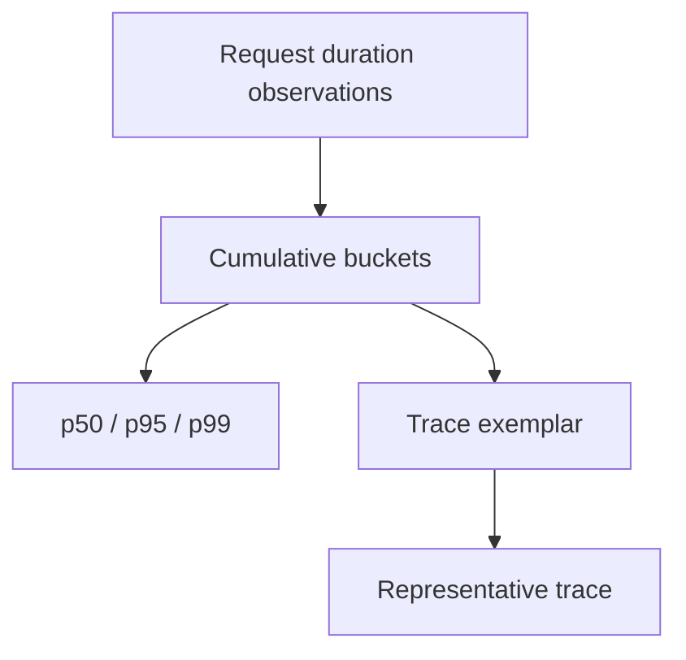

# Lab 06: Counter Math — `rate`, `irate`, and `increase`

## Purpose and Scope

> **Primary objective:** Convert monotonically increasing process-local counters into defensible traffic measurements across scrape timing, window boundaries, and process resets.

Lab 05 selected and grouped the correct series. A raw counter still answers only “how many events has this process observed since its current counter epoch?” Lab 06 adds time:

```text
selected counter samples -> range window -> reset correction -> rate or increase
```

You will generate bounded traffic, compare windows, contrast `rate()` with `irate()`, interpret fractional `increase()` results, restart the app to create a real reset, and prove why rate must be calculated before aggregation.

---

## 6.1 Inherited State From Lab 05

Expected running services:

```text
app
db
prometheus
redis
```

Expected conditions:

- OpenTelemetry export is disabled;
- Prometheus scrapes every 15 seconds;
- the app target and Prometheus self-target are `UP`;
- later observability services remain stopped;
- the Lab 05 query vocabulary is understood; and
- no Prometheus configuration changes are pending.

The Prometheus volume may contain earlier process epochs. That history is useful for reset analysis.

---

## 6.2 Explicit Scope and Exclusions

This lab teaches classic float counters and range-vector counter functions. It does not yet teach:

- classic or native histogram quantiles;
- exemplars;
- recording-rule implementation;
- dashboard interval variables;
- alert thresholds;
- long-term forecasting;
- SLO windows; or
- exact business-event reconciliation.

`increase()` is an estimate based on sampled telemetry. PostgreSQL or an event ledger remains the source for exact order accounting.

---

## 6.3 Prerequisites

```bash
pwd
test -f .env
test -f labs/Lab-5.md
test -f labs/Lab-6.md
test -x scripts/generate-load.sh

docker version
docker compose version
docker compose config --quiet
curl --version
jq --version
git --version
```

You need enough time to collect several scrapes. Budget 60–90 minutes for the observations and reset experiment.

---

## 6.4 Learning Objectives

By the end of Lab 06, you must be able to:

- explain why a counter level is not throughput;
- distinguish an instant vector from a range vector;
- describe the left-open, right-closed range-window boundary;
- state the minimum sample requirement for rate calculations;
- explain extrapolation to window boundaries;
- explain automatic counter-reset correction;
- interpret `rate()` as an average per-second rate;
- interpret `irate()` as a last-two-sample per-second rate;
- interpret `increase()` as an extrapolated increase over the selected window;
- explain why an integer counter can yield a fractional increase;
- choose a window that balances responsiveness and stability;
- explain Grafana’s four-scrape window heuristic without treating it as a Prometheus law;
- use `resets()` to find observed counter decreases;
- distinguish `changes()` from `resets()`;
- use `delta()` and `deriv()` only for suitable gauges;
- apply `rate()` before cross-series aggregation;
- build request-rate and error-ratio queries;
- avoid interpreting missing rate output as zero traffic;
- create and recover from a bounded application restart; and
- document the uncertainty of sampled measurements.

---

## 6.5 Architecture and Time Model



Prometheus does not receive every request event. It samples the cumulative counter. Counter functions infer change from those samples.

---

## 6.6 Load the Environment

```bash
set -a
source .env
set +a

LAB_HTTP_HOST="${BIND_ADDRESS:-127.0.0.1}"
if [[ "$LAB_HTTP_HOST" == "0.0.0.0" || "$LAB_HTTP_HOST" == "::" ]]; then
  LAB_HTTP_HOST=127.0.0.1
fi

export APP_URL="http://$LAB_HTTP_HOST:${APP_HOST_PORT:-8000}"
export PROMETHEUS_URL="http://$LAB_HTTP_HOST:${PROMETHEUS_HOST_PORT:-9090}"
export LAB6_NOTEBOOK="lab-notes/Lab-6.md"

mkdir -p lab-notes
test -f "$LAB6_NOTEBOOK" || printf '# Lab 06 Evidence\n\n' > "$LAB6_NOTEBOOK"
printf 'Started: %s\n' "$(date -u +%FT%TZ)" | tee -a "$LAB6_NOTEBOOK"
```

Repeat variable and helper definitions in each new terminal.

---

## 6.7 Reconcile the Starting State

```bash
APP_OTEL_ENABLED=false docker compose up -d db redis app
docker compose up -d --no-deps prometheus
docker compose stop alertmanager otel-collector loki tempo grafana node-exporter

for attempt in {1..30}; do
  app_status="$(curl -sS "$APP_URL/health/ready" || true)"
  prom_status="$(curl -sS "$PROMETHEUS_URL/-/ready" || true)"
  if jq -e '.status == "ready"' <<<"$app_status" >/dev/null 2>&1 &&
     grep -q Ready <<<"$prom_status"; then
    break
  fi
  if [[ "$attempt" -eq 30 ]]; then
    docker compose ps
    exit 1
  fi
  sleep 2
done

running="$(docker compose ps --status running --services | sort)"
expected="$(printf '%s\n' app db prometheus redis | sort)"
test "$running" = "$expected"
```

---

## 6.8 Define Query Helpers

```bash
prom_query() {
  local expression="$1"
  local response

  response="$(
    curl -fsS "$PROMETHEUS_URL/api/v1/query" \
      --data-urlencode "query=$expression"
  )"
  jq -e '.status == "success"' <<<"$response" >/dev/null
  printf '%s\n' "$response"
}

prom_result() {
  prom_query "$1" | jq '.data.result'
}

prom_value() {
  prom_query "$1" | jq -r '.data.result[0].value[1] // empty'
}

prom_range() {
  local expression="$1"
  local start="$2"
  local end="$3"
  local step="$4"

  curl -fsS "$PROMETHEUS_URL/api/v1/query_range" \
    --data-urlencode "query=$expression" \
    --data-urlencode "start=$start" \
    --data-urlencode "end=$end" \
    --data-urlencode "step=$step" |
    jq -e '.status == "success" and .data'
}
```

Verify:

```bash
test "$(prom_value 'up{job="orders-api"}')" = "1"
```

---

## 6.9 Select One Stable Counter Child

Use the collection endpoint’s GET/200 child throughout the reset experiment:

```bash
export COUNTER_SELECTOR='obslab_http_requests_total{
  job="orders-api",
  method="GET",
  route="/api/v1/orders",
  status_code="200"
}'

curl -fsS "$APP_URL/api/v1/orders?limit=5" >/dev/null
sleep 20
prom_result "$COUNTER_SELECTOR"
```

The label identity stays stable across app restarts because Prometheus continues scraping `app:8000`. The counter value does not.

---

## 6.10 Prediction Checkpoint — A Raw Counter

Run two requests:

```bash
before="$(prom_value "$COUNTER_SELECTOR")"
curl -fsS "$APP_URL/api/v1/orders?limit=5" >/dev/null
curl -fsS "$APP_URL/api/v1/orders?limit=5" >/dev/null
after_source="$(
  curl -fsS "$APP_URL/metrics" |
    awk '
      /^obslab_http_requests_total/ &&
      /method="GET"/ &&
      /route="\/api\/v1\/orders"/ &&
      /status_code="200"/ {print $NF}
    '
)"

printf 'Prometheus before=%s source now=%s\n' "$before" "$after_source"
```

Before waiting for a scrape, predict whether Prometheus already reflects the two events. The source registry changes immediately; Prometheus changes only after collection.

```bash
sleep 20
after="$(prom_value "$COUNTER_SELECTOR")"
printf 'Prometheus after=%s\n' "$after"
```

---

## 6.11 A Counter Has a Process Epoch

A counter normally:

- starts at zero when the process initializes;
- never decreases during that process lifetime;
- increases when matching events occur; and
- returns to a lower value when the process restarts.

The counter is not permanent storage. The target labels may remain unchanged across a reset, so the TSDB series can contain a decrease.

Inspect the process start gauge:

```bash
prom_result 'process_start_time_seconds{job="orders-api"}'
```

It helps corroborate a new process epoch; it is not needed by `rate()` to detect the counter decrease.

---

## 6.12 Range Selectors Supply Samples

This selector:

```promql
obslab_http_requests_total{job="orders-api"}[5m]
```

creates one range vector element per matching series. Each element contains stored samples newer than the left boundary and up to and including the right boundary.

Inspect one series through the query API:

```bash
prom_query "$COUNTER_SELECTOR[2m]" |
  jq '.data | {resultType, sample_count: (.result[0].values | length), first: .result[0].values[0], last: .result[0].values[-1]}'
```

An instant-query endpoint may return a range-vector result. A query-range endpoint cannot use a raw range vector as its root expression.

---

## 6.13 `rate()` — Average Per-Second Change

Run:

```bash
prom_result "rate($COUNTER_SELECTOR[5m])"
```

`rate()`:

1. reads the counter samples inside the range;
2. adjusts observed decreases as resets;
3. estimates change across the window;
4. extrapolates to the window boundaries; and
5. divides by window seconds.

The unit is requests per second because the input counter unit is requests.

Convert to requests per minute only for presentation:

```bash
prom_result "60 * rate($COUNTER_SELECTOR[5m])"
```

The underlying semantic contract remains a per-second Prometheus rate.

---

## 6.14 Generate a Measured Steady Workload

Create about two successful requests per second for 90 seconds:

```bash
workload_start="$(date -u +%s)"
deadline=$((SECONDS + 90))
attempted=0

while ((SECONDS < deadline)); do
  curl -fsS "$APP_URL/api/v1/orders?limit=5" >/dev/null
  attempted=$((attempted + 1))
  sleep 0.5
done

workload_end="$(date -u +%s)"
printf 'Attempted=%s start=%s end=%s\n' \
  "$attempted" "$workload_start" "$workload_end" |
  tee -a "$LAB6_NOTEBOOK"

sleep 20
```

Shell scheduling, HTTP duration, and scrape alignment mean the observed rate will be near—not exactly—two per second.

---

## 6.15 Compare Rate Windows

```bash
for window in 1m 5m 15m; do
  value="$(prom_value "rate($COUNTER_SELECTOR[$window])")"
  printf '%-4s %s requests/second\n' "$window" "$value"
done | tee -a "$LAB6_NOTEBOOK"
```

Interpretation:

| Window | Typical behavior | Risk |
|---|---|---|
| `1m` | Responds quickly to the recent workload | Noisier; fewer samples; vulnerable to missed scrapes |
| `5m` | Balanced operational view | Smooths short bursts |
| `15m` | Stable trend | Can conceal a recent change |

The 15-minute value includes more pre-workload idle time unless traffic has run for the full window.

---

## 6.16 Window Size Versus Scrape Interval

With a 15-second scrape interval:

| Window | Approximate scheduled samples when fully populated |
|---:|---:|
| 30 seconds | 2 |
| 1 minute | 4 |
| 5 minutes | 20 |
| 15 minutes | 60 |

`rate()` needs at least two usable samples. That minimum is not a recommendation. A missed scrape can leave a two-sample window with insufficient data.

Grafana’s `$__rate_interval` uses a lower bound based on roughly four scrape intervals. Treat that as a robust visualization heuristic, not a PromQL language requirement. Lab 10 uses the variable.

---

## 6.17 Prediction Checkpoint — Stop the Workload

After the workload stops, predict which window falls fastest:

```promql
rate(selector[1m])
rate(selector[5m])
rate(selector[15m])
```

Observe every 30 seconds for two minutes:

```bash
for observation in {1..4}; do
  printf '\nObservation %s at %s\n' "$observation" "$(date -u +%T)"
  for window in 1m 5m 15m; do
    printf '%-4s %s\n' "$window" \
      "$(prom_value "rate($COUNTER_SELECTOR[$window])")"
  done
  sleep 30
done | tee -a "$LAB6_NOTEBOOK"
```

The shorter window forgets old traffic sooner.

---

## 6.18 `irate()` — Last-Two-Sample Change

Compare both functions:

```bash
prom_result "rate($COUNTER_SELECTOR[5m])"
prom_result "irate($COUNTER_SELECTOR[5m])"
```

`irate()` uses only the last two samples found in the five-minute range. The range provides a search horizon; it does not make `irate()` average across all five minutes.

Generate a short burst and observe:

```bash
for request in {1..40}; do
  curl -fsS "$APP_URL/api/v1/orders?limit=5" >/dev/null &
done
wait
sleep 20

printf 'rate:  %s\n' "$(prom_value "rate($COUNTER_SELECTOR[5m])")"
printf 'irate: %s\n' "$(prom_value "irate($COUNTER_SELECTOR[5m])")"
```

Depending on scrape alignment, the last two samples may capture the burst or the quiet period immediately after it.

---

## 6.19 Choose `rate` or `irate` Deliberately

| Function | Samples used | Best fit | Main hazard |
|---|---|---|---|
| `rate(v[5m])` | All usable samples in the window | Alerts, capacity trends, slow-moving counters | Smooths brief changes |
| `irate(v[5m])` | Last two usable samples | High-resolution graphs of fast-moving counters | Volatile and scrape-alignment-sensitive |

Avoid `irate()` for alerts. A single evaluation can see a burst and the next can see quiet, producing flapping behavior.

---

## 6.20 `increase()` — Change Over the Window

Run:

```bash
prom_result "increase($COUNTER_SELECTOR[5m])"
prom_result "300 * rate($COUNTER_SELECTOR[5m])"
```

The values should be equivalent apart from floating-point representation because `increase(v[5m])` is conceptually `rate(v[5m]) * 300`.

Use `increase()` when the question is naturally window-based:

```text
Approximately how many matching requests occurred over this five-minute window?
```

Use `rate()` when comparing windows or services with a normalized per-second unit.

---

## 6.21 Why `increase()` Can Be Fractional

Even when the counter increments by whole requests, Prometheus extrapolates observed change to the exact window boundaries. Scrapes rarely align perfectly with those boundaries.

Therefore this is normal:

```text
increase(...) = 39.7421
```

It does not mean 0.7421 of an HTTP request occurred. It means the sampled series supports an extrapolated estimate of that increase.

Do not round an estimate and present it as an audited transaction count.

---

## 6.22 Controlled Exact Attempts Versus Sampled Estimate

Run exactly 25 requests:

```bash
experiment_start="$(date -u +%s)"
for request in {1..25}; do
  curl -fsS "$APP_URL/api/v1/orders?limit=5" >/dev/null
done
experiment_end="$(date -u +%s)"
sleep 20

printf 'Client attempts: 25\n' | tee -a "$LAB6_NOTEBOOK"
printf 'Prometheus increase over 2m: %s\n' \
  "$(prom_value "increase($COUNTER_SELECTOR[2m])")" |
  tee -a "$LAB6_NOTEBOOK"
```

The two-minute window likely includes traffic outside the exact experiment and boundary extrapolation. The client count and metric estimate answer related but non-identical questions.

---

## 6.23 Build Total Request Rate

Calculate rate per child, then aggregate:

```bash
prom_result '
  sum(
    rate(
      obslab_http_requests_total{job="orders-api"}[5m]
    )
  )
'
```

Preserve route:

```bash
prom_result '
  sum by (route) (
    rate(
      obslab_http_requests_total{job="orders-api"}[5m]
    )
  )
'
```

The output unit remains requests per second.

---

## 6.24 Rate Before Sum

Correct:

```promql
sum by (route) (
  rate(obslab_http_requests_total{job="orders-api"}[5m])
)
```

Unsafe conceptual order:

```promql
rate(
  sum by (route) (obslab_http_requests_total{job="orders-api"})[5m:]
)
```

The subquery makes the second expression parse, but aggregation has already hidden which individual series reset. If one replica resets while another continues, `rate()` cannot correct each counter independently.

Rule:

```text
counter function first -> aggregation second
```

Apply it to classic histogram buckets too.

---

## 6.25 Calculate Status-Class Rate

```bash
prom_result '
  sum by (status_code) (
    rate(
      obslab_http_requests_total{job="orders-api"}[5m]
    )
  )
' |
  jq -r '.[] | [.metric.status_code, .value[1]] | @tsv' |
  sort
```

Generate known errors if no recent error series has usable samples:

```bash
for request in {1..10}; do
  curl -sS -o /dev/null \
    "$APP_URL/api/v1/simulate/error?status_code=500"
done
sleep 20
```

Repeat the query and identify the `500` series.

---

## 6.26 Build a 5xx Error Ratio

Numerator:

```promql
sum(
  rate(
    obslab_http_requests_total{
      job="orders-api",
      status_code=~"5.."
    }[5m]
  )
)
```

Denominator:

```promql
sum(
  rate(
    obslab_http_requests_total{job="orders-api"}[5m]
  )
)
```

Combined:

```bash
prom_result '
  sum(
    rate(
      obslab_http_requests_total{
        job="orders-api",
        status_code=~"5.."
      }[5m]
    )
  )
  /
  clamp_min(
    sum(
      rate(
        obslab_http_requests_total{job="orders-api"}[5m]
      )
    ),
    0.001
  )
'
```

The result is a ratio from zero to one, not a percentage. Multiply by 100 only for percentage display.

---

## 6.27 Empty Numerators Need an Explicit Contract

If no 5xx child has ever been initialized in the current process, the numerator can be empty, making the entire ratio empty.

The repository recording rule uses a zero fallback aligned by job:

```promql
(
  sum by (job) (
    rate(obslab_http_requests_total{status_code=~"5.."}[5m])
  )
  or on (job)
  0 * sum by (job) (
    rate(obslab_http_requests_total[5m])
  )
)
/
clamp_min(
  sum by (job) (rate(obslab_http_requests_total[5m])),
  0.001
)
```

This deliberately says “when total traffic exists but the 5xx child is absent, treat 5xx rate as zero.” It does not say “when the app is unmonitored, error ratio is zero.”

---

## 6.28 `resets()` Counts Observed Resets

Before restarting:

```bash
prom_result "resets($COUNTER_SELECTOR[30m])"
```

Any decrease between consecutive float samples is treated as a reset. The value may already be nonzero because previous labs restarted the app inside the 30-minute window.

Capture a narrower baseline:

```bash
reset_baseline="$(prom_value "resets($COUNTER_SELECTOR[10m])")"
printf 'Reset baseline: %s\n' "$reset_baseline" | tee -a "$LAB6_NOTEBOOK"
```

---

## 6.29 Controlled Reset — Establish Pre-Restart Samples

Generate and scrape a clear pre-restart value:

```bash
for request in {1..20}; do
  curl -fsS "$APP_URL/api/v1/orders?limit=5" >/dev/null
done
sleep 20

export RESET_EXPERIMENT_START="$(date -u +%s)"
pre_counter="$(prom_value "$COUNTER_SELECTOR")"
pre_process_start="$(
  prom_value 'process_start_time_seconds{job="orders-api"}'
)"

printf 'Pre counter=%s process_start=%s\n' \
  "$pre_counter" "$pre_process_start" |
  tee -a "$LAB6_NOTEBOOK"
```

Prediction checkpoint:

1. Will target labels change after restart?
2. Will the counter child exist before its first matching request?
3. Will `rate()` become negative?
4. How will `resets()` change?

---

## 6.30 Controlled Reset — Restart Only the App

```bash
docker compose restart app

for attempt in {1..30}; do
  response="$(curl -sS "$APP_URL/health/ready" || true)"
  if jq -e '.status == "ready"' <<<"$response" >/dev/null 2>&1; then
    break
  fi
  if [[ "$attempt" -eq 30 ]]; then
    docker compose logs --tail=150 app
    exit 1
  fi
  sleep 2
done

for request in {1..8}; do
  curl -fsS "$APP_URL/api/v1/orders?limit=5" >/dev/null
done
sleep 20
```

No named volume or database state was removed.

---

## 6.31 Prove the New Epoch

```bash
post_counter="$(prom_value "$COUNTER_SELECTOR")"
post_process_start="$(
  prom_value 'process_start_time_seconds{job="orders-api"}'
)"

printf 'Post counter=%s process_start=%s\n' \
  "$post_counter" "$post_process_start" |
  tee -a "$LAB6_NOTEBOOK"

awk -v before="$pre_counter" -v after="$post_counter" \
  'BEGIN {exit !(after < before)}'

awk -v before="$pre_process_start" -v after="$post_process_start" \
  'BEGIN {exit !(after > before)}'
```

The first assertion expects a lower counter after only eight new requests. If earlier commands or parallel users generated enough traffic to violate that assumption, preserve the raw evidence and compare the range graph instead.

Target identity should remain:

```bash
prom_result 'up{job="orders-api",instance="app:8000"}'
```

---

## 6.32 Prove Reset Correction

```bash
printf 'Observed resets: %s\n' \
  "$(prom_value "resets($COUNTER_SELECTOR[10m])")" |
  tee -a "$LAB6_NOTEBOOK"

printf 'Corrected rate: %s\n' \
  "$(prom_value "rate($COUNTER_SELECTOR[10m])")" |
  tee -a "$LAB6_NOTEBOOK"

printf 'Corrected increase: %s\n' \
  "$(prom_value "increase($COUNTER_SELECTOR[10m])")" |
  tee -a "$LAB6_NOTEBOOK"
```

`rate()` and `increase()` should remain non-negative. They interpret the decrease as the start of a new counter epoch.

---

## 6.33 Capture the Raw Reset Shape

```bash
range_end="$(date -u +%s)"
range_start=$((RESET_EXPERIMENT_START - 120))

prom_range "$COUNTER_SELECTOR" "$range_start" "$range_end" 15s |
  jq '.data.result[0] | {metric, values}' |
  tee -a "$LAB6_NOTEBOOK"
```

Find the consecutive pair where the value decreases. This is the raw evidence consumed by reset-aware functions.

---

## 6.34 `changes()` Is Not `resets()`

Compare:

```bash
prom_result "changes($COUNTER_SELECTOR[10m])"
prom_result "resets($COUNTER_SELECTOR[10m])"
```

- `changes()` counts every value change.
- `resets()` counts counter-reset evidence.

A busy counter can have many changes and zero resets. Use the function that matches the question.

---

## 6.35 Gauges Need Different Math

`obslab_http_requests_in_progress` is a gauge. It can rise and fall normally:

```bash
prom_result 'obslab_http_requests_in_progress{job="orders-api"}'
```

Do not apply `rate()` merely because Prometheus accepts the expression. For gauges:

- `delta(gauge[5m])` estimates total difference over the window;
- `idelta(gauge[5m])` uses the last two samples;
- `deriv(gauge[5m])` estimates a per-second linear-regression slope; and
- `*_over_time` functions summarize sample values in the window.

An in-progress gauge is often better analyzed with `max_over_time()`:

```bash
prom_result '
  max_over_time(
    obslab_http_requests_in_progress{
      job="orders-api",
      method="GET"
    }[5m]
  )
'
```

---

## 6.36 No Data Is Not Zero Rate

Ask for a window too short to reliably contain two scrapes:

```bash
prom_result "rate($COUNTER_SELECTOR[10s])"
```

With a 15-second scrape interval, the result should normally be empty. That means insufficient usable samples, not proven zero requests.

A real zero rate requires a valid range containing enough samples whose corrected change is zero.

---

## 6.37 Missed Scrapes and Extrapolation

Inspect scrape health beside the rate:

```bash
prom_result 'up{job="orders-api"}'
prom_result 'scrape_duration_seconds{job="orders-api"}'
prom_result "rate($COUNTER_SELECTOR[5m])"
```

`rate()` can tolerate imperfect alignment and some missed scrapes through extrapolation. It cannot reconstruct events if the target was unobserved for a long period or restarted entirely between two successful scrapes.

Sampling limitation:

```text
If a counter rises and resets between successful scrapes, Prometheus may never see the rise.
```

---

## 6.38 Query a Historical Rate Range

```bash
end="$(date -u +%s)"
start=$((end - 900))

prom_range \
  "sum(rate(obslab_http_requests_total{job=\"orders-api\"}[1m]))" \
  "$start" "$end" 15s |
  jq '.data.result[0] | {
    metric,
    points: (.values | length),
    first: .values[0],
    last: .values[-1]
  }'
```

Each output point evaluates `rate(...[1m])` at a different timestamp. The query step controls output evaluation density; the range selector controls input history per evaluation.

---

## 6.39 Avoid a Step Smaller Than the Evidence

A one-second query step does not create one-second scrape resolution:

```bash
prom_range \
  "rate($COUNTER_SELECTOR[1m])" \
  "$((end - 120))" "$end" 1s |
  jq '.data.result[0].values | length'
```

Prometheus repeats evaluations over largely identical underlying 15-second samples. More pixels are not more observations, and they increase query work.

---

## 6.40 Rate Query Review Checklist

Before reusing a counter query, ask:

1. Is the input truly a counter?
2. Is the selector scoped to the correct service and telemetry source?
3. Is the window long enough for the scrape cadence and missed scrapes?
4. Is the function applied before aggregation?
5. What labels must remain?
6. Is the unit per second, per minute, count, ratio, or percent?
7. What should happen when input is absent?
8. Could multiple telemetry pipelines overlap?
9. Does the consumer need a responsive graph or stable alert signal?
10. Is sampled telemetry sufficient, or is an exact event ledger required?

---

## 6.41 Evidence Matrix

| Evidence | Required proof |
|---|---|
| Source-before-scrape difference | App exposition versus Prometheus value |
| Stable workload | Attempt count and UTC interval |
| Window comparison | `1m`, `5m`, and `15m` values |
| Burst response | Side-by-side `rate` and `irate` |
| Increase equivalence | `increase(v[5m])` versus `300 * rate(v[5m])` |
| Status rates | Output grouped by status |
| Error ratio | Numerator, denominator, combined value, unit |
| Process reset | Pre/post counter and process start values |
| Raw reset | Timestamped range samples showing a decrease |
| Corrected reset | Non-negative rate/increase and `resets()` |
| Insufficient window | Empty `rate(...[10s])` result |
| Query-range distinction | Output step and input window explained |

---

## 6.42 Troubleshooting — Rate Is Empty

Check:

```bash
prom_result 'up{job="orders-api"}'
prom_result "$COUNTER_SELECTOR"
prom_query "$COUNTER_SELECTOR[5m]" |
  jq '.data.result[0].values | length'
```

Likely causes:

- fewer than two samples in the window;
- the counter child was initialized recently;
- the matcher is wrong;
- the target was stale or down;
- the window is shorter than the scrape interval; or
- the series existed in a different process epoch but has not reappeared.

Do not replace empty output with zero until you know which case applies.

---

## 6.43 Troubleshooting — Rate Is Unexpectedly High

Check:

- duplicate native and OTLP paths;
- an unscoped service/job selector;
- a short window aligned with a burst;
- an incorrect unit conversion;
- replayed client requests;
- load generators still running; and
- aggregation across environments or replicas you did not intend.

Inspect series:

```bash
prom_result '
  rate(
    obslab_http_requests_total{job="orders-api"}[5m]
  )
' |
  jq -r '.[] | [.metric.instance, .metric.route, .metric.status_code, .value[1]] | @tsv'
```

---

## 6.44 Troubleshooting — Reset Was Not Detected

Verify:

1. a pre-restart sample was scraped;
2. the app actually restarted;
3. the same label set reappeared;
4. the post-restart value was lower;
5. both samples are inside the selected window; and
6. Prometheus remained running.

```bash
docker compose ps app prometheus
docker inspect -f '{{.State.StartedAt}}' obs-lab-app
prom_result 'process_start_time_seconds{job="orders-api"}'
prom_query "$COUNTER_SELECTOR[10m]" |
  jq '.data.result[0].values'
```

If the process restarted and exceeded the old value before the next scrape, a visible decrease may not exist.

---

## 6.45 Production Implications

1. Calculate rate before aggregating counters across replicas.
2. Match rate windows to scrape cadence and decision speed.
3. Use stable windows for alerts and responsive windows for exploration.
4. Treat `increase()` as an extrapolated telemetry estimate.
5. Monitor target availability beside service rates.
6. Preserve telemetry-source identity when parallel pipelines exist.
7. Expect application deploys to reset process-local counters.
8. Use database or event records for exact financial/business reconciliation.
9. Keep dashboard steps proportional to actual scrape resolution.
10. Test queries with one replica resetting while others remain active.
11. Document units at every multiplication and division.
12. Never convert missing observations into healthy zeros by accident.

---

## 6.46 Knowledge Check

Answer before reading the key:

1. What does a raw counter value represent?
2. What does `rate(counter[5m])` return?
3. What does `irate(counter[5m])` use?
4. What does `increase(counter[5m])` return?
5. Why can `increase()` be fractional?
6. Does `rate()` correct observed counter resets?
7. What is the correct order of `rate` and `sum`?
8. Why is summing before rate unsafe across replicas?
9. How many samples does `rate()` minimally need?
10. Why is that minimum not a recommended window?
11. With 15-second scrapes, why is a 10-second range normally empty?
12. Which responds faster: a 1-minute or 15-minute rate?
13. Which is normally more stable?
14. Why is `irate()` a poor alert input?
15. What is the unit of a request-counter rate?
16. What is the unit of an error numerator divided by total request rate?
17. What does `resets()` count for float counters?
18. How does `changes()` differ?
19. Should `rate()` be used on an in-progress gauge?
20. Which function can summarize the peak gauge value in a window?
21. Does query-range `step=1s` create one-second source resolution?
22. Why can an observed rate miss some events across an outage?
23. When is an empty rate equal to proven zero traffic?
24. What corroborating metric identifies an app process epoch?
25. When should exact event storage replace metric estimates?

---

## 6.47 Knowledge Check Answers

1. The cumulative number of matching events in the current process counter epoch.
2. The reset-corrected, extrapolated average per-second increase over the window.
3. The last two usable samples found in the range.
4. The reset-corrected, extrapolated increase over the selected window.
5. Extrapolation adjusts sampled change to exact window boundaries.
6. Yes, for decreases it observes.
7. Apply `rate()` per series, then aggregate.
8. It hides which individual counter reset before correction.
9. At least two usable samples.
10. A missed scrape, jitter, or recent initialization can remove one; more samples provide robustness.
11. The range is shorter than the scrape interval and normally contains at most one sample.
12. The 1-minute rate.
13. The 15-minute rate.
14. It is last-two-sample and can change sharply with burst/scrape alignment.
15. Requests per second.
16. A dimensionless ratio.
17. Observed decreases between consecutive counter samples.
18. It counts all value changes, not only decreases/resets.
19. No; normal gauge decreases are not counter resets.
20. `max_over_time()`.
21. No. It creates more evaluations over the same scraped samples.
22. Prometheus sees sampled counter states, not every event; events and a reset can occur between successful scrapes.
23. Only when enough healthy observations exist and the corrected counter change is zero.
24. `process_start_time_seconds`.
25. When exact, auditable business totals are required.

---

## 6.48 Professional Scenarios

### Scenario A — Deploy creates a negative-looking dashboard

The dashboard subtracts the first raw counter from the last without reset correction. A deploy lowers the counter. Replace manual subtraction with reset-aware counter functions and test across a restart.

### Scenario B — Alert flaps during bursty traffic

An alert uses `irate(...[5m])`. Each evaluation depends on two samples. Use `rate()` with a window and `for` duration aligned to the operational objective.

### Scenario C — Fleet traffic drops when one replica restarts

The query aggregates counters first through a subquery and then rates the total. One reset is obscured by other replicas. Move `rate()` inside the aggregation.

---

## 6.49 Required Lab Notebook

The notebook must contain:

- UTC start and finish times;
- exact service set;
- selected counter label set;
- source-before-scrape observation;
- workload attempts and duration;
- three rate windows with interpretations;
- `rate` versus `irate` after a burst;
- `increase` equivalence and fractional-value explanation;
- error-ratio numerator, denominator, result, and unit;
- pre/post reset counter values;
- pre/post process start timestamps;
- raw range samples containing the reset;
- `resets()`, corrected `rate()`, and corrected `increase()`;
- insufficient-window output;
- all 25 knowledge answers; and
- one question for Lab 07.

```bash
{
  printf '\n## Final evidence\n'
  printf 'Finished: %s\n' "$(date -u +%FT%TZ)"
  printf 'App up: %s\n' "$(prom_value 'up{job="orders-api"}')"
  printf 'Five-minute request rate: %s\n' \
    "$(prom_value 'sum(rate(obslab_http_requests_total{job="orders-api"}[5m]))')"
} >> "$LAB6_NOTEBOOK"
```

---

## 6.50 Completion Checklist

- [ ] The intended four services are running.
- [ ] One stable counter child was selected.
- [ ] Source-registry change was distinguished from scrape timing.
- [ ] A bounded steady workload was measured.
- [ ] One-, five-, and fifteen-minute rates were compared.
- [ ] Window responsiveness and stability were explained.
- [ ] `rate` and `irate` were compared after a burst.
- [ ] `increase(v[5m])` and `300 * rate(v[5m])` were compared.
- [ ] Fractional increase was interpreted correctly.
- [ ] Rate-before-sum ordering was demonstrated.
- [ ] Status rate and 5xx ratio were built.
- [ ] Empty-numerator behavior was explained.
- [ ] A real application counter reset was generated.
- [ ] Target identity remained stable across restart.
- [ ] Raw samples showed the decrease.
- [ ] `resets()` detected the epoch change.
- [ ] Rate and increase remained non-negative.
- [ ] Gauges were separated from counters.
- [ ] A too-short window returned insufficient data rather than a false zero.
- [ ] All 25 questions and notebook evidence are complete.

---

## 6.51 Upstream Reference Map

- [Prometheus query functions](https://prometheus.io/docs/prometheus/latest/querying/functions/) — `rate`, `irate`, `increase`, `resets`, `changes`, and gauge functions.
- [Prometheus querying basics](https://prometheus.io/docs/prometheus/latest/querying/basics/) — range selectors and evaluation types.
- [Prometheus querying examples](https://prometheus.io/docs/prometheus/latest/querying/examples/) — per-second rates and aggregation.
- [Grafana Prometheus template variables](https://grafana.com/docs/grafana/latest/datasources/prometheus/template-variables/) — `$__rate_interval` calculation and scrape-interval behavior.

---

## 6.52 Final State and Transition to Lab 07

Verify:

```bash
test "$(prom_value 'up{job="orders-api"}')" = "1"
test "$(prom_value 'up{job="prometheus"}')" = "1"
git diff --exit-code -- config/prometheus docker-compose.yml

running="$(docker compose ps --status running --services | sort)"
expected="$(printf '%s\n' app db prometheus redis | sort)"
test "$running" = "$expected"
```

Leave these running:

```text
app
db
prometheus
redis
```

Lab 06 measures event frequency. Lab 07 measures distributions and connects an outlying latency observation to a representative trace:



Carry forward:

```text
counter level != rate
rate first -> aggregate second
short window = responsive + noisy
long window = stable + slow
increase = sampled estimate, not an audit log
observed reset correction != recovery of unseen events
```
