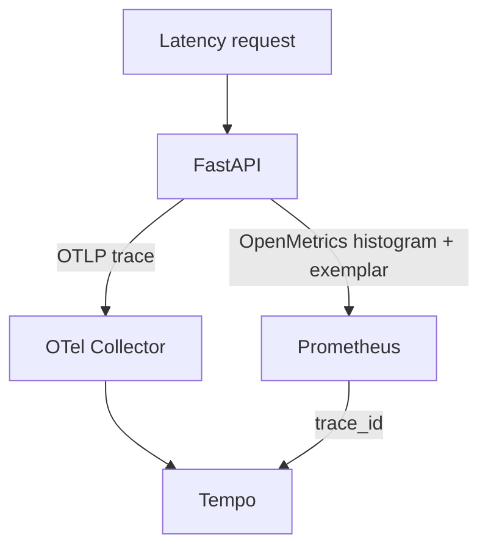
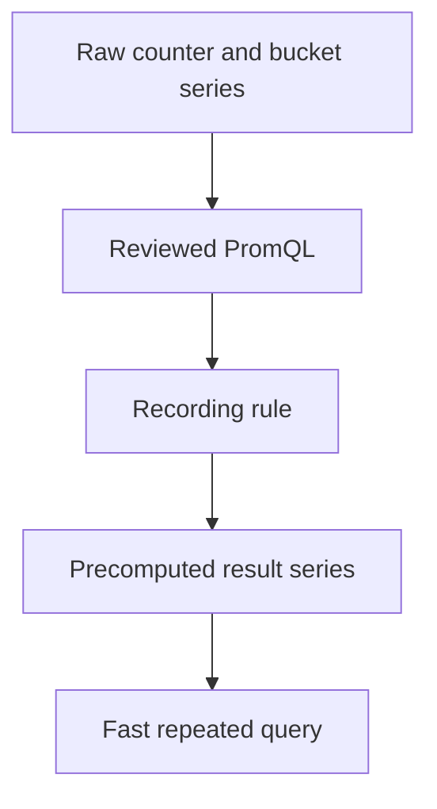

# Lab 07: Histograms, Quantiles, and Exemplars

## Purpose and Scope

> **Primary objective:** Turn request-duration observations into defensible latency distributions and use a stored exemplar to retrieve one representative trace.

Lab 06 measured how often events happen. Latency is not a counter total; it is a distribution. Averages can hide slow minorities, and percentiles can be wrong when buckets, labels, or windows are wrong.

This lab follows two paths:

```text
duration observations -> classic histogram buckets -> rates -> p50 / p95 / p99
duration observation -> exemplar trace_id -> Tempo trace-by-ID
```

The trace backend is introduced only as an exemplar destination. Trace architecture, span semantics, TraceQL, sampling design, and cross-signal investigation are taught deeply in Labs 28–40.

---

## 7.1 Inherited State From Lab 06

Expected running services:

```text
app
db
prometheus
redis
```

Expected conditions:

- the app currently has OpenTelemetry export disabled;
- Prometheus uses 15-second scrapes;
- exemplar storage is enabled in the repository’s Prometheus startup flags;
- the application exports a classic Prometheus histogram named `obslab_http_request_duration_seconds`;
- the middleware excludes `/metrics` from that histogram; and
- previous request and restart history remains in the Prometheus volume.

---

## 7.2 Explicit Scope and Exclusions

Lab services:

```text
db
redis
app
prometheus
loki             temporary support for Collector log export
tempo            temporary exemplar destination
otel-collector   temporary trace transport
```

Keep stopped:

```text
alertmanager
grafana
node-exporter
```

Loki is started only so every configured Collector pipeline has a reachable exporter. You will not query logs. Grafana remains stopped; exemplar navigation is proven through APIs.

This lab does not teach:

- summary quantiles in application code;
- native-histogram rollout;
- tail sampling;
- trace search;
- span-metrics design;
- production trace retention; or
- SLO alerting.

---

## 7.3 Prerequisites

```bash
pwd
test -f .env
test -f labs/Lab-6.md
test -f labs/Lab-7.md
test -f app/app/metrics.py
test -f app/app/middleware.py
test -f app/app/telemetry.py
test -f config/otel-collector/otel-collector-config.yaml
test -f config/tempo/tempo.yaml

docker version
docker compose version
docker compose config --quiet
curl --version
jq --version
git --version
```

The lab assumes the configured trace sampling ratio is `1.0` during the controlled exemplar experiment.

---

## 7.4 Learning Objectives

By the end of Lab 07, you must be able to:

- describe a classic histogram as cumulative bucket counters plus `_sum` and `_count`;
- explain the inclusive `le` boundary;
- prove bucket monotonicity;
- explain why `+Inf` equals the observation count;
- calculate a mean duration from sum and count rates;
- explain why mean and percentile answer different questions;
- calculate p50, p95, and p99 with `histogram_quantile()`;
- preserve `le` when aggregating classic buckets;
- preserve route when calculating per-route quantiles;
- explain bucket interpolation and bounded accuracy;
- distinguish percentile rank from a percentage of a maximum;
- explain why percentiles cannot be averaged;
- calculate the fraction of observations below a bucket boundary;
- calculate an approximate Apdex score from suitable buckets;
- evaluate bucket coverage and cost;
- distinguish classic histograms, native histograms, and summaries;
- explain what an exemplar contains and what it does not contain;
- prove source exposition contains a trace ID;
- verify Prometheus exemplar storage is active;
- query the experimental Prometheus exemplar API;
- retrieve a matching trace directly from Tempo;
- explain why an exemplar is representative rather than exhaustive;
- diagnose an absent exemplar across instrumentation, sampling, exposition, scraping, storage, and trace retention; and
- restore the metrics-only service state for Lab 08.

---

## 7.5 Architecture for the Temporary Correlation Path



Loki is a support dependency for the Collector’s configured log pipeline and is omitted from the conceptual path.

---

## 7.6 Load the Environment

```bash
set -a
source .env
set +a

LAB_HTTP_HOST="${BIND_ADDRESS:-127.0.0.1}"
if [[ "$LAB_HTTP_HOST" == "0.0.0.0" || "$LAB_HTTP_HOST" == "::" ]]; then
  LAB_HTTP_HOST=127.0.0.1
fi

export APP_URL="http://$LAB_HTTP_HOST:${APP_HOST_PORT:-8000}"
export PROMETHEUS_URL="http://$LAB_HTTP_HOST:${PROMETHEUS_HOST_PORT:-9090}"
export TEMPO_URL="http://127.0.0.1:${TEMPO_HOST_PORT:-3200}"
export LOKI_URL="http://127.0.0.1:${LOKI_HOST_PORT:-3100}"
export LAB7_NOTEBOOK="lab-notes/Lab-7.md"

mkdir -p lab-notes
test -f "$LAB7_NOTEBOOK" || printf '# Lab 07 Evidence\n\n' > "$LAB7_NOTEBOOK"
printf 'Started: %s\n' "$(date -u +%FT%TZ)" | tee -a "$LAB7_NOTEBOOK"
```

Tempo and Loki are loopback-bound by design, so their URLs do not use an externally exposed bind address.

---

## 7.7 Define Query Helpers

```bash
prom_query() {
  local expression="$1"
  local response

  response="$(
    curl -fsS "$PROMETHEUS_URL/api/v1/query" \
      --data-urlencode "query=$expression"
  )"
  jq -e '.status == "success"' <<<"$response" >/dev/null
  printf '%s\n' "$response"
}

prom_result() {
  prom_query "$1" | jq '.data.result'
}

prom_value() {
  prom_query "$1" | jq -r '.data.result[0].value[1] // empty'
}
```

---

## 7.8 Reconcile the Metrics-Only Baseline

```bash
APP_OTEL_ENABLED=false docker compose up -d db redis app
docker compose up -d --no-deps prometheus
docker compose stop alertmanager otel-collector loki tempo grafana node-exporter

for attempt in {1..30}; do
  app_ready="$(curl -sS "$APP_URL/health/ready" || true)"
  if jq -e '.status == "ready"' <<<"$app_ready" >/dev/null 2>&1 &&
     curl -fsS "$PROMETHEUS_URL/-/ready" | grep -q Ready; then
    break
  fi
  sleep 2
done

test "$(prom_value 'up{job="orders-api"}')" = "1"
```

---

## 7.9 Inspect the Histogram Definition

```bash
sed -n '/HTTP_DURATION = Histogram(/,/^)/p' app/app/metrics.py
```

Record:

- metric basename;
- help text;
- labels;
- bucket boundaries; and
- duration unit.

The baseline repository defines:

```text
0.005, 0.01, 0.025, 0.05, 0.1, 0.25, 0.5, 1, 2.5, 5, 10, 20, +Inf
```

If you completed Lab 03’s bucket exercise, your local list may also include `0.3`. Use observed data, not this prose, as the runtime truth.

---

## 7.10 Inspect the Exposed Families

```bash
curl -fsS "$APP_URL/metrics" |
  grep -E '^# (HELP|TYPE) obslab_http_request_duration_seconds|^obslab_http_request_duration_seconds' |
  head -80
```

For each `method`/`route` label set, a classic histogram exposes:

| Suffix | Meaning |
|---|---|
| `_bucket{le="x"}` | Cumulative count of observations less than or equal to `x` |
| `_bucket{le="+Inf"}` | Count of all observations |
| `_count` | Count of all observations |
| `_sum` | Sum of all observed durations in seconds |
| `_created` | Client-library creation timestamp; not part of quantile math |

---

## 7.11 Initialize a Controlled Route

```bash
for seconds in 0.05 0.20 0.80 2.00; do
  curl -fsS \
    "$APP_URL/api/v1/simulate/latency?seconds=$seconds" >/dev/null
done
sleep 20
```

Use this label scope:

```bash
export LATENCY_LABELS='job="orders-api",method="GET",route="/api/v1/simulate/latency"'
```

Inspect:

```bash
prom_result "obslab_http_request_duration_seconds_count{$LATENCY_LABELS}"
prom_result "obslab_http_request_duration_seconds_sum{$LATENCY_LABELS}"
prom_result "obslab_http_request_duration_seconds_bucket{$LATENCY_LABELS}"
```

---

## 7.12 Prove Cumulative Bucket Semantics

```bash
prom_result "obslab_http_request_duration_seconds_bucket{$LATENCY_LABELS}" |
  jq -r '.[] | [.metric.le, (.value[1] | tonumber)] | @tsv' |
  sort -g |
  tee -a "$LAB7_NOTEBOOK"
```

For increasing numeric boundaries, counts must never decrease. An observation of `0.20` seconds increments every bucket whose upper bound is at least its measured total request duration.

The simulation sleeps for the requested time, but middleware observes total request duration, including framework overhead.

---

## 7.13 Prove `+Inf` Equals Count

```bash
inf_count="$(
  prom_value \
    "obslab_http_request_duration_seconds_bucket{$LATENCY_LABELS,le=\"+Inf\"}"
)"
observation_count="$(
  prom_value \
    "obslab_http_request_duration_seconds_count{$LATENCY_LABELS}"
)"

printf '+Inf=%s count=%s\n' "$inf_count" "$observation_count"
test "$inf_count" = "$observation_count"
```

This consistency is required for a valid classic histogram.

---

## 7.14 Bucket Count Versus Observation Count

Count component series:

```bash
printf 'Bucket series: %s\n' "$(
  prom_value \
    "count(obslab_http_request_duration_seconds_bucket{$LATENCY_LABELS})"
)"
printf 'Count series: %s\n' "$(
  prom_value \
    "count(obslab_http_request_duration_seconds_count{$LATENCY_LABELS})"
)"
printf 'Sum series: %s\n' "$(
  prom_value \
    "count(obslab_http_request_duration_seconds_sum{$LATENCY_LABELS})"
)"
```

Every additional classic bucket creates another time series per label combination. Bucket precision has ingestion, memory, storage, and query costs.

---

## 7.15 Calculate Mean Duration

Correct rolling mean:

```bash
prom_result "
  sum(
    rate(
      obslab_http_request_duration_seconds_sum{$LATENCY_LABELS}[5m]
    )
  )
  /
  clamp_min(
    sum(
      rate(
        obslab_http_request_duration_seconds_count{$LATENCY_LABELS}[5m]
      )
    ),
    0.000001
  )
"
```

Unit analysis:

```text
(seconds of duration / second) / (requests / second)
= seconds / request
```

Do not average the already averaged values of replicas without weighting by their counts.

---

## 7.16 Mean Does Not Describe the Tail

Consider durations:

```text
99 requests at 0.05 s
1 request at 5.00 s
```

The mean is about 0.10 seconds, but one user waited five seconds. Percentiles state a rank in the distribution and make tail behavior visible.

A p95 value of 0.8 seconds means approximately 95% of observations were no slower than 0.8 seconds for the selected population and window. It does not mean “95% of the maximum.”

---

## 7.17 Generate a Controlled Distribution

This workload is bounded to 35 sequential requests:

```bash
distribution_start="$(date -u +%s)"

for request in {1..20}; do
  curl -fsS "$APP_URL/api/v1/simulate/latency?seconds=0.05" >/dev/null
done
for request in {1..10}; do
  curl -fsS "$APP_URL/api/v1/simulate/latency?seconds=0.20" >/dev/null
done
for request in {1..4}; do
  curl -fsS "$APP_URL/api/v1/simulate/latency?seconds=0.80" >/dev/null
done
curl -fsS "$APP_URL/api/v1/simulate/latency?seconds=2.00" >/dev/null

distribution_end="$(date -u +%s)"
printf 'Distribution start=%s end=%s requests=35\n' \
  "$distribution_start" "$distribution_end" |
  tee -a "$LAB7_NOTEBOOK"
sleep 20
```

The requests take roughly six to ten seconds plus overhead and stay within application safety limits.

---

## 7.18 Calculate One Classic-Histogram Quantile

```bash
prom_result "
  histogram_quantile(
    0.95,
    sum by (le) (
      rate(
        obslab_http_request_duration_seconds_bucket{
          $LATENCY_LABELS
        }[5m]
      )
    )
  )
"
```

The order matters:

```text
bucket counters -> rate per series -> sum compatible buckets -> histogram_quantile
```

`le` must remain in the input label set because it identifies classic bucket boundaries.

---

## 7.19 Calculate p50, p95, and p99

```bash
for quantile in 0.50 0.95 0.99; do
  value="$(
    prom_value "
      histogram_quantile(
        $quantile,
        sum by (le) (
          rate(
            obslab_http_request_duration_seconds_bucket{
              $LATENCY_LABELS
            }[5m]
          )
        )
      )
    "
  )"
  printf 'q=%s value=%s seconds\n' "$quantile" "$value"
done | tee -a "$LAB7_NOTEBOOK"
```

Expected ordering:

```text
p50 <= p95 <= p99
```

If the rate window includes earlier experiments, the values represent the full selected five-minute population, not only the 35 requests.

---

## 7.20 Preserve Route for Per-Route Quantiles

```bash
prom_result '
  histogram_quantile(
    0.95,
    sum by (route, le) (
      rate(
        obslab_http_request_duration_seconds_bucket{
          job="orders-api",
          method="GET"
        }[5m]
      )
    )
  )
' |
  jq -r '.[] | [.metric.route, .value[1]] | @tsv' |
  sort
```

Dropping `route` answers whole-service latency. Preserving it answers per-route latency. Neither is inherently correct; match the question.

---

## 7.21 The Broken Aggregation

This is wrong for classic histograms:

```promql
histogram_quantile(
  0.95,
  sum(
    rate(obslab_http_request_duration_seconds_bucket[5m])
  )
)
```

The sum removes `le` and collapses all boundaries into one value. Run it:

```bash
prom_result '
  histogram_quantile(
    0.95,
    sum(
      rate(
        obslab_http_request_duration_seconds_bucket{
          job="orders-api"
        }[5m]
      )
    )
  )
'
```

Expect no meaningful quantile result. A query can parse and still destroy the data model needed by the next function.

---

## 7.22 Interpolation and Accuracy

If the target rank falls inside a classic bucket, `histogram_quantile()` estimates its value within that bucket. It does not recover the original durations.

Example:

```text
previous boundary: 0.5 s
selected boundary: 1.0 s
reported p95: somewhere between them
```

The exact error depends on the distribution within that interval. Place bucket boundaries near operational thresholds where accuracy matters.

---

## 7.23 Quantiles Cannot Be Averaged

This is not a fleet p95:

```promql
avg(
  instance_p95
)
```

Each instance percentile summarizes a different distribution and discards its bucket counts. Combine compatible bucket rates across instances first, then calculate one quantile.

Correct shape:

```promql
histogram_quantile(
  0.95,
  sum by (le) (
    rate(http_request_duration_seconds_bucket[5m])
  )
)
```

---

## 7.24 Calculate a Threshold Fraction

The fraction of latency-route requests no slower than 0.25 seconds:

```bash
prom_result "
  sum(
    rate(
      obslab_http_request_duration_seconds_bucket{
        $LATENCY_LABELS,
        le=\"0.25\"
      }[5m]
    )
  )
  /
  clamp_min(
    sum(
      rate(
        obslab_http_request_duration_seconds_count{
          $LATENCY_LABELS
        }[5m]
      )
    ),
    0.000001
  )
"
```

This bucket ratio is often better than a percentile for an SLO such as “99% below 250 ms” because the boundary exactly represents the objective.

---

## 7.25 Detect Whether a 300 ms Boundary Exists

```bash
if [[ "$(
  prom_value '
    count(
      obslab_http_request_duration_seconds_bucket{
        job="orders-api",
        le="0.3"
      }
    )
  '
)" != "0" ]]; then
  echo "A 300 ms bucket exists"
else
  echo "No exact 300 ms bucket; do not estimate a 300 ms SLO from a 250 or 500 ms bucket"
fi
```

This is why bucket selection is an instrumentation decision, not merely a query decision.

---

## 7.26 Calculate an Approximate Apdex

For demonstration, choose:

```text
Satisfied T = 0.25 seconds
Tolerated 4T = 1.0 second
```

Classic buckets are cumulative. The 1.0-second bucket already contains satisfied requests, so the standard expression divides the sum of both cumulative rates by two:

```bash
prom_result "
  (
    sum(
      rate(
        obslab_http_request_duration_seconds_bucket{
          $LATENCY_LABELS,
          le=\"0.25\"
        }[5m]
      )
    )
    +
    sum(
      rate(
        obslab_http_request_duration_seconds_bucket{
          $LATENCY_LABELS,
          le=~\"1|1.0\"
        }[5m]
      )
    )
  )
  /
  2
  /
  clamp_min(
    sum(
      rate(
        obslab_http_request_duration_seconds_count{
          $LATENCY_LABELS
        }[5m]
      )
    ),
    0.000001
  )
"
```

This simplified lab expression does not exclude failed requests. A production Apdex contract must define errors explicitly.

---

## 7.27 Bucket Design Review

For each proposed bucket boundary ask:

1. Is it near an SLO or user-experience threshold?
2. Does the largest finite bucket cover ordinary and expected slow behavior?
3. Are several buckets wasted where no decision needs precision?
4. How many label combinations multiply this bucket count?
5. Will multiple services use compatible boundaries for aggregation?
6. Can native histograms meet the accuracy/cost requirement?

Approximate classic-series count:

```text
label combinations * (finite buckets + +Inf + count + sum)
```

The optional `_created` family adds more series in clients that expose it.

---

## 7.28 Classic Histogram, Native Histogram, or Summary

| Type | Representation | Aggregation | Accuracy decision |
|---|---|---|---|
| Classic histogram | One float series per bucket plus count/sum | Aggregate compatible buckets; preserve `le` | Choose fixed boundaries in code |
| Native histogram | One composite histogram sample per series | Aggregate histogram samples directly | Choose schema/resolution |
| Summary | Client-calculated quantile series plus count/sum | Quantiles generally cannot be meaningfully aggregated | Choose quantiles/window in code |

This application intentionally uses a classic histogram so every bucket and its cardinality are visible.

---

## 7.29 An Exemplar Is a Link, Not a Label Dimension

An exemplar attaches a sampled observation and metadata such as a `trace_id` to a metric sample. It does not add the trace ID to the normal time-series identity.

That distinction is crucial:

```text
trace_id as ordinary metric label -> extreme cardinality
trace_id as exemplar metadata     -> sparse correlation link
```

An exemplar does not mean every request has a stored link, nor that it is the slowest request in a bucket.

---

## 7.30 Verify the Prometheus Feature Flag

The Compose service includes:

```text
--enable-feature=exemplar-storage
```

Inspect the running server:

```bash
feature_flags="$(
  curl -fsS "$PROMETHEUS_URL/api/v1/status/flags" |
    jq -r '.data["enable-feature"] // ""'
)"
printf 'Enabled features: %s\n' "$feature_flags"

if ! grep -Eq '(^|,)exemplar-storage(,|$)' <<<"$feature_flags"; then
  echo "Recreating Prometheus to apply the repository startup flag"
  docker compose up -d --no-deps --force-recreate prometheus
  for attempt in {1..30}; do
    if curl -fsS "$PROMETHEUS_URL/-/ready" | grep -q Ready; then
      break
    fi
    sleep 2
  done
fi

curl -fsS "$PROMETHEUS_URL/api/v1/status/flags" |
  jq -e '.data["enable-feature"] | split(",") | index("exemplar-storage")'
```

Exemplar storage is an in-memory circular buffer and is persisted through the WAL for its WAL lifetime; it is not the trace store.

---

## 7.31 Start the Temporary Trace Support Stack

Start storage backends without expanding Compose dependencies:

```bash
docker compose up -d --no-deps loki tempo

for attempt in {1..45}; do
  loki_ready="$(curl -sS "$LOKI_URL/ready" || true)"
  tempo_ready="$(curl -sS "$TEMPO_URL/ready" || true)"
  if grep -qi ready <<<"$loki_ready" &&
     grep -qi ready <<<"$tempo_ready"; then
    break
  fi
  if [[ "$attempt" -eq 45 ]]; then
    docker compose logs --tail=150 loki tempo
    exit 1
  fi
  sleep 2
done

docker compose up -d --no-deps otel-collector
```

Wait for Collector self-telemetry:

```bash
for attempt in {1..30}; do
  if curl -fsS "http://127.0.0.1:${OTEL_INTERNAL_METRICS_HOST_PORT:-8888}/metrics" \
    >/dev/null; then
    break
  fi
  if [[ "$attempt" -eq 30 ]]; then
    docker compose logs --tail=200 otel-collector
    exit 1
  fi
  sleep 2
done
```

---

## 7.32 Recreate the App With Tracing Enabled

Environment changes require container recreation, not a simple restart:

```bash
APP_OTEL_ENABLED=true \
APP_OTEL_TRACE_SAMPLE_RATIO=1.0 \
docker compose up -d --no-deps --force-recreate app

for attempt in {1..30}; do
  response="$(curl -sS "$APP_URL/health/ready" || true)"
  if jq -e '.status == "ready"' <<<"$response" >/dev/null 2>&1; then
    break
  fi
  if [[ "$attempt" -eq 30 ]]; then
    docker compose logs --tail=200 app
    exit 1
  fi
  sleep 2
done

docker inspect obs-lab-app |
  jq -r '.[0].Config.Env[] | select(startswith("APP_OTEL_"))' |
  sort
```

Verify `APP_OTEL_ENABLED=true` and a sample ratio of `1.0`.

---

## 7.33 Confirm the Runtime Support Set

```bash
docker compose ps --status running --services | sort
```

Expected:

```text
app
db
loki
otel-collector
prometheus
redis
tempo
```

Alertmanager, Grafana, and Node Exporter remain stopped.

---

## 7.34 Generate a Traced Latency Observation

Record the query interval and invoke one distinctive request:

```bash
export EXEMPLAR_START="$(date -u -d '2 minutes ago' +%s)"

curl -fsS \
  -H 'x-request-id: lab07-exemplar-request' \
  "$APP_URL/api/v1/simulate/latency?seconds=1.3" |
  jq

export EXEMPLAR_END="$(date -u -d '2 minutes' +%s)"
```

The total observed duration should land above 1 second and normally at or below the 2.5-second bucket.

---

## 7.35 Prove the Source Exemplar

Request OpenMetrics exposition:

```bash
curl -fsS \
  -H 'Accept: application/openmetrics-text; version=1.0.0' \
  "$APP_URL/metrics" |
  grep 'obslab_http_request_duration_seconds_bucket' |
  grep 'trace_id=' |
  tee /tmp/lab7-source-exemplars.txt

test -s /tmp/lab7-source-exemplars.txt
```

An exemplar appears after the sample using OpenMetrics exemplar syntax. Record one full line in the notebook.

If no line appears, go directly to Section 7.42 before continuing.

---

## 7.36 Wait for Prometheus to Scrape the Exemplar

```bash
sleep 20
test "$(prom_value 'up{job="orders-api"}')" = "1"
```

Prometheus scrapes the app’s OpenMetrics endpoint. Exemplar ingestion additionally requires the runtime feature flag verified earlier.

---

## 7.37 Query the Prometheus Exemplar API

The endpoint is experimental, so keep API parsing isolated:

```bash
curl -fsS "$PROMETHEUS_URL/api/v1/query_exemplars" \
  --data-urlencode 'query=obslab_http_request_duration_seconds_bucket{
    job="orders-api",
    route="/api/v1/simulate/latency"
  }' \
  --data-urlencode "start=$EXEMPLAR_START" \
  --data-urlencode "end=$EXEMPLAR_END" |
  tee /tmp/lab7-prometheus-exemplars.json |
  jq

jq -e '.status == "success"' /tmp/lab7-prometheus-exemplars.json
```

Extract the newest trace ID:

```bash
export TRACE_ID="$(
  jq -r '
    [
      .data[]?.exemplars[]?
      | select(.labels.trace_id != null)
    ]
    | sort_by(.timestamp)
    | last
    | .labels.trace_id // empty
  ' /tmp/lab7-prometheus-exemplars.json
)"

test -n "$TRACE_ID"
test "${#TRACE_ID}" -eq 32
printf 'Trace ID: %s\n' "$TRACE_ID" | tee -a "$LAB7_NOTEBOOK"
```

Trace IDs are identifiers, not secrets by definition, but trace content may contain sensitive attributes. Protect tracing APIs in real environments.

---

## 7.38 Retrieve the Trace From Tempo

Trace export is batched, so retry a bounded number of times:

```bash
trace_found=false
for attempt in {1..30}; do
  code="$(
    curl -sS -o /tmp/lab7-tempo-trace.json -w '%{http_code}' \
      "$TEMPO_URL/api/v2/traces/$TRACE_ID"
  )"
  if [[ "$code" = "200" ]] &&
     jq -e '.trace.resourceSpans | length > 0' \
       /tmp/lab7-tempo-trace.json >/dev/null 2>&1; then
    trace_found=true
    break
  fi
  sleep 2
done

test "$trace_found" = true
jq '{
  resource_span_groups: (.trace.resourceSpans | length),
  span_count: (
    [.trace.resourceSpans[].scopeSpans[].spans[]] | length
  ),
  span_names: (
    [.trace.resourceSpans[].scopeSpans[].spans[].name] | unique
  )
}' /tmp/lab7-tempo-trace.json |
  tee -a "$LAB7_NOTEBOOK"
```

This proves a navigation key stored beside a latency bucket can retrieve the related trace.

---

## 7.39 Correlation Is Representative

The exemplar does not prove:

- the trace is the slowest request;
- every request has an exemplar;
- every bucket retains every exemplar;
- the trace backend retained data as long as the metric;
- the trace explains population-wide latency; or
- metrics and traces have identical sampling.

It provides a concrete starting point near an observed metric event. Use distribution-level metrics for scope and traces for request-level detail.

---

## 7.40 Exemplar and Series Cardinality

Prove `trace_id` is not an ordinary metric label:

```bash
prom_result '
  count by (trace_id) (
    obslab_http_request_duration_seconds_bucket{
      job="orders-api"
    }
  )
'
```

The result should not fan out by trace ID because exemplar labels are stored separately from ordinary series labels.

Inspect one series label set and one exemplar label set side by side:

```bash
prom_result '
  obslab_http_request_duration_seconds_bucket{
    job="orders-api",
    route="/api/v1/simulate/latency",
    le="2.5"
  }
' |
  jq '.[0].metric'

jq '
  [.data[]?.exemplars[]?]
  | sort_by(.timestamp)
  | last
  | .labels
' /tmp/lab7-prometheus-exemplars.json
```

---

## 7.41 Sampling Experiment — What Happens at Zero

Prediction:

> If trace sampling is zero, will the histogram still record durations? Will it attach valid trace exemplars?

Recreate the app temporarily:

```bash
APP_OTEL_ENABLED=true \
APP_OTEL_TRACE_SAMPLE_RATIO=0.0 \
docker compose up -d --no-deps --force-recreate app

for attempt in {1..30}; do
  if curl -fsS "$APP_URL/health/live" >/dev/null; then
    break
  fi
  sleep 2
done

zero_start="$(date -u -d '1 minute ago' +%s)"
curl -fsS \
  "$APP_URL/api/v1/simulate/latency?seconds=0.6" >/dev/null
sleep 20
zero_end="$(date -u -d '1 minute' +%s)"

prom_result '
  rate(
    obslab_http_request_duration_seconds_count{
      job="orders-api",
      route="/api/v1/simulate/latency"
    }[2m]
  )
'
```

The histogram still works. The middleware’s exemplar helper requires a valid sampled span, so the zero-sampled request should not contribute a trace link.

Do not infer this by asking whether any older exemplar exists in a broad time range. Bound the exemplar query to the recorded zero-sampling interval and compare its timestamp to the request time.

---

## 7.42 Troubleshooting — No Source Exemplar

Inspect in order:

1. Was the app recreated with `APP_OTEL_ENABLED=true`?
2. Is `APP_OTEL_TRACE_SAMPLE_RATIO=1.0`?
3. Is the Collector reachable from the app?
4. Is a server span active while middleware calls `observe()`?
5. Did the request route get recorded?
6. Did you request OpenMetrics rather than filter away exemplar syntax?

```bash
docker inspect obs-lab-app |
  jq -r '.[0].Config.Env[] | select(startswith("APP_OTEL_"))'

docker compose logs --since=5m --tail=250 app otel-collector

curl -fsS \
  -H 'Accept: application/openmetrics-text; version=1.0.0' \
  "$APP_URL/metrics" |
  grep -E 'obslab_http_request_duration_seconds_bucket.*trace_id='
```

An application histogram observation can succeed even when trace export later fails.

---

## 7.43 Troubleshooting — Source Has Exemplar, Prometheus Does Not

Check:

```bash
curl -fsS "$PROMETHEUS_URL/api/v1/status/flags" |
  jq '.data["enable-feature"]'

prom_result 'up{job="orders-api"}'

curl -fsS "$PROMETHEUS_URL/api/v1/targets" |
  jq '.data.activeTargets[] |
    select(.labels.job == "orders-api") |
    {health, lastScrape, lastError, scrapeUrl}'
```

Then verify:

- exemplar storage flag is active;
- the request occurred before a successful scrape;
- start/end timestamps cover the scrape;
- the query selects the correct bucket metric; and
- another later exemplar did not replace what you expected in a small buffer.

---

## 7.44 Troubleshooting — Trace ID Is Not in Tempo

Check each hop:

```bash
docker compose ps app otel-collector tempo
docker compose logs --since=10m --tail=300 app otel-collector tempo
curl -fsS "$TEMPO_URL/ready"
```

Possible causes:

- OTLP export was disabled;
- sample ratio excluded the trace;
- Collector batching has not flushed yet;
- Collector-to-Tempo export is retrying;
- the trace expired before the exemplar;
- the trace ID/time range is wrong; or
- only the metrics path succeeded.

Metrics and traces have independent failure paths after the application observation.

---

## 7.45 Troubleshooting — Quantile Is `NaN` or Empty

Check:

1. bucket rates exist;
2. `le` survived aggregation;
3. the `+Inf` bucket is present;
4. the window contains at least two scrapes;
5. bucket counts are non-decreasing;
6. compatible histogram schemas were combined; and
7. route/method filters match initialized children.

```bash
prom_result "
  sum by (le) (
    rate(
      obslab_http_request_duration_seconds_bucket{
        $LATENCY_LABELS
      }[5m]
    )
  )
"
```

Debug the function input before debugging `histogram_quantile()` itself.

---

## 7.46 Evidence Matrix

| Evidence | What it proves |
|---|---|
| Histogram source definition | Intended labels and boundaries |
| Runtime bucket list | Actual deployed schema |
| Monotonic bucket table | Cumulative semantics |
| `+Inf == count` | Histogram consistency |
| Mean expression and unit derivation | Correct sum/count use |
| p50/p95/p99 | Quantile calculation |
| Per-route p95 | Correct output grouping |
| Broken no-`le` query | Required classic boundary label |
| Threshold ratio | Direct objective calculation |
| Apdex | Cumulative-bucket adjustment |
| Prometheus feature flag | Exemplar storage active |
| Source exemplar line | Instrumentation and exposition |
| Exemplar API JSON | Scrape and exemplar storage |
| Tempo trace JSON | Trace export and retrieval |
| Zero-sampling comparison | Histogram independent of trace sampling |
| Restored service set | Recovery |

---

## 7.47 Production Implications

1. Place classic bucket boundaries at real decision thresholds.
2. Calculate rate before aggregating bucket counters.
3. Preserve `le` for classic histogram quantiles.
4. Aggregate buckets before calculating fleet percentiles.
5. Never average percentiles.
6. Prefer direct bucket ratios for threshold-based SLOs.
7. State the population, labels, and time window beside every percentile.
8. Treat quantiles as estimates bounded by bucket resolution.
9. Budget classic bucket count across every label combination.
10. Keep trace IDs in exemplars, not normal metric labels.
11. Align metric and trace retention expectations.
12. Protect trace APIs and scrub sensitive attributes.
13. Monitor each correlation hop independently.
14. Treat exemplars as representative pivots, not statistical samples.
15. Evaluate native histograms with compatibility and cost tests before rollout.

---

## 7.48 Knowledge Check

Answer before reading the key:

1. What does a classic `_bucket{le="0.5"}` value count?
2. Are classic buckets cumulative?
3. Why must bucket values be non-decreasing as `le` increases?
4. What should `+Inf` equal?
5. What does `_sum / _count` calculate for one process epoch?
6. What is the rolling mean expression shape?
7. Why can the mean hide user pain?
8. What does p95 mean?
9. Is p95 95% of the maximum?
10. Which function estimates histogram quantiles?
11. Why must `le` survive classic bucket aggregation?
12. When should `route` survive aggregation?
13. Why is averaging instance p95 values invalid?
14. Where does classic quantile error come from?
15. How can bucket design improve SLO accuracy?
16. What is a direct threshold fraction?
17. Why does the simplified classic Apdex expression divide by two?
18. How does each extra classic bucket affect series count?
19. What is the primary aggregation advantage of histograms over summaries?
20. What is an exemplar?
21. Is an exemplar label part of normal series identity?
22. Why must a trace ID not be a normal histogram label?
23. Does an exemplar represent every request?
24. What Prometheus feature is required here?
25. Which endpoint queries exemplars?
26. Which Tempo endpoint retrieves the trace in this lab?
27. Why can a metric exemplar exist while the trace is unavailable?
28. Does zero trace sampling stop histogram observations?
29. Why are Loki and the Collector temporary in this lab?
30. Which later phase teaches tracing systematically?

---

## 7.49 Knowledge Check Answers

1. All observations for that label set whose value is at most 0.5 seconds.
2. Yes.
3. Every observation in a smaller bucket must also be in all larger buckets.
4. The matching `_count`.
5. The lifetime arithmetic mean, not a rolling mean.
6. Rate of `_sum` divided by rate of `_count`.
7. A slow minority can be offset by many fast requests.
8. Approximately 95% of the selected observations were at or below that duration.
9. No.
10. `histogram_quantile()`.
11. It identifies the bucket upper bounds needed to reconstruct the cumulative distribution.
12. When the question asks for a percentile per route.
13. Percentiles discard distribution weights; combine buckets first.
14. Interpolation within finite bucket boundaries.
15. Put an exact boundary at the objective and useful boundaries around it.
16. Rate in a chosen bucket divided by total observation rate.
17. The tolerated cumulative bucket already includes the satisfied observations.
18. It adds one series per histogram label combination.
19. Compatible bucket distributions can be aggregated before calculating quantiles.
20. Sparse metadata attached to a metric observation, often linking a trace.
21. No.
22. It would create one series per trace and cause extreme cardinality.
23. No.
24. `exemplar-storage`.
25. `/api/v1/query_exemplars`.
26. `/api/v2/traces/<traceID>`.
27. Metric and trace storage/export paths and retention are independent.
28. No.
29. The Collector transports the trace; Loki keeps its configured log exporter healthy.
30. Labs 28–40.

---

## 7.50 Professional Scenarios

### Scenario A — Fleet p95 is averaged

One instance handles 95% of traffic and another handles 5%. Averaging their p95 values weights them equally. Aggregate compatible bucket rates across both instances, then calculate the percentile.

### Scenario B — A 300 ms SLO uses the 500 ms bucket

The query overstates compliance because it counts requests between 300 and 500 ms as successful. Add and deploy a 300 ms boundary; accept the temporary schema transition intentionally.

### Scenario C — Exemplar link returns not found

Prometheus retained the exemplar, but Tempo retention expired or trace export failed. Check trace pipeline health and align retention; do not conclude the metric observation is invalid.

---

## 7.51 Required Lab Notebook

Include:

- start and finish UTC timestamps;
- actual histogram boundaries;
- cumulative bucket table;
- proof that `+Inf` equals count;
- classic component series count;
- rolling mean and unit derivation;
- p50, p95, and p99;
- per-route p95;
- broken aggregation outcome;
- interpolation explanation;
- 250 ms threshold fraction;
- Apdex result and caveat;
- active Prometheus feature flags;
- one full source exemplar line;
- Prometheus exemplar response;
- extracted 32-character trace ID;
- Tempo span count and names;
- zero-sampling observation;
- all 30 answers; and
- proof of final recovery.

---

## 7.52 Restore the Metrics-Only Baseline

Recreate the application with OTLP disabled:

```bash
APP_OTEL_ENABLED=false \
docker compose up -d --no-deps --force-recreate app

for attempt in {1..30}; do
  response="$(curl -sS "$APP_URL/health/ready" || true)"
  if jq -e '.status == "ready"' <<<"$response" >/dev/null 2>&1; then
    break
  fi
  sleep 2
done

docker inspect obs-lab-app |
  jq -r '.[0].Config.Env[] |
    select(startswith("APP_OTEL_ENABLED="))' |
  grep -Fx 'APP_OTEL_ENABLED=false'

docker compose stop otel-collector loki tempo
```

Do not delete their named volumes; stopping is sufficient.

---

## 7.53 Completion Checklist

- [ ] Histogram source and runtime schema were inspected.
- [ ] Classic bucket, sum, count, and created families were distinguished.
- [ ] Cumulative bucket monotonicity was proven.
- [ ] `+Inf` equaled count.
- [ ] A rolling mean was calculated with correct units.
- [ ] A bounded latency distribution was generated.
- [ ] p50, p95, and p99 were calculated.
- [ ] `le` was retained through bucket aggregation.
- [ ] Whole-service and per-route populations were distinguished.
- [ ] Quantile interpolation and bucket error were explained.
- [ ] A threshold ratio and approximate Apdex were calculated.
- [ ] Histogram types and tradeoffs were compared.
- [ ] Prometheus exemplar storage was verified.
- [ ] Temporary trace support services were started without Grafana.
- [ ] The app ran with trace sampling 1.0.
- [ ] Source OpenMetrics contained a trace exemplar.
- [ ] Prometheus returned that exemplar.
- [ ] Tempo returned the trace by ID.
- [ ] Exemplar labels were proven separate from series identity.
- [ ] Zero trace sampling retained histogram metrics.
- [ ] OTLP was disabled again.
- [ ] Collector, Loki, and Tempo were stopped.
- [ ] All 30 questions and notebook evidence are complete.

---

## 7.54 Upstream Reference Map

- [Prometheus histograms and summaries](https://prometheus.io/docs/practices/histograms/) — classic buckets, quantiles, Apdex, aggregation, and accuracy.
- [Prometheus query functions](https://prometheus.io/docs/prometheus/latest/querying/functions/) — `histogram_quantile()` behavior.
- [Prometheus metric types](https://prometheus.io/docs/concepts/metric_types/) — classic and native histogram representation.
- [Prometheus feature flags](https://prometheus.io/docs/prometheus/latest/feature_flags/) — exemplar storage.
- [Prometheus HTTP API](https://prometheus.io/docs/prometheus/latest/querying/api/) — experimental exemplar query endpoint.
- [OpenTelemetry metrics data model](https://opentelemetry.io/docs/specs/otel/metrics/data-model/) — exemplar context.
- [Tempo HTTP API](https://grafana.com/docs/tempo/latest/api_docs/) — trace-by-ID retrieval.

---

## 7.55 Final State and Transition to Lab 08

```bash
test "$(prom_value 'up{job="orders-api"}')" = "1"
test "$(prom_value 'up{job="prometheus"}')" = "1"

running="$(docker compose ps --status running --services | sort)"
expected="$(printf '%s\n' app db prometheus redis | sort)"
test "$running" = "$expected"

{
  printf '\n## Final evidence\n'
  printf 'Finished: %s\n' "$(date -u +%FT%TZ)"
  printf 'Running services:\n%s\n' "$running"
} >> "$LAB7_NOTEBOOK"
```

Lab 07 built correct but comparatively expensive distribution queries. Lab 08 makes stable, reused expressions into tested recording rules and measures their query-cost effect:



Carry forward:

```text
mean != tail
percentile != percent of maximum
classic quantile requires le
aggregate buckets before quantile
exemplar metadata != series label
representative trace != population proof
```
