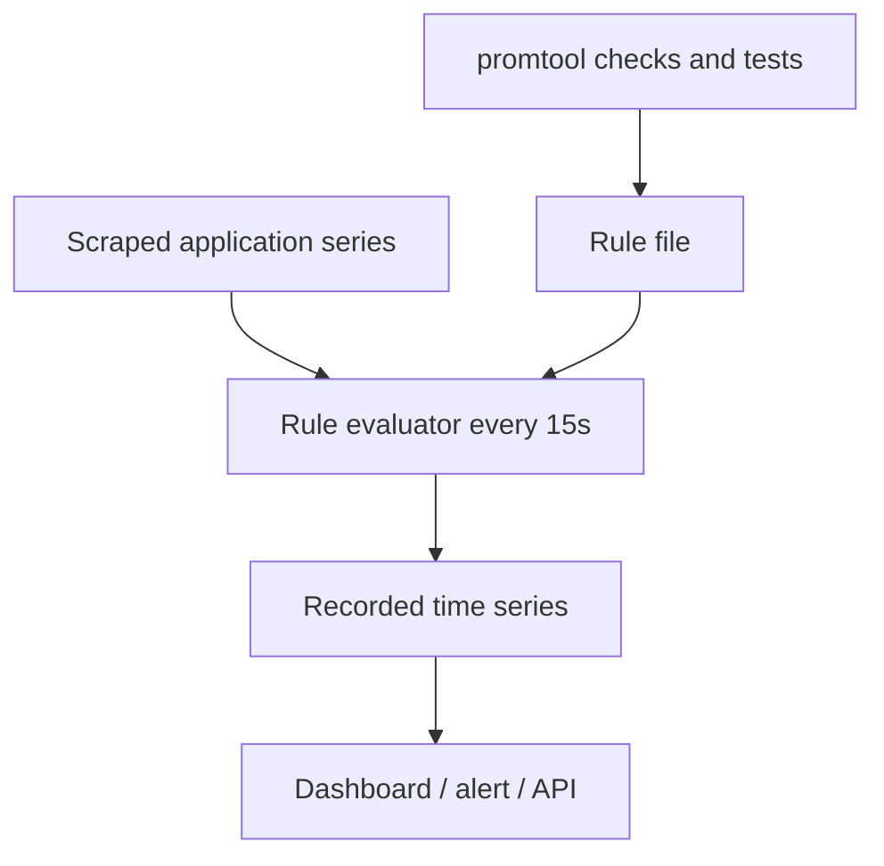
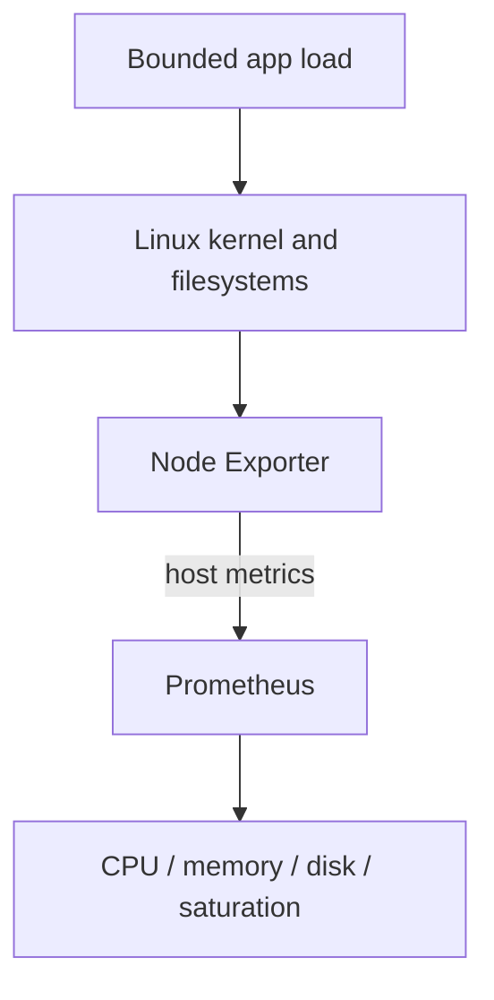

# Lab 08: Recording Rules and Query Cost

## Purpose and Scope

> **Primary objective:** Turn reviewed, repeatedly used PromQL into named time series, verify it before reload, unit-test its behavior, and measure the cost tradeoff rather than assuming precomputation is free.

Labs 05–07 built correct selectors, rates, ratios, and histogram quantiles. Dashboards and alerts will evaluate some of those expressions repeatedly. A recording rule evaluates an expression on a schedule and stores its output as a new series:

```text
raw series -> scheduled PromQL evaluation -> recorded series -> cheap consumer query
```

You will inspect the repository’s existing rules, add a route-level rate rule, test deterministic input data with `promtool`, load the rule safely, compare raw and recorded values, inspect query statistics, create an invalid-rule failure, prove atomic reload behavior, and restore the last good file.

---

## 8.1 Inherited State From Lab 07

Expected running services:

```text
app
db
prometheus
redis
```

Expected conditions:

- OpenTelemetry is disabled again;
- Loki, Tempo, Collector, Grafana, Alertmanager, and Node Exporter are stopped;
- Prometheus exemplar storage remains enabled but is not used here;
- the canonical scrape and evaluation intervals are 15 seconds;
- application and Prometheus targets are `UP`; and
- the application recording-rule group already defines total rate, 5xx ratio, and p95 latency.

---

## 8.2 Explicit Scope and Exclusions

This lab teaches Prometheus recording rules. It does not teach:

- alert state transitions or notifications;
- SLO or burn-rate rule design;
- rule sharding at large scale;
- remote rule evaluators;
- Grafana-managed rules;
- ruler multi-tenancy;
- Prometheus high availability; or
- production benchmark methodology.

The single-VM cost measurements demonstrate mechanics, not universal performance numbers.

---

## 8.3 Prerequisites

```bash
pwd
test -f .env
test -f labs/Lab-7.md
test -f labs/Lab-8.md
test -f config/prometheus/prometheus.yml
test -f config/prometheus/rules/application.yml
test -f config/prometheus/rules/platform.yml

docker version
docker compose version
docker compose config --quiet
curl --version
jq --version
git --version
python3 --version
```

This lab edits tracked rule files. Begin with a clean checkpoint.

---

## 8.4 Learning Objectives

By the end of Lab 08, you must be able to:

- explain what a recording rule evaluates and stores;
- distinguish scrape interval, global evaluation interval, and rule-group interval;
- identify recording versus alerting rules in one group file;
- interpret rule health, last evaluation, evaluation duration, and last error;
- apply the `level:metric:operations` naming convention;
- predict the output labels of a rule;
- distinguish a rule expression from its recorded metric name;
- explain why a recording rule creates new stored cardinality;
- validate rules offline with `promtool check rules`;
- write deterministic `promtool test rules` input;
- test counter-rate aggregation across multiple input series;
- test a zero-to-nonzero error ratio;
- add a route-level request-rate rule safely;
- reload Prometheus without restart;
- prove the runtime loaded the new rule;
- compare raw and recorded values within an evaluation-timing tolerance;
- use `stats=all` to inspect query samples and timings;
- explain why a rule can reduce consumer cost while adding continuous evaluation and storage cost;
- identify when a rule is too high-cardinality;
- prove an invalid reload preserves the last good runtime rules;
- restore and revalidate the good file; and
- leave a reproducible rule test in source control.

---

## 8.5 Architecture and Rule Lifecycle



The rule output is ordinary Prometheus time-series data. It has timestamps, labels, staleness behavior, WAL persistence, and storage cost.

---

## 8.6 Load the Environment

```bash
set -a
source .env
set +a

LAB_HTTP_HOST="${BIND_ADDRESS:-127.0.0.1}"
if [[ "$LAB_HTTP_HOST" == "0.0.0.0" || "$LAB_HTTP_HOST" == "::" ]]; then
  LAB_HTTP_HOST=127.0.0.1
fi

export APP_URL="http://$LAB_HTTP_HOST:${APP_HOST_PORT:-8000}"
export PROMETHEUS_URL="http://$LAB_HTTP_HOST:${PROMETHEUS_HOST_PORT:-9090}"
export LAB8_NOTEBOOK="lab-notes/Lab-8.md"

mkdir -p lab-notes
test -f "$LAB8_NOTEBOOK" || printf '# Lab 08 Evidence\n\n' > "$LAB8_NOTEBOOK"
printf 'Started: %s\n' "$(date -u +%FT%TZ)" | tee -a "$LAB8_NOTEBOOK"
```

---

## 8.7 Reconcile the Starting State

```bash
APP_OTEL_ENABLED=false docker compose up -d db redis app
docker compose up -d --no-deps prometheus
docker compose stop alertmanager otel-collector loki tempo grafana node-exporter

for attempt in {1..30}; do
  app_ready="$(curl -sS "$APP_URL/health/ready" || true)"
  if jq -e '.status == "ready"' <<<"$app_ready" >/dev/null 2>&1 &&
     curl -fsS "$PROMETHEUS_URL/-/ready" | grep -q Ready; then
    break
  fi
  sleep 2
done

running="$(docker compose ps --status running --services | sort)"
expected="$(printf '%s\n' app db prometheus redis | sort)"
test "$running" = "$expected"
```

---

## 8.8 Define Query Helpers

```bash
prom_query() {
  local expression="$1"
  local response
  response="$(
    curl -fsS "$PROMETHEUS_URL/api/v1/query" \
      --data-urlencode "query=$expression"
  )"
  jq -e '.status == "success"' <<<"$response" >/dev/null
  printf '%s\n' "$response"
}

prom_result() {
  prom_query "$1" | jq '.data.result'
}

prom_value() {
  prom_query "$1" | jq -r '.data.result[0].value[1] // empty'
}
```

Verify:

```bash
test "$(prom_value 'up{job="orders-api"}')" = "1"
```

---

## 8.9 Create a Git Recovery Point

```bash
git rev-parse --is-inside-work-tree
git status --short

if ! git diff --quiet || ! git diff --cached --quiet; then
  echo "Tracked changes exist; review and checkpoint them before Lab 08" >&2
  exit 1
fi

if git show-ref --verify --quiet refs/heads/lab-08-recording-rules; then
  git switch lab-08-recording-rules
else
  git switch -c lab-08-recording-rules
fi

export LAB8_BASE_COMMIT="$(git rev-parse HEAD)"
cp config/prometheus/rules/application.yml \
  /tmp/lab8-application.base.yml
sha256sum config/prometheus/rules/application.yml |
  tee -a "$LAB8_NOTEBOOK"
```

The temporary copy supports immediate recovery. Git remains the durable history.

---

## 8.10 Inspect How Rule Files Are Loaded

```bash
sed -n '/^rule_files:/,/^alerting:/p' \
  config/prometheus/prometheus.yml
```

The glob:

```text
/etc/prometheus/rules/*.yml
```

loads YAML files at the rules directory root. The test file you create under `rules/tests/` is deliberately outside that runtime glob.

Inspect the bind mount:

```bash
docker inspect obs-lab-prometheus |
  jq '.[0].Mounts[] |
    select(.Destination == "/etc/prometheus/rules") |
    {Source, Destination, Mode, RW}'
```

The container sees the host rules read-only; edits occur on the host and are loaded by the Prometheus lifecycle endpoint.

---

## 8.11 Inspect Existing Rule Groups

```bash
sed -n '1,260p' config/prometheus/rules/application.yml
sed -n '1,240p' config/prometheus/rules/platform.yml
```

The application file contains:

- an `orders-api-recording` group;
- three recording rules;
- an `orders-api-alerts` group; and
- several alerting rules.

Do not assume a YAML file contains only one rule type.

---

## 8.12 Scrape and Evaluation Clocks

| Clock | Current value | Purpose |
|---|---:|---|
| Global scrape interval | 15 seconds | Collect target exposition |
| Global evaluation interval | 15 seconds | Default rule evaluation cadence |
| Application recording group interval | 15 seconds | Explicit cadence for that group |
| Application alert group interval | 15 seconds | Explicit cadence for that group |
| Platform group interval | 30 seconds | Explicit platform-rule cadence |

The rule output can lag source events by:

```text
time until source scrape + time until rule evaluation
```

It can be fresher or older within those independent schedules.

---

## 8.13 Inspect Runtime Rule State

```bash
curl -fsS "$PROMETHEUS_URL/api/v1/rules" \
  --data-urlencode 'type=record' |
  tee /tmp/lab8-rules-before.json |
  jq '{
    status,
    groups: [
      .data.groups[] |
      {
        name,
        file,
        interval,
        health,
        lastEvaluation,
        evaluationTime,
        lastError,
        records: [.rules[].name]
      }
    ]
  }'
```

Record for `orders-api-recording`:

- group health;
- last evaluation;
- evaluation duration;
- last error; and
- loaded recording names.

The API proves runtime state. Reading the file proves only desired on-disk state.

---

## 8.14 Query Existing Recorded Series

```bash
for metric in \
  'job:http_requests:rate5m' \
  'job:http_5xx_ratio:rate5m' \
  'job:http_request_duration_seconds:p95_5m'
do
  printf '\n%s\n' "$metric"
  prom_result "{__name__=\"$metric\",job=\"orders-api\"}"
done
```

If a rate series is temporarily absent, generate traffic and wait:

```bash
for request in {1..20}; do
  curl -fsS "$APP_URL/api/v1/orders?limit=5" >/dev/null
done
sleep 30
```

---

## 8.15 Read a Rule as a Contract

Existing example:

```yaml
- record: job:http_requests:rate5m
  expr: sum by (job) (rate(obslab_http_requests_total[5m]))
```

Contract:

| Field | Meaning |
|---|---|
| Input | Every current `obslab_http_requests_total` child |
| Counter function | Five-minute per-second rate, before aggregation |
| Aggregation | Sum by `job` |
| Output labels | `job` only |
| Output name | `job:http_requests:rate5m` |
| Unit | Requests per second |
| Evaluation | Every 15 seconds |

Notice the input expression does not explicitly select `job="orders-api"`. The metric prefix is application-specific in this repository, but a production shared Prometheus should still review scope deliberately.

---

## 8.16 Recording-Rule Naming

Recommended general shape:

```text
level:metric:operations
```

For:

```promql
sum by (job, route) (
  rate(obslab_http_requests_total[5m])
)
```

use:

```text
job_route:http_requests:rate5m
```

- `job_route` describes output aggregation labels;
- `http_requests` preserves the input concept and removes counter `_total` after rate; and
- `rate5m` states the operation and window.

A name is a human contract, not executable proof. Tests must verify labels and values.

---

## 8.17 Prediction Checkpoint — Rule Cardinality

Before adding the route rule, run:

```bash
prom_result '
  count(
    sum by (job, route) (
      rate(obslab_http_requests_total[5m])
    )
  )
'
```

Predict:

1. how many output series the rule will create now;
2. which labels they contain;
3. how route growth changes that number; and
4. whether method/status detail remains recoverable.

Route is bounded by normalized templates in this app. An unbounded raw path label would make this rule unsafe.

---

## 8.18 Validate the Baseline Offline

```bash
docker compose run --rm --no-deps \
  --entrypoint /bin/promtool \
  prometheus \
  check rules \
  /etc/prometheus/rules/application.yml \
  /etc/prometheus/rules/platform.yml
```

Expected output includes `SUCCESS` for both files.

Also validate the full configuration:

```bash
docker compose run --rm --no-deps \
  --entrypoint /bin/promtool \
  prometheus \
  check config /etc/prometheus/prometheus.yml
```

---

## 8.19 Add the Route-Level Recording Rule

Use this deterministic insertion:

```bash
python3 <<'PY'
from pathlib import Path

path = Path("config/prometheus/rules/application.yml")
text = path.read_text()

record_name = "job_route:http_requests:rate5m"
if record_name in text:
    print(f"{record_name} already exists; no change")
else:
    anchor = """      - record: job:http_requests:rate5m
        expr: sum by (job) (rate(obslab_http_requests_total[5m]))
"""
    addition = """      - record: job_route:http_requests:rate5m
        expr: |
          sum by (job, route) (
            rate(obslab_http_requests_total[5m])
          )
"""
    if anchor not in text:
        raise SystemExit("Expected baseline anchor not found; edit manually after review")
    path.write_text(text.replace(anchor, anchor + addition, 1))
    print(f"Added {record_name}")
PY

git diff -- config/prometheus/rules/application.yml
```

Review indentation and ensure the rule remains inside `orders-api-recording`.

---

## 8.20 Revalidate Before Runtime Reload

```bash
docker compose run --rm --no-deps \
  --entrypoint /bin/promtool \
  prometheus \
  check rules /etc/prometheus/rules/application.yml

docker compose run --rm --no-deps \
  --entrypoint /bin/promtool \
  prometheus \
  check config /etc/prometheus/prometheus.yml
```

Do not call reload if either command fails.

---

## 8.21 Create a Deterministic Rule Test

Create a test directory outside the runtime glob:

```bash
mkdir -p config/prometheus/rules/tests

tee config/prometheus/rules/tests/application.test.yml >/dev/null <<'YAML'
rule_files:
  - ../application.yml

evaluation_interval: 1m

tests:
  - name: aggregate request rates across instances and preserve route
    interval: 1m
    input_series:
      - series: 'obslab_http_requests_total{job="orders-api",instance="app-a:8000",method="GET",route="/api/v1/orders",status_code="200"}'
        values: '0+60x10'
      - series: 'obslab_http_requests_total{job="orders-api",instance="app-b:8000",method="GET",route="/api/v1/orders",status_code="200"}'
        values: '0+120x10'
    promql_expr_test:
      - expr: 'job:http_requests:rate5m{job="orders-api"}'
        eval_time: 10m
        exp_samples:
          - labels: 'job:http_requests:rate5m{job="orders-api"}'
            value: 3
      - expr: 'job_route:http_requests:rate5m{job="orders-api"}'
        eval_time: 10m
        exp_samples:
          - labels: 'job_route:http_requests:rate5m{job="orders-api",route="/api/v1/orders"}'
            value: 3

  - name: calculate a five-percent server-error ratio
    interval: 1m
    input_series:
      - series: 'obslab_http_requests_total{job="orders-api",instance="app-a:8000",method="GET",route="/api/v1/orders",status_code="200"}'
        values: '0+95x10'
      - series: 'obslab_http_requests_total{job="orders-api",instance="app-a:8000",method="GET",route="/api/v1/simulate/error",status_code="500"}'
        values: '0+5x10'
    promql_expr_test:
      - expr: 'job:http_5xx_ratio:rate5m{job="orders-api"}'
        eval_time: 10m
        exp_samples:
          - labels: 'job:http_5xx_ratio:rate5m{job="orders-api"}'
            value: 0.05
YAML
```

The notation `0+60x10` creates a starting zero followed by ten samples that increase by 60 at each one-minute interval. That counter rate is exactly one per second.

---

## 8.22 Run the Rule Unit Tests

Run from the test directory inside the container so `../application.yml` resolves correctly:

```bash
docker compose run --rm --no-deps \
  --workdir /etc/prometheus/rules/tests \
  --entrypoint /bin/promtool \
  prometheus \
  test rules application.test.yml
```

Expected:

```text
SUCCESS
```

These tests isolate expression behavior from scrape timing and live workload variability.

---

## 8.23 Understand What the Unit Tests Prove

Test 1 proves:

- each counter is rated before aggregation;
- two instance rates add to three requests per second;
- the existing job rule drops route;
- the new rule preserves route; and
- both output metric names are correct.

Test 2 proves:

- 5 errors per minute divided by 100 requests per minute equals 0.05;
- the result unit is a ratio; and
- the output retains `job`.

It does not yet test empty numerator behavior, counter resets, missing targets, or histogram interpolation. Add those cases in a future review before production reuse.

---

## 8.24 Load the Valid Rule

```bash
reload_code="$(
  curl -sS -o /tmp/lab8-valid-reload.txt -w '%{http_code}' \
    -X POST "$PROMETHEUS_URL/-/reload"
)"
printf 'Reload HTTP status: %s\n' "$reload_code"
cat /tmp/lab8-valid-reload.txt
test "$reload_code" = "200"
```

Wait for evaluation:

```bash
for attempt in {1..20}; do
  if prom_result \
      'job_route:http_requests:rate5m{job="orders-api"}' |
      jq -e 'length > 0' >/dev/null; then
    break
  fi
  if [[ "$attempt" -eq 20 ]]; then
    curl -fsS "$PROMETHEUS_URL/api/v1/rules" |
      jq '.data.groups[] | select(.name == "orders-api-recording")'
    exit 1
  fi
  sleep 3
done
```

---

## 8.25 Prove the Runtime Loaded the New Rule

```bash
curl -fsS "$PROMETHEUS_URL/api/v1/rules" \
  --data-urlencode 'type=record' |
  tee /tmp/lab8-rules-after.json |
  jq -e '
    [
      .data.groups[].rules[].name
      | select(. == "job_route:http_requests:rate5m")
    ]
    | length == 1
  '

jq '
  .data.groups[]
  | select(.name == "orders-api-recording")
  | {
      name,
      health,
      lastEvaluation,
      evaluationTime,
      lastError,
      records: [.rules[].name]
    }
' /tmp/lab8-rules-after.json |
  tee -a "$LAB8_NOTEBOOK"
```

Loaded runtime evidence completes the configuration lifecycle:

```text
edited -> validated -> tested -> reloaded -> observed
```

---

## 8.26 Generate Current Multi-Route Traffic

```bash
for request in {1..30}; do
  curl -fsS "$APP_URL/api/v1/orders?limit=5" >/dev/null
done
for request in {1..8}; do
  curl -sS -o /dev/null \
    "$APP_URL/api/v1/simulate/error?status_code=500"
done
for request in {1..8}; do
  curl -fsS \
    "$APP_URL/api/v1/simulate/latency?seconds=0.1" >/dev/null
done
sleep 30
```

---

## 8.27 Compare Raw and Recorded Output Labels

Raw:

```bash
prom_result '
  sum by (job, route) (
    rate(obslab_http_requests_total[5m])
  )
' |
  jq -r '.[] | [.metric.job, .metric.route, .value[1]] | @tsv' |
  sort > /tmp/lab8-raw.tsv
```

Recorded:

```bash
prom_result 'job_route:http_requests:rate5m' |
  jq -r '.[] | [.metric.job, .metric.route, .value[1]] | @tsv' |
  sort > /tmp/lab8-recorded.tsv

printf 'Raw:\n'
cat /tmp/lab8-raw.tsv
printf 'Recorded:\n'
cat /tmp/lab8-recorded.tsv
```

The label sets should correspond. Values may differ slightly because the instant raw query and the latest recorded sample were evaluated at different times.

---

## 8.28 Measure Rule Sample Age

```bash
prom_result '
  time()
  -
  timestamp(
    job_route:http_requests:rate5m{job="orders-api"}
  )
'
```

Under healthy evaluation, sample age should normally remain near the 15-second rule interval plus scheduling/query timing. It is not expected to be exactly zero.

Compare group evaluation timestamp:

```bash
curl -fsS "$PROMETHEUS_URL/api/v1/rules" \
  --data-urlencode 'type=record' |
  jq -r '
    .data.groups[]
    | select(.name == "orders-api-recording")
    | [.lastEvaluation, .evaluationTime, .health, .lastError]
    | @tsv
  '
```

---

## 8.29 Compare Values at the Same Evaluation Time

Get the recorded sample timestamp:

```bash
recorded_json="$(
  prom_query \
    'job_route:http_requests:rate5m{
      job="orders-api",
      route="/api/v1/orders"
    }'
)"

recorded_time="$(jq -r '.data.result[0].value[0]' <<<"$recorded_json")"
recorded_value="$(jq -r '.data.result[0].value[1]' <<<"$recorded_json")"

raw_at_time="$(
  curl -fsS "$PROMETHEUS_URL/api/v1/query" \
    --data-urlencode '
      query=sum by (job, route) (
        rate(obslab_http_requests_total[5m])
      )
    ' \
    --data-urlencode "time=$recorded_time" |
    jq -r '
      .data.result[]
      | select(
          .metric.job == "orders-api"
          and .metric.route == "/api/v1/orders"
        )
      | .value[1]
    '
)"

printf 'Timestamp=%s raw=%s recorded=%s\n' \
  "$recorded_time" "$raw_at_time" "$recorded_value" |
  tee -a "$LAB8_NOTEBOOK"
```

For deterministic rule evaluation, these should be equal or differ only at negligible floating precision. A mismatch requires expression, label, or timestamp investigation.

---

## 8.30 Query Statistics Helper

```bash
query_range_with_stats() {
  local expression="$1"
  local start="$2"
  local end="$3"
  local step="$4"

  curl -fsS "$PROMETHEUS_URL/api/v1/query_range" \
    --data-urlencode "query=$expression" \
    --data-urlencode "start=$start" \
    --data-urlencode "end=$end" \
    --data-urlencode "step=$step" \
    --data-urlencode 'stats=all'
}
```

The response’s `data.stats` can include:

- evaluation timing;
- total queryable samples;
- samples read;
- peak samples; and
- per-step details when the corresponding server feature is enabled.

Treat field availability as runtime-version behavior.

---

## 8.31 Compare a Raw p95 Query With Its Existing Rule

Use the already established p95 rule, which has historical samples:

```bash
stats_end="$(date -u +%s)"
stats_start=$((stats_end - 900))

raw_p95='histogram_quantile(
  0.95,
  sum by (job, le) (
    rate(obslab_http_request_duration_seconds_bucket[5m])
  )
)'

recorded_p95='job:http_request_duration_seconds:p95_5m'

query_range_with_stats "$raw_p95" \
  "$stats_start" "$stats_end" 15s \
  > /tmp/lab8-raw-stats.json

query_range_with_stats "$recorded_p95" \
  "$stats_start" "$stats_end" 15s \
  > /tmp/lab8-recorded-stats.json

jq -e '.status == "success"' /tmp/lab8-raw-stats.json
jq -e '.status == "success"' /tmp/lab8-recorded-stats.json
```

---

## 8.32 Inspect Query Statistics

```bash
printf 'Raw expression stats:\n'
jq '.data.stats' /tmp/lab8-raw-stats.json

printf 'Recorded series stats:\n'
jq '.data.stats' /tmp/lab8-recorded-stats.json
```

Create a comparison:

```bash
jq -n \
  --slurpfile raw /tmp/lab8-raw-stats.json \
  --slurpfile recorded /tmp/lab8-recorded-stats.json \
  '{
    raw: $raw[0].data.stats,
    recorded: $recorded[0].data.stats
  }' |
  tee -a "$LAB8_NOTEBOOK"
```

The raw histogram query should normally load far more input samples than the recorded-series selector. On this tiny VM, elapsed timing may be dominated by noise.

---

## 8.33 Measure Client-Observed Response Time and Size

Run each request several times:

```bash
for kind in raw recorded; do
  if [[ "$kind" = raw ]]; then
    expression="$raw_p95"
  else
    expression="$recorded_p95"
  fi

  for run in {1..5}; do
    curl -sS -o "/tmp/lab8-$kind-$run.json" \
      -w "$kind run=$run code=%{http_code} seconds=%{time_total} bytes=%{size_download}\n" \
      "$PROMETHEUS_URL/api/v1/query_range" \
      --data-urlencode "query=$expression" \
      --data-urlencode "start=$stats_start" \
      --data-urlencode "end=$stats_end" \
      --data-urlencode 'step=15s'
  done
done | tee -a "$LAB8_NOTEBOOK"
```

Do not claim a benchmark win from five tiny local requests. The sample statistics explain engine work more directly; production benchmarking needs controlled concurrency, representative data, warm-up, and repeated distributions.

---

## 8.34 Where the Cost Went

A recording rule does not eliminate work. It changes when and how often work occurs:

| Cost | Raw consumer query | Recording rule |
|---|---|---|
| Expression evaluation | Every consumer refresh | Every rule interval |
| Input samples loaded | Per consumer query | Per scheduled evaluation |
| Output series storage | None beyond result | Continuous recorded series |
| Dashboard expression | Complex | Simple selector |
| Central consistency | Copy/paste risk | One reviewed definition |
| Freshness | Query evaluation time | Latest rule evaluation |

A rule is valuable when reuse, latency, consistency, or alert dependency justifies continuous cost.

---

## 8.35 Cardinality Budget for Rules

Estimate output count:

```bash
prom_result '
  count(
    job_route:http_requests:rate5m
  )
'
```

Compare source count:

```bash
prom_result '
  count(
    obslab_http_requests_total
  )
'
```

The route rule reduces method/status/instance dimensions but still creates one output per job/route. A rule grouped by user ID, order ID, raw URL, or trace ID would continuously materialize unsafe cardinality.

---

## 8.36 Labels Added by a Rule

Prometheus rule syntax permits:

```yaml
labels:
  team: application
```

Those labels are added or overwrite expression-result labels before storage. Use this only for stable, reviewed dimensions. Overwriting identity labels can hide source differences and create collisions.

This lab does not add static labels to the route rule because `job` and `route` already define its output contract.

---

## 8.37 Rule Dependency Ordering

Rules inside one group are evaluated sequentially at the same nominal timestamp. A later rule may reference an earlier rule in that group.

Risks:

- hidden dependency chains;
- partial understanding during refactors;
- long group evaluation time;
- confusing output when upstream rule labels change.

Prefer shallow, documented layers. Do not create a rule merely to avoid writing a clear expression once.

---

## 8.38 Prediction Checkpoint — Invalid Rule Reload

Before the failure experiment, predict:

1. Will `promtool` return zero?
2. Will the lifecycle endpoint return HTTP 200?
3. Will the already loaded route rule disappear?
4. Will the on-disk file repair itself?
5. Can a later process restart load the invalid file?

Prometheus runtime reload is designed to keep its last good configuration when a new load fails. The bad file remains a restart hazard until repaired.

---

## 8.39 Save the Last Good Rule File

```bash
cp config/prometheus/rules/application.yml \
  /tmp/lab8-application.good.yml

sha256sum /tmp/lab8-application.good.yml |
  tee -a "$LAB8_NOTEBOOK"

docker compose run --rm --no-deps \
  --entrypoint /bin/promtool \
  prometheus \
  check rules /etc/prometheus/rules/application.yml
```

---

## 8.40 Introduce a Bounded Syntax Error

Modify only the newly added rule:

```bash
python3 <<'PY'
from pathlib import Path

path = Path("config/prometheus/rules/application.yml")
text = path.read_text()
old = """      - record: job_route:http_requests:rate5m
        expr: |
          sum by (job, route) (
            rate(obslab_http_requests_total[5m])
          )
"""
new = """      - record: job_route:http_requests:rate5m
        expr: |
          sum by (job, route) (
            rate(obslab_http_requests_total[5m]
          )
"""
if old not in text:
    raise SystemExit("Expected good route rule not found")
path.write_text(text.replace(old, new, 1))
PY

git diff -- config/prometheus/rules/application.yml
```

---

## 8.41 Prove Offline Validation Fails

```bash
set +e
docker compose run --rm --no-deps \
  --entrypoint /bin/promtool \
  prometheus \
  check rules /etc/prometheus/rules/application.yml \
  > /tmp/lab8-invalid-check.txt 2>&1
check_status=$?
set -e

cat /tmp/lab8-invalid-check.txt
test "$check_status" -ne 0
```

Capture the exact parser error. This is why validation belongs before reload.

---

## 8.42 Prove Invalid Runtime Reload Is Rejected

```bash
reload_code="$(
  curl -sS -o /tmp/lab8-invalid-reload.txt -w '%{http_code}' \
    -X POST "$PROMETHEUS_URL/-/reload"
)"

printf 'Reload HTTP status: %s\n' "$reload_code"
cat /tmp/lab8-invalid-reload.txt
test "$reload_code" != "200"
```

Do not restart Prometheus while the file is invalid.

---

## 8.43 Prove the Last Good Runtime Rule Survives

```bash
prom_result 'job_route:http_requests:rate5m{job="orders-api"}' |
  tee /tmp/lab8-rule-after-failed-reload.json

test "$(
  jq 'length' /tmp/lab8-rule-after-failed-reload.json
)" -gt 0

curl -fsS "$PROMETHEUS_URL/api/v1/rules" \
  --data-urlencode 'type=record' |
  jq -e '
    [
      .data.groups[].rules[].name
      | select(. == "job_route:http_requests:rate5m")
    ]
    | length == 1
  '
```

Runtime continuity does not make the on-disk state safe.

---

## 8.44 Inspect Reload Failure Evidence

```bash
docker compose logs --since=5m --tail=300 prometheus |
  grep -Ei 'reload|rule|error|fail' |
  tail -80 |
  tee -a "$LAB8_NOTEBOOK"

prom_result '
  prometheus_config_last_reload_successful
'

prom_result '
  prometheus_config_last_reload_success_timestamp_seconds
'
```

The success gauge should be zero after the failed attempt. The timestamp records the last successful reload, not the failed attempt.

---

## 8.45 Restore and Reload the Good Rule

```bash
cp /tmp/lab8-application.good.yml \
  config/prometheus/rules/application.yml

docker compose run --rm --no-deps \
  --entrypoint /bin/promtool \
  prometheus \
  check rules /etc/prometheus/rules/application.yml

docker compose run --rm --no-deps \
  --workdir /etc/prometheus/rules/tests \
  --entrypoint /bin/promtool \
  prometheus \
  test rules application.test.yml

curl -fsS -X POST "$PROMETHEUS_URL/-/reload"
sleep 20

test "$(prom_value 'prometheus_config_last_reload_successful')" = "1"
```

Prove the rule remains available:

```bash
prom_result 'job_route:http_requests:rate5m{job="orders-api"}'
```

---

## 8.46 Commit the Reviewed Rule and Test

```bash
git status --short
git diff --check
git diff -- config/prometheus/rules/application.yml
git diff -- config/prometheus/rules/tests/application.test.yml

git add \
  config/prometheus/rules/application.yml \
  config/prometheus/rules/tests/application.test.yml

git commit -m "lab 08: add tested route request-rate rule"
git status --short
```

The working tree should now be clean.

---

## 8.47 Rule Review Checklist

Use this review gate:

- [ ] The operational consumer is named.
- [ ] The raw expression is correct without the rule.
- [ ] Counter functions occur before aggregation.
- [ ] Histogram rules preserve required bucket structure.
- [ ] The output labels are explicitly documented.
- [ ] The record name matches output level and operations.
- [ ] Selector scope prevents cross-service/tenant mixing.
- [ ] Expected output cardinality is measured.
- [ ] Empty and missing behavior is defined.
- [ ] Unit tests cover ordinary, zero, reset, and missing cases as appropriate.
- [ ] `promtool check rules` passes.
- [ ] Full Prometheus configuration validation passes.
- [ ] Runtime reload succeeds.
- [ ] Rule API health and output series are verified.
- [ ] Dashboard/query cost reduction justifies scheduled/storage cost.

---

## 8.48 Troubleshooting — Rule File Valid, Series Missing

Check:

```bash
curl -fsS "$PROMETHEUS_URL/api/v1/rules" \
  --data-urlencode 'type=record' |
  jq '.data.groups[] |
    select(.name == "orders-api-recording") |
    {health, lastEvaluation, evaluationTime, lastError, rules}'

prom_result '
  sum by (job, route) (
    rate(obslab_http_requests_total[5m])
  )
'
```

Possible causes:

- file not reloaded;
- rule placed outside a loaded group;
- expression input is empty;
- insufficient counter samples;
- group is unhealthy;
- record name or label matcher is wrong; or
- query occurs before the first successful evaluation.

---

## 8.49 Troubleshooting — Unit Test Fails

Read the diff printed by `promtool`. Check:

- sample interval and evaluation time;
- counter notation;
- expected labels including metric name;
- rate window population;
- explicit rule-group interval;
- floating-point expected value;
- rule file path relative to container workdir; and
- whether a second rule or alert adds unexpected output.

Run with a single test case while debugging, then restore the full suite.

---

## 8.50 Troubleshooting — Raw and Recorded Values Differ

First evaluate raw data at the recorded sample’s exact timestamp, as in Section 8.29.

Then check:

- expressions are textually/semantically identical;
- output labels select the same population;
- rule sample is not stale;
- source data was available at rule time;
- an input reset or scrape occurred between evaluation times;
- rule labels did not overwrite identity; and
- one query did not include another telemetry source.

Small differences at different timestamps are expected. Large same-timestamp differences are evidence.

---

## 8.51 Troubleshooting — Recorded Query Is Not Faster

On a tiny dataset:

- network and JSON overhead dominate;
- both queries complete below clock resolution;
- cache state differs;
- output payloads differ;
- the selected range is short; or
- the raw expression is already cheap.

Compare `totalQueryableSamples`, `samplesRead`, and `peakSamples` before interpreting wall-clock timing. At scale, benchmark with realistic data and concurrency.

---

## 8.52 Evidence Matrix

| Evidence | What it proves |
|---|---|
| Baseline rule API | Runtime groups and health |
| Existing recorded values | Preloaded rule outputs |
| Rule contract | Labels, unit, cadence |
| Cardinality prediction | Expected new series |
| Offline validation | Syntax/semantic parse |
| Deterministic tests | Value and label behavior |
| Successful reload | Runtime accepted file |
| Runtime rule API | New record loaded and healthy |
| Same-time raw/recorded comparison | Semantic equivalence |
| Query stats | Relative engine sample work |
| Client timing/size | Observed local response behavior |
| Invalid check output | Pre-deploy guard |
| Failed reload response | Runtime rejection |
| Surviving rule output | Atomic last-good behavior |
| Restored success gauge | Recovery |
| Git commit | Reproducible reviewed state |

---

## 8.53 Production Implications

1. Record expressions because they are reused or expensive, not merely long.
2. Name output labels and operations consistently.
3. Unit-test rule values and complete label sets.
4. Validate before reload and verify after reload.
5. Monitor rule group health, duration, missed iterations, and last errors.
6. Keep group evaluation duration comfortably below its interval.
7. Budget every recorded output as new ingested/stored series.
8. Avoid unbounded dimensions in recording-rule grouping.
9. Keep dependency chains shallow and documented.
10. Compare source and recorded results at the same timestamp.
11. Account for rule freshness in dashboards and alerts.
12. Treat failed reload as an on-disk restart hazard even if runtime remains healthy.
13. Use code review and CI for rule changes.
14. Benchmark representative workloads before making capacity claims.
15. Preserve tenant/environment boundaries in shared Prometheus deployments.

---

## 8.54 Knowledge Check

Answer before reading the key:

1. What does a recording rule store?
2. When is the application recording group evaluated?
3. How can a rule output lag a request?
4. What is the recommended general naming shape?
5. In `job_route:http_requests:rate5m`, what does `job_route` mean?
6. Why is `_total` removed from the metric concept after rate?
7. What labels should the route rule output?
8. Does a recording rule reduce stored series count to zero?
9. What validates rule syntax offline?
10. What executes deterministic rule tests?
11. Why use synthetic counters in rule tests?
12. What does `0+60x10` represent here?
13. Why run rate before sum in the rule?
14. What does the rule API prove that the file cannot?
15. Why compare raw and recorded values at one timestamp?
16. What does `stats=all` request?
17. Why can wall-clock results be noisy on one VM?
18. Where does precomputation move query work?
19. What new cost does a recording rule add?
20. Why is a raw-path grouping unsafe?
21. Can a rule add or overwrite labels?
22. What happens to runtime rules after an invalid reload?
23. Why is the bad on-disk file still dangerous?
24. What metric reports the last reload attempt’s success?
25. Why is a rule series sometimes initially absent?
26. What is the role of `evaluationTime`?
27. Should a dashboard use `$__rate_interval` inside a recording rule definition?
28. Why are the tests stored in a subdirectory?
29. What should be committed with the rule?
30. What does Lab 09 add to the monitored system?

---

## 8.55 Knowledge Check Answers

1. The scheduled expression’s result as new time series.
2. Every 15 seconds according to its explicit group interval.
3. It waits for a source scrape and then a rule evaluation.
4. `level:metric:operations`.
5. The output aggregation labels.
6. Rate converts a cumulative counter into a rate concept rather than a total.
7. `job` and `route`.
8. No; it creates additional stored output series.
9. `promtool check rules`.
10. `promtool test rules`.
11. They make expected rates and labels reproducible without live timing.
12. Zero followed by ten one-minute samples increasing by 60 each step.
13. To preserve per-series reset detection.
14. Which definitions are actually loaded, evaluated, and healthy.
15. To remove schedule timing as the cause of value differences.
16. Query timing and sample statistics, with detailed per-step fields when enabled.
17. Fixed HTTP/JSON scheduling noise can dominate very small execution time.
18. From every consumer refresh to scheduled rule evaluation.
19. Continuous evaluation plus output-series ingestion, WAL, memory, and storage.
20. Every distinct raw path can create persistent output cardinality.
21. Yes.
22. Prometheus keeps the last good runtime configuration/rules.
23. A later restart may fail to load it.
24. `prometheus_config_last_reload_successful`.
25. It has not evaluated successfully yet or its expression is empty.
26. It shows how long the last group evaluation took.
27. No; use a fixed range in recording rules.
28. The runtime `*.yml` glob loads only root rule files, not test fixtures.
29. Its deterministic test and relevant documentation.
30. Host/VM metrics through Node Exporter.

---

## 8.56 Professional Scenarios

### Scenario A — Dashboard migration increases Prometheus load

Twenty panels each evaluate the same raw p95 expression every 15 seconds. A reviewed p95 rule can centralize the definition and reduce consumer sample work, but its output labels and window must satisfy all consumers.

### Scenario B — Valid rule creates millions of series

`promtool` passes because syntax is correct. The rule groups by raw URL and customer ID. Validation is not cardinality review; estimate output from live label counts and enforce budgets.

### Scenario C — Failed reload appears harmless

Runtime queries still work because Prometheus retained the last good rules. The invalid file remains mounted. A host reboot later turns the latent error into failed startup. Repair on disk immediately and prove restart safety in a controlled change window.

---

## 8.57 Required Lab Notebook

Include:

- UTC start and finish timestamps;
- exact service set;
- baseline rule-group runtime state;
- contracts for the existing job rule and new route rule;
- predicted and observed rule cardinality;
- baseline and modified `promtool` output;
- complete unit-test output;
- successful reload status;
- runtime proof of the new rule;
- same-timestamp raw and recorded comparison;
- rule sample age;
- raw and recorded query stats;
- five client timing/size results for each query;
- invalid validation output;
- invalid reload response;
- proof the last good runtime rule survived;
- reload-success metrics before/after recovery;
- commit ID;
- all 30 knowledge answers; and
- one question for Node Exporter.

---

## 8.58 Completion Checklist

- [ ] Metrics-only service isolation was confirmed.
- [ ] Existing rule files and runtime groups were inspected.
- [ ] Scrape and evaluation clocks were distinguished.
- [ ] Existing recorded series were queried.
- [ ] A rule contract was written.
- [ ] The naming convention was applied.
- [ ] New rule cardinality was predicted.
- [ ] Baseline rules and full configuration passed validation.
- [ ] The route-level request-rate rule was added.
- [ ] A deterministic multi-series rate test passed.
- [ ] A deterministic 5xx-ratio test passed.
- [ ] Valid runtime reload succeeded.
- [ ] The rule API showed the new healthy rule.
- [ ] Raw and recorded output labels were compared.
- [ ] Values were compared at the same timestamp.
- [ ] Rule sample age was measured.
- [ ] Raw and recorded query statistics were captured.
- [ ] Query cost movement was explained.
- [ ] An invalid rule failed offline validation.
- [ ] Invalid reload was rejected.
- [ ] Last good runtime rule survived.
- [ ] Good file and success gauge were restored.
- [ ] Rule and tests were committed.
- [ ] All 30 questions and notebook evidence are complete.

---

## 8.59 Upstream Reference Map

- [Prometheus recording rules](https://prometheus.io/docs/prometheus/latest/configuration/recording_rules/) — rule syntax, evaluation, and validation.
- [Prometheus recording-rule practices](https://prometheus.io/docs/practices/rules/) — naming and aggregation conventions.
- [Prometheus unit testing for rules](https://prometheus.io/docs/prometheus/latest/configuration/unit_testing_rules/) — synthetic series and expected output.
- [Prometheus HTTP API](https://prometheus.io/docs/prometheus/latest/querying/api/) — rules endpoint, query timestamps, and `stats`.
- [Prometheus management API](https://prometheus.io/docs/prometheus/latest/management_api/) — lifecycle reload behavior.

---

## 8.60 Final State and Transition to Lab 09

```bash
docker compose run --rm --no-deps \
  --entrypoint /bin/promtool \
  prometheus \
  check config /etc/prometheus/prometheus.yml

docker compose run --rm --no-deps \
  --workdir /etc/prometheus/rules/tests \
  --entrypoint /bin/promtool \
  prometheus \
  test rules application.test.yml

test "$(prom_value 'prometheus_config_last_reload_successful')" = "1"
test "$(prom_value 'up{job="orders-api"}')" = "1"

running="$(docker compose ps --status running --services | sort)"
expected="$(printf '%s\n' app db prometheus redis | sort)"
test "$running" = "$expected"

git status --short
```

Leave the four services running. Lab 09 adds one bounded host exporter:



Carry forward:

```text
rule loaded != file edited
rule valid != rule useful
precomputation != free computation
recorded value freshness != query time
syntax validation != cardinality safety
failed reload continuity != safe on-disk state
```
