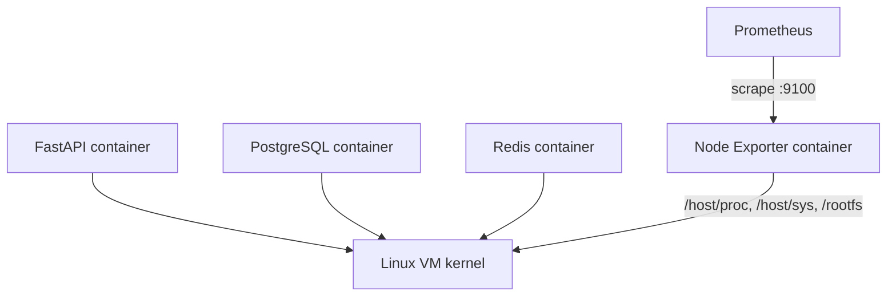
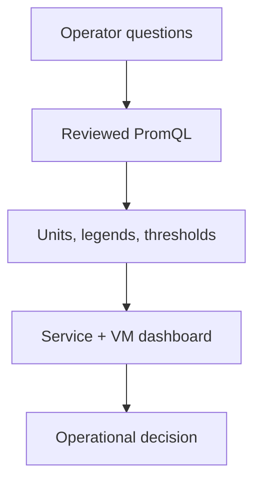

# Lab 09: VM Monitoring With Node Exporter

## Purpose and Scope

> **Primary objective:** Add host-level evidence and diagnose CPU, memory, load, pressure, filesystem, disk, network, and kernel resource signals without confusing VM telemetry with application or container telemetry.

Labs 01–08 observed the workload and Prometheus. A service can slow down even when its code, database, and cache are logically healthy because the underlying VM is constrained.

Node Exporter translates Linux kernel and filesystem statistics into Prometheus metrics:

```text
Linux host state -> Node Exporter collectors -> /metrics -> Prometheus -> PromQL
```

You will start only Node Exporter, prove its host access boundary, inventory collectors, derive USE-style signals, run one bounded CPU experiment, inspect platform alert expressions, and leave the exporter running for Lab 10.

---

## 9.1 Inherited State From Lab 08

Expected running services:

```text
app
db
prometheus
redis
```

Expected conditions:

- Node Exporter is configured as a stopped Prometheus target;
- Prometheus uses a 15-second scrape interval;
- the application and Prometheus targets are `UP`;
- Lab 08’s tested route-level recording rule may be present;
- OpenTelemetry remains disabled; and
- no named volumes were reset.

Lab 09 does not depend on the learner-added Lab 08 rule.

---

## 9.2 Explicit Scope and Exclusions

Services used:

```text
db
redis
app
prometheus
node-exporter
```

Keep stopped:

```text
alertmanager
otel-collector
loki
tempo
grafana
```

This lab does not provide:

- per-container CPU or memory from cAdvisor;
- Kubernetes pod/container resource metrics;
- database-internal performance diagnosis;
- process-by-process profiling;
- eBPF telemetry;
- hardware-vendor management metrics;
- Windows host metrics;
- cloud-provider instance metadata;
- a production host-security hardening guide; or
- capacity forecasts from long retention.

Node Exporter is a host exporter, not an application performance agent.

---

## 9.3 Prerequisites

```bash
pwd
test -f .env
test -f labs/Lab-8.md
test -f labs/Lab-9.md
test -f docker-compose.yml
test -f config/prometheus/prometheus.yml
test -f config/prometheus/rules/platform.yml

docker version
docker compose version
docker compose config --quiet
curl --version
jq --version
git --version
```

The exercises target a Linux VM. Node Exporter availability and metric families vary by operating system, kernel, permissions, and enabled collectors.

---

## 9.4 Learning Objectives

By the end of Lab 09, you must be able to:

- explain what Node Exporter reads and exposes;
- distinguish host, container, process, and application scopes;
- explain the repository’s `/proc`, `/sys`, rootfs, and host-PID settings;
- start the exporter without starting unrelated Compose dependencies;
- prove direct endpoint and Prometheus scrape health;
- inspect enabled collectors and per-collector success/duration;
- identify kernel, OS, boot, and CPU inventory;
- calculate total non-idle CPU utilization;
- calculate CPU utilization by mode;
- explain `iowait` and `steal` cautiously;
- calculate memory used using `MemAvailable` rather than `MemFree`;
- calculate swap utilization safely;
- distinguish load average from CPU percentage;
- normalize load by logical CPU count;
- query pressure-stall metrics when the kernel exposes them;
- calculate filesystem available percentage and inode available percentage;
- filter pseudo and container filesystems deliberately;
- identify read-only filesystems;
- calculate disk throughput, operations, approximate operation latency, and busy time;
- calculate network throughput, error, and drop rates;
- inspect file-descriptor utilization;
- apply utilization, saturation, and errors as a diagnostic framework;
- run a bounded CPU experiment and capture before/during/after evidence;
- recognize when VM-wide metrics dilute one container’s load;
- review host alert expressions without triggering destructive conditions; and
- define the additional exporters needed for missing scopes.

---

## 9.5 Architecture and Scope Boundaries



Node Exporter runs in a container for repeatable labs but is configured to read host views. It still does not provide complete container/cgroup attribution.

---

## 9.6 Load the Environment

```bash
set -a
source .env
set +a

LAB_HTTP_HOST="${BIND_ADDRESS:-127.0.0.1}"
if [[ "$LAB_HTTP_HOST" == "0.0.0.0" || "$LAB_HTTP_HOST" == "::" ]]; then
  LAB_HTTP_HOST=127.0.0.1
fi

export APP_URL="http://$LAB_HTTP_HOST:${APP_HOST_PORT:-8000}"
export PROMETHEUS_URL="http://$LAB_HTTP_HOST:${PROMETHEUS_HOST_PORT:-9090}"
export NODE_EXPORTER_URL="http://127.0.0.1:${NODE_EXPORTER_HOST_PORT:-9100}"
export LAB9_NOTEBOOK="lab-notes/Lab-9.md"

mkdir -p lab-notes
test -f "$LAB9_NOTEBOOK" || printf '# Lab 09 Evidence\n\n' > "$LAB9_NOTEBOOK"
printf 'Started: %s\n' "$(date -u +%FT%TZ)" | tee -a "$LAB9_NOTEBOOK"
```

Node Exporter’s host port is intentionally loopback-bound.

---

## 9.7 Define Query Helpers

```bash
prom_query() {
  local expression="$1"
  local response
  response="$(
    curl -fsS "$PROMETHEUS_URL/api/v1/query" \
      --data-urlencode "query=$expression"
  )"
  jq -e '.status == "success"' <<<"$response" >/dev/null
  printf '%s\n' "$response"
}

prom_result() {
  prom_query "$1" | jq '.data.result'
}

prom_value() {
  prom_query "$1" | jq -r '.data.result[0].value[1] // empty'
}
```

---

## 9.8 Reconcile the Starting State

```bash
APP_OTEL_ENABLED=false docker compose up -d db redis app
docker compose up -d --no-deps prometheus
docker compose stop alertmanager otel-collector loki tempo grafana node-exporter

for attempt in {1..30}; do
  if curl -fsS "$APP_URL/health/ready" |
       jq -e '.status == "ready"' >/dev/null &&
     curl -fsS "$PROMETHEUS_URL/-/ready" | grep -q Ready; then
    break
  fi
  sleep 2
done

test "$(prom_value 'up{job="orders-api"}')" = "1"
```

Before starting the exporter:

```bash
prom_result 'up{job="node-exporter"}'
```

Expected value is `0` because the configured target is intentionally stopped.

---

## 9.9 Inspect the Compose Security and Host-View Boundary

```bash
docker compose config |
  sed -n '/node-exporter:/,/^[^ ]/p'
```

Important settings:

| Setting | Purpose | Risk/control |
|---|---|---|
| `pid: host` | Host process namespace visibility for relevant proc data | Expands visibility |
| `/proc:/host/proc:ro` | Read host procfs | Read-only |
| `/sys:/host/sys:ro` | Read host sysfs | Read-only |
| `/:/rootfs:ro,rslave` | Read host filesystem/mount topology | Broad read visibility, no writes |
| `--path.*` flags | Point collectors at mounted host views | Required for correct scope |
| loopback host port | Prevent remote direct access by default | Prometheus still reaches it on Compose network |
| `no-new-privileges` | Prevent privilege escalation | Defense in depth |

Read-only is not the same as low sensitivity. Host metadata, mount names, kernel information, and network interfaces can be operationally sensitive.

---

## 9.10 Start Only Node Exporter

```bash
docker compose up -d --no-deps node-exporter

for attempt in {1..30}; do
  if curl -fsS "$NODE_EXPORTER_URL/metrics" >/dev/null; then
    echo "Node Exporter endpoint is ready"
    break
  fi
  if [[ "$attempt" -eq 30 ]]; then
    docker compose ps node-exporter
    docker compose logs --tail=150 node-exporter
    exit 1
  fi
  sleep 2
done
```

Confirm no other later service started:

```bash
running="$(docker compose ps --status running --services | sort)"
expected="$(printf '%s\n' app db node-exporter prometheus redis | sort)"
test "$running" = "$expected"
```

---

## 9.11 Prove Direct Exposition

```bash
curl -fsS "$NODE_EXPORTER_URL/metrics" |
  grep -E '^# (HELP|TYPE) node_(cpu_seconds|memory_MemAvailable_bytes|filesystem_avail_bytes|disk_read_bytes|network_receive_bytes)'
```

Record source response size and family count:

```bash
curl -fsS "$NODE_EXPORTER_URL/metrics" \
  -o /tmp/lab9-node-metrics.txt

printf 'Bytes: %s\n' "$(wc -c < /tmp/lab9-node-metrics.txt)"
printf 'HELP families: %s\n' \
  "$(grep -c '^# HELP ' /tmp/lab9-node-metrics.txt)"
```

Exporter versions and host features change these values. Record rather than hard-code them.

---

## 9.12 Prove Prometheus Scrape Recovery

Wait for one canonical scrape:

```bash
for attempt in {1..12}; do
  node_up="$(prom_value 'up{job="node-exporter"}')"
  if [[ "$node_up" = "1" ]]; then
    break
  fi
  sleep 5
done

test "$node_up" = "1"
prom_result 'up{job="node-exporter",instance="node-exporter:9100"}'
```

Inspect the target:

```bash
curl -fsS "$PROMETHEUS_URL/api/v1/targets" |
  jq '.data.activeTargets[] |
    select(.labels.job == "node-exporter") |
    {
      discoveredLabels,
      labels,
      scrapeUrl,
      health,
      lastScrape,
      lastError
    }' |
  tee -a "$LAB9_NOTEBOOK"
```

---

## 9.13 Inspect Exporter Identity

```bash
prom_result 'node_exporter_build_info{job="node-exporter"}'
prom_result 'node_uname_info{job="node-exporter"}'
```

`node_exporter_build_info` describes the exporter binary. `node_uname_info` describes kernel/system identity. Neither proves resource health.

Compare the exporter-reported node name to the VM:

```bash
hostname
prom_result 'node_uname_info{job="node-exporter"}' |
  jq -r '.data.result[0].metric.nodename'
```

Containerization and hostname namespaces can affect identity fields; validate the deployed topology.

---

## 9.14 Inventory Collectors

Node Exporter exposes collector self-metrics:

```bash
prom_result '
  node_scrape_collector_success{job="node-exporter"}
' |
  jq -r '.data.result[] |
    [.metric.collector, .value[1]] |
    @tsv' |
  sort |
  tee /tmp/lab9-collectors.tsv
```

Identify failures:

```bash
prom_result '
  node_scrape_collector_success{
    job="node-exporter"
  } == 0
'
```

An absent collector may be disabled or unsupported; a present zero-valued success metric means its most recent collection failed.

---

## 9.15 Inspect Collector Duration

```bash
prom_result '
  topk(
    10,
    node_scrape_collector_duration_seconds{
      job="node-exporter"
    }
  )
' |
  jq -r '.data.result[] |
    [.metric.collector, .value[1]] |
    @tsv'
```

Compare total scrape duration and timeout headroom:

```bash
prom_result 'scrape_duration_seconds{job="node-exporter"}'
prom_result 'scrape_samples_scraped{job="node-exporter"}'
```

Slow collectors consume scrape timeout and exporter CPU. Disable defaults only after understanding the lost evidence.

---

## 9.16 Host Time and Uptime

```bash
prom_result 'node_boot_time_seconds{job="node-exporter"}'
prom_result 'node_time_seconds{job="node-exporter"}'
prom_result '
  time()
  -
  node_boot_time_seconds{job="node-exporter"}
'
```

Format approximate uptime:

```bash
uptime_seconds="$(
  prom_value '
    time() - node_boot_time_seconds{job="node-exporter"}
  '
)"
awk -v seconds="$uptime_seconds" '
  BEGIN {
    printf "Uptime: %.2f days\n", seconds / 86400
  }
'
```

Prometheus query time and exported node time can also expose clock skew:

```bash
prom_result '
  abs(
    time() - node_time_seconds{job="node-exporter"}
  )
'
```

---

## 9.17 Count Logical CPUs

```bash
prom_result '
  count by (instance) (
    node_cpu_seconds_total{
      job="node-exporter",
      mode="idle"
    }
  )
'
```

One idle counter exists per logical CPU. This count is the denominator for normalized load later.

Do not infer licensed cores, sockets, NUMA topology, or guaranteed container CPU from this one count.

---

## 9.18 Understand CPU Time Counters

`node_cpu_seconds_total` accumulates seconds per CPU and mode:

```bash
prom_result '
  node_cpu_seconds_total{
    job="node-exporter",
    cpu="0"
  }
' |
  jq -r '.data.result[] |
    [.metric.mode, .value[1]] |
    @tsv' |
  sort
```

Common modes include:

- `idle` — not doing work;
- `user` — user-space execution;
- `system` — kernel execution;
- `iowait` — idle while the kernel accounts waiting for I/O;
- `steal` — virtual CPU time involuntarily unavailable to this guest;
- `irq` and `softirq` — interrupt handling.

These are counters, so analyze their rates.

---

## 9.19 Calculate Total Non-Idle CPU Utilization

```bash
export HOST_CPU_QUERY='
  100 * (
    1
    -
    avg by (instance) (
      rate(
        node_cpu_seconds_total{
          job="node-exporter",
          mode="idle"
        }[1m]
      )
    )
  )
'

prom_result "$HOST_CPU_QUERY"
```

The average combines logical CPUs. On an 8-vCPU VM, one fully busy CPU contributes roughly 12.5 percentage points to host-wide utilization.

---

## 9.20 Break CPU Down by Mode

```bash
prom_result '
  100
  *
  avg by (instance, mode) (
    rate(
      node_cpu_seconds_total{
        job="node-exporter"
      }[5m]
    )
  )
' |
  jq -r '.data.result[] |
    [.metric.mode, .value[1]] |
    @tsv' |
  sort
```

Mode breakdown often explains the same total:

- high `user` suggests application computation;
- high `system` suggests kernel work;
- high `steal` can indicate hypervisor contention;
- high `iowait` prompts storage-path investigation.

`iowait` is not a direct device utilization measurement and can be subtle on multi-core systems.

---

## 9.21 Capture a CPU Baseline

```bash
baseline_cpu="$(prom_value "$HOST_CPU_QUERY")"
baseline_time="$(date -u +%FT%TZ)"

printf 'CPU baseline time=%s value=%s percent\n' \
  "$baseline_time" "$baseline_cpu" |
  tee -a "$LAB9_NOTEBOOK"
```

Also capture app-container CPU quota:

```bash
docker inspect obs-lab-app |
  jq '.[0].HostConfig | {
    NanoCpus,
    Memory,
    CpuShares,
    CpusetCpus
  }' |
  tee -a "$LAB9_NOTEBOOK"
```

The app is limited to 1.5 CPUs. Node Exporter’s CPU denominator is the whole VM.

---

## 9.22 Controlled CPU Experiment

Run four bounded workers for about 60 seconds. Each app request can burn at most four seconds here, below the endpoint’s hard safety maximum.

```bash
cpu_experiment_start="$(date -u +%s)"
cpu_deadline=$((SECONDS + 60))
pids=()

for worker in {1..4}; do
  (
    while ((SECONDS < cpu_deadline)); do
      curl -fsS \
        "$APP_URL/api/v1/simulate/cpu?seconds=4" \
        >/dev/null
    done
  ) &
  pids+=("$!")
done

sleep 25
during_cpu="$(prom_value "$HOST_CPU_QUERY")"
printf 'CPU during load=%s percent at %s\n' \
  "$during_cpu" "$(date -u +%FT%TZ)" |
  tee -a "$LAB9_NOTEBOOK"

for pid in "${pids[@]}"; do
  wait "$pid"
done

cpu_experiment_end="$(date -u +%s)"
sleep 75
after_cpu="$(prom_value "$HOST_CPU_QUERY")"

printf 'CPU after recovery=%s percent at %s\n' \
  "$after_cpu" "$(date -u +%FT%TZ)" |
  tee -a "$LAB9_NOTEBOOK"
```

The 75-second recovery wait lets the one-minute rate window forget the bounded load.

---

## 9.23 Interpret the CPU Experiment Carefully

Record:

```text
baseline:
during:
after:
logical CPU count:
app CPU limit:
```

Do not require a fixed percentage increase. Results depend on:

- VM logical CPU count;
- other workloads;
- hypervisor scheduling;
- scrape alignment;
- the one-minute averaging window;
- app cgroup quota; and
- whether the VM is itself nested or virtualized unusually.

The experiment succeeds if the request load is bounded, evidence is captured, and the change is interpreted within scope.

---

## 9.24 Memory Inventory

```bash
prom_result 'node_memory_MemTotal_bytes{job="node-exporter"}'
prom_result 'node_memory_MemAvailable_bytes{job="node-exporter"}'
prom_result 'node_memory_MemFree_bytes{job="node-exporter"}'
prom_result 'node_memory_Cached_bytes{job="node-exporter"}'
prom_result 'node_memory_Buffers_bytes{job="node-exporter"}'
```

Linux uses otherwise idle memory for useful caches. `MemFree` alone is not a good “memory left for workloads” signal. `MemAvailable` estimates memory available without swapping.

---

## 9.25 Calculate Host Memory Used

```bash
export HOST_MEMORY_QUERY='
  100 * (
    1
    -
    node_memory_MemAvailable_bytes{job="node-exporter"}
    /
    node_memory_MemTotal_bytes{job="node-exporter"}
  )
'

prom_result "$HOST_MEMORY_QUERY"
```

Convert totals for human inspection:

```bash
prom_result '
  node_memory_MemTotal_bytes{job="node-exporter"}
  / 1024 / 1024 / 1024
'

prom_result '
  node_memory_MemAvailable_bytes{job="node-exporter"}
  / 1024 / 1024 / 1024
'
```

PromQL values remain bytes until explicitly converted.

---

## 9.26 Swap Capacity and Use

First inspect whether swap exists:

```bash
prom_result 'node_memory_SwapTotal_bytes{job="node-exporter"}'
prom_result 'node_memory_SwapFree_bytes{job="node-exporter"}'
```

Only divide when total swap is greater than zero:

```bash
prom_result '
  (
    100 * (
      1
      -
      node_memory_SwapFree_bytes{job="node-exporter"}
      /
      node_memory_SwapTotal_bytes{job="node-exporter"}
    )
  )
  and on (instance)
  node_memory_SwapTotal_bytes{job="node-exporter"} > 0
'
```

No result can correctly mean “this VM has no configured swap.” It does not mean zero-percent swap utilization unless your dashboard contract chooses to display it that way with an annotation.

---

## 9.27 Load Average Is Not CPU Percentage

```bash
prom_result 'node_load1{job="node-exporter"}'
prom_result 'node_load5{job="node-exporter"}'
prom_result 'node_load15{job="node-exporter"}'
```

Linux load average reflects runnable and uninterruptible tasks over time. It is a queue/population measure, not percent CPU.

Normalize one-minute load by logical CPU count:

```bash
prom_result '
  node_load1{job="node-exporter"}
  /
  count by (instance) (
    node_cpu_seconds_total{
      job="node-exporter",
      mode="idle"
    }
  )
'
```

Values above one mean load exceeds logical CPU count, but workload type, I/O waits, and short bursts still matter.

---

## 9.28 Pressure Stall Information

List pressure metrics if supported:

```bash
prom_result '
  {__name__=~"node_pressure_.+",job="node-exporter"}
' |
  jq -r '.data.result[].metric.__name__' |
  sort -u
```

On supported Linux kernels, common counters include time when tasks were delayed by CPU, memory, or I/O pressure.

Example conditional query:

```bash
if prom_result '
     node_pressure_cpu_waiting_seconds_total{
       job="node-exporter"
     }
   ' | jq -e '.data.result | length > 0' >/dev/null; then
  prom_result '
    100 * rate(
      node_pressure_cpu_waiting_seconds_total{
        job="node-exporter"
      }[5m]
    )
  '
else
  echo "CPU PSI metric not exposed on this host"
fi
```

PSI can provide saturation evidence even when average utilization is ambiguous. Confirm exact metric help text on your exporter version.

---

## 9.29 Inventory Filesystems

```bash
prom_result '
  node_filesystem_size_bytes{job="node-exporter"}
' |
  jq -r '.data.result[] |
    [
      .metric.device,
      .metric.mountpoint,
      .metric.fstype,
      .value[1]
    ] |
    @tsv' |
  sort |
  tee /tmp/lab9-filesystems.tsv
```

Expect pseudo, runtime, and container-related mounts in addition to durable VM filesystems. Filtering is an operational policy, not a cosmetic step.

---

## 9.30 Calculate Filesystem Available Percentage

Use available bytes rather than free bytes for operator-available capacity:

```bash
export FILESYSTEM_AVAILABLE_QUERY='
  100
  *
  node_filesystem_avail_bytes{
    job="node-exporter",
    fstype!~"tmpfs|overlay|squashfs"
  }
  /
  node_filesystem_size_bytes{
    job="node-exporter",
    fstype!~"tmpfs|overlay|squashfs"
  }
'

prom_result "$FILESYSTEM_AVAILABLE_QUERY" |
  jq -r '.data.result[] |
    [
      .metric.device,
      .metric.mountpoint,
      .metric.fstype,
      .value[1]
    ] |
    @tsv' |
  sort
```

`avail` can differ from `free` because filesystems may reserve blocks for privileged use.

---

## 9.31 Find the Lowest Writable Filesystem

```bash
prom_result "
  bottomk(
    5,
    (
      $FILESYSTEM_AVAILABLE_QUERY
    )
    and on (instance, device, mountpoint, fstype)
    node_filesystem_readonly{
      job=\"node-exporter\"
    } == 0
  )
" |
  jq -r '.data.result[] |
    [.metric.mountpoint, .metric.device, .value[1]] |
    @tsv'
```

Review every returned mount. A percentage-only alert can misprioritize a tiny filesystem; pair percentage with available bytes and expected growth.

---

## 9.32 Inspect Read-Only Filesystems

```bash
prom_result '
  node_filesystem_readonly{
    job="node-exporter"
  } == 1
' |
  jq -r '.data.result[] |
    [.metric.mountpoint, .metric.device, .metric.fstype] |
    @tsv'
```

Read-only may be expected for pseudo or image mounts. On a required writable data mount, it can be a critical symptom.

---

## 9.33 Calculate Inode Availability

```bash
prom_result '
  100
  *
  node_filesystem_files_free{
    job="node-exporter",
    fstype!~"tmpfs|overlay|squashfs"
  }
  /
  node_filesystem_files{
    job="node-exporter",
    fstype!~"tmpfs|overlay|squashfs"
  }
' |
  jq -r '.data.result[] |
    [.metric.mountpoint, .metric.device, .value[1]] |
    @tsv'
```

A filesystem can exhaust inodes while many bytes remain. Monitor both resource dimensions where inode limits apply.

---

## 9.34 Inventory Block Devices

```bash
prom_result '
  node_disk_info{job="node-exporter"}
' |
  jq -r '.data.result[] |
    [
      .metric.device,
      (.metric.model // ""),
      (.metric.serial // "")
    ] |
    @tsv' |
  sort
```

Model and serial labels may not exist for virtual devices. Avoid exposing hardware identifiers beyond trusted operator boundaries.

---

## 9.35 Disk Throughput

```bash
prom_result '
  sum by (instance, device) (
    rate(
      node_disk_read_bytes_total{
        job="node-exporter",
        device!~"loop.*|ram.*|fd.*|sr.*"
      }[5m]
    )
  )
' |
  jq -r '.data.result[] |
    [.metric.device, .value[1]] |
    @tsv'

prom_result '
  sum by (instance, device) (
    rate(
      node_disk_written_bytes_total{
        job="node-exporter",
        device!~"loop.*|ram.*|fd.*|sr.*"
      }[5m]
    )
  )
'
```

Units are bytes per second. Convert only at presentation time.

---

## 9.36 Disk Operation Rate

```bash
prom_result '
  rate(
    node_disk_reads_completed_total{
      job="node-exporter",
      device!~"loop.*|ram.*|fd.*|sr.*"
    }[5m]
  )
'

prom_result '
  rate(
    node_disk_writes_completed_total{
      job="node-exporter",
      device!~"loop.*|ram.*|fd.*|sr.*"
    }[5m]
  )
'
```

Operations per second plus bytes per second let you infer average request size, but merged/block-layer behavior can complicate physical-device interpretation.

---

## 9.37 Approximate Disk Read Latency

Calculate milliseconds of accumulated read time per completed read, only where read rate is positive:

```bash
prom_result '
  (
    1000
    *
    rate(
      node_disk_read_time_seconds_total{
        job="node-exporter",
        device!~"loop.*|ram.*|fd.*|sr.*"
      }[5m]
    )
    /
    rate(
      node_disk_reads_completed_total{
        job="node-exporter",
        device!~"loop.*|ram.*|fd.*|sr.*"
      }[5m]
    )
  )
  and on (instance, job, device)
  rate(
    node_disk_reads_completed_total{
      job="node-exporter",
      device!~"loop.*|ram.*|fd.*|sr.*"
    }[5m]
  ) > 0
'
```

This is an interval average derived from kernel counters, not a request percentile.

---

## 9.38 Disk Busy-Time Signal

```bash
prom_result '
  100
  *
  rate(
    node_disk_io_time_seconds_total{
      job="node-exporter",
      device!~"loop.*|ram.*|fd.*|sr.*"
    }[5m]
  )
'
```

Interpret busy time with latency, operation rate, queue behavior, device type, and kernel semantics. Modern parallel devices can serve many requests concurrently; one percentage is not a complete saturation model.

---

## 9.39 Network Throughput

```bash
prom_result '
  rate(
    node_network_receive_bytes_total{
      job="node-exporter",
      device!~"lo|veth.*|docker.*|br-.*"
    }[5m]
  )
'

prom_result '
  rate(
    node_network_transmit_bytes_total{
      job="node-exporter",
      device!~"lo|veth.*|docker.*|br-.*"
    }[5m]
  )
'
```

The filter is an example for this VM. Never copy it blindly: interface names and operational importance differ.

---

## 9.40 Network Errors and Drops

```bash
prom_result '
  sum by (instance, device) (
    rate(
      node_network_receive_errs_total{
        job="node-exporter"
      }[5m]
    )
    +
    rate(
      node_network_transmit_errs_total{
        job="node-exporter"
      }[5m]
    )
  )
'

prom_result '
  sum by (instance, device) (
    rate(
      node_network_receive_drop_total{
        job="node-exporter"
      }[5m]
    )
    +
    rate(
      node_network_transmit_drop_total{
        job="node-exporter"
      }[5m]
    )
  )
'
```

Zero rates are reassuring only while the exporter and interface series are present.

---

## 9.41 File Descriptor Utilization

```bash
prom_result 'node_filefd_allocated{job="node-exporter"}'
prom_result 'node_filefd_maximum{job="node-exporter"}'
prom_result '
  100
  *
  node_filefd_allocated{job="node-exporter"}
  /
  node_filefd_maximum{job="node-exporter"}
'
```

This is the host-wide kernel file-handle pool, not the FastAPI process limit. Process-level limits require another source.

---

## 9.42 Apply the USE Framework

For each resource ask:

| Resource | Utilization | Saturation | Errors |
|---|---|---|---|
| CPU | non-idle CPU rate by mode | normalized load, CPU PSI | machine checks/kernel logs; not fully covered |
| Memory | available/total, swap use | memory PSI, reclaim/swap activity | OOM events need logs/counters beyond this core exercise |
| Disk | bytes/s, ops/s, busy time | latency, queue/IO PSI | device error evidence may require kernel/storage tooling |
| Network | bytes/s, packets/s | queue/drop signals | error and drop counters |
| Filesystem | bytes/inodes consumed | low available capacity and growth | read-only/unexpected mount state |

USE is a question framework, not a guarantee that one exporter exposes every required signal.

---

## 9.43 Correlate Host and App Signals

During a host anomaly, compare:

```bash
prom_result "$HOST_CPU_QUERY"

prom_result '
  sum(
    rate(
      obslab_http_requests_total{
        job="orders-api"
      }[5m]
    )
  )
'

prom_result '
  histogram_quantile(
    0.95,
    sum by (le) (
      rate(
        obslab_http_request_duration_seconds_bucket{
          job="orders-api"
        }[5m]
      )
    )
  )
'
```

Correlation in time supports a hypothesis; it does not prove causality. Use controlled experiments, traces, logs, profiles, and dependency evidence as appropriate.

---

## 9.44 Inspect Existing Host Alert Rules

```bash
sed -n '/alert: HostHighCpu/,/alert: OpenTelemetryCollectorDown/p' \
  config/prometheus/rules/platform.yml
```

The repository includes:

- sustained host CPU above 90% for five minutes; and
- writable filesystem availability below 10% for ten minutes, excluding selected pseudo filesystems.

Review the loaded runtime rules:

```bash
curl -fsS "$PROMETHEUS_URL/api/v1/rules" |
  jq '.data.groups[] |
    select(.name == "single-vm-platform-alerts") |
    {
      health,
      interval,
      lastEvaluation,
      evaluationTime,
      rules: [
        .rules[] |
        select(.name == "HostHighCpu" or .name == "HostLowDiskSpace") |
        {name, state, health, query}
      ]
    }'
```

Alertmanager can remain stopped; Prometheus still evaluates alert expressions.

---

## 9.45 Do Not Trigger Disk Alerts by Filling the VM

This lab is read-only for disk capacity. Do not create a large file to force `HostLowDiskSpace`.

Safe alternatives:

- evaluate the expression;
- inspect current margin;
- unit-test the rule with synthetic series in a later alert lab; and
- use a disposable, quota-limited filesystem for destructive capacity tests.

Calculate current minimum:

```bash
prom_result "
  bottomk(
    5,
    $FILESYSTEM_AVAILABLE_QUERY
  )
"
```

---

## 9.46 Host Metrics Versus Container Metrics

Node Exporter answers:

```text
What is happening on the VM?
```

It does not directly answer:

```text
Which container used the CPU?
Which cgroup is near its memory limit?
Which pod restarted?
Which Python function consumed CPU?
```

For those questions consider:

| Scope | Typical source |
|---|---|
| Container/cgroup | cAdvisor or runtime metrics |
| Kubernetes object | kube-state-metrics |
| Process | process exporter or app runtime metrics |
| Code path | continuous profiler |
| Kernel/network path | eBPF tooling |
| Cloud VM metadata | provider exporter/integration |

Add sources because a question requires them, not because a dashboard has empty space.

---

## 9.47 Troubleshooting — Direct Endpoint Is Down

```bash
docker compose ps node-exporter
docker compose logs --tail=200 node-exporter
docker inspect obs-lab-node-exporter |
  jq '.[0] | {
    State,
    HostConfig: {
      PidMode: .HostConfig.PidMode,
      SecurityOpt: .HostConfig.SecurityOpt
    },
    Mounts
  }'
ss -lnt | grep ":${NODE_EXPORTER_HOST_PORT:-9100}"
```

Check port conflicts, unsupported mounts, kernel permissions, architecture, and container startup arguments.

---

## 9.48 Troubleshooting — Direct Endpoint Works, Target Is Down

```bash
curl -fsS "$NODE_EXPORTER_URL/metrics" >/dev/null

curl -fsS "$PROMETHEUS_URL/api/v1/targets" |
  jq '.data.activeTargets[] |
    select(.labels.job == "node-exporter") |
    {scrapeUrl, health, lastError, lastScrape}'

docker compose exec prometheus \
  wget -qO- http://node-exporter:9100/metrics |
  head
```

Host loopback reachability does not prove the Compose network path.

---

## 9.49 Troubleshooting — Filesystem Values Look Wrong

Check:

- `--path.rootfs` and root mount;
- mount propagation mode;
- container versus native Linux environment;
- excluded mountpoint regex;
- filesystem type filters;
- bind/overlay duplicate views;
- read-only state; and
- whether the desired mount exists in the host namespace.

Compare:

```bash
df -hT
findmnt

prom_result 'node_filesystem_size_bytes{job="node-exporter"}' |
  jq -r '.data.result[] |
    [.metric.mountpoint, .metric.device, .metric.fstype, .value[1]] |
    @tsv' |
  sort
```

Do not silently relabel until the scope mismatch is understood.

---

## 9.50 Troubleshooting — CPU Load Did Not Rise Much

Possible explanations:

- many VM CPUs dilute a 1.5-CPU-limited container;
- the query window includes pre/post idle time;
- the controlled requests completed between scrapes;
- another baseline workload changed;
- the app CPU quota constrained the load; or
- the exporter is observing a different host scope.

Check the app simulation counter and CPU mode:

```bash
prom_result '
  increase(
    obslab_simulations_total{
      job="orders-api",
      kind="cpu",
      outcome="success"
    }[10m]
  )
'

prom_result '
  100 * avg by (mode) (
    rate(
      node_cpu_seconds_total{
        job="node-exporter"
      }[1m]
    )
  )
'
```

Do not remove safety limits merely to make a graph dramatic.

---

## 9.51 Evidence Matrix

| Evidence | What it proves |
|---|---|
| Compose host mounts and PID mode | Exporter scope/configuration |
| Direct `/metrics` | Exporter exposition |
| `up=1` and target JSON | Prometheus path |
| Build and uname info | Exporter/kernel identity |
| Collector success/duration | Collection health and cost |
| CPU count/modes | CPU inventory |
| CPU baseline/during/after | Bounded experiment |
| Memory total/available/used | Host memory view |
| Swap conditional query | Zero-capacity safety |
| Load normalized by CPU | Saturation context |
| PSI inventory | Kernel-dependent pressure |
| Filesystem inventory/filter | Capacity scope |
| Bytes and inode percentages | Two exhaustion dimensions |
| Disk throughput/latency/busy | Block-device evidence |
| Network rate/errors/drops | Interface evidence |
| File descriptor ratio | Kernel pool utilization |
| Host alert review | Operational consumer |
| Final service set | Progressive handoff |

---

## 9.52 Production Implications

1. Deploy one correctly scoped node exporter per host.
2. Restrict exporter reachability and protect host metadata.
3. Pin and review enabled collectors by OS and requirement.
4. Monitor collector success, duration, scrape duration, and sample growth.
5. Use `MemAvailable` rather than `MemFree` for practical pressure.
6. Treat load average as queue demand, not CPU percent.
7. Use PSI where supported to strengthen saturation diagnosis.
8. Monitor filesystem bytes and inodes.
9. Filter pseudo filesystems without hiding required mounts.
10. Combine disk utilization, latency, throughput, and queue/pressure evidence.
11. Monitor network errors/drops beside throughput.
12. Separate VM-wide and container-specific resource questions.
13. Account for virtualization and CPU steal.
14. Test alerts synthetically instead of destructively filling production disks.
15. Build capacity forecasts from longer histories and demand context.

---

## 9.53 Knowledge Check

Answer before reading the key:

1. What does Node Exporter primarily expose?
2. Why does the container mount host `/proc` and `/sys`?
3. Why is the root filesystem mount read-only?
4. Does read-only host access eliminate information sensitivity?
5. What does `up{job="node-exporter"}=1` prove?
6. What reports collector failures?
7. What reports collector duration?
8. How do you count logical CPUs from CPU metrics?
9. Why must CPU time use `rate()`?
10. How is total non-idle CPU calculated?
11. What can high `steal` suggest?
12. Is `iowait` equivalent to disk utilization?
13. Why use `MemAvailable`?
14. How should zero configured swap be handled?
15. Is load average a percentage?
16. Why normalize load by CPU count?
17. What does PSI add?
18. Why monitor filesystem inodes?
19. Why use available rather than free filesystem bytes?
20. Why filter pseudo filesystems?
21. What is disk throughput’s unit?
22. What does read-time rate divided by completed-read rate estimate?
23. Is that estimate a latency percentile?
24. Why can disk busy percentage be incomplete on parallel devices?
25. Which network signals indicate errors rather than utilization?
26. Is host file-descriptor utilization the FastAPI process limit?
27. What are USE’s three questions?
28. Why might app CPU load make only a small VM-wide change?
29. Why does this lab not fill the disk to trigger an alert?
30. Which service remains running for Lab 10?

---

## 9.54 Knowledge Check Answers

1. Machine-level kernel, hardware, filesystem, and OS metrics.
2. To read the host’s procfs/sysfs instead of only container-local views.
3. The exporter requires observation, not host mutation.
4. No; metadata itself can be sensitive.
5. Prometheus’s latest scrape succeeded, not that every collector or host resource is healthy.
6. `node_scrape_collector_success`.
7. `node_scrape_collector_duration_seconds`.
8. Count idle-mode series by instance, one per logical CPU.
9. CPU seconds are cumulative counters.
10. One minus average idle rate across CPUs, multiplied by 100.
11. Hypervisor/host contention depriving the guest of scheduled CPU.
12. No.
13. It better estimates memory available for new work without swapping.
14. Filter division to series whose total swap is greater than zero.
15. No.
16. A load of four has different meaning on two versus sixteen CPUs.
17. Direct time-based evidence that tasks are delayed by CPU, memory, or I/O pressure.
18. Inodes can exhaust while byte capacity remains.
19. Available accounts for blocks usable by ordinary processes after reservations.
20. To focus decisions and avoid noisy duplicate/runtime mounts.
21. Bytes per second.
22. Mean accumulated read time per completed read in the window.
23. No.
24. Concurrent modern device behavior is not captured by one scalar interpretation.
25. Receive/transmit error and drop counter rates.
26. No; it is a host-wide kernel pool signal.
27. Utilization, saturation, and errors.
28. The app is capped at 1.5 CPUs while Node Exporter averages the whole VM.
29. It risks destabilizing the only lab VM and is unnecessary for learning expression behavior.
30. Node Exporter.

---

## 9.55 Professional Scenarios

### Scenario A — CPU is 40%, but latency is high

Average CPU has headroom. Check per-CPU/mode distribution, normalized load, CPU PSI, disk latency, I/O PSI, memory pressure, and dependency signals. Average utilization alone does not exclude localized saturation.

### Scenario B — Root disk looks healthy, database fails writes

The database volume may reside on another mount or inodes may be exhausted. Inventory every required mount, bytes, inodes, and read-only state; map services to storage paths.

### Scenario C — Node dashboard blames the app

VM CPU increased during app traffic, but Node Exporter cannot attribute the increase to one container. Add cgroup/container metrics or profiling before asserting causation.

---

## 9.56 Required Lab Notebook

Include:

- UTC start and finish;
- exact running service set;
- Node Exporter Compose boundary;
- direct response size and family count;
- target JSON and `up`;
- exporter/kernel identity;
- collector inventory and any failures;
- ten slowest collectors;
- host uptime and clock difference;
- logical CPU count;
- CPU mode table;
- CPU baseline, during, after, app quota, and interpretation;
- memory total, available, and percentage;
- swap presence/utilization behavior;
- load averages and normalized load;
- PSI availability and one query if supported;
- filesystem inventory and filters;
- lowest writable byte and inode availability;
- disk throughput, operations, latency, and busy signals;
- network throughput/errors/drops;
- file descriptor ratio;
- host-alert review;
- all 30 answers; and
- missing-scope exporter recommendations.

---

## 9.57 Completion Checklist

- [ ] Metrics-only baseline was reconciled.
- [ ] Node Exporter’s host-view and security settings were inspected.
- [ ] Only Node Exporter was added.
- [ ] Direct exposition succeeded.
- [ ] Prometheus target changed to `UP`.
- [ ] Exporter and kernel identity were recorded.
- [ ] Collector success and duration were inspected.
- [ ] Logical CPUs and CPU modes were inventoried.
- [ ] Total CPU utilization was calculated.
- [ ] CPU baseline, bounded load, and recovery were recorded.
- [ ] VM scope and app CPU quota were considered.
- [ ] Memory use was calculated from `MemAvailable`.
- [ ] Swap-zero division was handled safely.
- [ ] Load was distinguished from CPU percentage.
- [ ] PSI was queried conditionally.
- [ ] Filesystem bytes, inodes, types, and read-only state were inspected.
- [ ] Disk throughput, operations, latency, and busy time were queried.
- [ ] Network throughput, errors, and drops were queried.
- [ ] File descriptor utilization was queried.
- [ ] USE was applied to each host resource.
- [ ] Host alerts were reviewed without destructive triggering.
- [ ] Missing container/process scopes were documented.
- [ ] All 30 questions and notebook evidence are complete.

---

## 9.58 Upstream Reference Map

- [Node Exporter project documentation](https://github.com/prometheus/node_exporter) — collectors, containerized deployment, host paths, and flags.
- [Prometheus Node Exporter guide](https://prometheus.io/docs/guides/node-exporter/) — exporter and scrape setup.
- [Prometheus instrumentation practices](https://prometheus.io/docs/practices/instrumentation/) — exporter and series considerations.
- [Prometheus query functions](https://prometheus.io/docs/prometheus/latest/querying/functions/) — counter rates and range analysis.

Verify collector names and help text against the pinned exporter because OS support varies.

---

## 9.59 Final State and Transition to Lab 10

```bash
test "$(prom_value 'up{job="orders-api"}')" = "1"
test "$(prom_value 'up{job="prometheus"}')" = "1"
test "$(prom_value 'up{job="node-exporter"}')" = "1"

running="$(docker compose ps --status running --services | sort)"
expected="$(printf '%s\n' app db node-exporter prometheus redis | sort)"
test "$running" = "$expected"

{
  printf '\n## Final evidence\n'
  printf 'Finished: %s\n' "$(date -u +%FT%TZ)"
  printf 'Running services:\n%s\n' "$running"
} >> "$LAB9_NOTEBOOK"
```

Leave Node Exporter running. Lab 10 adds Grafana and turns verified queries into a dashboard designed from operator questions:



Carry forward:

```text
host metric != container attribution
utilization != saturation
load != CPU percent
free memory != available memory
disk bytes != inodes
temporal correlation != causation
```
